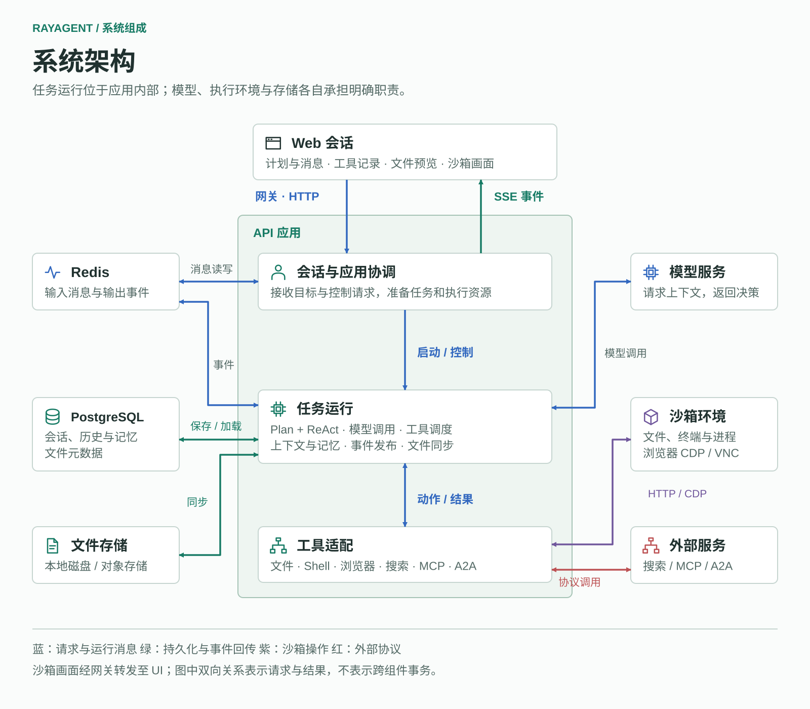
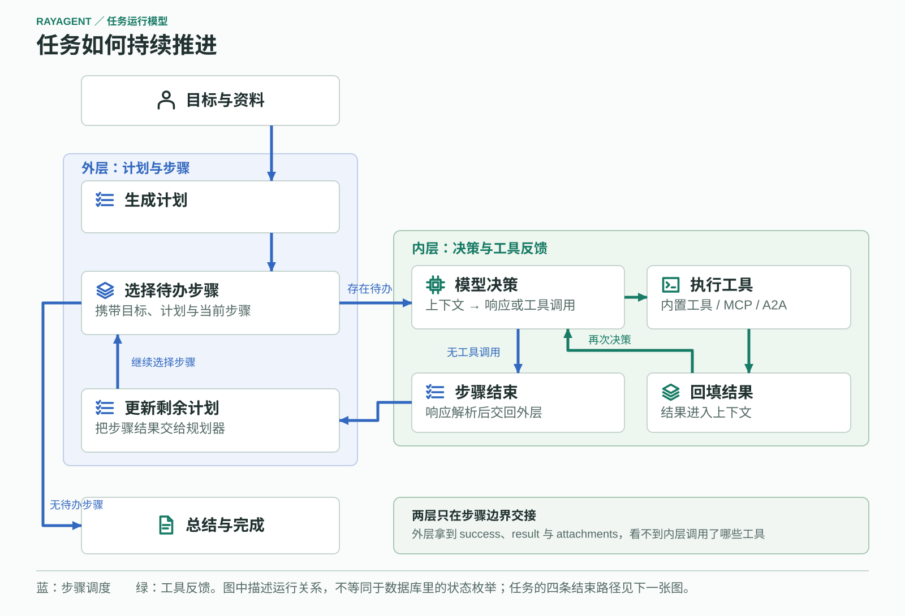

# RayAgent 架构说明

本文描述当前系统的模块边界、执行与数据流，以及理解实现时需要注意的限制。产品交互与能力详见[产品说明](product.md)；发送之后请求怎样走完见下文「一次任务的执行」。内容依据代码核对，完整运行验证的阶段状态见 [执行计划](../PLAN.md)。

部署步骤见 [运行指南](../ray_agent/README.md)，服务内部导航与开发命令见各服务 README。本文件维护系统结构；更新条件见[根工作指南](../AGENTS.md#文档约定)。接口字段、配置项和局部处理细节以源码、测试及所属服务指南为准。

## 系统边界

图中蓝线表示请求与运行消息，绿线表示持久化与事件回传，紫线连接沙箱操作，红线连接外部协议。中间区域属于 API 应用，外部服务和存储通过适配访问；双向箭头表示交互关系，不表示各操作在同一事务中完成。图中使用组件职责命名，具体类与代码入口见下文。

| 模块 | 职责 |
|---|---|
| [UI](../ray_agent/ui/README.md) | 会话交互、事件消费、计划与工具结果展示、沙箱画面 |
| [API](../ray_agent/api/README.md) | 会话管理、任务执行、模型与外部能力适配 |
| [沙箱](../ray_agent/sandbox/README.md) | 隔离的 Shell、文件、浏览器与进程管理环境 |
| Nginx | UI 与 API 的访问入口，转发 SSE 和 WebSocket |
| PostgreSQL | 会话状态、事件历史、Agent 记忆及文件元数据 |
| Redis | 任务输入输出流与事件传递 |
| 文件存储 | 附件、执行文件与截图；通过适配支持本地磁盘或对象存储 |

产品通过 MCP 客户端调用外部工具，通过 A2A 客户端调用远程 Agent。两者接入现有工具层，主执行流程由自研 Plan + ReAct 驱动。实验目录还包含服务端示例，其角色不能直接套用于产品。

## API 分层

API 的实现位于 `ray_agent/api/app/`：

| 层 | 职责 |
|---|---|
| `interfaces/` | HTTP 路由、请求响应结构、SSE 映射与依赖组装 |
| `application/` | 会话、文件、配置和任务等应用服务的协调 |
| `domain/` | 领域模型、规划执行、Agent 与工具，以及仓库和外部能力的抽象 |
| `infrastructure/` | 数据库仓库、模型调用、Docker、浏览器、消息队列和存储的具体实现 |

依赖在 [service_dependencies.py](../ray_agent/api/app/interfaces/service_dependencies.py) 中组装。数据访问通过仓库与工作单元组织，外部资源通过抽象接口和具体适配实现连接。目录表达了职责划分，分析具体行为仍需沿调用代码确认。

## 一次任务的执行

会话请求经 AgentService 准备沙箱、浏览器与任务，由 AgentTaskRunner 消费输入并调用流程。外层创建计划、选择待办步骤，步骤结束后更新剩余计划；没有待办步骤时进入总结。内层 Agent 请求模型、执行工具、回填结果，再次请求模型。工具反馈返回内层，步骤结果才交回外层，两种循环不能合并成一条顺序流水线。

询问用户会记录等待状态并退出当前运行，回复到来后再继续。运行中出现新输入时，运行器在事件交接处处理它，流程可能重新规划。失败和取消各有独立收尾路径；图中描述的是运行关系，不能直接当作会话状态枚举。尤其当前取消路径使用 `COMPLETED` 会话状态收尾，不代表目标已经完成。

消息、计划、工具等事件贯穿执行，经 Redis 输出流与 API 的 SSE 映射回到页面，同时保存历史。附件同步发生在相关消息或工具事件处理期间，不是所有任务的固定最终步骤。

核心入口：

- [AgentService](../ray_agent/api/app/application/services/agent_service.py)：任务和执行资源的准备、输入输出协调。
- [AgentTaskRunner](../ray_agent/api/app/domain/services/agent_task_runner.py)：运行流程、处理事件和资源生命周期。
- [PlannerReActFlow](../ray_agent/api/app/domain/services/flows/planner_react.py)：规划与执行的外层状态转换。
- [BaseAgent](../ray_agent/api/app/domain/services/agents/base.py)：模型调用、工具循环与迭代控制。

## 状态与持久化

| 状态或数据 | 所属位置与意义 |
|---|---|
| 会话、事件历史、Agent 记忆 | 领域会话模型与 PostgreSQL 持久化数据 |
| 计划与步骤 | 外层流程使用的执行状态，通过相关事件反映变化 |
| 正在执行的任务 | `RedisStreamTask` 维护的进程内任务实例与注册表 |
| 输入输出消息 | Redis Stream，供任务和 API 交换消息与事件 |
| 页面展示状态 | 前端从实时事件和历史详情派生的状态 |

[RedisStreamTask](../ray_agent/api/app/infrastructure/external/task/redis_stream_task.py) 使用进程内 `asyncio.Task` 执行任务。Redis 中存在消息，或数据库中存在任务 ID，都不等于进程重启后能继续执行。恢复、并发和取消能力必须按对应路径验证。

界面显示完成、流程到达终态、后台任务结束和资源释放是不同环节，排查时应分别确认，不能只依据某一个状态字段。

## 跨模块协作

工具层将模型提出的动作交给具体适配实现：Shell 和文件操作访问沙箱服务，浏览器通过 Playwright 连接沙箱浏览器，MCP/A2A 通过协议适配连接外部工具与远程 Agent。应用侧负责组装这些能力，协议接入不替代本地任务流程。

领域事件经 API 映射为 SSE，前端据此构建时间线与计划展示；历史详情提供已保存的事件。实时流与历史读取共同支撑同一会话视图。事件模型与消费入口见 [API 指南](../ray_agent/api/README.md#代码导航)和 [UI 指南](../ray_agent/ui/README.md#代码导航)。

领域模型、数据库模型与接口响应分别承担业务、存储和传输职责。文件内容由存储适配管理，元数据与会话关系由应用和数据库管理；沙箱工作文件与用户可下载的交付文件属于不同资源，任务执行通过文件同步连接两者。

## 沙箱生命周期与限制

创建任务时会准备沙箱和浏览器，因此不使用浏览器工具的对话也依赖这条准备链路。

API 支持动态创建沙箱，也支持按地址连接已有沙箱。具体配置、网络条件和生命周期差异统一见 [沙箱连接方式](../ray_agent/sandbox/README.md#与-api-连接)。两种模式不能混用资源归属假设。

本说明记录现有结构与关键限制，不表示这些路径已完成端到端验证，也不替代学习文档中的逐步实验。
