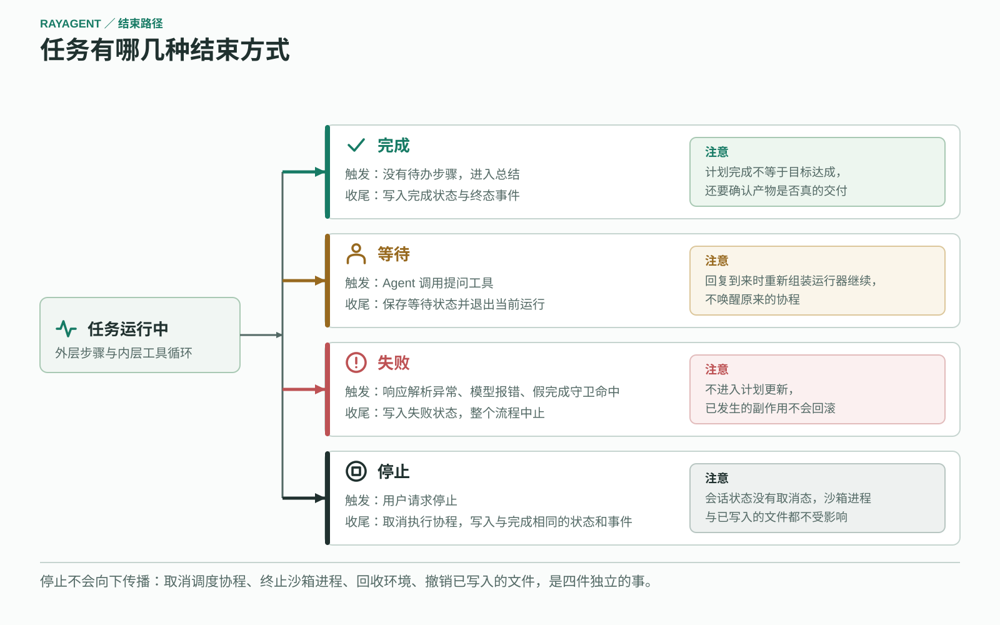
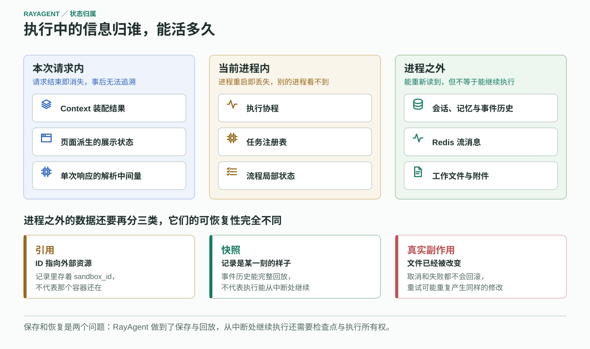

# RayAgent 架构说明

本文描述当前系统的模块边界、执行与数据流、状态归属和控制参数。职责为什么这样划分见 [Harness 工程](harness.md)，用户可见的交互见[产品说明](product.md)，每项能力的实现程度与未验证范围见[能力与边界](capabilities.md)。

部署步骤见[运行指南](../ray_agent/README.md)，服务内部导航与开发命令见各服务 README。本文件维护系统结构；更新条件见[文档地图](README.md)。接口字段、配置项和局部处理细节以源码、测试及所属服务指南为准。

## 系统边界

图中蓝线表示请求与运行消息，绿线表示持久化与事件回传，紫线连接沙箱操作，红线连接外部协议。中间区域属于 API 应用，外部服务和存储通过适配访问；双向箭头表示交互关系，不表示各操作在同一事务中完成。

| 模块 | 职责 |
|---|---|
| [UI](../ray_agent/ui/README.md) | 会话交互、事件消费、计划与工具结果展示、沙箱画面 |
| [API](../ray_agent/api/README.md) | 会话管理、任务执行、模型与外部能力适配 |
| [沙箱](../ray_agent/sandbox/README.md) | 隔离的 Shell、文件、浏览器与进程管理环境 |
| Nginx | UI 与 API 的访问入口，转发 SSE 和 WebSocket |
| PostgreSQL | 会话状态、事件历史、Agent 记忆及文件元数据 |
| Redis | 任务输入输出流与事件传递 |
| 文件存储 | 附件、执行文件与截图；通过适配支持本地磁盘或对象存储 |

产品通过 MCP 客户端调用外部工具，通过 A2A 客户端调用远程 Agent。两者接入现有工具层，主执行流程由自研 Plan + ReAct 驱动。实验目录还包含服务端示例，其角色不能直接套用于产品。

## API 分层

API 的实现位于 `ray_agent/api/app/`：

| 层 | 职责 |
|---|---|
| `interfaces/` | HTTP 路由、请求响应结构、SSE 映射与依赖组装 |
| `application/` | 会话、文件、配置和任务等应用服务的协调 |
| `domain/` | 领域模型、规划执行、Agent 与工具，以及仓库和外部能力的抽象 |
| `infrastructure/` | 数据库仓库、模型调用、Docker、浏览器、消息队列、协议客户端和存储的具体实现 |

依赖在 [service_dependencies.py](../ray_agent/api/app/interfaces/service_dependencies.py) 中组装。数据访问通过仓库与工作单元组织，外部资源通过抽象接口和具体适配实现连接。目录表达了职责划分，分析具体行为仍需沿调用代码确认。

## 一次任务的执行

会话请求经 AgentService 准备沙箱、浏览器与任务，由 AgentTaskRunner 消费输入并调用流程。外层创建计划、选择待办步骤，步骤结束后更新剩余计划；没有待办步骤时进入总结。内层 Agent 请求模型、执行工具、回填结果，再次请求模型。工具反馈返回内层，步骤结果才交回外层，两种循环不能合并成一条顺序流水线。

步骤结果以 `success`、`result`、`attachments` 交回外层。这里有两条分支：`success=false` 表示步骤执行失败，结果交给 Planner 调整后续安排，流程继续；步骤处理失败（响应解析异常、模型报错、假完成守卫命中）则置为 `FAILED` 并中止整个流程，不进入计划更新。

计划更新只在旧计划仍存在未结束步骤时合并新步骤；若所有步骤都已结束，Planner 返回的新步骤会被丢弃。规划阶段调用模型时禁用工具选择并要求 JSON 输出，因此 Planner 只产出计划，不会顺带执行动作。

核心入口：

- [AgentService](../ray_agent/api/app/application/services/agent_service.py)：任务和执行资源的准备、输入输出协调。
- [AgentTaskRunner](../ray_agent/api/app/domain/services/agent_task_runner.py)：运行流程、处理事件和资源生命周期。
- [PlannerReActFlow](../ray_agent/api/app/domain/services/flows/planner_react.py)：规划与执行的外层状态转换。
- [Planner](../ray_agent/api/app/domain/services/agents/planner.py) 与 [ReActAgent](../ray_agent/api/app/domain/services/agents/react.py)：两种角色的模型调用。
- [BaseAgent](../ray_agent/api/app/domain/services/agents/base.py)：模型调用、工具循环与迭代控制。

## 结束路径与控制平面

任务有四种离开运行状态的方式，收尾范围各不相同：

| 路径 | 触发 | 收尾 | 注意 |
|---|---|---|---|
| 完成 | 没有待办步骤，进入总结 | 写入完成状态与终态事件 | 计划完成不等于目标达成 |
| 等待 | Agent 调用提问工具 | 保存等待状态并退出当前运行 | 回复到来时重新组装运行器继续，不唤醒原协程 |
| 失败 | 解析异常、模型报错、守卫命中 | 写入失败状态 | 流程中止，不进入计划更新 |
| 停止 | 用户请求停止 | 取消执行协程，写入与完成相同的状态和终态事件 | 会话状态枚举中没有取消态 |

停止不会向下传播。取消调度协程、终止沙箱内的 OS 进程、回收沙箱环境、撤销已写入的文件是四件独立的事，当前只做了第一件。

执行预算分布在各层，全部约束**单次调用**，没有跨调用的任务总预算：

| 参数 | 默认值 | 约束范围 |
|---|---|---|
| `max_iterations` | 100 | 单次内层 Agent 循环，即单个步骤；不跨步骤累计 |
| `max_retries` | 3 | 单次模型调用或单次工具调用的尝试次数 |
| 模型请求超时 | 3600 秒 | 单次模型请求（在模型客户端内硬编码） |
| 沙箱 HTTP 超时 | 600 秒 | 单次沙箱请求 |
| Shell 等待进程 | 60 秒 | 单次等待；超时返回错误，不终止进程 |
| MCP 连接／发现／调用超时 | 10／15／120 秒 | 每个服务各自计时，另有 20 秒全局发现预算 |
| A2A 调用／取消超时 | 600／5 秒 | 单次委派；轮询间隔由 1 秒递增至 5 秒 |

`context_window` 只用于展示最近一次请求的占用，不参与裁剪或拒绝。用量事件是记账，不是强制预算。

## 状态与持久化

执行中的信息按寿命分三层，排查问题时应先确定目标信息属于哪一层：

| 寿命 | 包含 | 边界 |
|---|---|---|
| 本次请求内 | Context 装配结果、前端派生的展示状态 | 请求结束即消失，事后不可追溯 |
| 当前进程内 | 执行协程、`RedisStreamTask` 任务注册表、Flow 局部状态 | 进程重启即丢失，另一个进程看不到 |
| 进程之外 | 会话、Agent 记忆、事件历史、Redis 流消息、工作文件与附件 | 能重新读到，但不等于能继续执行 |

三类进程外数据的性质也不同：**ID 是引用**（数据库里存着 `sandbox_id` 不代表容器还在），**记录是快照**（事件历史能完整回放不代表执行能继续），**只有工作文件是真实副作用**（取消不会回滚已写出的内容）。

| 状态或数据 | 所属位置 |
|---|---|
| 会话、事件历史、Agent 记忆、文件元数据 | 领域会话模型与 PostgreSQL |
| 计划与步骤 | 外层流程状态，通过事件反映变化 |
| 正在执行的任务 | [RedisStreamTask](../ray_agent/api/app/infrastructure/external/task/redis_stream_task.py) 维护的进程内 `asyncio.Task` 与注册表 |
| 输入输出消息 | Redis Stream |
| 页面展示状态 | 前端从实时事件和历史详情派生 |

[Session.get_latest_plan()](../ray_agent/api/app/domain/models/session.py) 返回最近一个计划事件的快照，不合并其后的步骤事件；前端展示的进度是合并事件后的结果，两者在同一时刻可能不同。

Agent 记忆在步骤成功结束后做一次局部清理：`compact()` 把浏览器查看与导航两类工具消息的正文替换为占位内容，并删除消息上的推理字段。这是按工具类型的定点裁剪，不按 token 预算触发，步骤失败时不执行。

界面显示完成、流程到达终态、后台任务结束和资源释放是不同环节，排查时应分别确认。

## 事件与投影

领域事件经 API 映射为 SSE，前端据此构建时间线与计划展示；历史详情提供已保存的事件。实时流与历史读取共同支撑同一会话视图。

投影过程中会丢信息，因此**页面所见严格小于内部保存**：给前端的工具事件省略了模型收到的原始结果，只保留供预览的内容；文件类工具在 `called` 阶段由运行器再读一次沙箱来填充这份预览。时间戳取整到秒，短间隔无法区分；事件之间也没有贯穿一轮的关联标识，无法据此重建完整调用链。

事件先写入 Redis 输出流，再写入数据库（[`_put_and_add_event`](../ray_agent/api/app/domain/services/agent_task_runner.py)）。页面因此能尽快看到进展，代价是存在一个窗口：事件已经展示但尚未落库。数据库事务也不包含工作文件写入、事件发布与文件存储上传。

事件模型与消费入口见 [API 指南](../ray_agent/api/README.md#代码导航)和 [UI 指南](../ray_agent/ui/README.md#代码导航)。

## 跨模块协作

工具层将模型提出的动作交给具体适配实现：Shell 和文件操作访问沙箱服务，浏览器通过 Playwright 连接沙箱浏览器，MCP/A2A 通过[协议适配](../ray_agent/api/app/infrastructure/protocols/)连接外部工具与远程 Agent。应用侧负责组装这些能力，协议接入不替代本地任务流程。

多服务可能提供同名工具，MCP 适配用带哈希的别名路由区分并映射回原始名称。协议返回的结果按字符数与列表项数截断后才进入上下文。需要多轮交互的协议调用当前按失败返回。

领域模型、数据库模型与接口响应分别承担业务、存储和传输职责。文件内容由存储适配管理，元数据与会话关系由应用和数据库管理；沙箱工作文件与用户可下载的交付文件属于不同资源，任务执行通过文件同步连接两者。

## 沙箱生命周期与限制

创建任务时会准备沙箱和浏览器，因此不使用浏览器工具的对话也依赖这条准备链路。

沙箱按会话标识查找或创建：找到运行中的容器就复用，否则新建。任务结束不销毁沙箱，环境靠显式销毁或存活时间到期回收。API 支持动态创建，也支持按地址连接已有沙箱；两种模式不能混用资源归属假设，配置与网络条件见[沙箱连接方式](../ray_agent/sandbox/README.md#与-api-连接)。

隔离需要分别落实在四个方向上，当前程度不一致：文件系统按容器分离；网络仅在配置了专用网络时才隔离；沙箱服务以 root 身份运行；创建容器时未设置 CPU 与内存配额。工具参数中的工作目录只用于解释相对路径，不构成访问围栏。

本说明记录现有结构与关键限制，不表示这些路径已完成端到端验证。已知的不一致与未验证范围见[能力与边界](capabilities.md)。
