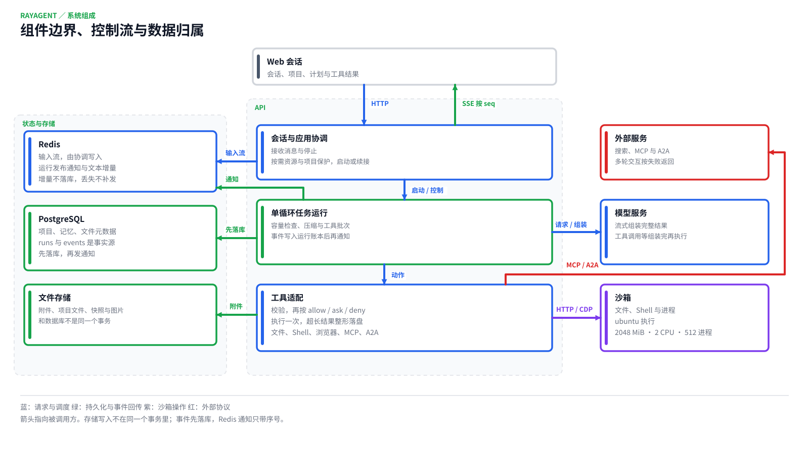
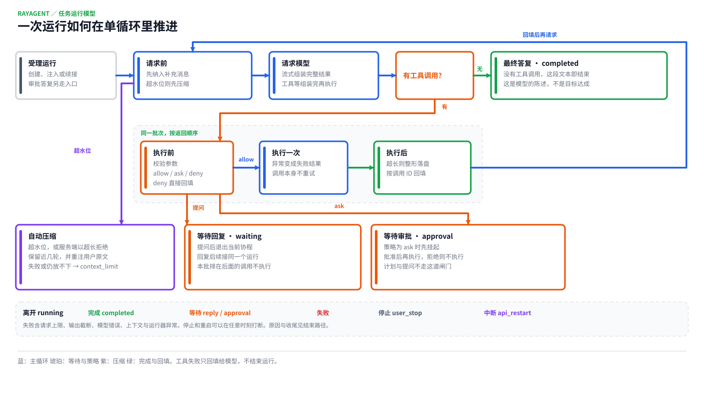
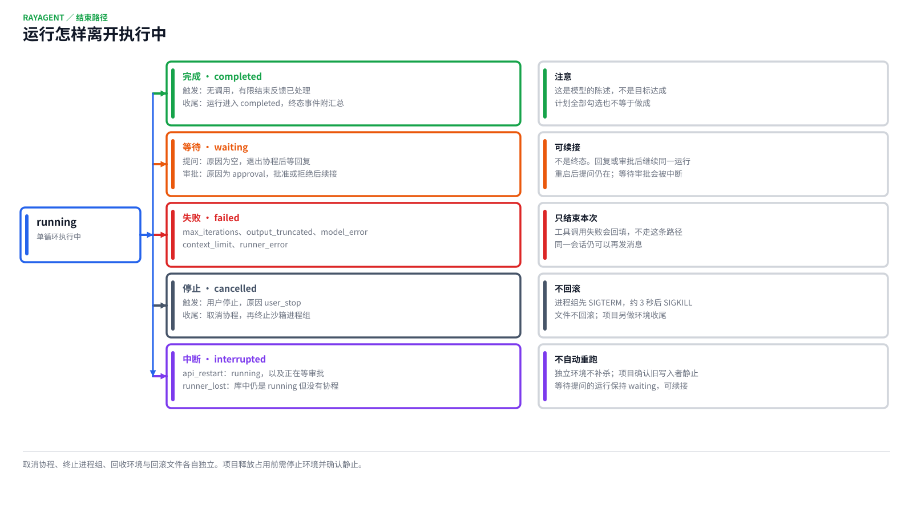
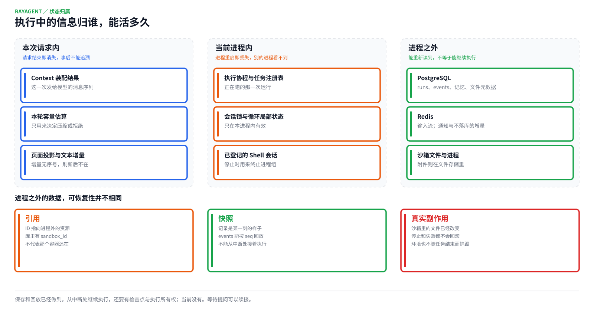

# RayAgent 架构说明

本文维护系统结构：模块边界、执行与数据流、状态与资源归属。按机制定位代码见[代码地图](code-map.md)。

## 系统边界

*组件边界与数据归属。Web 会话经 HTTP 进入 API，事件按 seq 以 SSE 返回。会话协调启动或续接运行，资源按归属准备；单循环做容量检查、压缩和工具批次，事件先写入 runs 与 events，再经 Redis 通知。Redis 保留输入流、提交通知和不落库的文本增量。工具适配校验后按 allow / ask / deny 执行，超长结果整形落盘。动态沙箱以 ubuntu 运行，默认 2048 MiB、2 CPU、512 进程。后端保留独立的画面转发通道，当前 UI 无接管入口。*

图中蓝线是请求与调度，绿线是持久化与事件回传，紫线是沙箱操作，红线是外部协议。箭头指向被调用的一方表示谁发起，结果沿同一条边返回。左侧三处存储各自标注了写入内容，两组扇出分别来自应用协调和任务运行；这些写入不在同一个事务里完成。

| 模块 | 职责 |
|---|---|
| UI | 会话与项目交互、事件消费、计划、工具结果与显式截图展示 |
| API | 会话管理、任务执行、模型与外部能力适配 |
| 沙箱 | 隔离的 Shell、文件、浏览器与进程管理环境 |
| Nginx | UI 与 API 的访问入口，转发 SSE 和 WebSocket |
| PostgreSQL | 数据清理任务及固定清单、项目及文件操作所有权、快照索引、笔记与审计、会话、运行、事件和文件元数据 |
| Redis | 任务输入流、事件提交通知，以及不落库的文本增量 |
| 文件存储 | 附件与截图通过存储适配访问；托管项目 files 与内容哈希快照位于 API 本地文件卷 |

产品通过 MCP 客户端调用外部工具，通过 A2A 客户端调用远程 Agent。两者接入现有工具层，主执行流程由自研单循环 Agent 驱动。实验目录还包含服务端示例，其角色不能直接套用于产品。

## API 分层

API 的实现位于 `ray_agent/api/app/`：

| 层 | 职责 |
|---|---|
| `interfaces/` | HTTP 路由、请求响应结构、SSE 映射与依赖组装 |
| `application/` | 会话、文件、配置和任务等应用服务的协调 |
| `domain/` | 领域模型、Agent 循环与工具管线、工具，以及仓库和外部能力的抽象 |
| `infrastructure/` | 数据库仓库、模型调用、Docker、浏览器、消息队列、协议客户端和存储的具体实现 |

依赖在 `interfaces/service_dependencies.py` 中组装。数据访问通过仓库与工作单元组织，外部资源通过抽象接口和具体适配实现连接。目录表达了职责划分，分析具体行为仍需沿调用代码确认。

## 一次任务的执行

*一次运行如何推进。无工具调用时先经过有限结束反馈，再进入 completed；这仍不是通用成果验收。同一批次按返回顺序经过校验和 allow / ask / deny；deny 直接回填，调用本身不重试，超长结果整形后按调用 ID 回填。超水位或服务端以超长拒绝时先压缩。提问进入 waiting，回复后续接同一个运行；策略为 ask 时进入等待审批。计划与提问不走审批这道闸门。*

会话请求经应用服务写入用户消息、创建或续接运行及任务，由运行器消费输入并调用 `AgentLoop`。独立对话通过按需资源端口在首次文件、Shell、浏览器、网页抓取或附件同步时准备沙箱；项目仍先完成占用、旧写入者收尾与文件保护。循环只有一层、一份记忆：每次请求模型前先取出补充消息，带内置及已发现的工具定义请求模型。MCP 通过离线目录和所选服务发现展开定义，A2A 读取卡片时发现；已发现集合随运行快照保存并在等待续接时恢复。回复含工具调用时，经工具管线执行，把结果按调用 ID 回填后再次请求模型；回复不含工具调用时，普通模式检查明确交付需求、交付失败和已修改计划的未完成项，最多反馈一次，仍有问题则加最终说明后结束。模型可随工具调用附带简短说明，作为进展旁白显示。

整批均为策略允许的文件读取/搜索/列举或公开网页读取时，执行段最多并发 3 项；校验、记忆、后处理及事件按原顺序提交。含浏览器动作、Shell、外部业务调用或审批的批次仍串行。

计划清单由模型调用 `update_plan` 维护：每次提交完整清单，程序据此发出计划事件供页面展示，不按清单调度，也不校验清单与实际执行是否一致。需要文件成果时，模型调用 `deliver_files` 把沙箱文件上传为会话附件；缺少必要信息时调用提问工具，运行进入等待。

工具管线分执行前、执行、执行后三段，每段是按注册顺序运行的处理函数。执行前检查工具是否存在、解析参数 JSON 并按声明做轻量校验，失败时短路为该调用的失败结果；计划模式（`runs.mode=plan`）下另有执行前检查，按允许清单拒绝副作用工具并回填 `denied_by=plan_mode`，在工具策略授权之前生效；校验与计划模式检查之后按应用配置的工具策略表授权：deny 短路为“策略禁止”，ask 发出审批请求事件后挂起，该调用与同批后续调用都不执行；执行段只调用工具一次，异常转为失败结果、不重试；执行后记录耗时。正常调用和跳过项均回填配对结果；审批待答复时尚未产生工具事件，停止中的调用可能只有开始事件，续接或下一运行会补模型结果。工具失败交给模型决定下一步，不直接终止任务。

模型请求只对传输类错误（连接、超时、限流、5xx）和空回复重试。输出因长度上限被截断时，本次回复不写入记忆、其中的调用不执行，循环追加一条缩短输出的提示后重试一次；连续两次截断以失败结束。

每轮请求前先做容量检查：以上一次响应的 `prompt_tokens` 为已知部分，加上其后新增消息与工具 schema 变化的字符估算，得到系统提示词、工具 schema、对话历史、工具结果四部分的估算。可用输入上限是 `context_window − 输出预留 − 安全余量`（输出预留由生成上限与模型思考能力确定）；估算超过压缩水位时先自动压缩再重估，仍超过上限则以 `context_limit` 失败。服务端以上下文超长拒绝请求时，同样先压缩一次再重试，第二次被拒即失败。工具结果在执行后段统一整形：序列化后超过单条上限的结果，完整内容写入沙箱文件，模型只收到首尾预览、总长度与文件路径，需要时用 `read_file` 按行分段再读。

## 结束路径与控制平面

*运行离开 executing 的方式。completed 在无工具调用且有限结束反馈处理后触发。waiting 分提问和审批：提问在重启后仍可续接，审批在批准或拒绝后续接，重启则中断。failed 含请求上限、输出截断、模型错误、context_limit 和运行器异常；工具调用失败会回填，不走这条路径。停止写 cancelled（user_stop），取消协程并终止沙箱进程组。启动扫描把仍在 running 的运行和正在等审批的运行标为 interrupted，不自动重跑。独立对话不因扫描回收已启动的沙箱；项目通过收尾流程停止旧写入者。*

空闲或终态会话的新消息创建一次**运行**，运行中补充或等待时回复继续同一运行；运行有独立 ID 与状态：running、waiting 是活动状态，每个会话最多一个；completed、failed、cancelled、interrupted 是终态，进入后不可再改。运行离开 running 的方式有五种，收尾范围各不相同：

| 路径 | 触发 | 收尾 | 注意 |
|---|---|---|---|
| 完成 | 模型回复不含工具调用，有限结束反馈已处理 | 运行置 completed，终态 `run` 事件附汇总 | 最终答复是模型的陈述，不等于目标达成 |
| 等待 | 模型调用提问工具；或工具策略要求审批某个调用 | 提问发出问题消息，审批发出 `approval(pending)`；本轮收尾，运行置 waiting（审批时原因为 `approval`）并退出当前协程；同批次之后的调用不执行 | 回复或审批答复到来时重新组装运行器，继续同一个运行 ID，不唤醒原协程。提问以回复为调用结果；审批由 `POST /sessions/{id}/approvals/{tool_call_id}` 答复，批准执行该调用一次，拒绝回填“用户拒绝执行”。等待审批时聊天接口返回 409 |
| 失败 | 模型请求不可重试或重试耗尽、连续两次输出截断、模型请求数达到 `max_iterations`、上下文压缩后仍放不下或摘要请求失败（`context_limit`）、运行器异常 | 运行置 failed，原因写入运行与 `run` 事件，另有错误事件 | 只结束本次运行，同一会话可再发消息 |
| 停止 | 用户请求停止 | 同一事务把运行置 cancelled（`user_stop`）并补齐未结束的轮次，再取消协程、终止本次运行登记的 Shell 会话，终止结果写一条 `cleanup` 事件 | 终止失败不改变终态；不回滚已写入的文件 |
| 中断 | API 启动扫描发现 running 或等待审批的运行；或数据库仍是 running 而本进程已无执行协程 | 运行置 interrupted（`api_restart` 或 `runner_lost`）；等待审批的同时写 `approval(expired)` | 等待提问的运行不受影响；不自动重新执行 |

运行结束前若还有已受理但未处理的补充消息（完成、失败或提问与用户补充消息几乎同时发生），运行器不结束运行，而是把这些消息交给同一运行继续；判断与收尾在会话锁内完成，与消息路由互斥，因此消息不会落进已结束的运行。

上一次运行留下的无结果调用（等待、停止或失败时正在执行或尚未执行的调用）在下一次运行开始时统一补结果：等待时提问调用以用户回复为结果，其余补为“未执行”；停止或失败时，已发出 `calling` 事件的调用补为“执行中断，结果未知”，其余补为“未执行”。因此发给模型的消息序列里不会有缺少结果的调用。审批是例外：续接时先让答复的调用重新经过管线（只跳过 ask，deny 仍生效），再补同批剩余调用；等待审批时停止或重启，在写 `approval(expired)` 的同一事务里就把这些调用补为“未执行”，不留到下一次运行。

取消调度协程、终止沙箱内的 OS 进程、回收沙箱环境、撤销已写入的文件是四件独立的事。独立对话停止做前两件，项目另需环境收尾：运行器在分发 `shell_execute` 时登记 Shell 会话 ID，停止后逐个调用沙箱终止接口，并最多等待 10 秒让被取消的协程退出。终止接口向该会话的进程组先发 SIGTERM，约 3 秒后组内仍有进程则发 SIGKILL，因此命令拉起的子进程会一起结束。A2A 沿用已有的远端取消尝试，结果一并写入 `cleanup` 事件。独立对话环境不在运行终态时回收，文件不回滚；项目运行另有容器停止与静止确认。外壳进程已经退出之后，不再按可能被系统复用的进程组号补杀。

执行预算分布在各层，除 `max_iterations` 从最近一条用户消息累计、上下文容量按单次请求检查外都约束**单次调用**，没有跨运行的任务总预算或 token 计费预算：

| 参数 | 默认值 | 约束范围 |
|---|---|---|
| `max_iterations` | 100 | 最近一条用户消息起的模型请求数，重试与压缩摘要也计入；新消息、运行中补充的消息和提问回复重新计算，审批续接沿用。上限不小于 10 时，用到 70% 追加一次提醒，最后 10%（至少 2 次）进入收尾，只放行读文件、交付和更新计划 |
| `max_retries` | 3 | 单次模型请求的最多尝试次数，只对传输类错误、流中断和空回复生效；工具调用不重试 |
| 模型请求超时 | 3600 秒（`llm_config.request_timeout`） | 非流式是单次请求的总等待。流式是等待首个分片以及相邻分片之间的空闲间隔，不是整段生成的总时长 |
| 沙箱 HTTP 超时 | 600 秒 | 单次沙箱请求 |
| Shell 初次等待 | 5 秒 | `exec_command` 未结束则返回 running，命令继续在会话中跑 |
| Shell 等待进程 | 默认 60 秒，上限 570 秒 | 单次 `shell_wait_process`；结束时连同输出返回，超时返回错误与目前的输出，不终止进程。上限是 HTTP 超时减去 30 秒余量 |
| 进程组终止宽限 | 3 秒 | SIGTERM 之后若进程组仍有存活进程则 SIGKILL |
| 动态沙箱内存 | 2048 MiB | 创建容器时的内存上限，swap 不超过同一值；环境变量 `SANDBOX_MEMORY_MB` |
| 动态沙箱 CPU | 2 | `nano_cpus`；环境变量 `SANDBOX_CPUS` |
| 动态沙箱进程数 | 512 | pids cgroup；环境变量 `SANDBOX_PIDS_LIMIT` |
| 沙箱存活时间 | 60 分钟 | `SANDBOX_TTL_MINUTES` 注入为沙箱读取的 `SERVER_TIMEOUT_MINUTES` |
| MCP 连接／发现／调用超时 | 10／15／120 秒 | 每个服务各自计时，另有 20 秒全局发现预算 |
| A2A 调用／取消超时 | 600／5 秒 | 单次委派；轮询间隔由 1 秒递增至 5 秒 |
| `context_window` − `max_tokens` − 安全余量 | 200000 − 8192 − 5% 窗口（思考模式生成预留至少 32768） | 单次模型请求的可用输入上限。已知厂商按模型保存这三项，再封顶到模型目录里的窗口。对话第一次运行时记下当时的窗口、输出预留和温度；之后改设置只影响新建对话，在对话里换模型则改用目标模型当前的数值。超过即 `context_limit` |
| `compact_watermark` | 可用上限的 75% | 单次请求前的估算超过它时自动压缩 |
| `compact_keep_turns` | 3 | 压缩时原样保留的最近轮数；保留区过大时逐步减到 1 |
| `compact_user_chars` | 16000 字符 | 压缩后重新注入的用户消息原文总量 |
| `tool_result_max_chars` | 8000 字符 | 单条工具结果进入上下文的上限，超出部分落盘 |
| 沙箱 Shell 输出 | 1 MB（按字符计） | 单个 Shell 会话在沙箱内存中累积的输出，超出保留尾部 |

轮次事件上的用量与运行汇总是记账，不是强制预算；摘要请求也计入运行的模型请求数与 tokens。

## 托管项目执行与文件保护

chat 先在短事务内写消息与受理运行，再由后台准备环境。项目行先于会话和运行行加锁，同项目活动运行（含 waiting）与持久化 file_operation 共同控制准入。文件 IO 不保持数据库长事务，后台回调核对 operation_id/run_id，迟到回调不能释放新占用。

项目运行开始时冻结说明、笔记版本和近期其他对话摘要，在模型请求时拼接 project_context，不写入 Agent 历史。笔记使用版本比较并与全文审计同事务保存；说明与笔记分别保存版本，摘要使用代次与截止 seq 防止旧响应覆盖新结果；重生成期间和失败后保留原摘要及来源，成功才替换。摘要材料选择目标、用户更新、已完成回复与运行状态，不读取完整工具日志，辅助请求耗时与用量单独记录。固定输入超过容量时直接给出容量出口，不循环压缩历史。

项目文件在 API 文件卷中，动态沙箱只挂项目 files 子路径到 /workspace。统一文件 IO 使用描述符遍历、不跟随链接，发布后统一属主。快照使用内容哈希对象及完整清单，磁盘完整发布后才登记 ready 和淘汰旧记录；回收按引用与固定清单保留对象。

数据管理通过独立持久清理任务保存资源清单、进度与失败原因。写请求持有共享数据库 advisory 准入锁，受理清理时使用独占锁固定目标，随后拒绝未完成目标的新写入；全局清理阻止所有业务写入。运行、等待、文件操作、摘要生成及当前进程压缩未结束时不受理。资源适配依次回收托管沙箱、项目目录、附件与任务输入流，成功后事务删除数据库记录；其他对话引用的附件保留。重启将未完成任务标为可重试失败，worker advisory 锁防止同时清理同一固定清单，完成任务保留删除标识阻止迟到附件回调复活数据。模型和服务配置不属于业务清理范围。

项目 run 进入终态时先登记 settling，再停止项目容器并读回静止状态；确认后释放占用。等待状态继续占用并保留环境。上传批次、快照、恢复与收尾互斥。恢复进入 applying 前固定目标和恢复前清单，失败或重启保留 failed 状态及阻止标记，只允许手动重试或回到恢复前。只读查看与下载不要求沙箱存活。

## 状态与持久化

*执行中的信息按寿命分三层。Context 装配对象不持久化，已记录请求可由快照与事件重建；没有序号的文本增量刷新后不在。当前进程内的协程、锁和已登记的 Shell 会话随重启丢失；停止时用这份登记终止进程组。进程之外的 runs、events 和文件能再读到，但不等于能从中断处继续。库里的 sandbox_id 是引用；events 按 seq 回放是快照；沙箱里已经改过的文件是副作用，停止和失败都不回滚。等待提问可以续接。*

执行中的信息按寿命分三层，排查问题时应先确定目标信息属于哪一层：

| 寿命 | 包含 | 边界 |
|---|---|---|
| 本次请求内 | Context 装配对象、临时增量与前端派生状态 | 对象不会持久化；已记录轮次可由快照和事件重建请求 |
| 当前进程内 | 执行协程、任务注册表、会话锁、循环局部状态、登记的 Shell 会话 | 进程重启即丢失，另一个进程看不到；启动扫描把遗留的 running 运行和等待审批的运行置为 interrupted，等待提问的运行保持 |
| 进程之外 | 会话、运行、事件、Agent 记忆、Redis 输入流消息、工作文件与附件 | 能重新读到，但不等于能继续执行 |

三类进程外数据的性质也不同：**ID 是引用**（数据库里存着 `sandbox_id` 不代表容器还在），**记录是快照**（事件历史能完整回放不代表执行能继续），**工作文件是真实副作用**（取消不会回滚已写出的内容）。

| 状态或数据 | 所属位置 |
|---|---|
| 会话、Agent 记忆、文件元数据 | 领域会话模型与 PostgreSQL sessions、files 表；`sessions.status` 是最近一次运行状态的冗余副本，供会话列表使用。会话创建时确定 project_id，独立对话为空；不接入宿主机项目路径 |
| 托管项目文件 | 项目按 id 归属，API 文件存储卷下 `projects/<id>/files` 承载文件；API 读取不依赖沙箱。动态沙箱使用解析出的命名卷子路径挂到 `/workspace`，只挂文件目录。宿主机目录浏览、路径登记与 Git 接入已移除。项目快照、上传批次和文件操作占用通过项目事务与协调器管理 |
| 运行 | runs 表：状态、原因、起止时间、轮数、模型请求数、工具调用数、tokens 合计，以及运行开始时的配置快照（模型参数、系统提示词全文、工具 schema） |
| 事件 | events 表，主键为会话 ID 与会话内序号 `seq`；`run_id` 标明所属运行，可空。手动压缩成功的 `compact` 与 `context(replace)` 不挂 `run_id`，会话状态不因压缩而改变 |
| 计划清单 | 计划工具在运行内持有，每次更新发出完整快照的计划事件；续接时从最近的计划事件恢复 |
| 正在执行的任务 | `RedisStreamTask` 维护的进程内 `asyncio.Task` 与注册表 |
| 输入消息 | Redis Stream |
| 事件提交通知与文本增量 | Redis pub/sub，频道 `session:events:{session_id}`。落库通知只有会话 ID 与 `seq`；文本增量是同一频道上没有 `seq` 的另一类载荷，不写数据库，丢失后不补发 |
| 列表与项目目录通知 | Redis pub/sub，频道 `catalog:changed`。载荷只有 `session` 或 `project` 以及 id，不带列表正文。会话列表流在收到通知后重读一页；没有通知时约每 30 秒兜底。页面隐藏时断开这条流，重新可见时再核对 |
| 页面展示状态 | 前端从事件订阅与历史详情派生 |

所有事件写入都经运行账本：在一个数据库事务里写入事件、更新运行计数与状态和会话状态，提交后再发布通知；通知失败只记日志。带运行 ID 的写入先锁住运行行，终态之后迟到的事件被丢弃（停止收尾事件除外），因此终态不会被覆盖。

每一轮模型请求有成对的 `turn` 事件：started 在请求前（带轮次序号、上下文窗口与容量估算的四部分构成），completed 在工具批次全部有结果、提问或审批中止批次、截断丢弃或请求失败后（带请求耗时、尝试次数、首字延迟、用量、`finish_reason`、调用 ID 与工具耗时）；被停止或中断的运行由账本在终态事务里补上 completed。失败、被重试或被停止取消的模型请求另写一条 `attempt` 事件，不进入模型历史，请求重建忽略它。审批单独用 `approval` 事件记录：挂起时一条 pending，之后一条结论（approved、rejected 或 expired），由迁移运行状态的一方在同一事务里写入；挂起的调用在答复前没有工具事件，被拒绝或被策略禁止的调用在 `called` 上带 `denied_by`。模型历史的每次变化（追加消息、清除推理字段、压缩替换）先成为一条 `context` 事件，于是任一轮的请求都能由运行的配置快照加上该轮之前的 `context` 事件逐字重建，压缩之后的请求也一样；调试接口按运行与轮次返回重建结果，只读、不重放动作。

Agent 记忆在每次以新用户消息开始运行时删除消息上的推理字段（回复提问属于同一轮，不清理），工具结果原样保留。历史接近窗口时的自动压缩按轮切分（一轮是一条助手消息及其全部工具结果），保留系统提示词与最近几轮原样，较早部分交给不带工具的独立摘要请求，按固定小节写成一条以 `[上下文摘要]` 开头的用户角色消息；其后按时间顺序重新注入被摘要范围内的用户消息原文（含对提问的回复），总量超限时只留最近的若干条并在摘要中说明。替换后的完整消息序列写入一条 `context(replace)` 事件，压缩元数据（触发原因、前后估算、摘要与保留轮数、摘要全文、重新注入的用户消息事件序号、摘要请求用量）写入 `compact` 事件。压缩只改发给模型的记忆，会话里原有的事件不变。工具结果写入记忆先于对应的 `called` 事件发布，在事件之后停止不会丢失已执行调用的结果。

界面显示完成、流程到达终态、后台任务结束和资源释放是不同环节，排查时应分别确认。

## 事件与投影

数据库里的事件是唯一事实源。提交消息与读取事件分成两个接口：`POST /sessions/{id}/chat` 写入用户消息，按会话状态新建运行、续接等待中的运行或注入运行中的运行，返回运行 ID、消息的 `seq` 与路由（`started` / `resumed` / `injected`）；`GET /sessions/{id}/events?after_seq=N` 以 SSE 推送 `seq > N` 的事件，先按页从数据库补齐，订阅通知后再补一次订阅建立前的空档，之后每收到通知就补查。没有通知时，有活动运行仍约每 3 秒查一次；连续空闲且没有活动运行后改为约每 30 秒。SSE 的 `id` 即 `seq`，断线后带 `after_seq` 或 `Last-Event-ID` 重连即可补齐。会话详情返回运行列表、事件与最后一个 `seq`，支持 `after_seq` 分段。调试接口 `GET /sessions/{id}/runs/{run_id}/turns/{index}/request` 按运行快照与 `context` 事件重建该轮请求，只读、不重放。

投影过程中会丢信息，因此**页面所见严格小于内部保存**：给前端的工具事件省略了模型收到的原始结果，只保留供预览的内容；运行器从本次工具结果派生预览，不为展示再读文件或 Shell；被整形的结果另带整形元数据（原始字符数、预览字符数、完整内容路径或写入失败原因）。`context` 事件只推送条数与角色，消息全文留在数据库与请求重建接口里。事件的 `created_at` 为毫秒精度，`run_id` 与轮次序号把事件串成运行与轮次。

事件先提交数据库再发通知，带 `seq` 的事件页面都能在重连后补齐。文本增量除外：模型适配把可见文本片段交给循环，循环经运行账本发到上述 Redis 频道，载荷是 `session_id`、`run_id`、`turn`、`attempt`、`delta`。SSE 以事件名 `delta` 推给当前连接，不带 `id`。重连、刷新和会话详情只返回已落库事件；增量通知被丢弃时，兜底查询也不会补上这段文本。页面对当前连接上的增量按 `(run_id, turn, attempt)` 拼成时间线末尾的临时条目，不写入带序号的事件列表。同一 attempt 的助手消息到达后改显示那条已保存消息；出现更大的 attempt 或另一轮、该轮结束但没有对应助手消息、运行进入终态、刷新或重连时，临时条目消失。完整助手消息仍是带 `seq` 的 `message` 事件，并带上 `attempt`。用户停止时，若这次请求还没返回，先写入 `attempt`（`reason=cancelled`），再把运行置为终态。数据库事务仍不包含工作文件写入与文件存储上传。

## 跨模块协作

工具层将模型提出的动作交给具体适配实现：Shell、文件操作和公开网页抓取通过 HTTP 访问沙箱服务，浏览器通过 Playwright 以 CDP 连接沙箱内的 Chromium，MCP 与 A2A 通过协议适配连接外部工具和远程 Agent。应用侧负责组装这些能力，协议接入不替代本地任务流程。

后端保留 VNC WebSocket 转发到沙箱的通道，不经过工具层；当前 UI 已移除远程桌面入口，浏览器工作台展示工具观察与显式截图。

多服务可能提供同名工具，MCP 适配用带哈希的别名路由区分并映射回原始名称。协议返回的结果按字符数与列表项数截断后才进入上下文；被截断时，截断前的完整内容随结果交给工具管线的整形步骤写入沙箱文件，截掉的部分仍可再读。需要多轮交互的协议调用当前按失败返回。

领域模型、数据库模型与接口响应分别承担业务、存储和传输职责。文件内容由存储适配管理，元数据与会话关系由应用和数据库管理；沙箱工作文件与用户可下载的交付文件属于不同资源：用户上传的附件由运行器同步进沙箱，普通文件由 `deliver_files` 从沙箱上传到存储并关联会话，显式截图按交付参数直接登记附件；普通文件工具读写不会同步到存储。

## 沙箱生命周期与限制

用户只读预览由应用服务统一解析附件存储与托管项目当前文件，独立于 Agent 工具执行和沙箱准备。文本分段读取，表格和图片由有界子进程生成当前阅读窗口；项目预览携带文件版本，内联图片/PDF 与下载按块发送。预览临时副本和派生缓存由 API 拥有并回收，不登记为业务产物。

独立对话在首次使用沙箱能力或同步附件时准备环境，纯回答无需沙箱；项目运行保留保护与占用准备链路。CDP 在首次浏览器调用时连接。浏览器和公开网页读取共用本次文本结果，显式截图按分析/交付参数进入视觉模型或登记附件。图片元数据保留会话、运行、调用及内容标识，历史保存引用，发模型请求时才读字节装配。临时图满保留期且运行终止后回收，运行或等待中的图受保护；配额和未验证范围见能力与边界。

沙箱按会话标识查找或创建：找到运行中的容器就复用，否则新建。独立对话结束不销毁沙箱，环境靠显式销毁或存活时间到期回收；项目运行终态停止沙箱，下一运行重新准备环境。API 支持动态创建，也支持按地址连接已有沙箱，两种模式不能混用资源归属假设。

隔离需要分别落实在四个方向上，当前程度不一致：文件系统按容器分离；网络仅在配置了专用网络时才隔离。动态创建的容器带内存、CPU 与进程数上限。Supervisor 管理的服务进程（FastAPI、Chromium、虚拟显示、VNC 与端口转发）以用户 `ubuntu` 运行，`HOME` 与 FastAPI 工作目录为 `/home/ubuntu`，需要 root 的操作走免密 sudo；容器里的 supervisord 主进程仍是 root。已有沙箱地址模式不创建容器，因此不套用这些限额。工具参数中的工作目录只用于解释相对路径，不构成访问围栏；已知的不一致与未验证范围见[能力与边界](capabilities.md)。
