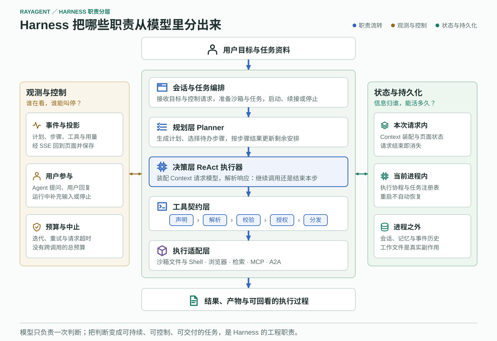

# RayAgent 的 Harness 工程

模型一次调用只能做一件事：读入一段文本，输出一段文本或一次工具调用请求。它不会真的打开文件，不知道上一步做过什么，也不会在失败后重来。把这一次判断变成一项能持续推进、能被打断、能交付成果的任务，是模型之外的工程职责——本文把这部分职责称为 **Harness**，并说明 RayAgent 把它拆成了哪几层、每层解决什么问题、为此付出什么代价。

本文维护职责分层与设计取舍，是理解这个项目的主入口。

## 三类职责

一次工具调用要真的发生，至少有三方参与，它们的失败方式完全不同：

| 角色 | 负责 | 典型失败 |
|---|---|---|
| 模型 | 判断该做什么、用什么参数 | 选错工具、参数不合法、口头声称已完成 |
| 程序 | 找到工具、校验、授权、真正执行 | 工具不存在、参数解析失败、环境不可达 |
| 流程 | 决定继续、等待还是结束，并保存过程 | 死循环、丢状态、结束了却没有成果 |

把三者混为一谈，就会出现两类典型误判：模型说"文件已写入"被当作文件真的存在；页面显示任务结束被当作目标已经达成。Harness 的价值首先在于把这三件事分开，让每一件都能被单独观察和验证。

## 职责分层

### 会话与任务编排

接收用户目标与控制请求，准备执行资源，启动、续接或停止一次运行。

这一层决定了"一次任务"的边界。RayAgent 以**会话**为单位组织目标、历史、文件和记忆，以**任务**为单位组织本轮执行；两者关联但不是同一个对象，会话存在不代表有任务在跑。创建任务时会统一准备沙箱与浏览器，因此不使用浏览器的纯文本对话也会走这条准备链路——这是一个用启动开销换取工具可用性一致的取舍。

用户在运行中补充的消息写入输入流，运行器在**每个流程事件发布之后**检查输入流并改道，而不是在任意时刻打断。所以一个正在执行的长命令不会因为新消息立刻中止，后续计划则可能因此重新生成。

### 规划层

生成计划、选择待办步骤，按步骤结果更新剩余安排。

显式计划的价值在于把"还剩什么工作"变成程序可读、可展示的对象，而不是只存在于模型的上下文里。代价是每一轮多出规划调用，并且要维护计划与实际执行之间的一致性。

Planner 调用模型时强制 `tool_choice="none"` 并要求 `json_object` 输出：它只允许产出计划，不允许顺手把活干了。工具声明仍然传给它，使它知道有哪些能力可用。

计划更新有一条容易被忽略的边界：只有当旧计划里还存在未结束步骤时，Planner 返回的新步骤才会替换掉待办段；如果所有步骤都已结束，新步骤会被丢弃。这意味着**计划更新不是一个可以在任意时刻追加工作的通用调度入口**。

### 决策层

装配 Context 请求模型，解析响应，决定继续调用工具还是结束本步。

这是 ReAct 循环所在的位置，也是"上下文里到底有什么"被真正决定的地方。每次请求的输入不是一段字符串，而是按角色组装的消息序列：系统提示、原始目标与当前步骤、会话消息、工具声明。模型看见的内容和页面展示的内容、以及数据库保存的内容，是三份不同的东西。

循环的退出条件是响应里没有 `tool_calls`。这只说明模型认为本步说完了，既不代表步骤成功，也不代表目标达成——所以 RayAgent 在这里还加了一道守卫，用来识别没有对应工具记录的"假完成"。

上下文在步骤边界做一次局部清理：`compact()` 把 `browser_view`、`browser_navigate` 两类工具消息的正文替换为 `(removed)`，并删除所有消息上的 `reasoning_content`。这是**按工具类型的定点裁剪，不是按 token 预算的压缩，也不是语义摘要**；被替换掉的网页正文无法还原，而未命中的长结果仍然会持续累积。步骤失败时不做清理，以保留排查现场。

### 工具契约层

模型提出的动作要通过五个环节才会真的发生，任何一个环节都可能失败，而且失败含义不同：

| 环节 | 问题 | 失败意味着 |
|---|---|---|
| 声明 | 有哪些能力写进了请求 | 模型根本不知道这个工具存在 |
| 解析 | `arguments` 字符串能否还原成结构 | 模型输出不合法，动作没发生 |
| 校验 | 工具是否存在、字段是否合法 | 契约不匹配，动作没发生 |
| 授权 | 这个动作、这个资源是否获准 | 动作被拒绝，不是执行失败 |
| 执行 | 环境是否真的完成了操作 | 动作发生了，结果可能是失败 |

把它们分开的实际收益是：观察一次失败时能立刻区分"模型没说对"和"环境没做成"。RayAgent 目前实现了声明、解析、校验和执行，**授权只存在于提示词层面，没有执行前的审批闸门**——模型被要求在敏感操作前确认，但这是约定而非技术约束。

工具结果按 `role: tool` 回填到模型上下文，同时作为事件发布给页面。这两条路径的内容并不相同：文件类工具在 `called` 事件上会由运行器再读一次沙箱内容填充预览字段，而给页面的事件里省略了模型看到的原始结果。

### 执行适配层

同一个"读文件"动作，在本机、在沙箱、在远程 Agent 上是三件不同的事。这一层负责把工具动作落到具体环境：文件与 Shell 走沙箱 HTTP 服务，浏览器通过 CDP 连接沙箱内的 Chromium，MCP 与 A2A 通过协议适配连接进程外的工具和远程 Agent。

MCP 与 A2A 都接进同一个工具层，但它们的契约不同：MCP 是"描述工具、传参调用、消费结果"，A2A 是"读能力卡片、委派消息、跟踪远程 Task 与产物"。远程 Task 完成、取得远程产物、本地用户任务完成，是三件需要分别确认的事。

跨进程带来一组本地工具没有的问题：不同服务可能提供同名工具（RayAgent 用带哈希的别名路由解决）、结果可能大到撑爆上下文（按字符数和列表项数截断）、调用可能挂起（连接、发现、调用各有独立超时）、远程可能要求补充输入（当前不支持续接，直接按失败返回）。

## 两条贯穿轴

### 观测与控制

计划、步骤、工具、用量作为事件贯穿整个执行，经输出流回到页面并保存为历史。这里要区分三件容易混淆的事：**内部保存的**、**接口投影出去的**、**页面展示的**，后者严格小于前者。事件投影会省略字段，时间戳取整到秒，也没有贯穿一轮的关联 ID，因此现有事件能支持"看见发生了什么"，但不足以支撑完整的调用链归因。

控制能力分布在不同层次，停止一个任务并不会自动向下传播：取消调度协程、终止沙箱里的 OS 进程、回收沙箱环境、撤销已经写入的文件，是四件独立的事，RayAgent 只做了第一件。

预算同理。迭代上限、重试次数、单次请求超时都存在，但它们都约束**单次调用**；没有跨调用的任务总预算，也就没有"这次任务最多花多少"这样的强制上限。

### 状态与持久化

执行中的信息按寿命分成三层，混淆它们是排查问题时最常见的错误：

| 寿命 | 包含什么 | 边界 |
|---|---|---|
| 本次请求内 | Context 装配结果、页面派生状态 | 请求结束即消失，不可追溯 |
| 当前进程内 | 执行协程、任务注册表 | 进程重启即丢失，另一个进程看不到 |
| 进程之外 | 会话、Agent 记忆、事件历史、工作文件与附件 | 能重新读到，但不等于能继续执行 |

最关键的区分是：**ID 是引用，记录是快照，只有工作文件是真实副作用**。数据库里存着 `sandbox_id` 不代表那个容器还在；事件历史能完整回放不代表执行能从中断处继续；取消一次任务不会回滚已经写出去的文件。

"保存"和"恢复"是两个不同的工程问题。RayAgent 做到了保存与回放，恢复执行则需要另外一套机制——查询已有结果、幂等键、步骤级检查点、执行所有权认领——这些当前都没有。

## 关键机制

### 内外层循环的交接契约

外层按步骤状态调度，内层按工具结果决策，两者只在步骤边界交接，交接内容是 `success`、`result`、`attachments`。

交接处有一个语义区分值得注意：步骤**执行失败**（`success=false`）会被交给 Planner，让它调整后续安排；而步骤**处理失败**（解析异常、模型报错、假完成守卫命中）会让整个流程中止，不进入计划更新。前者是任务的一部分，后者是任务的终结。

因为执行器能看到原始目标而不只是当前步骤，它常常在一步之内把后面的活也干了，导致三步计划在更新后塌缩成一步完成。这是动态计划的正常表现，不是计划生成得不对。

### 等待用户不是挂起

Agent 提问后，运行器保存等待状态并**退出当前运行**；用户回复到来时重新组装运行器继续，而不是唤醒原来的协程和调用栈。这个设计让等待可以跨越进程边界，代价是"继续"必须能从保存的状态重建，任何只存在于调用栈里的信息都会丢失。

### 发布与提交不是一个事务

事件先写输出流、再写数据库。这让页面能尽快看到进展，但也意味着存在一个窗口：页面已经显示了某个事件，而它还没有落库。同样地，数据库事务不包含工作文件写入、事件发布和文件存储上传——一次"步骤完成"在不同位置的可见时间并不一致。

## 本文小节对照课程与代码

想看完整推导、备选方案和排除理由，去[课程](../lessons/README.md)对应章节；想看实现位置和回归测试，去[代码地图](code-map.md)对应分组。

| 本文小节 | 课程章节 | 代码地图分组 |
|---|---|---|
| 三类职责 | 第 01 章 | — |
| 会话与任务编排 | 第 06 章 | 任务控制与生命周期 |
| 规划层 | 第 07 章 | 规划与执行循环 |
| 决策层 | 第 02、04、05 章 | 规划与执行循环、上下文与记忆 |
| 工具契约层 | 第 03 章 | 工具与动作 |
| 执行适配层 | 第 11、13、14、15 章 | 执行环境、外部协议 |
| 观测与控制 | 第 08、10 章 | 事件观测与投影、任务控制与生命周期 |
| 状态与持久化 | 第 09 章 | 状态与持久化 |
| 验证这些判断 | 第 16 章 | — |

模块边界与控制参数见[架构说明](architecture.md)，选型的备选方案见[设计取舍记录](decisions.md)，实现程度与证据见[能力与边界](capabilities.md)。本文依据 2026-09-16 的代码静态核对撰写，机制描述以代码为准。
