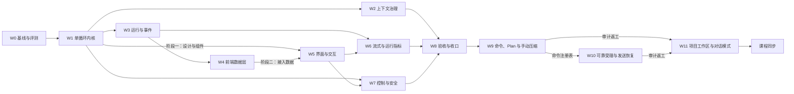

# RayAgent 阶段 4：二次开发计划

编制日期：2026-09-28；2026-09-29 追加 W9/W10；2026-09-30 评审现有实现与未提交计划草稿，按用户“优先投入最有价值的工作”的要求重评 W10 全部排除项，修订并确认 W9/W10 返工和 W11 工作区方案。实现基线：`2c323ccffdf6f58ad1e8b1214c0a12bb6b8c1a45`。本轮审计覆盖 `45bc73b9b4705d5d42dc328ad4b2a3022e8c4d62` 本身至 `fad30c0`，交互对照为前一提交 `d06a1a8`。本文件是唯一总计划和进度记录，根目录 PLAN.md 是其软链接。第 5、6 节维护进度与证据。执行顺序在[执行入口](execution.md)，入口不另存进度。

**当前怎么读：** 进度只看第 5 节。产品定位与功能定位见第 1 节（2026-09-30 调整）。进行中的交互只维护三处，不在产品说明、DESIGN 或能力边界里再写一遍：[W11](w11-project-workspace.md) 管项目、项目文件与快照、项目记忆、导航与归档；[W9 文末](w9-input-commands.md#审计返工2026-09-30) 管输入与圆环；[W10 文末](w10-local-project.md#审计返工2026-09-30) 管受理与发送恢复。三处之前的正文是历史。课程仍未更新。

本计划取代 2026-09-19 至 09-20 编制的原阶段 4 计划（P0–P8）。原计划全文可在提交 `082e825` 的 `docs/research/phase-4-plan.md` 追溯；它的方向判断被保留，规格密度与课程随包修改的安排被放弃，原因见第 2 节。未验收的目标不要写成已经具备的能力；已验收能力以[能力与边界](../capabilities.md)和源码为准。

## 1. 目标与原则

**作品定位：** 面向受信任操作者的 Web Agent Harness。用户提交任务后，单循环按工具反馈推进，可维护计划、提问、停止，长任务不被上下文撑爆，成果以可下载文件交付；界面让操作者随时看清 Agent 正在做什么、做到哪一步、花了多少；并能用一组固定评测任务证明改造前后的差异。

**产品定位（2026-09-30 用户确认，同日完整审计后校准）：** RayAgent 是**门槛更低的通用 Agent Harness 平台**。平台完成部署与模型配置后，日常使用者通过 Web 完成对话，并用“项目”承载需要多次对话、持续积累的工作，无需配置宿主机目录或 Git。本阶段仍面向受信任单人操作者，不交付免部署托管服务或多用户平台。RayAgent **不承担编码任务**：编码交给 Codex、Claude Code、Cursor 等专业工具，RayAgent 不做 Git、代码审阅或宿主机代码目录接入。它同时保持教学与实验工程的属性：执行循环、上下文、事件和工具调用对操作者透明可查。

**功能定位：**

| 能力 | 定位 | 不做 |
|---|---|---|
| 独立对话 | 日常问答、调研、处理附件、交付文件；沿用临时沙箱 | 跨对话记忆 |
| 项目 | 材料、产出和记忆的长期容器；新建或从本地文件夹上传创建，可连续开多段对话 | Git、宿主机目录挂载、实时回写本地 |
| 项目文件 | 平台托管；以“上传副本 + 下载”进出；上传前检查大小、包依赖与敏感文件并弹框确认；项目内对话的附件与交付也落入项目文件 | 在线编辑、双向同步 |
| 文件快照 | 运行前整项目快照，默认保留 5 份、设置可调至最多 7 份；读写错误不执行，超限可跳过并明确保护降级；上传覆盖/恢复须有保护快照；恢复失败先修复；已归档项目可清理快照 | 完整备份历史、单文件历史、按运行归因的变更集 |
| 项目记忆 | 透明可编辑：项目说明、项目笔记（用户与 Agent 共同维护）、有限近期摘要，每次运行读取并冻结，可追溯修改 | 向量检索、隐式记忆、全部历史细节自动召回 |
| 执行与观察 | 单循环、计划模式、提问、审批、停止、压缩；运行视图与开发者视图 | 多 Agent、排队发送 |

**取舍原则：**

- 投入顺序：执行内核与上下文决定任务能否做好，投入最大；运行与事件让状态可信，是界面可观测的前提；界面是作品唯一直接可见的部分，按行业产品标准重做，但只展示后端真实产生的数据，不做装饰性指标。不为教学项目建设生产级持久执行、多租户或平台能力。
- 每个改动要有可观察的收益：先建立评测基线，之后每个工作包用同一套任务复测。
- 一个对话完成一个包或包内一个阶段。对话开头读 [AGENTS.md](../../AGENTS.md)、本文件和对应子计划即可开工，不需要通读全部资料。
- 工作包按执行顺序连续编号，不用子编号追加新包。新需求先判断能否并入已有包；确需新增时，先修改第 3 节范围，再按顺序重排编号。包内子项（如 W7.1）只用于同一包的并行拆分。
- 代码与 `docs/` 同步推进：工作包完成时更新受影响的 docs 正文；课程在全部代码与 docs 完成后另行处理（第 7 节）。
- 新 schema 从空库建立，不兼容旧数据，不维护双执行策略；旧实现与旧课程通过 tag `baseline-v1`（W0 创建）保留。

## 2. 为什么是这些改动

以下是 2026-09-28 的源码静态核对与 2026-09-14 运行记录（见[背景](../background/README.md#能力评估的真实任务记录)）得出的判断。

| 方向 | 依据 | 结论 |
|---|---|---|
| 执行内核 | 一次“写文件、读回、交付”用了 13 次模型调用、约 6.5 万 prompt tokens，7 次工具调用中 4 次是提示词强制的进度通知；每步必须输出 Step JSON，解析失败终止整个任务；假完成守卫与总结阶段的附件 JSON 都是双循环结构的补丁；每次响应只保留第一个工具调用 | 提升最大，W1 |
| 上下文 | 记忆只追加，`compact()` 只裁两类浏览器消息，`context_window` 只用于显示；单循环会让单次运行的历史更长 | 第二，W2 紧随 W1 |
| 评测 | 目前没有能复跑的端到端任务集，labs/verification 的 V01–V05 只有样本描述 | 成本最低、证明其余改动的前提，W0 |
| 状态与事件 | 停止写 completed；events/memories/files 全部是 sessions 行上的 JSONB，每次读取整行；事件先写 Redis 后写数据库；前端状态从事件推断并靠空流重连补齐；没有轮次边界与请求耗时，界面无法可靠统计每轮用时与速率 | 第三，最小集加可观测字段，W3 |
| 前端 | 时间线按 step 猜测分组，同内容重试会隐藏失败轮次；运行中看不到当前动作、已用时间与输出速度，用量只有一个上下文占用环；组件大量直接写灰阶类名，没有设计规范与应用级暗色主题；设置页是 866 行的单文件 | 数据层随 W3 适配（W4）；界面按行业标准重做（W5）；流式输出与运行指标（W6） |
| 控制与安全 | 沙箱 Shell 输出读取协程被直接 await，推断会让长命令阻塞到进程结束；工具异常统一重试 3 次，写操作可能重复；沙箱以 root 运行、无配额；TTL 环境变量两侧命名不一致；审批只存在于提示词 | 改动小而实，W7 |

**从原计划保留的判断：** 单循环加只维护清单的计划工具；完整保存模型返回的调用集合并按 call ID 配对；数据库是事实源、Redis 只通知；停止、中断与完成分开；交付改为工具；副作用工具不自动重试；请求前检查容量并支持压缩。

**放弃的部分及原因：** 8 态状态机与逐态启动处理、request ID 去重与冲突体系、结果 unknown 分类与副作用窗口、流式 attempt 级收敛、审批绑定策略版本、ContextSnapshot 版本化、Artifact 不可变副本与摘要、会话清理顺序、逐次证据记录与逐图审阅清单。这些是生产级持久执行的要求，对单人教学作品边际价值低，却迫使第一个包先建大 schema、把用户可见改进推到很后面。原计划还缺少改造前后的度量，并要求每个包修改课程，会反复返工。

**外部参照：** 主要参照是 Codex（经 [learn-codex](https://github.com/xinqingaa/learn-codex) 拆解）：单循环、`update_plan`、调用配对与压缩。2026-09-28 补查了 [pi](https://github.com/earendil-works/pi) 与 [DeepSeek Harness](https://github.com/deepseek-ai/deepseek-harness) 的官方 README 与架构文档（未读源码、未运行），两者印证了单循环、耐久事件与瞬时流分离、悬空调用补结果、运行中插话的方向，并补充了以下四项：

| 吸收项 | 来源 | 解决的问题 | 落在 |
|---|---|---|---|
| 轮次边界事件：一次模型请求及其工具批次为一轮，开始与结束各记一条带时间与用量的事件 | pi 的 turn 事件、DeepSeek Harness 的 step 事件 | 界面的“第 N 轮”、每轮用时与 tokens、开发者视图的按轮展示不再靠猜 | W3 |
| 工具三段管线：执行前检查 → 执行 → 执行后处理，按顺序挂载处理函数 | DeepSeek Harness 的 guarded tool pipeline | 审批挂在执行前、输出整形挂在执行后，W2 与 W7 不必改同一段分发代码；工具耗时统一记录 | W1 |
| 模型可见即已记录：每次模型请求的内容都能由事件与运行快照重建，并有自动测试 | DeepSeek Harness 的 “Model-visible means logged” | 能回答“模型当时看到了什么”；开发者视图展示真实上下文而非近似值 | W3（W2 补压缩用例） |
| 失败尝试记录：失败、重试、取消的模型请求落一条轻量事件，不进入模型历史 | DeepSeek Harness 的 `assistant/attempt` | 流式中途失败时界面能说明发生了什么；评测能统计重试 | W6 |

不吸收：插件化框架与 TypeScript 重写（框架迁移）、会话树分支、子 Agent 与 Agent Teams、排队发送（运行结束后自动执行的后续消息，使用场景少而状态复杂）。

## 3. 范围

**已纳入的原阶段范围：** W0–W8 的执行、上下文、事件、前端、流式、安全与验收；W9 输入命令、后端约束的计划模式和手动压缩；W10 本地目录挂载、文件树与 Git 只读查看（2026-09-30 定位调整后废弃：Git 代码已在 `ce131c5` 移除，宿主机目录代码仍待移除；W10 收缩为可靠受理与发送恢复）。W9/W10 尚未达到完整验收，不能以 tag `v2` 的首轮成果称追加范围全部完成。

**本轮范围：** 按第 1 节定位，完成 W9 输入与上下文返工、W10 可靠受理与发送恢复、W11 项目工作区（托管项目文件、快照、项目记忆）。进度见第 5 节。

### 定位调整后的取舍（2026-09-30）

同日上午曾按“宿主机代码目录 + Git 只读”评估 W10 原排除项，并纳入项目身份、HEAD 记录、两段 diff 等；用户随后确认 RayAgent 不承担编码，Git 投入与收益不成正比，下表取代那张评估表（原表可在提交 `ef77222` 追溯）。

| 事项 | 取舍 | 原因 |
|---|---|---|
| Git（状态、diff、分支、身份、HEAD 记录、提交/推送边界、包装脚本） | 不做，已有代码全部移除 | 编码交给专业工具；Git 带来的挂载执行风险与验收量远大于非编码场景收益 |
| 宿主机目录挂载与 `PROJECT_ROOTS` | 不做，移除 | 需要配置与 Docker 文件共享，门槛高；直接改写用户文件且无回滚 |
| 长期项目实体、导航与归档 | 做，W11 | 项目是定位核心 |
| 平台托管项目目录 | 做，W11 | 默认无需配置；沙箱销毁后文件保留 |
| 上传本地文件夹（副本）与下载 | 做，W11 | 本阶段不回写本地；上传前检查大小、包依赖、版本库目录与敏感文件，前端弹框确认，服务端复核 |
| 运行前文件快照与整项目恢复 | 做，W11 | 去掉 Git 后唯一的文件保护；默认 5 份，设置可调 1–7 份 |
| 项目笔记与对话摘要索引 | 做，W11 | 把上下文从会话扩展到项目；透明可编辑，避免隐式记忆的过期与隐私问题 |
| 运行中上传与恢复快照 | 禁止 | 与同项目单活动运行一致，保证快照一致 |
| 同项目单活动运行（waiting 也占用） | 做 | 保护共享文件与笔记 |
| 项目终态后的旧写入者收尾与文件操作占用 | 做，W11 | 运行终态不能证明沙箱进程已停；环境未确认静止或恢复未完成时阻止新写入。终态停止项目容器，跨运行不保证浏览器/终端状态延续 |
| worktree、并行隔离、变更集 | 不做 | 非编码场景不需要 |
| 项目内全文搜索、向量记忆、压缩时自动写笔记 | 不做 | 首版以透明笔记为主，后续按需评估 |
| 删除项目 | 不做，首版只归档 | 删除涉及文件、快照与历史的级联处理 |
| 清理已归档项目的快照 | 做，W11 | 项目不能删除，快照又持续累积；目标用户无法自行清理 Docker 卷。只删快照，文件与历史保留 |
| 快照失败时继续运行 | 读写错误不做；超过上限仅运行前可跳过并明确提示 | 超限是保护降级例外；上传覆盖/恢复前快照不能跳过，否则拒绝操作 |
| 项目内对话的附件与交付写入项目文件 | 做，W11 | 附件与 `/workspace` 外的产出否则随沙箱回收丢失，与“项目是材料与产出的容器”不符 |
| 笔记版本列表界面 | 不做 | 每次写入的全文保留在事件中，可从开发者视图取回 |
| 沙箱空闲回收与全局沙箱上限 | 不在本轮 | 沙箱积压是独立对话与项目对话共有的问题；回收会丢失浏览器状态，需单独设计 |
| 访问围栏、鉴权 | 不做 | 继续是受信任的单人使用；默认只监听本机 |

其他原阶段排除项（多 Agent、框架迁移、向量库、多实例调度、会话分支、自动排队、执行回放、费用估算、移动端专门适配等）没有被本轮顺带纳入。窄屏仍需可读可操作。旧数据不兼容、不回填：本地库的脏数据直接移除，必要时清库重建（2026-09-30 用户确认）。

### 已确认决策（2026-09-29）

以下决策在 2026-09-29 拍板，原文照录，W9、W10 子计划同样照录；实施中与源码冲突时，在子计划“实施修正”中记录冲突与处理，决策本身保留。

1. Plan 语义 = 后端约束模式。chat 带 mode: "plan"，运行记录 mode；执行前检查对副作用工具（write_file、replace_in_file、shell_*、浏览器操作、deliver_files、MCP、A2A）返回「计划模式下不执行」；只读工具可用；提示词要求调研后用 update_plan 给出计划并结束；界面提供「按计划执行」，作为下一次普通运行。
2. 计划模式下 Shell 全部禁止（无法可靠判断命令是否只读），不改为 ask。
3. 手动压缩只在没有活动运行时可用；等待提问回复或等待审批时也不允许（返回 409）。
4. 一个会话绑定一个项目，只能在首次运行前选择或更换；沙箱创建后不允许更换。**（2026-09-30 已被 W11 修订：归属在创建会话时确定，界面不提供更换；下文该条保留为当日原文。）**
5. 文件树与 Git 由 API 侧只读挂载读取，不依赖沙箱是否存活。**（2026-09-30 定位调整后废弃：不做 Git；文件树改读托管目录，见 W11。）**
6. Agent 在项目里默认允许 git commit/push，写入能力边界；沙箱镜像安装 git。工具策略不按 Shell 参数区分 git 写操作，这一点要写进边界。 **（2026-09-30 已由 W10 R5 澄清：这是策略许可，不保证身份、凭据或远端可用。）** **（定位调整后废弃：平台不做 Git，沙箱不再安装 git 与包装脚本。）**
7. 允许接入的宿主机根目录由配置项 PROJECT_ROOTS 限定，不允许任意绝对路径。**（定位调整后废弃：不再接入宿主机目录，配置项移除。）**

协调者补充决定（2026-09-29，W9）：手动压缩不套用自动压缩的最小收益跳过规则。只要存在可摘要轮次就执行；没有可摘要轮次时返回明确原因，不算失败；摘要失败时记忆不变。

决策 1–3 与补充决定由 [W9](w9-input-commands.md) 实施，决策 4–7 的目录与 Git 部分由 [W10](w10-local-project.md) 文末实施。手动压缩的事件不挂 `run_id`、不新建运行，这条保留。项目不再使用 `sessions.project_path`；长期项目以 [W11](w11-project-workspace.md) 为准。W9、W10 文末之前的正文是 2026-09-29 历史，不按那些段落开工。

### 本轮确认与历史决策的关系（2026-09-30）

用户已确认：项目是长期实体，工作区是打开项目后的工作界面，独立对话与项目内对话共享既有执行器；打开项目不建 session；未配置时入口可发现；项目用归档保留历史，共享目录用同项目单活动运行控制并发。移除“新建任务”按钮，在项目/对话分区右侧常驻加号，两区及每个项目的对话列表可折叠，对话区固定在导航底部；项目内新对话从项目工作区空白输入发送。导航与工作台契约只维护在 [W11](w11-project-workspace.md)。

用户已确认上下文入口只显示圆环，不常驻“上下文”或占用百分比；悬停/聚焦与点击查看真实数据。输入框加号保持轻量菜单，斜杠命令提供筛选与简短说明，操作语义共用。具体契约只维护在 [W9 当前返工](w9-input-commands.md#审计返工2026-09-30)。不把该确认当作新增全功能 Git/凭据平台授权。

历史决策 1–3 保留，W9 补耗时恢复与数据口径。决策 4 里「首次运行后不能换项目」仍然成立；已打开的对话里也不改所属项目，打开项目是离开当前对话、进入工作区。决策 5、7 保留并补每次启动校验。决策 6 区分许可、身份与认证，不能保证 commit/push 成功。原排除项是否实施以上表为准。独立新对话没有快捷键。

**同日定位调整（2026-09-30 下午）：** 用户确认第 1 节的产品与功能定位。以上段落中关于宿主机目录、Git 身份、commit/push 的部分失效；项目改为托管文件、上传副本与下载、运行前快照和项目记忆，契约只在 W11。决策 1–3 不受影响；决策 4 的“归属创建时确定”保留。后端审计与证据分级见第 6 节。

## 4. 工作包与依赖

| 包 | 子计划 | 前置 |
|---|---|---|
| W0 基线与评测 | [w0-baseline-eval.md](w0-baseline-eval.md) | 无 |
| W1 单循环执行内核 | [w1-agent-loop.md](w1-agent-loop.md) | W0 |
| W2 上下文治理 | [w2-context.md](w2-context.md) | W1 |
| W3 运行与事件事实源 | [w3-run-events.md](w3-run-events.md) | W1 |
| W4 前端数据层 | [w4-ui-data.md](w4-ui-data.md) | W3 |
| W5 界面与交互设计 | [w5-ux.md](w5-ux.md) | 阶段一 W1；阶段二 W4；阶段三 阶段一 |
| W6 流式输出与运行指标 | [w6-streaming.md](w6-streaming.md) | 后端 W3；前端 W5 阶段二 |
| W7 执行控制与安全 | [w7-control-safety.md](w7-control-safety.md) | W7.1、W7.3 在 W0 后随时；W7.2 需 W1、W3、W5 |
| W8 综合验收与收口 | [w8-acceptance.md](w8-acceptance.md) | W2、W6、W7 |
| W9 输入框命令、Plan 模式与手动压缩 | [w9-input-commands.md](w9-input-commands.md) | W8 |
| W10 可靠受理与发送恢复（原本地项目、目录与 Git） | [w10-local-project.md](w10-local-project.md) | W9 的命令注册表；当前返工见文末 R2–R3 |
| W11 项目工作区、项目文件与项目记忆 | [w11-project-workspace.md](w11-project-workspace.md) | W10 R2–R3；W9 U1–U4 |
| L 课程同步 | W11 完成后另立课程计划 | W11 |

**并行规则（W0–W8 的历史分工）：** 当前 W9–W11 不按下面的「选择项目」或已删除的接手清单开工。

- W1 完成后可由三个对话并行：W2、W3、W5 阶段一。W2 与 W3 都会触及任务运行器，后合入的一方负责解决冲突并复跑对方的测试。W5 阶段一只改 UI 的组件、样式与组件状态目录页，用夹具数据开发，不改接口与订阅。
- W4 与 W5 按文件职责分工：W4 负责 `lib/api/`、订阅 hook 与事件投影，产出 [W4 子计划](w4-ui-data.md#视图模型契约)定义的视图模型；W5 负责 `components/`、样式与页面结构，只消费视图模型。视图模型字段需要变化时，修改 W4 子计划的契约并在两边同步。
- W6 的模型适配与增量通道只依赖 W3，可以先做；前端增量渲染在 W5 阶段二的消息组件上完成。
- W7.1 Shell 修复与 W7.3 沙箱身份不依赖其他包，W0 之后随时可做；W7.2 审批需要 W1 的工具管线、W3 的等待状态和 W5 的审批卡片与设置页。
- W9 当时先做后端，再做前端命令注册表。W10 后端可在 W9 后端之后与 W9 前端并行。当时接入的是「选择项目」；2026-09-30 起命令改为「打开项目」，导航归 W11。
- 2026-09-30 起，W9 的数据口径与压缩、W10 的启动与恢复、W11 的项目工作区分开维护。会话页、接口和 W4 契约的交叉修改串行合入。

### 子计划统一结构

每份子计划包含：目标与不做、现状代码事实、设计契约、改动清单、验收、docs 同步、交接。交接写明本包完成后下游能依赖的接口和已知未决问题。现状描述与代码不符时按源码校正；已确认目标契约不能因为代码尚未实现而降低验收。发现目标不可行时记录偏差、影响和处理取舍；范围或用户已确认行为需要改变时先明确变更，再同步子计划和总计划第 6 节，不以实现倒推目标已经完成。

### 每个包的完成条件

1. 子计划中的自动测试通过，测试命令按所属服务指南执行；
2. 用 W0 评测脚本复跑子计划指定的任务，结果写入 `docs/plan/evidence/`；
3. 涉及界面的包，在真实浏览器中完成子计划列出的走查，截图作为当次验证记录存放在 `docs/plan/evidence/`；
4. 子计划列出的 docs 正文已更新为当前事实，过时的项目级配图在图注标明“旧基线示意，W8 重绘”；
5. 第 5 节状态改为完成，第 6 节追加一条证据。只写完代码、未验证的状态记为待验证。

## 5. 进度

状态约定：未开始 / 进行中 / 待验证 / 阻塞 / 完成。计划行的完成只指已确认方案与文档检查；产品包不因计划改完而改变实施状态。本节与第 6 节是唯一实施进度和验证证据记录，执行入口与子计划只维护步骤、契约及验收。

| 包 | 状态 | 代码提交 | 评测报告 | 备注 |
|---|---|---|---|---|
| 计划 | 完成 | 2026-09-30 的方案确认与完整审计后契约补齐 | [审计快照](evidence/w9-w10-plan-review-2026-09-30.md) | 用户确认补齐保护、失败收敛与最终证据契约；这是计划完成，产品包仍进行中。进度以本节为准 |
| W0 | 完成 | `phase-4` 上以 `W0:` 开头的提交 | [w0-baseline-2026-09-28-961005d](evidence/w0-baseline-2026-09-28-961005d.md) | 基线 5/6 通过，E4 停止未生效；tag `baseline-v1` 指向 `961005d` |
| W1 | 完成 | `phase-4` 上以 `W1:` 开头的提交 | [w1-2026-09-28-9faa304](evidence/w1-2026-09-28-9faa304.md) | 通过情况同基线；模型调用 55 → 20 |
| W2 | 完成 | `phase-4` 上以 `W2:` 开头的提交 | [w2-2026-09-28-c0822dc](evidence/w2-2026-09-28-c0822dc.md) | E1–E7 全部通过；E7 压缩 2 次 |
| W3 | 完成 | `phase-4` 上以 `W3:` 开头的提交 | [w3-2026-09-28-8511bdf](evidence/w3-2026-09-28-8511bdf.md) | E1–E6 全部通过，E4 停止生效 |
| W4 | 完成 | `phase-4` 上以 `W4:` 开头的提交 | — | 浏览器走查随 W5 阶段二与 W6 前端完成 |
| W5 | 完成 | 以 `W5 阶段一+三:`、`W5 阶段二:` 开头的提交；完成后界面微调 `8bdacea` | 截图 `evidence/w5-2026-09-28-*.png`、`evidence/w5-2-2026-09-29-*.png` | 侧栏徽标滞后已随 W6 前端修复复验。后续界面微调见第 6 节。侧栏点击的后续记录在 2026-09-29 的 8088 走查 |
| W6 | 完成 | 以 `W6 后端:`、`W6 前端:` 开头的提交 | [w6-2026-09-29-33964e0](evidence/w6-2026-09-29-33964e0.md) | E1、E2 通过；首字延迟 579–871 ms |
| W7 | 完成 | 以 `W7.1/W7.3:`、`W7.2 后端:`、`W7.2 前端:` 开头的提交 | [w7-1-3-2026-09-28-4b413ef](evidence/w7-1-3-2026-09-28-4b413ef.md)、[w7-2026-09-29-b2d83c5](evidence/w7-2026-09-29-b2d83c5.md) | 三个子项完成；E6-deny 正式轮超时、复跑通过，W8 补正式记录 |
| W8 | 完成 | `phase-4` 上以 `W8:` 开头的提交 | [w8-2026-09-29-0d9ea1f](evidence/w8-2026-09-29-0d9ea1f.md)、[对比报告](evidence/w8-comparison-2026-09-29.md) | E1–E7 与 E6-deny 各 2 次全部通过；tag `v2` 指向 `39d9fb7` |
| W9 | 进行中 | 阶段 C 已提交 | [阶段 C](evidence/w9-w11-stage-c-2026-09-30.md) | U1–U7 与阶段 C 出口已完成；压缩中含时间线转圈并在 `8088` 验收。完整评测在阶段 E，包不标完成 |
| W10 | 进行中 | 阶段 C 已提交（R2–R3、R4） | 同上 | 慢创建、停止、迟到容器和发送读回由测试与恢复脚本覆盖，未在浏览器注入 502。网关 `127.0.0.1:8088`。R1、R4 其余与 R5 废弃 |
| W11 | 进行中 | 阶段 B + 阶段 C 部分能力 | [阶段 B](evidence/w9-w11-stage-b-summary-2026-09-30.md)、[阶段 C](evidence/w9-w11-stage-c-2026-09-30.md) | 托管卷基础已实测；阶段 C 含项目段估算与固定输入。阶段 D 的上传/快照/恢复/下载后端已有定向与真实 API 证据；附件/交付后端证据已补；记忆后端与笔记设置源代码已提交，真实摘要模型401待复验；完整 UI 和 E 验收未完成，不标完成 |
| L 课程同步 | 未开始 | — | — | 代码还在变，课程维持未更新。草稿见 [course-sync.md](course-sync.md) |

**上一轮进度（2026-09-30）：** 阶段 A、阶段 B、阶段 C 均已提交并推送，见[阶段 C 证据](evidence/w9-w11-stage-c-2026-09-30.md)与第 6 节最新记录。下一步是阶段 D：文件操作占用、上传、快照、恢复、项目笔记与摘要。W9、W10、W11 仍为进行中，不移动 `v2`。

**当前进度（2026-10-01）：** 从阶段 D 推进。部署目录已对齐 `/data/files`，真实项目创建和托管自检通过；持久所有权与统一文件 IO 已提交 `203fa08` / `abaff8b`。上传批次、覆盖前保护、内容哈希快照、原地恢复/失败修复、保留清理、无沙箱流式下载后端已本地提交 `3359830`，[本次证据](evidence/w11-stage-d-files-2026-10-01.md)记录定向 51 项、核心/协议 273 passed/28 skipped/2 warnings、真实 API 闭环与完整镜像/源码同一性。运行 API 已到迁移 `f6cad3e75b86`。附件受理/后台副本已提交 `321e0e9`、启动读回修正 `9bfc117`，定向 46 项与真实 API/事务/后台准备验证通过，见[附件证据](evidence/w11-stage-d-attachments-2026-10-01.md)。交付副本、部分失败与无沙箱补存已提交 `9317b73` / `25216bf`，真实动态沙箱与销毁后下载通过，见[交付证据](evidence/w11-stage-d-delivery-2026-10-01.md)。笔记/摘要后端与运行上下文冻结已提交 `64ffad2`，见[记忆证据](evidence/w11-stage-d-memory-2026-10-01.md)；真实摘要模型请求401，待有效凭据后复验。阶段 D 尚余完整 UI、跨包状态、记忆真实验收与完整文件故障验收补齐；随后阶段 E、版本冻结、事实文档和 tag。W9/W10/W11 保持进行中，目标 active；未冻结、未建验收 tag、未推送、未改课程。审计文件与凭据保留，独立测试 PG 继续复用；只清理证据中限定的本次测试项目，不恢复旧会话。

**阶段 C 后审计结论（2026-10-01 澄清）：** 仅针对 W9–W11，未发现需要返工阶段 B/C 或阻止进入阶段 D 的代码问题，可以继续 D。进入 D 时先修正本地文件目录与 Compose 卷目标不一致导致的项目创建 409；文件操作占用、旧写入者收尾、上传、快照、恢复、笔记与摘要是 D 的既定待办，不是 B/C 漏项。W0–W8 沿用已完成状态。详见[审计报告](evidence/audit-2026-09-30-d4a0be0.md)；本次仅修订记录，验证仍为 2026-09-30 的结果，未改产品或运行配置。

**完整审计后补充（2026-09-30）：** 用户认可审计并授权补齐全部契约；W11 新增旧写入者停止、持久化文件操作占用、恢复失败修复、内容哈希与发布/回收、上传确认及批次、附件受理关联、摘要乱序与用户笔记审计；W9 补固定项目输入超限出口；W10 补受理与附件协作。最终验收扩为完整 E1–E7/E6-deny、外部工具界面回归及非编码连续项目任务，并固定最终提交/镜像证据。以上待实施/验证，W9/W10/W11 状态不变，本轮未改产品代码、服务、用户库或课程。

**较早记录（2026-09-30，`ce131c5` 之前）：** 实现提交是 `863e2a2`。W0–W8 已完成。W9、W10、W11 的代码在该提交中，三个包都还没有真实浏览器全路径、Compose 重建和用户库迁移，所以都不能标完成。临时 PostgreSQL 18 项通过，普通核心 259 passed / 18 skipped，两套数字不能加成生产验收。用户库仍是旧结构：37 个会话、2 条旧路径、1 个 waiting，尚未迁移。完整沙箱镜像曾因 Docker Hub 超时没有建成。细节在[实施记录](evidence/w9-w11-rework-2026-09-30.md)，该文件按时间追加，不作为当前任务单。 同日下午产品定位调整（第 1 节）：W10 收缩为受理与发送恢复，W11 改为托管项目文件、快照与项目记忆；下一步先按 W11 改动清单第 1 项移除 Git 与宿主机目录代码，再改写迁移与项目模型，顺序见[执行入口](execution.md)。

## 6. 证据记录

- 2026-10-01，阶段 D 项目记忆：本地产品 `64ffad2acc64d92cb22d9977dec50a4f5d69b1c0`，观察与测试补充 `a49aa52f67ef584f3499341e30deffd6b251e69b`；[实施/证据](evidence/w11-stage-d-memory-2026-10-01.md)、[API条件](evidence/w11-stage-d-memory-api-2026-10-01.json)、[真实摘要失败](evidence/w11-stage-d-memory-model-2026-10-01.json)。冻结说明/笔记/有来源摘要、笔记版本与全文事件、设置CAS、摘要代次/截止/手动来源、重启失败标记已接入；笔记设置UI源代码和事件类型已补，未构建或浏览器验证。独立PG核心299 passed / 2 warnings，追加定向14 passed，协议25 passed，UI类型通过。真实HTTP版本/冲突通过，API healthy、业务库追加f6、178个Python文件哈希一致。真实摘要模型返回401认证失败，原摘要保留且显示失败原因；已请求有效凭据，未算模型通过，继续不依赖模型的工作。失败/复验与误目录命令保留记录，本次唯一项目/对话先按JSON范围保留供复验，无动态沙箱、无用户数据删除。W9/W10/W11仍进行中，完整UI、阶段E、冻结文档与tag未完成；不推送、不改课程。

每条一段：日期、包、代码提交与未提交变更、执行的检查及结果摘要、评测报告链接、未覆盖范围。

- 2026-10-01，阶段 D 交付副本：本地产品提交 `9317b739b140b9b19f2e8f1c3d66bb68c6851578` / `25216bfd88f33667129dfddc5ad51593015d1ab8`，无推送；[详细证据](evidence/w11-stage-d-delivery-2026-10-01.md)、[完整真实条件](evidence/w11-stage-d-delivery-api-2026-10-01.json)。独立 PG/磁盘与替身定向 46 passed，较早核心/协议 274 passed/40 skipped/2 warnings，沙箱本地 3 passed，UI 类型通过。API 190 / 沙箱 28 个 Python 文件与镜像一致、head `e5b9c2d64a75`。真实动态沙箱实际路径/副本/同调用复用、部分失败、销毁后补存，以及 HTTP 附件和 ZIP 路径/字节/哈希通过，无模型或浏览器。PG 外连接锁、共享引用约束、脚本就绪/权限、验证断言和解释器失败均修正并保留复验记录；只按 JSON 范围清理本次唯一项目/会话/三轮 run/7 个附件及对象和三个沙箱。笔记/摘要、完整 UI/跨包状态及阶段 E 仍未完成，三包保持进行中。

- 2026-10-01，阶段 D 项目附件：产品本地提交 `321e0e991939616a1bfbc930defbe6b39f3c8c7c`，启动读回修正 `9bfc117`，无推送；[详细证据](evidence/w11-stage-d-attachments-2026-10-01.md)、[实际 API/数据库/镜像条件](evidence/w11-stage-d-attachments-api-2026-10-01.json)。定向独立 PG/磁盘与替身 46 passed，核心/协议 273 passed/34 skipped/2 warnings，启动读回改动复验附件 5 项通过。真实部署迁移 `c3f7a0b42e53`、API 重建、187 个 Python 文件同一性及 HTTP 上传确认/真实受理事务/后台发布快照通过，无模型、浏览器或沙箱创建；唯一资源按预记录范围清理。新附件 fixture 缺失、旧上传测试共享 schema 的证据口径及无 PG 规则 fixture 失败已明确纠正，复验记录保留。交付、记忆、UI 和阶段 E 未完成，三包状态不变。

- 2026-10-01，阶段 D 上传/快照/恢复/下载后端：本地产品提交 `33598302633ec00b31bb9c7d470e4994f6715e8b`，无推送；[详细证据](evidence/w11-stage-d-files-2026-10-01.md)、[最终 API 条件](evidence/w11-stage-d-files-api-final-2026-10-01.json)。定向 51 passed（独立 PG + 真实临时磁盘，Docker/模型替身）；核心/协议 273 passed/28 skipped/2 warnings。业务库追加迁移 `b2e6f9a31d42`、API 重建健康、184 个 Python 文件哈希一致；真实 HTTP 覆盖前保护、复用、恢复路径/字节、无沙箱下载、归档清理及保留文件通过。测试 Path 误用与缺省协调器、Compose 服务名和容器 uv 核对失败及复验保留。两次唯一项目按事先 JSON 范围清理，其他数据保留。附件/交付、记忆、UI 与阶段 E 全部真实验收仍未完成，三包保持进行中。失败也记录，后续条目说明修正与复验。

- 2026-10-01，阶段 D 共用文件 IO：产品提交 `abaff8bad86ad3c3da8222ae89c9895ef53a9a12`，无推送。统一描述符遍历/原子发布/哈希/大小/属主，目录树与预览已复用；文件定向 19 passed，真实 Docker 验证统一发布的根文件及新建父目录内文件可由 ubuntu 改删，测试资源已清理。最新 API 镜像与 177 个 Python 文件同一性已核对；[证据后续小节](evidence/w11-stage-d-ownership-2026-10-01.md#统一文件-io-后续实施)保留完整 SHA/镜像及验证类型。尚未公开上传/覆盖入口，上传/恢复前保护快照要求不变，阶段 D/E 尚未完成。

- 2026-10-01，阶段 D 部署与所有权基础：产品本地提交 `203fa083138e4a03415dc90da6e3550b40b60ac8`，无推送；[详细证据](evidence/w11-stage-d-ownership-2026-10-01.md)、[条件与镜像](evidence/w11-stage-d-ownership-2026-10-01.json)。本地 `.env` 文件目录对齐 Compose 后，新建项目 200、真实命名卷子路径/ubuntu 改删/快照目录隐藏通过。终态与 settling 同事务、operation_id 回调、审计、启动/运行 token、Docker 停止读回及 waiting 容器核对已接入；最终定向含独立 PG 共 39 passed，较早核心/协议 244 passed/16 skipped/2 warnings。真实 Docker 曾有客户端上下文管理器错误、自动移除状态误判 409，两次修复后完整复验通过；失败记录保留。API 176 个 Python 文件与容器哈希一致，产品迁移追加单 head `a1d4e8f20c31`（旧迁移已执行，未重写/清库）。未完成阶段 D/E、模型与浏览器全套验收，三包不标完成；保留测试 PG 供后续复用，业务测试项目仅按限定 id 清理。

- 2026-09-30，阶段 C 后只读审计（`d4a0be0033d177a53e855a9a27ebf70bedf8edfa`，起始工作树干净）：[详细报告](evidence/audit-2026-09-30-d4a0be0.md)与[检查摘要](evidence/audit-2026-09-30-d4a0be0.json)。审计对象为 W9–W11；未发现需要返工 B/C 的代码问题，可以继续 D。文件保护与记忆等未实现项属于 D 的既定待办。本轮未实施阶段 D，W9/W10/W11 状态不变（2026-10-01 按用户澄清修订结论，未新增运行验证）。核心/协议 244 passed、13 skipped，独立 PostgreSQL 补跑 13 passed；UI 五个观察脚本、类型通过，lint 0 error/25 warning；沙箱 ShellService 2 项通过。API 172 个、沙箱 28 个 Python 文件与运行容器哈希一致。此前经用户授权重建并清空的数据卷，业务库为当前迁移 head、五张业务表均空；不以空库否定历史进度。当前部署文件目录与卷目标不一致，托管存储自检失败，新建项目实测 409；一次性容器按文档目录覆盖后真实挂载/ubuntu 改删/快照目录隐藏通过，测试资源已清理，运行配置未修改，该部署问题仍待处理。本地及 origin 当前无可见验收 tag，但对应历史提交和报告保留。未复跑真实模型全套评测、阶段 D 项目场景及阶段 E 最终验收；下一步先对齐部署，再实施阶段 D 文件操作占用与旧写入者收尾。

- 2026-09-30，阶段 C 出口：相关后端 50 项通过（慢启动/停止/迟到容器、固定输入 422、项目段估算不入库、附件同步失败保留 id）。UI 五个观察脚本、`tsc --noEmit`、`npm run build` 通过，lint 0 error / 25 warning。浏览器在 `http://127.0.0.1:8088` 核对浅色加号与斜杠、圆环、深色、390×844、计划后续与手动压缩；首轮走查未见「压缩中」，提交前无缓存重建 UI 后用户验收页头、状态行、侧栏与时间线转圈。网关 `127.0.0.1:8088`，无第二设备，未注入 502。见[阶段 C](evidence/w9-w11-stage-c-2026-09-30.md)。W9/W10/W11 仍进行中。

- 2026-09-30，阶段 B 出口（基于 `4759f6b`，产品工作树待阶段提交）：移除全部宿主机路径接入和改归属接口，托管项目模型/迁移、命名卷解析与子路径挂载、逐级无跟随读取、项目名称入口落地。API 核心/协议 240 passed / 13 skipped；临时 PostgreSQL 首轮 12 passed / 1 failed（废弃接口返回 404，测试误期望 405），修正后项目 3 项通过，运行/事件 10 项已通过。UI 类型/build、全部观察脚本通过，lint 0 error/25 warning；沙箱 2 项通过；三镜像构建成功。真实 Docker 验证 ubuntu 改删与快照不可见，测试资源已清理；浏览器核对项目选择器与无路径表单并截图。用户库迁移只删旧路径字段，37 会话与 waiting 保留；部署配置恢复；实际网关 127.0.0.1:8088。无项目 E1/E2/E3/E4/E7 各 1 次全通过。见[阶段 B 汇总](evidence/w9-w11-stage-b-summary-2026-09-30.md)和[模型回归](evidence/w9-w11-stage-b-2026-09-30-4759f6b.md)。E5/E6、完整项目/故障收敛及最终两次评测未执行；本轮专用 PG 与评测会话保留供后续检查，最终仅清本次资源。

- 2026-09-30，阶段 A：基于 `06609309371d5b2979b543f7d08e8f843e781393`，初始工作树干净。已读有效计划及服务指南，核对引擎、运行镜像与源码哈希、库版本及行数、卷与端口。实际 Nginx 发布到 0.0.0.0/::，与源码 loopback 默认不一致，阶段 C 重建后复验。旧路径清理限定废弃字段/关联，冲突记录需另记；未改用户数据。配置与库已私有备份。见[阶段 A](evidence/w9-w11-stage-a-2026-09-30.md)。这是只读核对与备份，不是行为/模型/浏览器验收；B–E 未完成。用户追加每阶段提交推送授权，沿用 phase-4 与中文提交风格。

- 2026-09-30，阶段 B 部署清理范围（工作树未提交，基于阶段 A `4759f6b`）：用户库当前 e7b1c4d9a2f6，2 条旧 project_path 将随 f9c2a7b4d110 删列；不回填托管项目。不删除 37 会话、55 运行、事件、文件行或附件卷；waiting 属独立对话，保留。部署 config.yaml 与库已有私有备份，API 停止/创建后先恢复实际配置再启动。真实 Docker 已验证卷子路径/ubuntu 改删/快照隐藏并清理测试目录和沙箱。部署和无项目回归尚待完成，阶段 B 未出口。

- 2026-09-28，计划：基于提交 `082e825` 编写本文件与 W0–W7 子计划；删除原阶段 4 计划与进度文档，`PLAN.md` 改指本文件；同步根 AGENTS、项目首页、文档地图、调研入口、背景、代码地图（“二次开发改造入口”）、能力与边界、设计取舍、课程目录与课程约定中的引用。检查：全仓 Markdown 本地链接与锚点无失效，`PLAN.md` 为指向本文件的相对软链接，第 4、5 节工作包与子计划一一对应，除两处历史追溯说明外无旧计划引用。子计划引用的源码行号为本日静态核对结果。未修改产品代码，未运行测试或评测。
- 2026-09-28，计划修订：基于提交 `66f20d7`。原因：界面是作品唯一直接可见的部分，原计划把视觉重设计列为不做，与作品定位不符；补查 pi 与 DeepSeek Harness 后吸收四项设计（第 2 节）。变更：范围纳入对话、运行视图与设置页重设计及开发者视图；原 W4 收窄为前端数据层并新增视图模型契约；新增 W5 界面与交互设计；原 W5、W6、W7 顺延为 W6、W7、W8，文件同步改名；W1 增加工具三段管线，W3 增加轮次事件、运行指标、请求重建与调试读取，W6 增加首字延迟、输出速度与失败尝试记录；项目 skill 新增 `skills/frontend-design`（来自 anthropics/skills，Apache 2.0，保留 LICENSE），根 AGENTS 增加界面设计约定；同步代码地图“二次开发改造入口”与背景中的编号。检查：全仓 Markdown 本地链接与锚点经 `docs/plan/` 路径解析无失效（根目录 `PLAN.md` 软链接按根目录解析相对路径产生的 14 条为检查脚本误报）；plan 目录与其他文档中无旧编号与旧文件名残留；第 4、5 节工作包与 9 份子计划一一对应。W5 现状中的样式与组件数据为本日静态核对结果。未修改产品代码，未运行测试或评测。
- 2026-09-28，W0：分支 `phase-4` 从 `961005d` 开出，本地 tag `baseline-v1` 指向 `961005d`（其与 `2c323cc` 之间只有文档变更）。新增 `tests/support/scripted_llm.py`（`ScriptedLLM`，`finish_reason` 经子类 `ScriptedInvokeResult` 携带，另提供 `exhausted_calls` 供测试断言脚本耗尽被产品重试吞掉的情况）与 `scripts/eval/`（E1–E6 声明式任务、HTTP + SSE 运行器、JSON/Markdown 报告），API 开发指南增加评测前提与命令；未修改产品代码。环境：Docker 29.7.2、Compose v5.5.0，按当前代码重建后各服务健康（重建后需重启 nginx，否则 UI 502）；模型 `deepseek-flash`（`api.deepseek.com`）直连与工具调用可用。检查：`test_scripted_llm.py` 8 项、`test_eval_script.py` 4 项通过；后端全量 103 通过、1 错误（`test_status_routes` 在宿主机解析不到 `manus-postgres`，与指南所述接口测试需另备数据库一致，开工前即存在）；UI `npm run lint` 有 19 个既有错误（`react-hooks/refs` 等，未修），事件观察脚本通过，镜像内 `next build` 通过。评测：[w0-baseline-2026-09-28-961005d](evidence/w0-baseline-2026-09-28-961005d.md)，温度 0.7、`max_tokens` 8192、`context_window` 65536，每条 1 次；E1、E2、E3、E5、E6 通过，E4 未通过（停止后标记 5 秒内增长 5 行，会话写为 completed，`shell_execute` 只有 calling 事件）。任务措辞按可检查性收紧：E2 写明 `total` 字段，E3 明确要求先询问文件名，E1/E5/E6 以最后一条助手消息为准（规划说明会复述问题）。冒烟中出现一次 E4 前置步骤“执行结果无法解析”导致结束的波动，单次基线不能代表稳定性。未覆盖：模型调用按 usage 事件计数，未发 usage 的调用会漏算；沙箱 TTL 回收未验证。
- 2026-09-28，W1：基于 `9faa304`。单循环 `AgentLoop` 替换 Planner + ReAct；新增工具三段管线 `ToolPipeline`（`add_before`/`add_after`）、`update_plan`、`deliver_files`、`repair_dangling_calls`（已发出 calling 的调用补为“执行中断，结果未知”，其余补为未执行）、传输错误与空回复重试、截断重试一次、`LLMInvokeResult.finish_reason`；移除 `message_notify_user`、Step JSON、假完成守卫、附件 JSON 与 `JSONParser`；重写中英文系统提示词；前端计划面板与工具记录最小兼容；`config.yaml` 随本包提交为 `deepseek-flash`。根 AGENTS 两处“当前 Plan + ReAct”改为单循环。检查：`test_agent_loop.py` 22 项覆盖子计划 10 项验收，协调者复跑循环与替身测试 30 项通过；后端全量 118 通过、1 既有错误；UI `npm run build` 通过，lint 仍为 19 个既有错误。评测 [w1-2026-09-28-9faa304](evidence/w1-2026-09-28-9faa304.md)（每条 1 次）：E1、E2、E3、E5、E6 通过，E4 未通过同基线；六条合计模型调用 55 → 20，prompt tokens 285218 → 92653，各条耗时均缩短；短任务均未调用 `update_plan`。Web 走查：E2、E3 类任务的计划清单、工具记录、提问与附件下载可见，截图 `evidence/w1-2026-09-28-web-*.png`（走查早于最后一处上下文清理修改，该修改不涉及提问续接路径，评测在其后运行）。子计划按代码修正，原因见其“实施修正”一节：会话占位标题“新对话”也要替换、中断调用补结果、新用户消息时清理上下文、截断提示用 user 角色等。未覆盖：停止未传到沙箱进程与停止时缺 called 事件（W7.1/W3）；基础设施不可达时会话卡在 pending；`json-repair` 依赖仍在 `pyproject`（W8 清理）；工具记录完成后仍显示“正在…”与等待中会话在侧栏显示加载图标（W5）。
- 2026-09-28，W3：基于 `8511bdf`。运行与事件改为独立表（迁移 `5b7e2c9d4a10`，删除 `sessions.events`，不转换旧数据）；事件先落库（会话内 `seq`）再发 Redis 通知；`chat` 返回 `run_id`/`seq`/`route`，SSE 改为 `GET /sessions/{id}/events?after_seq=N` 按序号续传；轮次事件与运行汇总；只读请求重建接口；停止写 `cancelled`/`user_stop` 并终止本次运行登记的 Shell 会话；启动扫描把遗留 running 标为 `interrupted`/`api_restart`，waiting 保持；前端只做接口最小适配。实施由两个代理完成（首个在收尾截图时停止，第二个补子计划修正、交接与 docs 核对）。检查：后端全量 122 通过、6 跳过、1 既有错误；跳过的 `test_run_events_pg.py`（验收 1–4、6 与快照往返）由协调者在临时 PostgreSQL 16 上补跑，6 项通过。评测 [w3-2026-09-28-8511bdf](evidence/w3-2026-09-28-8511bdf.md)（每条 1 次，对照 W1）：E1–E6 全部通过；E4 终态 cancelled（user_stop），停止后 10 秒内标记增长 0 行；六条合计模型调用 19（W1 为 20），prompt tokens 86923（W1 为 92653），差值含模型波动。手动：运行中重启 API 后刷新为 interrupted，等待中重启后回复可续接（经 API 核对，未截图，子计划未要求）。子计划按代码修正，原因见其“实施修正”（`runs.turns`、终态补写未完成轮次、`context`/`cleanup` 事件、`route`、`runner_lost` 等）。`ui/README.md` 的 chat/SSE 段落随 W5 提交（同文件含 W5 内容）。未覆盖：浏览器里的 SSE 断线重连未走查；`ttft_ms` 未实现（W6）；API 进程崩溃前已在沙箱启动的进程不被启动扫描回收。
- 2026-09-28，W2：基于 `c0822dc`。请求前容量估算（上次 `prompt_tokens` 加字符估算，随 `turn(started).context_estimate` 记录；可用上限为窗口 − `max_tokens` − 5% 窗口，水位 75%）；自动压缩（按轮切分，保留最近 3 轮可减到 1 轮，独立摘要请求计入运行计数，用户原文重新注入，`compact` 事件加 `context(replace)`，可摘要部分不足上限 15% 时跳过，摘要失败或仍超限以 `context_limit` 失败，服务端超长拒绝后强制压缩一次）；工具结果整形（超过 8000 字符时完整内容落盘到沙箱 `/home/ubuntu/.rayagent/outputs/<call_id>.txt`，模型收到首尾预览与路径；`tool.shaping` 元数据）；沙箱 Shell 输出上限约 1 MB；删除按浏览器工具名的定点裁剪。`docs/capabilities.md`、`docs/code-map.md` 同时含 W4 的前端段落，随本提交一起入库。检查：`test_context_governance.py` 17 项、`test_result_shaping.py`、`test_turn_events_rebuild.py` 6 项、`test_eval_script.py` 5 项通过；后端全量 141 通过、7 跳过、1 既有错误；临时 PostgreSQL 16 上 `test_run_events_pg.py` 7 项通过（含压缩与整形往返）。评测 [w2-2026-09-28-c0822dc](evidence/w2-2026-09-28-c0822dc.md)（每条 1 次，对照 W3）：E1–E7 全部通过，E1–E6 无回退；E7 在 `context_window` 24576、`max_tokens` 4096 下压缩 2 次（估算 14593→5777、15347→6030），source.csv 未改、12 个校验码正确；正式评测前 E7 冒烟 2 次，据此修正任务措辞并加入最小收益规则。手动会话 `seq 1 6000` 的结果被整形，模型按路径读回末行。子计划按代码修正，原因见其“实施修正”。未覆盖：`context` 事件读取时仍把 W3 旧值 `compact` 视为 `strip_reasoning`（为不清空并行使用的开发库，W8 删除）；浏览器与 A2A 大结果、真实服务端超长拒绝、默认窗口下的长任务无运行记录；落盘目录属主为 root，W7.3 改执行身份时核对。
- 2026-09-28，W4（待验证）：基于 `c0822dc`。新增 `session-projection.ts`（`projectSession`、按序号去重合并、重连退避 500 ms 起翻倍至 4 s），`useSessionDetail` 改为单条 `after_seq` 订阅并返回 `view`、`stop()`、`loadTurnRequest()`；API 客户端增加 `getTurnRequest`，SSE 忽略 ping、缺 `seq` 时用 SSE `id`；删除按内容折叠重试轮次与按最后用户消息裁剪；视图模型类型以 `session-view.ts` 为准，契约调整写回子计划（`maxTurns` 与水位不推断，提问等待 reason 为空时视为 `waiting_reply` 等）。检查：`check-event-observability.cjs` 通过，`tsc --noEmit` 与 `npm run build` 通过，lint 9 个 error 均在旧组件（W5 范围）；对真实 API 一条已完成会话只读核对，续传只收到后续序号、已到最新时只有 ping，投影得到 4 次运行与 78 条事件。会话页仍渲染旧时间线，浏览器走查（E2、E3、刷新不重复、断网补齐、停止文案）随 W5 阶段二完成后补记。
- 2026-09-28，W7.1 与 W7.3（W7.2 未做）：基于 `4b413ef`。沙箱 `exec_command` 最多等 5 秒，未结束返回 running；子进程以新会话启动，终止对进程组先 SIGTERM、约 3 秒后仍有存活进程再 SIGKILL，新命令替换旧进程同样按组处理；API 侧 Shell 等待截断到 570 秒（HTTP 读超时 600 减余量）。Supervisor 下全部服务以 ubuntu（uid 1000）运行，HOME 与工作目录 `/home/ubuntu`，上传目录与 W2 落盘目录属主为 ubuntu；动态容器默认 2048 MiB（swap 同值）、2 CPU、512 进程，可由 `SANDBOX_MEMORY_MB`/`SANDBOX_CPUS`/`SANDBOX_PIDS_LIMIT` 调整；`SANDBOX_TTL_MINUTES` 改为注入沙箱实际读取的 `SERVER_TIMEOUT_MINUTES`；提示词环境描述按镜像更新（Python 3.10.12、Node v24）。检查：沙箱新增 `test_shell_service.py` 2 项通过（本机 Python 3.12，指南的 3.10 下载无进展）；API 定向测试 31 项通过；API 容器内 `check_sandbox_environment.py` 通过（执行身份、限额与 TTL 注入）。评测 [w7-1-3-2026-09-28-4b413ef](evidence/w7-1-3-2026-09-28-4b413ef.md)（E2、E4 各 1 次，对照 W2）均通过；E4 停止后沙箱日志显示向进程组发 SIGTERM、返回 -15，`docker exec` 进程列表无循环进程，标记停在 8 行。子计划按代码修正，原因见其“实施修正（W7.1、W7.3）”。未覆盖：E1、E3、E5、E6 复跑（留到 W7.2）；TTL 实际到期销毁；supervisord 主进程仍为 root；`SANDBOX_ADDRESS` 地址模式不套用限额。
- 2026-09-28，W5 阶段一、三（阶段二未做）：基于 `f97d3a8`。新增设计说明 `ui/DESIGN.md` 与设计 token（石墨纸面加钴蓝强调，IBM Plex Sans/Mono 与中文字体回落，`next-themes` 类名暗色、默认跟随系统，状态色成对）；运行视图组件（状态条、计划条、工具卡与工具组、旁白与最终回复、用户消息、提问卡、审批卡、交付卡、压缩提示、失败尝试提示、终态条、上下文环、会话列表项）与开发模式组件状态目录 `/dev/components`，按子计划“组件与状态”表列全状态，夹具来自 W1 评测与走查会话的真实事件，按 W2/W3 契约补写的字段在夹具文件头注明；设置页拆为通用、模型提供商、MCP、远程 Agent、工具策略（占位，W7.2 实现）五分区，窄屏改为顶部标签；删除 866 行的 `manus-settings.tsx`。`ui/README.md` 中 W3、W4 的数据层段落随本提交入库。实施由三个代理完成：前两个在用浏览器 MCP 截长图时停止，第三个补齐会话列表 `pending`/`cancelled` 两个状态、修 lint 并改用 Playwright 无头脚本截图。检查：`tsc --noEmit` 与 `npm run build` 通过；`npm run lint` 在 W5 文件上 0 error，全仓剩 1 个既有 error（`components/ui/sidebar.tsx` 的 `Math.random`）。截图：`evidence/w5-2026-09-28-catalog-light.png`、`catalog-dark.png`（整页）、`settings-light.png`、`settings-dark.png`、`settings-narrow.png`（390×844），协调者抽看设置页暗色与目录页顶部。未覆盖：对比度自动检查；设置页保存与校验逐项操作；会话页接入 `view`、工作台、开发者视图与首页（阶段二）。
- 2026-09-29，W5 阶段二（待验证）：基于 `459b221`。会话页只消费 `useSessionDetail` 的 `view`，停止调用 `stop()`，删除旧时间线与其组件（`tool-use/`、`chat-message`、`plan-panel`、`tool-preview-panel` 等）；新增工作台（跟随最新工具、可固定，终端/浏览器/文件三页，窄屏抽屉）与开发者视图（事件表、按轮用时与上下文构成、`loadTurnRequest` 重建请求、导出 JSON）；首页为输入框加最近会话，空态三条示例；修复 W1 遗留的“工具完成后仍显示正在…”与等待中会话侧栏加载图标。投影补读 `context_estimate.system_prompt`/`tool_results` 与水位 token，类型字段未增删，契约写回 W4 子计划。检查：`tsc --noEmit`、`npm run lint`（0 error，原 `sidebar.tsx` 既有错误已修）、`npm run build`、`check-event-observability.cjs` 通过。Playwright 无头走查 `http://localhost:8088`（真实模型）：E2 上传与交付下载、E3 进入等你回复、E4 执行工具时停止后工具卡为“已取消：运行被停止”、多工具任务计划条 3/3、工作台跟随、开发者视图四部分构成与第 1 轮重建请求、暗色与 390×844 窄屏均通过，截图 `evidence/w5-2-2026-09-29-*.png` 13 张，协调者抽看交付与开发者视图两张。重建 UI 时 Compose 连带重建了 API 容器，把当时未提交的 W6 后端代码带入运行环境，走查在其后进行。发现缺陷：会话已终态时侧栏徽标仍显示“运行中”（列表未随详情更新）。未覆盖：E3 回复后的交付终态、工作台“回到最新”、“停止中”单独一帧、对比度自动检查、设置页逐项保存。以上缺陷与未覆盖项交给 W6 前端修复复验。
- 2026-09-29，W4 走查补记（随 W5 阶段二）：刷新前后事件不重复、不缺失（任务刚开始，仅 2 条）；执行工具时停止后文案为“你停止了这次运行”；任务结束后断网再恢复 50 条序号不丢不重，但运行中断网后的补齐三次尝试均未观察到；API 重启后的中断文案未在浏览器核对。运行中断网补齐交给 W6 前端走查。
- 2026-09-29，W6 后端（`33964e0`）：模型默认流式组装，`stream_options.include_usage` 提供 `prompt_tokens`（从未收到才按字符估算，曾收到后某次缺失不清基数）；文本增量走 Redis 频道与 SSE `delta`，不落库、无 `seq`；推理分片拼入最终消息但不推送、不计首字；`turn(completed).ttft_ms`；失败、重试与停止中的请求写 `attempt` 事件，不进模型历史，请求重建忽略；`config.yaml` 增加 `streaming: true` 与 `request_timeout: 3600`（流式时为首片与片间空闲上限）。检查：后端全量 160 通过、8 跳过、1 既有错误；临时 PostgreSQL 16 上 `test_run_events_pg.py` 8 项通过；对 `deepseek-flash` 一次真实流式请求，27 片中 24 片推理分片未进入增量，usage 正常。子计划修正见 `w6-streaming.md`“实施修正”。
- 2026-09-29，W6 前端与评测：基于 `72a5c23`。会话页按 `(run_id, turn, attempt)` 累积 `delta` 为临时旁白，同 attempt 助手消息替换，更大 attempt、另一轮、该轮结束、失败尝试或运行终态时丢弃；状态条生成中显示字符估算速度，轮次结束后按 `completion_tokens / (model_ms − ttft_ms)`（有 `reasoning_tokens` 时扣除）显示；失败尝试提示按 `reason` 给文案，停止不再写成重试上限；开发者视图显示首字、尝试与速度；当前会话的侧栏状态随详情更新（修复 W5 缺陷）。检查：`tsc --noEmit`、`npm run lint`（0 error）、`npm run build`、`check-event-observability.cjs`（含增量累积、替换、丢弃与速度估算）通过。评测 [w6-2026-09-29-33964e0](evidence/w6-2026-09-29-33964e0.md)（对照 W2）：E1 通过，10.1 s（W2 9.9 s），`ttft_ms` 871 与 629；E2 通过，12.5 s（W2 13.5 s），各轮 `ttft_ms` 652、783、751、579。Playwright 无头走查（UI 以 `--no-deps` 重建）：长文两帧字数增长且状态条为“速度（估算）”；生成中停止后临时文本消失、显示已停止；生成中刷新后旧半截不保留；截图 `evidence/w6-2026-09-29-*.png` 8 张。未覆盖：“停止中”单独一帧、非流式配置页面、浏览器里的 `model_error` 与重试耗尽文案。
- 2026-09-29，W4、W5 复验（随 W6 前端）：运行中断网 8 秒后事件序号由 9 补到 23，1–23 连续、不重复；停止后与 E3 完成后侧栏当前会话不再显示运行中；E3 回复文件名后到达已完成并出现 `sum.txt` 交付卡；工作台固定后点“回到最新”恢复跟随。W4、W5 据此改为完成。遗留：断网恢复后工作台终端仍显示“网络连接失败”（交 W7.2 阶段 B 修复）；API 重启后的中断文案未在浏览器核对（W8）。
- 2026-09-29，W7.2 工具级审批：后端 `72a5c23`，前端基于 `b2d83c5`。后端：应用配置增加工具策略表（内置工具写函数名或 `<工具集>:*`，MCP 写 `mcp:<服务>:<原始工具名>`，A2A 写 `a2a:<id>:call_remote_agent`，越具体越优先，未匹配为 allow；默认 `mcp:*`、`a2a:*` 为 ask；计划与提问工具不受策略约束）；管线执行前处理 deny 短路为 `tool(called, denied_by="policy")`，ask 发 `approval(pending)` 并进入 `waiting`/`approval`，同批后续调用不执行；`POST /sessions/{id}/approvals/{tool_call_id}` 批准执行一次、拒绝回填 `denied_by="user"`，重复或已失效返回 409，等待审批时发消息返回 409；停止与启动扫描把审批写为 expired 并补齐悬空调用，等待审批时重启运行为 `interrupted`/`api_restart`。前端：审批条目从审批事件构造并原地更新结论；审批卡接入批准与拒绝，等待批准时输入框禁用；设置页工具策略分区（分组、增删、恢复默认、整表保存）；侧栏等待徽标改为“等你处理”（列表接口不带等待原因）；修复挂起时多出空提问卡；修复工作台终端实时读取的请求字段错误（W5 起一直 422，即 W6 走查中断网后“网络连接失败”的根因）。检查：阶段 A 后端全量 182 通过、9 跳过、1 既有错误，临时 PostgreSQL 16 上 `test_run_events_pg.py` 9 项通过；前端 `tsc --noEmit`、`npm run lint`（0 error）、`npm run build`、`check-event-observability.cjs`（26 项，含 5 组审批投影）通过。评测 [w7-2026-09-29-b2d83c5](evidence/w7-2026-09-29-b2d83c5.md)（对照 W2）：E1–E6 通过，E6 先等待审批、批准后得到 6912；E6 耗时 174.3 s、E6-deny 请求超时，原因是 Docker 虚拟机积压 21 个动态沙箱约占 7 GB 内存，建会话耗时 72 s；清理 15 个空闲沙箱后 E6-deny 单任务复跑通过（14.9 s，审批被拒、夹具未收到 add、运行正常结束，报告在 `/tmp` 未入库）。Playwright 走查：审批卡、批准、拒绝（判定改看事件与夹具日志，Agent 被拒后用 Shell 算出同一结果）、刷新恢复、等待批准时停止（审批已失效）、等待批准时重启 API（页面“已中断 / 服务重启导致运行中断”，补上 W4/W5 遗留项）、设置页读写策略、断网恢复后终端继续刷新，均通过，截图 `evidence/w7-2-2026-09-29-*.png` 8 张。子计划补实施修正第 12–19 条与 W8 交接。未覆盖：A2A 调用审批实跑；策略禁止与内置工具设为 ask 的浏览器走查；设置页增删规则与保存失败的浏览器操作；E6 与 E6-deny 在资源正常环境下的正式评测（W8）。已知问题：动态沙箱积压会耗尽 Docker 内存，使会话长时间停在 pending。
- 2026-09-29，W8 综合验收与收口：基于 `0d9ea1f`，加上随 W8 提交的 API 清理（删除 `context` 旧值 `compact` 的读取兼容及其测试；从 `pyproject.toml`、`uv.lock`、`requirements.txt` 移除 `json-repair`，容器按 `requirements.txt` 安装，重建后镜像内已无该模块）。空库重建 Compose 后各核心服务可用，默认工具策略为 `mcp:*`、`a2a:*` ask。检查：后端全量 181 通过、9 跳过、1 既有错误（`test_status_routes`）；临时 PostgreSQL 16 上 `test_run_events_pg.py` 9 项通过；沙箱 unittest 2 项通过；UI `tsc`、lint（0 error）、build、事件观察脚本通过；容器内沙箱环境检查退出码 0。评测 [w8-2026-09-29-0d9ea1f](evidence/w8-2026-09-29-0d9ea1f.md)，对照见 [w8-comparison-2026-09-29](evidence/w8-comparison-2026-09-29.md)：模型 `deepseek-flash`、温度 0.7、窗口 65536（E7 临时 24576），每个任务前后删除动态沙箱；E1–E7 与 E6-deny 各 2 次全部通过，16 次都没有重试，首字延迟 245–1748 ms。相对 W0，短任务的模型调用与 prompt tokens 下降，不再出现 `message_notify_user`；E4 两次为 cancelled（user_stop），标记停在 8 行；E6 与 E6-deny 在 10–12 s 内完成；E7 两次各压缩 2 次后交付正确。跨包组合各 1 次通过：流式停止（临时内容消失、沙箱进程退出）、压缩后中途提问并续接、压缩后一轮的重建请求含摘要与用户原文且与调试接口一致、等待审批时重启 API、运行中刷新与断网 8 秒后序号连续。既有能力经界面各 1 次通过：浏览器受控页面、MCP 夹具、A2A 夹具回复与远端失败（均先批准）。Playwright 走查通过，组件状态目录在开发服务器上核对 74 个状态（生产构建返回 404），截图 `evidence/w8-2026-09-29-*.png` 15 张。失败记录：压缩组合脚本首轮把三句提示合进同一次运行，改脚本后通过；组件目录前两次因编译中与 `.next/dev/lock` 占用失败，第三次通过；均未改产品代码。docs 收口：harness、architecture、decisions、capabilities、code-map、product、首页、背景与运行、Docker 指南对齐单循环、审批与事件事实源；六张项目级配图重绘并换上新图注，`course-stages.svg` 未改；删除代码地图已空的改造入口表；课程目录说明正文对应 `baseline-v1`；新增[课程计划草稿](course-sync.md)；全仓 Markdown 本地链接与锚点检查无失效。Web Interface Guidelines 审查的轻微项未修，记入能力与边界。未覆盖：设置页前四个分区的保存与校验；默认窗口下的长任务压缩；不外推成功率。已知问题：动态沙箱积压仍需手动清理或等 TTL。
- 2026-09-29，W5 完成后界面微调（基于 `02bb9bd`，提交 `8bdacea`）：侧栏状态改纯文字，用户复核后撤回新增的已完成和已停止标记；运行状态条统一行高并在桌面宽度固定高度内垂直居中；开发者视图精简筛选与导出，`context` 事件按操作命名；事件原文和轮次请求可展开、收起并带短过渡。检查：UI `npm run lint` 0 error、22 个既有 warning，`npm run build`、`tsc --noEmit`、事件观察脚本通过；开发服务器 `3001` 的实际会话走查确认筛选上下文事件共 6 条（2 条清理推理字段、4 条追加消息）、原文与轮次可再次点击收起，390×844 和深色模式视觉核对；Compose 只重建 `manus-ui` 并重启 Nginx，`http://localhost:8088` 的页面视觉核对确认侧栏结束会话只留时间、状态行内容垂直居中，键盘操作确认事件原文与轮次请求可展开收起、类型筛选可用。未重跑模型评测，未归档本次浏览器截图。
- 2026-09-29，W5 开发者视图后续修正（基于 `8bdacea`，工作树未提交）：用户指出首版把请求内容放在整个轮次列表底部；现为每轮建立独立面板，紧跟该轮条目，切换轮次时旧面板收起、新面板展开，请求结果按运行与轮次缓存。事件表格另按用户截图修复短列被摘要挤成竖排的问题：固定序号、时间、类型、运行与原文操作列宽，窄屏时表格内部横向滚动。检查：UI `npm run lint` 0 error、22 个既有 warning，`npm run build`、`git diff --check` 通过；Compose 重建 `manus-ui` 并重启 Nginx 后，在 `http://localhost:8088` 的六轮真实会话核对第一轮请求位于第二轮之前，第二轮显示自己的 5 条消息，请求面板可收起；事件表格“原文”保持横排，操作列宽 64px，展开原文后列宽稳定。未重跑模型评测，未归档本次浏览器截图。
- 2026-09-29，W5 标题生成与重命名后续优化（当前工作树）：首次消息随 run 保存临时标题并异步请求独立的短标题模型；会话行记录标题来源，生成结果只在仍为临时标题时写入。侧栏标题固定单行，完整内容可在悬停和编辑框查看；侧栏与首页最近会话菜单都可重命名，编辑框末尾的 AI 按钮只填入建议，保存后才写入标题事件。支持按原语言生成，中日韩和拉丁文本按不同宽度控制，手动标题不被迟到结果覆盖。验证：API 核心测试、UI lint/build、Compose 迁移与真实接口；浏览器核对单行标题、弹窗和中文 AI 建议；真实会话在异步生成前手动改名，模型完成后保持手动名称。进程重启可能使未完成的后台标题请求丢失，临时标题仍保留，可手动请求建议。
- 2026-09-29，W5 侧栏状态与标题后续修正（工作树未提交）：状态从文字改为右下角色点，覆盖 pending、running、waiting、completed、failed、cancelled、interrupted；聚焦或悬停显示状态名称，导航按钮的可访问名称也包含状态。标题取消单行省略样式，显示已保存的内容并自然换行；选中态及操作菜单保留。检查：UI `npm run lint` 0 error、22 个既有 warning，`npm run build`、`git diff --check` 通过；Compose 重建 `manus-ui` 并重启 Nginx，在 `http://localhost:8088` 实际会话核对长标题换行、色点位置和颜色、键盘聚焦提示；390×844 抽屉与深色主题目视核对。未重跑模型评测，未归档浏览器截图。
- 2026-09-29，W5 侧栏与首页再次调整（当前工作树）：按反馈移除侧栏常驻状态色点与彩色状态文字，仅在选中项左侧细条使用七种状态色，保留悬停提示及可访问名称；会话顶部新增常驻重命名入口，复用手动标题与 AI 建议弹窗；桌面工作台宽度和主区随开合在 220 ms 内过渡，窄屏抽屉改为相同时长；侧栏顶部只保留 RayAgent 入口与折叠控件，新建任务仍可在收起态使用，设置移至底部，主题选项移入设置的外观分区；首页移除最近会话和示例，任务输入在主区居中。检查：UI `npm run lint` 0 error、22 个既有 warning，`npm run build`、`git diff --check` 通过；Compose 重建 `manus-ui` 并重启 Nginx。`http://localhost:8088` 实际会话页核对选中条颜色与无色点、顶部重命名弹窗、工作台开合宽度从 0 到 416px 再收回、设置外观三选项、桌面折叠态、390×844 首页与抽屉及长标题编辑入口。没有修改已有会话标题或主题偏好；未重跑模型评测。
- 2026-09-29，W5 运行状态与工作台后续修正（当前工作树）：完成或停止的运行移除顶部整行状态，标题旁保留轻量终态；运行中与等待审批、提问时只显示状态、当前动作、用时和停止操作，失败或中断保留原因。顶部移除过期速度及累计 tokens，上下文环明确标为“最近一次模型请求的上下文占用”。工作台改为按需打开，顶部只留展开图标，面板保留唯一可见标题；切换会话时重置工作台状态。按工具类型默认切换：Shell 到终端、浏览器到截图、文件到文件页，远程 Agent、MCP、搜索、计划等到新“结果”页；不相关的空终端/浏览器标签不出现。进一步核对并补足 Shell、浏览器、文件调用无常规输出时的结果或错误回退。检查：UI `npm run lint` 0 error、22 个既有 warning，`npm run build`、事件观察脚本通过（保留两个已知限制），`git diff --check` 通过；Compose 重建 `manus-ui` 并重启 Nginx，在 `http://localhost:8088` 的真实远程 Agent 成功与失败、MCP、计划、浏览器、Shell、文件会话逐项核对默认标签与内容；390×844 核对已中断会话状态、上下文环及远程 Agent 结果抽屉。未重跑模型评测，未归档本次浏览器截图。
- 2026-09-29，W9 / W10 界面走查（基于提交 `f310c8d`，记录 [w9-w10-walkthrough-2026-09-29](evidence/w9-w10-walkthrough-2026-09-29.md)）：Compose `http://localhost:8088`，未改产品代码、未发送新消息。侧栏内边距可点、更多菜单不带动整行、10 次脚本快切与三标签互不影响、键盘空格切换通过；上下文环 4 倍放大无毛刺，悬停与点击详情（含「立即压缩」按钮可见但未点击）通过；首页与会话页的 `/` 与 `+` 菜单三项一致（上传、Plan、压缩），路径内 `/` 不触发，上下键与 Esc 通过；Plan 标记出现与移除通过，「按计划执行」未在已有会话中出现、未新开计划任务故未点击；压缩入口可用性核对通过，未执行 `/compact` 与「立即压缩」。`PROJECT_ROOTS` 为空，首页无项目选择器、命令无「选择项目」，与配置一致；未测绑定与变更页。截图 `w9-sidebar-selected-2026-09-29.png`、`w5-context-ring-2026-09-29-light.png`、`w5-context-ring-2026-09-29-dark.png`、`w9-command-menu-2026-09-29.png`。未跑评测。
- 2026-09-29，W9 / W10 评测复跑（提交 `f310c8d`，报告 [w9-w10-2026-09-29-f310c8d](evidence/w9-w10-2026-09-29-f310c8d.md)）：`uv run --locked python -m scripts.eval --tasks E1,E2,E3,E4,E7 --repeat 1 --label w9-w10`，API `http://localhost:8088/api`，模型 `deepseek-flash`，窗口 65536（E7 任务内临时 24576）。开跑前无动态沙箱，未删 Compose 数据卷。E1、E2、E3、E4、E7 各 1 次通过，指标与运行汇总一致；会话 `project` 均为 null。未跑 E5、E6、E6-deny。未覆盖：带 `PROJECT_ROOTS` 的 Compose 挂载。
- 2026-09-29，W9 现场操作（记录 [w9-live-2026-09-29](evidence/w9-live-2026-09-29.md)）：在已完成会话点击「立即压缩」，时间线出现手动压缩条目，侧栏保持已完成，估算 6294 → 6312；成功提示未被观察到。首页以计划模式发送只读调研，状态条显示计划模式；点击「按计划执行」后普通运行执行了 Shell，随后停在「等你回复」，未等到已完成。
- 2026-09-30，计划评审与修订（代码基线 `fad30c0`，含未提交 W9/W10/W11 草稿）：[审计快照](evidence/w9-w10-plan-review-2026-09-30.md)。审计覆盖 `45bc73b^..fad30c0`，明确包含用户指定起始提交。
  - 实际运行：后端六个相关测试文件共 83 项通过；UI 事件观察与 slash 观察通过；投影合成输入复现估算 1000、实际 prompt 4000 却显示 1000；8088 浏览器核对加号菜单和上下文详情，没有发送消息或运行真实模型。
  - 静态结论：输入/上下文交互退步、占用口径不一致；chat 同步建沙箱、首次消息失败不回填、启动返工缺少停止/迟到结果处理；项目模型与新建作用域未闭环。W10 证据检查期间补回，报告记录局部 API/挂载通过和浏览器首发失败，截图完成态不足；只读挂载保护结论过强。
  - 文档验证：当前修订的本地链接与锚点检查通过，git diff --check 通过。补回的原 W10 报告和图片已读，未改其原始记录。
  - 用户要求整体评估收益与投入；已重评全部 W10 原排除项，修订三份子计划与课程草稿前置条件。新增方案写为建议，不记成确认决策。没有修改产品代码、课程正文、部署配置，也没有重跑真实模型/真实项目写入。
- 2026-09-30，计划最终收敛（沿用 `fad30c0` 审计基线，文档工作树未提交）：用户确认其余方案并明确最后两项调整。W11 移除“新建任务”按钮，确定项目/对话分区加号、分区与项目子列表折叠、对话区固定置底及项目内空白输入；W9 入口仅保留圆环，数值在悬停/聚焦与点击详情，补明确四个输入命令的用途。新增[执行入口](execution.md)，包含阶段 A–E、阶段出口与目标模式提示词；进度/证据继续只维护本文第 5、6 节。清理“方案尚待用户确认”表述，保留当时审计及历史记录，课程草稿校准到后续最终验收代码。检查：本轮七份文档的本地链接与锚点、PLAN.md 软链接指向、文档一致性与空白检查通过。本轮只修改计划文档，未改产品代码、课程正文或运行配置；未新增产品运行验证。计划状态完成，W9/W10 仍进行中，W11 仍未开始。（当时记录；当前状态以第 5 节为准。）

- 2026-09-30，W9/W10/W11 目标实施开始（`44f4926` + 未提交工作树）：[实施记录](evidence/w9-w11-rework-2026-09-30.md)。阶段 A 主路径/异常状态索引写入待实现 DESIGN；阶段 B 首批后台启动与压缩期限/忙碌状态实现，相关 69 项与压缩 21 项通过，首轮核心全量 246 passed/10 skipped；UI 类型及 lint（0 error/22 warning）通过，环境事件实际投影通过。随后 R1 接入后核心全量 247 passed/10 skipped，UI build/两个观察通过，macOS Docker 临时普通仓库真实读写/重校验/gitfile 拒绝通过且资源清理；Compose loopback 仅解析核对。真实浏览器/临时 PG 与剩余验收待完成。服务与用户数据未变，不将首批代码视为包完成。

- 2026-09-30，W9/W10/W11 后续（`44f4926` + 工作树）：[实施记录后续](evidence/w9-w11-rework-2026-09-30.md)。新增启动交叉/shutdown、草稿受理核对、上下文真实快照/计划判断、轻量输入和工作台刷新/乱序；API核心249 passed/10 skipped，Git定向15 passed，UI观察/类型/lint/build按记录通过。真实 macOS Docker临时wrapper与commit身份/hooks/filter验证通过，完整构建Docker Hub超时失败保留；合成主路径及390×844渲染修正通过，不算真实项目验收。服务与用户库未更新，W11实体及最终真实验收待完成。

- 2026-09-30，W11 数据与事务接线（`a359564` + 工作树）：[增量记录](evidence/w9-w11-rework-2026-09-30.md)。实际临时 PostgreSQL18 passed：原有事件/run/重建10项、项目去重与重叠/同项目互斥/waiting与终态/快照/归属竞争/HTTP/旧路径回填/迁移失败回滚8项。普通核心259 passed/18 skipped，2既有warnings。迁移单head `f9c2a7b4d110`，未运行于用户库。旧W10路径绑定及recent测试已改由W11真实库契约检查，保留工作台/沙箱/提示词检查。实际UI新契约和真实端到端仍待完成，不宣告工作包完成。

- 2026-09-30，文档收敛：实现已在 `863e2a2`。总计划只保留索引和进度；进行中的交互分别留在 W11、W9 文末和 W10 文末。删除 2026-09-29 接手清单，以及人天、建议对话数和具体模型指名。产品说明、DESIGN、能力边界、架构和代码地图里与今天契约冲突的现行句改为指向这三处，不把未验收的工作区写成已上线。课程未改。未新跑测试或浏览器。

- 2026-09-30，文档收尾：W9/W10 历史段加「已废弃」标记；决策 4、6 标注已修订；旧收敛条目标为当时记录；产品说明、DESIGN、代码地图补「已验收/进行中」区分。用户确认两项：waiting 继续占用项目（界面给占用者跳转、停止入口与「等待中」标记，不做超时和排队）；项目内新对话入口增加侧栏项目菜单与对话页标题栏的「在此项目新对话」，写入 W11。检查：全仓 Markdown 本地文件链接无失效，`git diff --check` 通过；锚点未逐条检查。未改产品代码，未跑测试或浏览器。

- 2026-09-30，产品定位调整：用户确认 RayAgent 是门槛更低的通用 Agent Harness 平台，不承担编码任务。决定：平台不做任何 Git 能力，已有 Git 代码全部移除；不再接入宿主机目录；项目文件平台托管，本阶段以“上传副本 + 下载”进出，上传前检查大小、包依赖与敏感文件并由前端弹框确认；运行前文件快照默认 5 份、设置可调至最多 7 份；运行中禁止上传与恢复；上传阈值由协调者评估（单次 200 MB/2000 个文件、单文件 50 MB、项目 500 MB）。随后用户确认采用协调者推荐：说明与笔记每次运行开始读取；首版只归档不删除项目；不做压缩时写笔记；旧数据不兼容，本地库脏数据直接移除，必要时清库重建，迁移去掉回填与预检。修改第 1、3、4、5 节，重写 W11，收缩 W10，更新执行入口。未改产品代码，未跑测试或浏览器。
- 2026-09-30，W11 第 1 项（Git 部分，基于 `863e2a2`，工作树未提交）：删除 Git 读取器、项目 Git 状态与差异接口、项目 Git 身份字段、运行前 Git 快照与 `project_start` 观察、沙箱 Git 默认配置脚本及 API/沙箱镜像中的 git 安装；迁移 `f9c2a7b4d110` 改为不建 Git 列、不回填旧 `project_path`、不做预检，旧路径数据直接丢弃，降级不恢复。前端删除变更页、分支显示、设置里的 Git 身份与相关类型、接口和夹具，项目图标换为普通文件夹。检查：API `pytest tests/core` 240 passed / 16 skipped；临时 PostgreSQL 上 W11 与 run_events 16 项通过；UI `tsc --noEmit`、`npm run build`、`scripts/*.cjs` 通过，`npm run lint` 剩 2 个 error 均在 `left-panel.tsx` 未改动的既有 effect 中；`git diff --check` 通过。保留：宿主机目录登记（`PROJECT_ROOTS`、`/roots`、`/browse`）待阶段 D 托管目录落地时移除；评测脚本的 `git_info` 记录本仓库提交，属于开发工具。未覆盖：Compose 重建与浏览器走查、用户库迁移。随后以 `ce131c5` 提交；“工作树未提交”是当时记录。

- 2026-09-30，计划审计补充（基于 `ce131c5`，文档未提交）：对照现有循环、默认 Compose 与沙箱身份，补齐 W11 里会在实施时出错的契约。用户确认三项：快照因磁盘或读写错误失败时，本次运行以环境准备失败结束、不执行；项目内对话的附件写入 `files/uploads/`，`/workspace` 外的交付复制到 `files/outputs/`；已归档项目可清理全部快照，文件与历史保留。同条写入、不另开范围的还有：托管目录用命名卷子路径挂载、API 写入统一改属主、遍历不跟随符号链接、快照按内容存储并原地恢复、项目段请求时拼接且不写入记忆、笔记冲突时返回全文、摘要带来源字段、排除规则分确定与有条件两档。沙箱空闲回收、笔记版本列表界面、拆分 W11、把 W9/W10 历史正文移走，均不纳入。同步总计划第 1、3、5 节与执行入口，W9 U3 的手动压缩估算，能力边界的项目一行，架构与代码地图里已删除的 Git 读取（含工作台变更页的断链）。检查：上述七份文档的本地链接与锚点无失效，`git diff --check` 通过。未改产品代码，未跑测试或浏览器。

- 2026-09-30，完整计划审计后契约补齐（基于 `ce131c5`，本轮文档工作树未提交）：用户认可审计并授权补齐全部契约。修改 W11 的共享写入收尾、文件操作冲突表与启动核对、恢复失败修复、内容哈希快照发布/回收、保护降级和大小状态、上传确认/批次、附件 pending/ready 关联与交付部分失败、项目审计/摘要乱序/固定输入容量；W9/W10 同步跨包职责与验收。执行入口要求最终完整评测、外部工具界面回归、固定答案的非编码连续项目场景、最终提交/镜像记录及新验收 tag，课程草稿只校准前置条件。校准“部署完成后日常使用低门槛”和超限快照例外；现状按源码核对，已确认目标不因尚未实现而降低验收。静态检查：六份文档 202 个本地链接、21 个 Markdown 锚点无失效，PLAN.md 软链接正确，`git diff --check` 通过；随后补固定项目样本与遍历类型约束并复查。没有修改产品代码、课程正文、服务配置或用户库，没有新增测试/浏览器/Docker 运行证据，W9/W10/W11 仍进行中。

## 7. 课程同步（追加工作验收之后）

代码阶段不修改课程正文，只在[课程目录](../../lessons/README.md)说明正文对应 `baseline-v1`。原定 W8 完成后开始；2026-09-29 起顺延到 W10 完成后，2026-09-30 再顺延到 W11 完成后，以届时的代码和评测数据为依据另立课程计划（tag `v2` 保留首轮验收基线），按改动幅度分批：

| 类别 | 章节 | 处理方式 |
|---|---|---|
| 重写主线 | 04、05、06、07、08、10 | 按新机制重写；07 改为“规划与执行决策”，以计划工具为主，双循环作对照，附基线与新版实测数据；10 以轮次事件、增量通道和运行视图为观察入口 |
| 局部更新 | 02、03、09、11、12、16 | 更新受影响的机制段落与项目实现段落；16 以评测脚本和前后对比为真实素材 |
| 基本保留 | 01、13、14、15 | 协议与浏览器原理不变，只改接入点段落；01 最后校准 |

课程配图只重画描述旧主链路的图，通用原理图保留。旧方案的推导保留为对照内容，不维护第二套课程。

逐章草稿见 [课程计划草稿](course-sync.md)。
