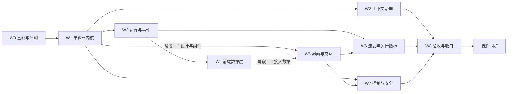

# RayAgent 阶段 4：二次开发计划

编制日期：2026-09-28，同日修订一次（纳入界面重设计与外部参照，工作包顺延为 W0–W8，见第 6 节）。实现基线：`2c323ccffdf6f58ad1e8b1214c0a12bb6b8c1a45`（之后到 `66f20d7` 只有文档变更）。本文件是唯一总计划，根目录 `PLAN.md` 是指向本文件的相对软链接；各工作包的设计与验收在同目录子计划中，进度与证据只维护在本文第 5、6 节。

本计划取代 2026-09-19 至 09-20 编制的原阶段 4 计划（P0–P8）。原计划全文可在提交 `082e825` 的 `docs/research/phase-4-plan.md` 追溯；它的方向判断被保留，规格密度与课程随包修改的安排被放弃，原因见第 2 节。以下内容均为目标，不代表已实现；当前能力以[能力与边界](../capabilities.md)和源码为准。

## 1. 目标与原则

**作品定位：** 面向受信任操作者的 Web Agent Harness。用户提交任务后，单循环按工具反馈推进，可维护计划、提问、停止，长任务不被上下文撑爆，成果以可下载文件交付；界面让操作者随时看清 Agent 正在做什么、做到哪一步、花了多少；并能用一组固定评测任务证明改造前后的差异。

**取舍原则：**

- 投入顺序：执行内核与上下文决定任务能否做好，投入最大；运行与事件让状态可信，是界面可观测的前提；界面是作品唯一直接可见的部分，按行业产品标准重做，但只展示后端真实产生的数据，不做装饰性指标。不为教学项目建设生产级持久执行、多租户或平台能力。
- 每个改动要有可观察的收益：先建立评测基线，之后每个工作包用同一套任务复测。
- 一个对话完成一个包或包内一个阶段。对话开头读 [AGENTS.md](../../AGENTS.md)、本文件和对应子计划即可开工，不需要通读全部资料。
- 工作包按执行顺序连续编号，不用子编号追加新包。新需求先判断能否并入已有包；确需新增时，先修改第 3 节范围，再按顺序重排编号。包内子项（如 W7.1）只用于同一包的并行拆分。
- 代码与 `docs/` 同步推进：工作包完成时更新受影响的 docs 正文；课程在全部代码与 docs 完成后另行处理（第 7 节）。
- 新 schema 从空库建立，不兼容旧数据，不维护双执行策略；旧实现与旧课程通过 tag `baseline-v1`（W0 创建）保留。

## 2. 为什么是这些改动

以下是 2026-09-28 的源码静态核对与 2026-09-14 运行记录（见[背景](../background/README.md#能力评估的真实任务记录)）得出的判断。

| 方向 | 依据 | 结论 |
|---|---|---|
| 执行内核 | 一次“写文件、读回、交付”用了 13 次模型调用、约 6.5 万 prompt tokens，7 次工具调用中 4 次是提示词强制的进度通知；每步必须输出 Step JSON，解析失败终止整个任务；假完成守卫与总结阶段的附件 JSON 都是双循环结构的补丁；每次响应只保留第一个工具调用 | 提升最大，W1 |
| 上下文 | 记忆只追加，`compact()` 只裁两类浏览器消息，`context_window` 只用于显示；单循环会让单次运行的历史更长 | 第二，W2 紧随 W1 |
| 评测 | 目前没有能复跑的端到端任务集，labs/verification 的 V01–V05 只有样本描述 | 成本最低、证明其余改动的前提，W0 |
| 状态与事件 | 停止写 completed；events/memories/files 全部是 sessions 行上的 JSONB，每次读取整行；事件先写 Redis 后写数据库；前端状态从事件推断并靠空流重连补齐；没有轮次边界与请求耗时，界面无法可靠统计每轮用时与速率 | 第三，最小集加可观测字段，W3 |
| 前端 | 时间线按 step 猜测分组，同内容重试会隐藏失败轮次；运行中看不到当前动作、已用时间与输出速度，用量只有一个上下文占用环；组件大量直接写灰阶类名，没有设计规范与应用级暗色主题；设置页是 866 行的单文件 | 数据层随 W3 适配（W4）；界面按行业标准重做（W5）；流式输出与运行指标（W6） |
| 控制与安全 | 沙箱 Shell 输出读取协程被直接 await，推断会让长命令阻塞到进程结束；工具异常统一重试 3 次，写操作可能重复；沙箱以 root 运行、无配额；TTL 环境变量两侧命名不一致；审批只存在于提示词 | 改动小而实，W7 |

**从原计划保留的判断：** 单循环加只维护清单的计划工具；完整保存模型返回的调用集合并按 call ID 配对；数据库是事实源、Redis 只通知；停止、中断与完成分开；交付改为工具；副作用工具不自动重试；请求前检查容量并支持压缩。

**放弃的部分及原因：** 8 态状态机与逐态启动处理、request ID 去重与冲突体系、结果 unknown 分类与副作用窗口、流式 attempt 级收敛、审批绑定策略版本、ContextSnapshot 版本化、Artifact 不可变副本与摘要、会话清理顺序、逐次证据记录与逐图审阅清单。这些是生产级持久执行的要求，对单人教学作品边际价值低，却迫使第一个包先建大 schema、把用户可见改进推到很后面。原计划还缺少改造前后的度量，并要求每个包修改课程，会反复返工。

**外部参照：** 主要参照是 Codex（经 [learn-codex](https://github.com/xinqingaa/learn-codex) 拆解）：单循环、`update_plan`、调用配对与压缩。2026-09-28 补查了 [pi](https://github.com/earendil-works/pi) 与 [DeepSeek Harness](https://github.com/deepseek-ai/deepseek-harness) 的官方 README 与架构文档（未读源码、未运行），两者印证了单循环、耐久事件与瞬时流分离、悬空调用补结果、运行中插话的方向，并补充了以下四项：

| 吸收项 | 来源 | 解决的问题 | 落在 |
|---|---|---|---|
| 轮次边界事件：一次模型请求及其工具批次为一轮，开始与结束各记一条带时间与用量的事件 | pi 的 turn 事件、DeepSeek Harness 的 step 事件 | 界面的“第 N 轮”、每轮用时与 tokens、开发者视图的按轮展示不再靠猜 | W3 |
| 工具三段管线：执行前检查 → 执行 → 执行后处理，按顺序挂载处理函数 | DeepSeek Harness 的 guarded tool pipeline | 审批挂在执行前、输出整形挂在执行后，W2 与 W7 不必改同一段分发代码；工具耗时统一记录 | W1 |
| 模型可见即已记录：每次模型请求的内容都能由事件与运行快照重建，并有自动测试 | DeepSeek Harness 的 “Model-visible means logged” | 能回答“模型当时看到了什么”；开发者视图展示真实上下文而非近似值 | W3（W2 补压缩用例） |
| 失败尝试记录：失败、重试、取消的模型请求落一条轻量事件，不进入模型历史 | DeepSeek Harness 的 `assistant/attempt` | 流式中途失败时界面能说明发生了什么；评测能统计重试 | W6 |

不吸收：插件化框架与 TypeScript 重写（框架迁移）、会话树分支、子 Agent 与 Agent Teams、排队发送（运行结束后自动执行的后续消息，使用场景少而状态复杂）。

## 3. 范围

**本阶段做：** 评测基线与脚本化模型替身；单循环、工具三段管线、计划/提问/交付工具与提示词重写；请求容量、工具输出整形与自动压缩；runs 与 events 表、轮次事件与运行指标、按序号续传的 SSE、请求重建与调试读取、停止传播与启动扫描；前端事件订阅与视图模型；对话、运行视图与设置页的界面与交互重设计，含开发者视图；模型流式输出、首字延迟与输出速度、失败尝试记录；Shell 缺陷修复、工具级审批、沙箱非 root 与配额；综合验收、项目级配图重绘与 docs 收口。

**本阶段不做：** 多 Agent/子 Agent、worktree 与长期项目工作区、跨会话记忆与向量库、框架或语言迁移、MCP/A2A 能力扩展、多实例与共享沙箱调度、旧数据迁移、会话分支、排队发送、执行过程回放、费用估算、移动端专门适配（只保证窄屏可读可操作）、通用成果验证框架。需要纳入时先修改本节。

## 4. 工作包与依赖

| 包 | 子计划 | 前置 | 规模 | 建议对话数 |
|---|---|---|---|---|
| W0 基线与评测 | [w0-baseline-eval.md](w0-baseline-eval.md) | 无 | 小 | 1 |
| W1 单循环执行内核 | [w1-agent-loop.md](w1-agent-loop.md) | W0 | 大 | 2 |
| W2 上下文治理 | [w2-context.md](w2-context.md) | W1 | 中 | 1 |
| W3 运行与事件事实源 | [w3-run-events.md](w3-run-events.md) | W1 | 中到大 | 2 |
| W4 前端数据层 | [w4-ui-data.md](w4-ui-data.md) | W3 | 中 | 1 |
| W5 界面与交互设计 | [w5-ux.md](w5-ux.md) | 阶段一 W1；阶段二 W4；阶段三 阶段一 | 大 | 3–4 |
| W6 流式输出与运行指标 | [w6-streaming.md](w6-streaming.md) | 后端 W3；前端 W5 阶段二 | 中 | 1 |
| W7 执行控制与安全 | [w7-control-safety.md](w7-control-safety.md) | W7.1、W7.3 在 W0 后随时；W7.2 需 W1、W3、W5 | 中 | 1 |
| W8 综合验收与收口 | [w8-acceptance.md](w8-acceptance.md) | W2、W6、W7 | 中 | 1–2 |
| L 课程同步 | W8 完成后另立课程计划 | W8 | 大 | 按章分批 |

**并行规则：**

- W1 完成后可由三个对话并行：W2、W3、W5 阶段一。W2 与 W3 都会触及任务运行器，后合入的一方负责解决冲突并复跑对方的测试。W5 阶段一只改 UI 的组件、样式与组件状态目录页，用夹具数据开发，不改接口与订阅。
- W4 与 W5 按文件职责分工：W4 负责 `lib/api/`、订阅 hook 与事件投影，产出 [W4 子计划](w4-ui-data.md#视图模型契约)定义的视图模型；W5 负责 `components/`、样式与页面结构，只消费视图模型。视图模型字段需要变化时，修改 W4 子计划的契约并在两边同步。
- W6 的模型适配与增量通道只依赖 W3，可以先做；前端增量渲染在 W5 阶段二的消息组件上完成。
- W7.1 Shell 修复与 W7.3 沙箱身份不依赖其他包，W0 之后随时可做；W7.2 审批需要 W1 的工具管线、W3 的等待状态和 W5 的审批卡片与设置页。

### 子计划统一结构

每份子计划包含：目标与不做、现状代码事实、设计契约、改动清单、验收、docs 同步、交接。交接写明本包完成后下游能依赖的接口和已知未决问题。实施中发现子计划与代码不符时，以代码为准修正子计划，并在第 6 节记录原因。

### 每个包的完成条件

1. 子计划中的自动测试通过，测试命令按所属服务指南执行；
2. 用 W0 评测脚本复跑子计划指定的任务，结果写入 `docs/plan/evidence/`；
3. 涉及界面的包，在真实浏览器中完成子计划列出的走查，截图作为当次验证记录存放在 `docs/plan/evidence/`；
4. 子计划列出的 docs 正文已更新为当前事实，过时的项目级配图在图注标明“旧基线示意，W8 重绘”；
5. 第 5 节状态改为完成，第 6 节追加一条证据。只写完代码、未验证的状态记为待验证。

## 5. 进度

状态约定：未开始 / 进行中 / 待验证 / 阻塞 / 完成。

| 包 | 状态 | 代码提交 | 评测报告 | 备注 |
|---|---|---|---|---|
| 计划 | 完成 | — | — | 本文件与 9 份子计划，2026-09-28 修订 |
| W0 | 完成 | `phase-4` 上以 `W0:` 开头的提交 | [w0-baseline-2026-09-28-961005d](evidence/w0-baseline-2026-09-28-961005d.md) | 基线 5/6 通过，E4 停止未生效；tag `baseline-v1` 指向 `961005d` |
| W1 | 完成 | `phase-4` 上以 `W1:` 开头的提交 | [w1-2026-09-28-9faa304](evidence/w1-2026-09-28-9faa304.md) | 通过情况同基线；模型调用 55 → 20 |
| W2 | 未开始 | — | — | — |
| W3 | 完成 | `phase-4` 上以 `W3:` 开头的提交 | [w3-2026-09-28-8511bdf](evidence/w3-2026-09-28-8511bdf.md) | E1–E6 全部通过，E4 停止生效 |
| W4 | 未开始 | — | — | — |
| W5 | 未开始 | — | — | 三个阶段分别记录 |
| W6 | 未开始 | — | — | — |
| W7 | 未开始 | — | — | 三个子项分别记录 |
| W8 | 未开始 | — | — | — |
| L 课程同步 | 未开始 | — | — | W8 后另立计划 |

**下一步：** W4 与 W2 并行（文件不重叠），W5 阶段一、三收尾。

## 6. 证据记录

每条一段：日期、包、代码提交与未提交变更、执行的检查及结果摘要、评测报告链接、未覆盖范围。失败也记录，后续条目说明修正与复验。

- 2026-09-28，计划：基于提交 `082e825` 编写本文件与 W0–W7 子计划；删除原阶段 4 计划与进度文档，`PLAN.md` 改指本文件；同步根 AGENTS、项目首页、文档地图、调研入口、背景、代码地图（“二次开发改造入口”）、能力与边界、设计取舍、课程目录与课程约定中的引用。检查：全仓 Markdown 本地链接与锚点无失效，`PLAN.md` 为指向本文件的相对软链接，第 4、5 节工作包与子计划一一对应，除两处历史追溯说明外无旧计划引用。子计划引用的源码行号为本日静态核对结果。未修改产品代码，未运行测试或评测。
- 2026-09-28，计划修订：基于提交 `66f20d7`。原因：界面是作品唯一直接可见的部分，原计划把视觉重设计列为不做，与作品定位不符；补查 pi 与 DeepSeek Harness 后吸收四项设计（第 2 节）。变更：范围纳入对话、运行视图与设置页重设计及开发者视图；原 W4 收窄为前端数据层并新增视图模型契约；新增 W5 界面与交互设计；原 W5、W6、W7 顺延为 W6、W7、W8，文件同步改名；W1 增加工具三段管线，W3 增加轮次事件、运行指标、请求重建与调试读取，W6 增加首字延迟、输出速度与失败尝试记录；项目 skill 新增 `skills/frontend-design`（来自 anthropics/skills，Apache 2.0，保留 LICENSE），根 AGENTS 增加界面设计约定；同步代码地图“二次开发改造入口”与背景中的编号。检查：全仓 Markdown 本地链接与锚点经 `docs/plan/` 路径解析无失效（根目录 `PLAN.md` 软链接按根目录解析相对路径产生的 14 条为检查脚本误报）；plan 目录与其他文档中无旧编号与旧文件名残留；第 4、5 节工作包与 9 份子计划一一对应。W5 现状中的样式与组件数据为本日静态核对结果。未修改产品代码，未运行测试或评测。
- 2026-09-28，W0：分支 `phase-4` 从 `961005d` 开出，本地 tag `baseline-v1` 指向 `961005d`（其与 `2c323cc` 之间只有文档变更）。新增 `tests/support/scripted_llm.py`（`ScriptedLLM`，`finish_reason` 经子类 `ScriptedInvokeResult` 携带，另提供 `exhausted_calls` 供测试断言脚本耗尽被产品重试吞掉的情况）与 `scripts/eval/`（E1–E6 声明式任务、HTTP + SSE 运行器、JSON/Markdown 报告），API 开发指南增加评测前提与命令；未修改产品代码。环境：Docker 29.7.2、Compose v5.5.0，按当前代码重建后各服务健康（重建后需重启 nginx，否则 UI 502）；模型 `deepseek-flash`（`api.deepseek.com`）直连与工具调用可用。检查：`test_scripted_llm.py` 8 项、`test_eval_script.py` 4 项通过；后端全量 103 通过、1 错误（`test_status_routes` 在宿主机解析不到 `manus-postgres`，与指南所述接口测试需另备数据库一致，开工前即存在）；UI `npm run lint` 有 19 个既有错误（`react-hooks/refs` 等，未修），事件观察脚本通过，镜像内 `next build` 通过。评测：[w0-baseline-2026-09-28-961005d](evidence/w0-baseline-2026-09-28-961005d.md)，温度 0.7、`max_tokens` 8192、`context_window` 65536，每条 1 次；E1、E2、E3、E5、E6 通过，E4 未通过（停止后标记 5 秒内增长 5 行，会话写为 completed，`shell_execute` 只有 calling 事件）。任务措辞按可检查性收紧：E2 写明 `total` 字段，E3 明确要求先询问文件名，E1/E5/E6 以最后一条助手消息为准（规划说明会复述问题）。冒烟中出现一次 E4 前置步骤“执行结果无法解析”导致结束的波动，单次基线不能代表稳定性。未覆盖：模型调用按 usage 事件计数，未发 usage 的调用会漏算；沙箱 TTL 回收未验证。
- 2026-09-28，W1：基于 `9faa304`。单循环 `AgentLoop` 替换 Planner + ReAct；新增工具三段管线 `ToolPipeline`（`add_before`/`add_after`）、`update_plan`、`deliver_files`、`repair_dangling_calls`（已发出 calling 的调用补为“执行中断，结果未知”，其余补为未执行）、传输错误与空回复重试、截断重试一次、`LLMInvokeResult.finish_reason`；移除 `message_notify_user`、Step JSON、假完成守卫、附件 JSON 与 `JSONParser`；重写中英文系统提示词；前端计划面板与工具记录最小兼容；`config.yaml` 随本包提交为 `deepseek-flash`。根 AGENTS 两处“当前 Plan + ReAct”改为单循环。检查：`test_agent_loop.py` 22 项覆盖子计划 10 项验收，协调者复跑循环与替身测试 30 项通过；后端全量 118 通过、1 既有错误；UI `npm run build` 通过，lint 仍为 19 个既有错误。评测 [w1-2026-09-28-9faa304](evidence/w1-2026-09-28-9faa304.md)（每条 1 次）：E1、E2、E3、E5、E6 通过，E4 未通过同基线；六条合计模型调用 55 → 20，prompt tokens 285218 → 92653，各条耗时均缩短；短任务均未调用 `update_plan`。Web 走查：E2、E3 类任务的计划清单、工具记录、提问与附件下载可见，截图 `evidence/w1-2026-09-28-web-*.png`（走查早于最后一处上下文清理修改，该修改不涉及提问续接路径，评测在其后运行）。子计划按代码修正，原因见其“实施修正”一节：会话占位标题“新对话”也要替换、中断调用补结果、新用户消息时清理上下文、截断提示用 user 角色等。未覆盖：停止未传到沙箱进程与停止时缺 called 事件（W7.1/W3）；基础设施不可达时会话卡在 pending；`json-repair` 依赖仍在 `pyproject`（W8 清理）；工具记录完成后仍显示“正在…”与等待中会话在侧栏显示加载图标（W5）。
- 2026-09-28，W3：基于 `8511bdf`。运行与事件改为独立表（迁移 `5b7e2c9d4a10`，删除 `sessions.events`，不转换旧数据）；事件先落库（会话内 `seq`）再发 Redis 通知；`chat` 返回 `run_id`/`seq`/`route`，SSE 改为 `GET /sessions/{id}/events?after_seq=N` 按序号续传；轮次事件与运行汇总；只读请求重建接口；停止写 `cancelled`/`user_stop` 并终止本次运行登记的 Shell 会话；启动扫描把遗留 running 标为 `interrupted`/`api_restart`，waiting 保持；前端只做接口最小适配。实施由两个代理完成（首个在收尾截图时停止，第二个补子计划修正、交接与 docs 核对）。检查：后端全量 122 通过、6 跳过、1 既有错误；跳过的 `test_run_events_pg.py`（验收 1–4、6 与快照往返）由协调者在临时 PostgreSQL 16 上补跑，6 项通过。评测 [w3-2026-09-28-8511bdf](evidence/w3-2026-09-28-8511bdf.md)（每条 1 次，对照 W1）：E1–E6 全部通过；E4 终态 cancelled（user_stop），停止后 10 秒内标记增长 0 行；六条合计模型调用 19（W1 为 20），prompt tokens 86923（W1 为 92653），差值含模型波动。手动：运行中重启 API 后刷新为 interrupted，等待中重启后回复可续接（经 API 核对，未截图，子计划未要求）。子计划按代码修正，原因见其“实施修正”（`runs.turns`、终态补写未完成轮次、`context`/`cleanup` 事件、`route`、`runner_lost` 等）。`ui/README.md` 的 chat/SSE 段落随 W5 提交（同文件含 W5 内容）。未覆盖：浏览器里的 SSE 断线重连未走查；`ttft_ms` 未实现（W6）；API 进程崩溃前已在沙箱启动的进程不被启动扫描回收。

## 7. 课程同步（W8 之后）

代码阶段不修改课程正文，只在[课程目录](../../lessons/README.md)说明正文对应 `baseline-v1`。W8 完成后，以 tag `v2` 的代码和评测数据为依据另立课程计划，按改动幅度分批：

| 类别 | 章节 | 处理方式 |
|---|---|---|
| 重写主线 | 04、05、06、07、08、10 | 按新机制重写；07 改为“规划与执行决策”，以计划工具为主，双循环作对照，附基线与新版实测数据；10 以轮次事件、增量通道和运行视图为观察入口 |
| 局部更新 | 02、03、09、11、12、16 | 更新受影响的机制段落与项目实现段落；16 以评测脚本和前后对比为真实素材 |
| 基本保留 | 01、13、14、15 | 协议与浏览器原理不变，只改接入点段落；01 最后校准 |

课程配图只重画描述旧主链路的图，通用原理图保留。旧方案的推导保留为对照内容，不维护第二套课程。
