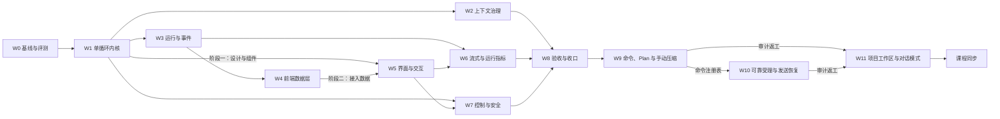

# RayAgent 阶段 4：二次开发计划

更新：2026-10-02。根 PLAN.md 是本文件软链接。本文件唯一维护阶段范围、工作包进度与验证证据；子计划维护设计与验收，产品说明/架构/能力边界维护已经实现的事实。

当前入口：第5节看进度，第6节看关键证据。W9–W11 已按用户批准的简化阶段 E 收口；产品基线 `89aa642`，验收 tag `v2-projects` 随文档收口提交创建。课程尚未更新。收口前的长篇进度与旧方案见[历史快照](../background/phase-4-plan-history/2026-10-02-README.md)，审计原件保留，不再当作当前任务单。

## 1. 目标与原则

**作品定位：** 面向受信任操作者的 Web Agent Harness。用户提交任务后，单循环按工具反馈推进，可维护计划、提问、停止，长任务不被上下文撑爆，成果以可下载文件交付；界面让操作者随时看清 Agent 正在做什么、做到哪一步、花了多少；并能用一组固定评测任务证明改造前后的差异。

**产品定位（2026-09-30 用户确认，同日完整审计后校准）：** RayAgent 是**门槛更低的通用 Agent Harness 平台**。平台完成部署与模型配置后，日常使用者通过 Web 完成对话，并用“项目”承载需要多次对话、持续积累的工作，无需配置宿主机目录或 Git。本阶段仍面向受信任单人操作者，不交付免部署托管服务或多用户平台。RayAgent **不承担编码任务**：编码交给 Codex、Claude Code、Cursor 等专业工具，RayAgent 不做 Git、代码审阅或宿主机代码目录接入。它同时保持教学与实验工程的属性：执行循环、上下文、事件和工具调用对操作者透明可查。

**功能定位：**

| 能力 | 定位 | 不做 |
|---|---|---|
| 独立对话 | 日常问答、调研、处理附件、交付文件；沿用临时沙箱 | 跨对话记忆 |
| 项目 | 材料、产出和记忆的长期容器；新建或从本地文件夹上传创建，可连续开多段对话 | Git、宿主机目录挂载、实时回写本地 |
| 项目文件 | 平台托管；以“上传副本 + 下载”进出；上传前检查大小、包依赖与敏感文件并弹框确认；项目内对话的附件与交付也落入项目文件 | 在线编辑、双向同步 |
| 文件快照 | 运行前整项目快照，默认保留 5 份、设置可调至最多 7 份；读写错误不执行，超限可跳过并明确保护降级；上传覆盖/恢复须有保护快照；恢复失败先修复；已归档项目可清理快照 | 完整备份历史、单文件历史、按运行归因的变更集 |
| 项目记忆 | 透明可编辑：项目说明、项目笔记（用户与 Agent 共同维护）、有限近期摘要，每次运行读取并冻结，可追溯修改 | 向量检索、隐式记忆、全部历史细节自动召回 |
| 执行与观察 | 单循环、计划模式、提问、审批、停止、压缩；运行视图与开发者视图 | 多 Agent、排队发送 |

**取舍原则：**

- 投入顺序：执行内核与上下文决定任务能否做好，投入最大；运行与事件让状态可信，是界面可观测的前提；界面是作品唯一直接可见的部分，按行业产品标准重做，但只展示后端真实产生的数据，不做装饰性指标。不为教学项目建设生产级持久执行、多租户或平台能力。
- 每个改动要有可观察的收益：先建立评测基线，之后每个工作包用同一套任务复测。
- 一个对话完成一个包或包内一个阶段。对话开头读 [AGENTS.md](../../AGENTS.md)、本文件和对应子计划即可开工，不需要通读全部资料。
- 工作包按执行顺序连续编号，不用子编号追加新包。新需求先判断能否并入已有包；确需新增时，先修改第 3 节范围，再按顺序重排编号。包内子项（如 W7.1）只用于同一包的并行拆分。
- 代码与 `docs/` 同步推进：工作包完成时更新受影响的 docs 正文；课程在全部代码与 docs 完成后另行处理（第 7 节）。
- 新 schema 从空库建立，不兼容旧数据，不维护双执行策略；旧实现与旧课程通过 tag `baseline-v1`（W0 创建）保留。

## 2. 设计依据与取舍

保留单循环、计划工具、完整调用配对、数据库事实源、独立终态、交付工具、副作用工具不自动重试和请求前预算治理。项目采用平台托管文件、整项目快照及可编辑笔记/有限近期摘要，避免宿主机目录与Git操作门槛。

不纳入框架迁移、多Agent、持久调度平台、多租户、向量记忆、代码审阅、本地回写或按运行变更集。演进理由见[设计取舍](../decisions.md)，旧方案和当时的量化依据见历史快照。

## 3. 范围与完成条件

W0–W8 是执行、上下文、事件、前端、流式、安全及首轮验收；W9 是输入命令/计划模式/手动压缩；W10 收缩为可靠受理和发送恢复；W11 是托管项目、上传下载、文件快照、记忆与导航归档。Git与宿主机目录代码已移除。

阶段 A–D 的实施及故障验证完成后，阶段 E 在同一产品版本上完成评测、外部工具界面回归、连续CSV项目与事实文档更新，冻结版本；课程另立计划。2026-10-02用户要求加快、测试从简：E1–E7/E6-deny各一次，保留全部八类；D同版本的故障、扫描、占用、归档与深浅主题证据沿用，不重复注入。具体检查答案与字节、不以completed代替目标达成。该调整覆盖旧版“每类至少两次”，不宣称原16次验收已执行。

## 4. 工作包与依赖

| 包 | 子计划 | 前置 |
|---|---|---|
| W0 基线与评测 | [w0-baseline-eval.md](w0-baseline-eval.md) | 无 |
| W1 单循环执行内核 | [w1-agent-loop.md](w1-agent-loop.md) | W0 |
| W2 上下文治理 | [w2-context.md](w2-context.md) | W1 |
| W3 运行与事件事实源 | [w3-run-events.md](w3-run-events.md) | W1 |
| W4 前端数据层 | [w4-ui-data.md](w4-ui-data.md) | W3 |
| W5 界面与交互设计 | [w5-ux.md](w5-ux.md) | 阶段一 W1；阶段二 W4；阶段三 阶段一 |
| W6 流式输出与运行指标 | [w6-streaming.md](w6-streaming.md) | 后端 W3；前端 W5 阶段二 |
| W7 执行控制与安全 | [w7-control-safety.md](w7-control-safety.md) | W7.1、W7.3 在 W0 后随时；W7.2 需 W1、W3、W5 |
| W8 综合验收与收口 | [w8-acceptance.md](w8-acceptance.md) | W2、W6、W7 |
| W9 输入框命令、Plan 模式与手动压缩 | [w9-input-commands.md](w9-input-commands.md) | W8 |
| W10 可靠受理与发送恢复（原本地项目、目录与 Git） | [w10-local-project.md](w10-local-project.md) | W9 的命令注册表；现行契约见 R2–R3 |
| W11 项目工作区、项目文件与项目记忆 | [w11-project-workspace.md](w11-project-workspace.md) | W10 R2–R3；W9 U1–U4 |
| L 课程同步 | W11 完成后另立课程计划 | W11 |

**并行规则（W0–W8 的历史分工）：** 当前 W9–W11 不按下面的「选择项目」或已删除的接手清单开工。

- W1 完成后可由三个对话并行：W2、W3、W5 阶段一。W2 与 W3 都会触及任务运行器，后合入的一方负责解决冲突并复跑对方的测试。W5 阶段一只改 UI 的组件、样式与组件状态目录页，用夹具数据开发，不改接口与订阅。
- W4 与 W5 按文件职责分工：W4 负责 `lib/api/`、订阅 hook 与事件投影，产出 [W4 子计划](w4-ui-data.md#视图模型契约)定义的视图模型；W5 负责 `components/`、样式与页面结构，只消费视图模型。视图模型字段需要变化时，修改 W4 子计划的契约并在两边同步。
- W6 的模型适配与增量通道只依赖 W3，可以先做；前端增量渲染在 W5 阶段二的消息组件上完成。
- W7.1 Shell 修复与 W7.3 沙箱身份不依赖其他包，W0 之后随时可做；W7.2 审批需要 W1 的工具管线、W3 的等待状态和 W5 的审批卡片与设置页。
- W9 当时先做后端，再做前端命令注册表。W10 后端可在 W9 后端之后与 W9 前端并行。当时接入的是「选择项目」；2026-09-30 起命令改为「打开项目」，导航归 W11。
- 2026-09-30 起，W9 的数据口径与压缩、W10 的启动与恢复、W11 的项目工作区分开维护。会话页、接口和 W4 契约的交叉修改串行合入。

### 子计划统一结构

每份子计划包含：目标与不做、现状代码事实、设计契约、改动清单、验收、docs 同步、交接。交接写明本包完成后下游能依赖的接口和已知未决问题。现状描述与代码不符时按源码校正；已确认目标契约不能因为代码尚未实现而降低验收。发现目标不可行时记录偏差、影响和处理取舍；范围或用户已确认行为需要改变时先明确变更，再同步子计划和总计划第 6 节，不以实现倒推目标已经完成。

### 每个包的完成条件

1. 子计划中的自动测试通过，测试命令按所属服务指南执行；
2. 用 W0 评测脚本复跑子计划指定的任务，结果写入 `docs/plan/evidence/`；
3. 涉及界面的包，在真实浏览器中完成子计划列出的走查，截图作为当次验证记录存放在 `docs/plan/evidence/`；
4. 子计划列出的 docs 正文已更新为当前事实，过时的项目级配图在图注标明“旧基线示意，W8 重绘”；
5. 第 5 节状态改为完成，第 6 节追加一条证据。只写完代码、未验证的状态记为待验证。

## 5. 进度

| 包/阶段 | 状态 | 完成内容 |
|---|---|---|
| W0–W8 | 完成 | 原阶段验收，保留baseline-v1/v2历史tag |
| W9 | 完成 | U1–U7，输入入口、圆环口径、计划条件与压缩恢复，最终回归通过 |
| W10 | 完成 | R2–R3及R4有效部署边界，受理/准备分离、发送读回恢复，最终回归通过 |
| W11 | 完成 | 托管文件、上传/快照/恢复/下载、项目记忆、互斥与导航归档，D与E验收通过 |
| A–D | 完成 | 实施与审计修复，D真实模型出口补齐 |
| E | 完成（用户简化口径） | 八类评测单轮通过；CSV连续任务、外部界面、现有检查通过；文档收口和验收冻结 |
| L课程同步 | 未开始 | 后续独立计划，见[课程同步草稿](course-sync.md) |

当前产品提交 `89aa642d08137521e1099e11c0822ea0b5f6367f`。本轮只改文档与测试替身，不改产品/依赖/迁移/部署；验收tag指向本次收口提交，受测产品代码同基线。没有推送。运行服务继续保留，E测试数据和临时服务已清理。详细结果与边界见阶段E报告和[能力与边界](../capabilities.md)。

## 6. 证据记录

| 证据 | 用途 |
|---|---|
| [阶段 E 汇总](evidence/w9-w11-e-summary-2026-10-02.md) | 最终版本、CSV/记忆/恢复/无沙箱下载、外部界面、清理与未验证边界 |
| [阶段 E 标准评测](evidence/w9-w11-e-final-2026-10-02-89aa642.md) | E1–E7/E6-deny单轮完整检查与条件 |
| [阶段 D 出口](evidence/w11-stage-d-exit-2026-10-02.md) | 真实模型记忆/摘要、等待回复与审批互斥 |
| [D审计修复](evidence/w11-stage-d-fixes-2026-10-02.md) | 回收重试、分页token和当前选择可达性 |
| [D界面出口](evidence/w11-stage-d-ui-exit-2026-10-02.md) | 文件夹、补存、保护降级、窄屏与界面 |
| [D恢复故障](evidence/w11-stage-d-real-restore-faults-2026-10-01.md)、[API退出](evidence/w11-stage-d-api-process-exit-2026-10-01.md) | 真实PostgreSQL/卷/Docker与API进程中断后的修复 |
| [D所有权](evidence/w11-stage-d-ownership-2026-10-01.md) | 旧写入者停止与文件操作互斥 |
| [阶段 C](evidence/w9-w11-stage-c-2026-09-30.md) | W9/W10输入与受理出口 |
| [W8验收](evidence/w8-comparison-2026-09-29.md) | W0–W8历史冻结与基线对照 |

2026-10-02：标准8/8、API329项、沙箱3项、UI六个检查与类型/lint/build通过。固定CSV结果60、A40/B20/remaining40、threshold1；版本4笔记进入下一请求；恢复后source/totals字节一致，历史交付副本仍下载。清理仅本轮ID，资源归零。旧报告按日期/基线保留，不覆盖历史失败。

## 7. 后续课程

课程正文仍对应baseline-v1；全部产品包完成后，以v2-projects和源码事实校准[课程同步草稿](course-sync.md)，另行授权实施。
