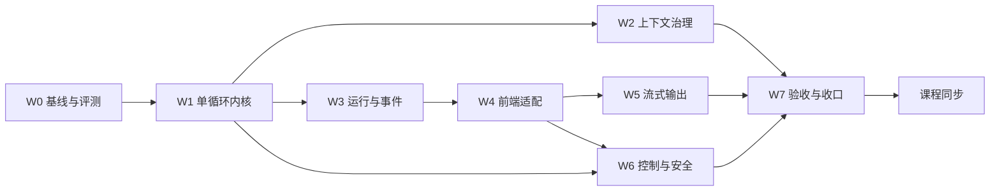

# RayAgent 阶段 4：二次开发计划

编制日期：2026-09-28。实现基线：`2c323ccffdf6f58ad1e8b1214c0a12bb6b8c1a45`（之后到 `082e825` 只有文档变更）。本文件是唯一总计划，根目录 `PLAN.md` 是指向本文件的相对软链接；各工作包的设计与验收在同目录子计划中，进度与证据只维护在本文第 5、6 节。

本计划取代 2026-09-19 至 09-20 编制的原阶段 4 计划（P0–P8）。原计划全文可在提交 `082e825` 的 `docs/research/phase-4-plan.md` 追溯；它的方向判断被保留，规格密度与课程随包修改的安排被放弃，原因见第 2 节。以下内容均为目标，不代表已实现；当前能力以[能力与边界](../capabilities.md)和源码为准。

## 1. 目标与原则

**作品定位：** 面向受信任操作者的 Web Agent Harness。用户提交任务后，单循环按工具反馈推进，可维护计划、提问、停止，长任务不被上下文撑爆，成果以可下载文件交付，并能用一组固定评测任务证明改造前后的差异。

**取舍原则：**

- 投入集中在每个任务都会经过的执行内核和上下文，其次是让状态和事件可信，最后是界面适配；不为教学项目建设生产级持久执行、多租户或平台能力。
- 每个改动要有可观察的收益：先建立评测基线，之后每个工作包用同一套任务复测。
- 一个子计划对应 1–2 个 Agent 对话。对话开头读 [AGENTS.md](../../AGENTS.md)、本文件和对应子计划即可开工，不需要通读全部资料。
- 代码与 `docs/` 同步推进：工作包完成时更新受影响的 docs 正文；课程在全部代码与 docs 完成后另行处理（第 7 节）。
- 新 schema 从空库建立，不兼容旧数据，不维护双执行策略；旧实现与旧课程通过 tag `baseline-v1`（W0 创建）保留。

## 2. 为什么是这些改动

以下是 2026-09-28 的源码静态核对与 2026-09-14 运行记录（见[背景](../background/README.md#能力评估的真实任务记录)）得出的判断。

| 方向 | 依据 | 结论 |
|---|---|---|
| 执行内核 | 一次“写文件、读回、交付”用了 13 次模型调用、约 6.5 万 prompt tokens，7 次工具调用中 4 次是提示词强制的进度通知；每步必须输出 Step JSON，解析失败终止整个任务；假完成守卫与总结阶段的附件 JSON 都是双循环结构的补丁；每次响应只保留第一个工具调用 | 提升最大，W1 |
| 上下文 | 记忆只追加，`compact()` 只裁两类浏览器消息，`context_window` 只用于显示；单循环会让单次运行的历史更长 | 第二，W2 紧随 W1 |
| 评测 | 目前没有能复跑的端到端任务集，labs/verification 的 V01–V05 只有样本描述 | 成本最低、证明其余改动的前提，W0 |
| 状态与事件 | 停止写 completed；events/memories/files 全部是 sessions 行上的 JSONB，每次读取整行；事件先写 Redis 后写数据库；前端状态从事件推断并靠空流重连补齐 | 第三，只做最小集，W3 |
| 前端 | 主要是随后端适配；单独值得投入的是流式输出和清晰终态 | 第四，W4、W5 |
| 控制与安全 | 沙箱 Shell 输出读取协程被直接 await，推断会让长命令阻塞到进程结束；工具异常统一重试 3 次，写操作可能重复；沙箱以 root 运行、无配额；TTL 环境变量两侧命名不一致；审批只存在于提示词 | 改动小而实，W6 |

**从原计划保留的判断：** 单循环加只维护清单的计划工具；完整保存模型返回的调用集合并按 call ID 配对；数据库是事实源、Redis 只通知；停止、中断与完成分开；交付改为工具；副作用工具不自动重试；请求前检查容量并支持压缩。

**放弃的部分及原因：** 8 态状态机与逐态启动处理、request ID 去重与冲突体系、结果 unknown 分类与副作用窗口、流式 attempt 级收敛、审批绑定策略版本、ContextSnapshot 版本化、Artifact 不可变副本与摘要、会话清理顺序、逐次证据记录与逐图审阅清单。这些是生产级持久执行的要求，对单人教学作品边际价值低，却迫使第一个包先建大 schema、把用户可见改进推到很后面。原计划还缺少改造前后的度量，并要求每个包修改课程，会反复返工。

## 3. 范围

**本阶段做：** 评测基线与脚本化模型替身；单循环、计划/提问/交付工具与提示词重写；请求容量、工具输出整形与自动压缩；runs 与 events 表、按序号续传的 SSE、停止传播与启动扫描；前端事件订阅与时间线适配；模型流式输出；Shell 缺陷修复、工具级审批、沙箱非 root 与配额；综合验收、项目级配图重绘与 docs 收口。

**本阶段不做：** 多 Agent/子 Agent、worktree 与长期项目工作区、跨会话记忆与向量库、框架或语言迁移、MCP/A2A 能力扩展、多实例与共享沙箱调度、旧数据迁移、设置页重构与界面视觉重设计、通用成果验证框架。需要纳入时先修改本节。

## 4. 工作包与依赖

| 包 | 子计划 | 前置 | 规模 | 建议对话数 |
|---|---|---|---|---|
| W0 基线与评测 | [w0-baseline-eval.md](w0-baseline-eval.md) | 无 | 小 | 1 |
| W1 单循环执行内核 | [w1-agent-loop.md](w1-agent-loop.md) | W0 | 大 | 2 |
| W2 上下文治理 | [w2-context.md](w2-context.md) | W1 | 中 | 1 |
| W3 运行与事件事实源 | [w3-run-events.md](w3-run-events.md) | W1 | 中到大 | 1–2 |
| W4 前端适配 | [w4-ui.md](w4-ui.md) | W3 | 中 | 1 |
| W5 流式输出 | [w5-streaming.md](w5-streaming.md) | W4 | 中 | 1 |
| W6 执行控制与安全 | [w6-control-safety.md](w6-control-safety.md) | W1；审批界面需 W4 | 中 | 1 |
| W7 综合验收与收口 | [w7-acceptance.md](w7-acceptance.md) | W2、W5、W6 | 小到中 | 1 |
| L 课程同步 | W7 完成后另立课程计划 | W7 | 大 | 按章分批 |

**并行规则：** W1 完成后 W2 与 W3 可由两个对话并行，二者都会触及任务运行器，后合入的一方负责解决冲突并复跑对方的测试。W6 的 Shell 修复（W6.1）不依赖其他包，W0 之后随时可做；审批（W6.2）需要 W1 的工具分发和 W4 的界面。

### 子计划统一结构

每份子计划包含：目标与不做、现状代码事实、设计契约、改动清单、验收、docs 同步、交接。交接写明本包完成后下游能依赖的接口和已知未决问题。实施中发现子计划与代码不符时，以代码为准修正子计划，并在第 6 节记录原因。

### 每个包的完成条件

1. 子计划中的自动测试通过，测试命令按所属服务指南执行；
2. 用 W0 评测脚本复跑子计划指定的任务，结果写入 `docs/plan/evidence/`；
3. 子计划列出的 docs 正文已更新为当前事实，过时的项目级配图在图注标明“旧基线示意，W7 重绘”；
4. 第 5 节状态改为完成，第 6 节追加一条证据。只写完代码、未验证的状态记为待验证。

## 5. 进度

状态约定：未开始 / 进行中 / 待验证 / 阻塞 / 完成。

| 包 | 状态 | 代码提交 | 评测报告 | 备注 |
|---|---|---|---|---|
| 计划 | 完成 | — | — | 本文件与 8 份子计划 |
| W0 | 未开始 | — | — | — |
| W1 | 未开始 | — | — | — |
| W2 | 未开始 | — | — | — |
| W3 | 未开始 | — | — | — |
| W4 | 未开始 | — | — | — |
| W5 | 未开始 | — | — | — |
| W6 | 未开始 | — | — | — |
| W7 | 未开始 | — | — | — |
| L 课程同步 | 未开始 | — | — | W7 后另立计划 |

**下一步：** W0。打 `baseline-v1` tag，实现脚本化模型替身与评测脚本，在旧实现上产出基线报告。

## 6. 证据记录

每条一段：日期、包、代码提交与未提交变更、执行的检查及结果摘要、评测报告链接、未覆盖范围。失败也记录，后续条目说明修正与复验。

- 2026-09-28，计划：基于提交 `082e825` 编写本文件与 W0–W7 子计划；删除原阶段 4 计划与进度文档，`PLAN.md` 改指本文件；同步根 AGENTS、项目首页、文档地图、调研入口、背景、代码地图（“二次开发改造入口”）、能力与边界、设计取舍、课程目录与课程约定中的引用。检查：全仓 Markdown 本地链接与锚点无失效，`PLAN.md` 为指向本文件的相对软链接，第 4、5 节工作包与子计划一一对应，除两处历史追溯说明外无旧计划引用。子计划引用的源码行号为本日静态核对结果。未修改产品代码，未运行测试或评测。

## 7. 课程同步（W7 之后）

代码阶段不修改课程正文，只在[课程目录](../../lessons/README.md)说明正文对应 `baseline-v1`。W7 完成后，以 tag `v2` 的代码和评测数据为依据另立课程计划，按改动幅度分批：

| 类别 | 章节 | 处理方式 |
|---|---|---|
| 重写主线 | 04、05、06、07、08、10 | 按新机制重写；07 改为“规划与执行决策”，以计划工具为主，双循环作对照，附基线与新版实测数据 |
| 局部更新 | 02、03、09、11、12、16 | 更新受影响的机制段落与项目实现段落；16 以评测脚本和前后对比为真实素材 |
| 基本保留 | 01、13、14、15 | 协议与浏览器原理不变，只改接入点段落；01 最后校准 |

课程配图只重画描述旧主链路的图，通用原理图保留。旧方案的推导保留为对照内容，不维护第二套课程。
