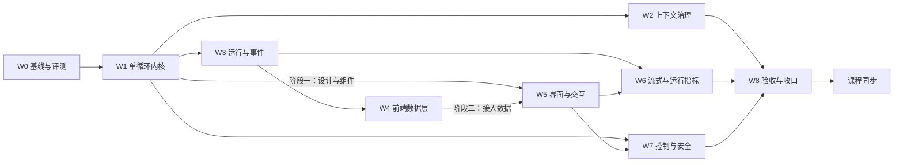

# RayAgent 阶段 4：二次开发计划

编制日期：2026-09-28，同日修订一次（纳入界面重设计与外部参照，工作包顺延为 W0–W8，见第 6 节）。实现基线：`2c323ccffdf6f58ad1e8b1214c0a12bb6b8c1a45`（之后到 `66f20d7` 只有文档变更）。本文件是唯一总计划，根目录 `PLAN.md` 是指向本文件的相对软链接；各工作包的设计与验收在同目录子计划中，进度与证据只维护在本文第 5、6 节。

本计划取代 2026-09-19 至 09-20 编制的原阶段 4 计划（P0–P8）。原计划全文可在提交 `082e825` 的 `docs/research/phase-4-plan.md` 追溯；它的方向判断被保留，规格密度与课程随包修改的安排被放弃，原因见第 2 节。以下内容均为目标，不代表已实现；当前能力以[能力与边界](../capabilities.md)和源码为准。

## 1. 目标与原则

**作品定位：** 面向受信任操作者的 Web Agent Harness。用户提交任务后，单循环按工具反馈推进，可维护计划、提问、停止，长任务不被上下文撑爆，成果以可下载文件交付；界面让操作者随时看清 Agent 正在做什么、做到哪一步、花了多少；并能用一组固定评测任务证明改造前后的差异。

**取舍原则：**

- 投入顺序：执行内核与上下文决定任务能否做好，投入最大；运行与事件让状态可信，是界面可观测的前提；界面是作品唯一直接可见的部分，按行业产品标准重做，但只展示后端真实产生的数据，不做装饰性指标。不为教学项目建设生产级持久执行、多租户或平台能力。
- 每个改动要有可观察的收益：先建立评测基线，之后每个工作包用同一套任务复测。
- 一个对话完成一个包或包内一个阶段。对话开头读 [AGENTS.md](../../AGENTS.md)、本文件和对应子计划即可开工，不需要通读全部资料。
- 工作包按执行顺序连续编号，不用子编号追加新包。新需求先判断能否并入已有包；确需新增时，先修改第 3 节范围，再按顺序重排编号。包内子项（如 W7.1）只用于同一包的并行拆分。
- 代码与 `docs/` 同步推进：工作包完成时更新受影响的 docs 正文；课程在全部代码与 docs 完成后另行处理（第 7 节）。
- 新 schema 从空库建立，不兼容旧数据，不维护双执行策略；旧实现与旧课程通过 tag `baseline-v1`（W0 创建）保留。

## 2. 为什么是这些改动

以下是 2026-09-28 的源码静态核对与 2026-09-14 运行记录（见[背景](../background/README.md#能力评估的真实任务记录)）得出的判断。

| 方向 | 依据 | 结论 |
|---|---|---|
| 执行内核 | 一次“写文件、读回、交付”用了 13 次模型调用、约 6.5 万 prompt tokens，7 次工具调用中 4 次是提示词强制的进度通知；每步必须输出 Step JSON，解析失败终止整个任务；假完成守卫与总结阶段的附件 JSON 都是双循环结构的补丁；每次响应只保留第一个工具调用 | 提升最大，W1 |
| 上下文 | 记忆只追加，`compact()` 只裁两类浏览器消息，`context_window` 只用于显示；单循环会让单次运行的历史更长 | 第二，W2 紧随 W1 |
| 评测 | 目前没有能复跑的端到端任务集，labs/verification 的 V01–V05 只有样本描述 | 成本最低、证明其余改动的前提，W0 |
| 状态与事件 | 停止写 completed；events/memories/files 全部是 sessions 行上的 JSONB，每次读取整行；事件先写 Redis 后写数据库；前端状态从事件推断并靠空流重连补齐；没有轮次边界与请求耗时，界面无法可靠统计每轮用时与速率 | 第三，最小集加可观测字段，W3 |
| 前端 | 时间线按 step 猜测分组，同内容重试会隐藏失败轮次；运行中看不到当前动作、已用时间与输出速度，用量只有一个上下文占用环；组件大量直接写灰阶类名，没有设计规范与应用级暗色主题；设置页是 866 行的单文件 | 数据层随 W3 适配（W4）；界面按行业标准重做（W5）；流式输出与运行指标（W6） |
| 控制与安全 | 沙箱 Shell 输出读取协程被直接 await，推断会让长命令阻塞到进程结束；工具异常统一重试 3 次，写操作可能重复；沙箱以 root 运行、无配额；TTL 环境变量两侧命名不一致；审批只存在于提示词 | 改动小而实，W7 |

**从原计划保留的判断：** 单循环加只维护清单的计划工具；完整保存模型返回的调用集合并按 call ID 配对；数据库是事实源、Redis 只通知；停止、中断与完成分开；交付改为工具；副作用工具不自动重试；请求前检查容量并支持压缩。

**放弃的部分及原因：** 8 态状态机与逐态启动处理、request ID 去重与冲突体系、结果 unknown 分类与副作用窗口、流式 attempt 级收敛、审批绑定策略版本、ContextSnapshot 版本化、Artifact 不可变副本与摘要、会话清理顺序、逐次证据记录与逐图审阅清单。这些是生产级持久执行的要求，对单人教学作品边际价值低，却迫使第一个包先建大 schema、把用户可见改进推到很后面。原计划还缺少改造前后的度量，并要求每个包修改课程，会反复返工。

**外部参照：** 主要参照是 Codex（经 [learn-codex](https://github.com/xinqingaa/learn-codex) 拆解）：单循环、`update_plan`、调用配对与压缩。2026-09-28 补查了 [pi](https://github.com/earendil-works/pi) 与 [DeepSeek Harness](https://github.com/deepseek-ai/deepseek-harness) 的官方 README 与架构文档（未读源码、未运行），两者印证了单循环、耐久事件与瞬时流分离、悬空调用补结果、运行中插话的方向，并补充了以下四项：

| 吸收项 | 来源 | 解决的问题 | 落在 |
|---|---|---|---|
| 轮次边界事件：一次模型请求及其工具批次为一轮，开始与结束各记一条带时间与用量的事件 | pi 的 turn 事件、DeepSeek Harness 的 step 事件 | 界面的“第 N 轮”、每轮用时与 tokens、开发者视图的按轮展示不再靠猜 | W3 |
| 工具三段管线：执行前检查 → 执行 → 执行后处理，按顺序挂载处理函数 | DeepSeek Harness 的 guarded tool pipeline | 审批挂在执行前、输出整形挂在执行后，W2 与 W7 不必改同一段分发代码；工具耗时统一记录 | W1 |
| 模型可见即已记录：每次模型请求的内容都能由事件与运行快照重建，并有自动测试 | DeepSeek Harness 的 “Model-visible means logged” | 能回答“模型当时看到了什么”；开发者视图展示真实上下文而非近似值 | W3（W2 补压缩用例） |
| 失败尝试记录：失败、重试、取消的模型请求落一条轻量事件，不进入模型历史 | DeepSeek Harness 的 `assistant/attempt` | 流式中途失败时界面能说明发生了什么；评测能统计重试 | W6 |

不吸收：插件化框架与 TypeScript 重写（框架迁移）、会话树分支、子 Agent 与 Agent Teams、排队发送（运行结束后自动执行的后续消息，使用场景少而状态复杂）。

## 3. 范围

**本阶段做：** 评测基线与脚本化模型替身；单循环、工具三段管线、计划/提问/交付工具与提示词重写；请求容量、工具输出整形与自动压缩；runs 与 events 表、轮次事件与运行指标、按序号续传的 SSE、请求重建与调试读取、停止传播与启动扫描；前端事件订阅与视图模型；对话、运行视图与设置页的界面与交互重设计，含开发者视图；模型流式输出、首字延迟与输出速度、失败尝试记录；Shell 缺陷修复、工具级审批、沙箱非 root 与配额；综合验收、项目级配图重绘与 docs 收口。

**本阶段不做：** 多 Agent/子 Agent、worktree 与长期项目工作区、跨会话记忆与向量库、框架或语言迁移、MCP/A2A 能力扩展、多实例与共享沙箱调度、旧数据迁移、会话分支、排队发送、执行过程回放、费用估算、移动端专门适配（只保证窄屏可读可操作）、通用成果验证框架。需要纳入时先修改本节。

## 4. 工作包与依赖

| 包 | 子计划 | 前置 | 规模 | 建议对话数 |
|---|---|---|---|---|
| W0 基线与评测 | [w0-baseline-eval.md](w0-baseline-eval.md) | 无 | 小 | 1 |
| W1 单循环执行内核 | [w1-agent-loop.md](w1-agent-loop.md) | W0 | 大 | 2 |
| W2 上下文治理 | [w2-context.md](w2-context.md) | W1 | 中 | 1 |
| W3 运行与事件事实源 | [w3-run-events.md](w3-run-events.md) | W1 | 中到大 | 2 |
| W4 前端数据层 | [w4-ui-data.md](w4-ui-data.md) | W3 | 中 | 1 |
| W5 界面与交互设计 | [w5-ux.md](w5-ux.md) | 阶段一 W1；阶段二 W4；阶段三 阶段一 | 大 | 3–4 |
| W6 流式输出与运行指标 | [w6-streaming.md](w6-streaming.md) | 后端 W3；前端 W5 阶段二 | 中 | 1 |
| W7 执行控制与安全 | [w7-control-safety.md](w7-control-safety.md) | W7.1、W7.3 在 W0 后随时；W7.2 需 W1、W3、W5 | 中 | 1 |
| W8 综合验收与收口 | [w8-acceptance.md](w8-acceptance.md) | W2、W6、W7 | 中 | 1–2 |
| L 课程同步 | W8 完成后另立课程计划 | W8 | 大 | 按章分批 |

**并行规则：**

- W1 完成后可由三个对话并行：W2、W3、W5 阶段一。W2 与 W3 都会触及任务运行器，后合入的一方负责解决冲突并复跑对方的测试。W5 阶段一只改 UI 的组件、样式与组件状态目录页，用夹具数据开发，不改接口与订阅。
- W4 与 W5 按文件职责分工：W4 负责 `lib/api/`、订阅 hook 与事件投影，产出 [W4 子计划](w4-ui-data.md#视图模型契约)定义的视图模型；W5 负责 `components/`、样式与页面结构，只消费视图模型。视图模型字段需要变化时，修改 W4 子计划的契约并在两边同步。
- W6 的模型适配与增量通道只依赖 W3，可以先做；前端增量渲染在 W5 阶段二的消息组件上完成。
- W7.1 Shell 修复与 W7.3 沙箱身份不依赖其他包，W0 之后随时可做；W7.2 审批需要 W1 的工具管线、W3 的等待状态和 W5 的审批卡片与设置页。

### 子计划统一结构

每份子计划包含：目标与不做、现状代码事实、设计契约、改动清单、验收、docs 同步、交接。交接写明本包完成后下游能依赖的接口和已知未决问题。实施中发现子计划与代码不符时，以代码为准修正子计划，并在第 6 节记录原因。

### 每个包的完成条件

1. 子计划中的自动测试通过，测试命令按所属服务指南执行；
2. 用 W0 评测脚本复跑子计划指定的任务，结果写入 `docs/plan/evidence/`；
3. 涉及界面的包，在真实浏览器中完成子计划列出的走查，截图作为当次验证记录存放在 `docs/plan/evidence/`；
4. 子计划列出的 docs 正文已更新为当前事实，过时的项目级配图在图注标明“旧基线示意，W8 重绘”；
5. 第 5 节状态改为完成，第 6 节追加一条证据。只写完代码、未验证的状态记为待验证。

## 5. 进度

状态约定：未开始 / 进行中 / 待验证 / 阻塞 / 完成。

| 包 | 状态 | 代码提交 | 评测报告 | 备注 |
|---|---|---|---|---|
| 计划 | 完成 | — | — | 本文件与 9 份子计划，2026-09-28 修订 |
| W0 | 完成 | `phase-4` 上以 `W0:` 开头的提交 | [w0-baseline-2026-09-28-961005d](evidence/w0-baseline-2026-09-28-961005d.md) | 基线 5/6 通过，E4 停止未生效；tag `baseline-v1` 指向 `961005d` |
| W1 | 完成 | `phase-4` 上以 `W1:` 开头的提交 | [w1-2026-09-28-9faa304](evidence/w1-2026-09-28-9faa304.md) | 通过情况同基线；模型调用 55 → 20 |
| W2 | 完成 | `phase-4` 上以 `W2:` 开头的提交 | [w2-2026-09-28-c0822dc](evidence/w2-2026-09-28-c0822dc.md) | E1–E7 全部通过；E7 压缩 2 次 |
| W3 | 完成 | `phase-4` 上以 `W3:` 开头的提交 | [w3-2026-09-28-8511bdf](evidence/w3-2026-09-28-8511bdf.md) | E1–E6 全部通过，E4 停止生效 |
| W4 | 完成 | `phase-4` 上以 `W4:` 开头的提交 | — | 浏览器走查随 W5 阶段二与 W6 前端完成 |
| W5 | 完成 | 以 `W5 阶段一+三:`、`W5 阶段二:` 开头的提交；完成后界面微调 `8bdacea`，轮次位置与侧栏状态修正待提交 | 截图 `evidence/w5-2026-09-28-*.png`、`evidence/w5-2-2026-09-29-*.png` | 侧栏徽标滞后已随 W6 前端修复复验；后续界面微调见第 6 节 |
| W6 | 完成 | 以 `W6 后端:`、`W6 前端:` 开头的提交 | [w6-2026-09-29-33964e0](evidence/w6-2026-09-29-33964e0.md) | E1、E2 通过；首字延迟 579–871 ms |
| W7 | 完成 | 以 `W7.1/W7.3:`、`W7.2 后端:`、`W7.2 前端:` 开头的提交 | [w7-1-3-2026-09-28-4b413ef](evidence/w7-1-3-2026-09-28-4b413ef.md)、[w7-2026-09-29-b2d83c5](evidence/w7-2026-09-29-b2d83c5.md) | 三个子项完成；E6-deny 正式轮超时、复跑通过，W8 补正式记录 |
| W8 | 完成 | `phase-4` 上以 `W8:` 开头的提交 | [w8-2026-09-29-0d9ea1f](evidence/w8-2026-09-29-0d9ea1f.md)、[对比报告](evidence/w8-comparison-2026-09-29.md) | E1–E7 与 E6-deny 各 2 次全部通过；tag `v2` 指向 `39d9fb7` |
| L 课程同步 | 未开始 | — | — | 草稿见 [course-sync.md](course-sync.md) |

**下一步：** tag `v2` 保存阶段 4 验收基线；当前工作树包含 W5 完成后的界面微调。课程仍按课程计划草稿另立同步计划。

## 6. 证据记录

每条一段：日期、包、代码提交与未提交变更、执行的检查及结果摘要、评测报告链接、未覆盖范围。失败也记录，后续条目说明修正与复验。

- 2026-09-28，计划：基于提交 `082e825` 编写本文件与 W0–W7 子计划；删除原阶段 4 计划与进度文档，`PLAN.md` 改指本文件；同步根 AGENTS、项目首页、文档地图、调研入口、背景、代码地图（“二次开发改造入口”）、能力与边界、设计取舍、课程目录与课程约定中的引用。检查：全仓 Markdown 本地链接与锚点无失效，`PLAN.md` 为指向本文件的相对软链接，第 4、5 节工作包与子计划一一对应，除两处历史追溯说明外无旧计划引用。子计划引用的源码行号为本日静态核对结果。未修改产品代码，未运行测试或评测。
- 2026-09-28，计划修订：基于提交 `66f20d7`。原因：界面是作品唯一直接可见的部分，原计划把视觉重设计列为不做，与作品定位不符；补查 pi 与 DeepSeek Harness 后吸收四项设计（第 2 节）。变更：范围纳入对话、运行视图与设置页重设计及开发者视图；原 W4 收窄为前端数据层并新增视图模型契约；新增 W5 界面与交互设计；原 W5、W6、W7 顺延为 W6、W7、W8，文件同步改名；W1 增加工具三段管线，W3 增加轮次事件、运行指标、请求重建与调试读取，W6 增加首字延迟、输出速度与失败尝试记录；项目 skill 新增 `skills/frontend-design`（来自 anthropics/skills，Apache 2.0，保留 LICENSE），根 AGENTS 增加界面设计约定；同步代码地图“二次开发改造入口”与背景中的编号。检查：全仓 Markdown 本地链接与锚点经 `docs/plan/` 路径解析无失效（根目录 `PLAN.md` 软链接按根目录解析相对路径产生的 14 条为检查脚本误报）；plan 目录与其他文档中无旧编号与旧文件名残留；第 4、5 节工作包与 9 份子计划一一对应。W5 现状中的样式与组件数据为本日静态核对结果。未修改产品代码，未运行测试或评测。
- 2026-09-28，W0：分支 `phase-4` 从 `961005d` 开出，本地 tag `baseline-v1` 指向 `961005d`（其与 `2c323cc` 之间只有文档变更）。新增 `tests/support/scripted_llm.py`（`ScriptedLLM`，`finish_reason` 经子类 `ScriptedInvokeResult` 携带，另提供 `exhausted_calls` 供测试断言脚本耗尽被产品重试吞掉的情况）与 `scripts/eval/`（E1–E6 声明式任务、HTTP + SSE 运行器、JSON/Markdown 报告），API 开发指南增加评测前提与命令；未修改产品代码。环境：Docker 29.7.2、Compose v5.5.0，按当前代码重建后各服务健康（重建后需重启 nginx，否则 UI 502）；模型 `deepseek-flash`（`api.deepseek.com`）直连与工具调用可用。检查：`test_scripted_llm.py` 8 项、`test_eval_script.py` 4 项通过；后端全量 103 通过、1 错误（`test_status_routes` 在宿主机解析不到 `manus-postgres`，与指南所述接口测试需另备数据库一致，开工前即存在）；UI `npm run lint` 有 19 个既有错误（`react-hooks/refs` 等，未修），事件观察脚本通过，镜像内 `next build` 通过。评测：[w0-baseline-2026-09-28-961005d](evidence/w0-baseline-2026-09-28-961005d.md)，温度 0.7、`max_tokens` 8192、`context_window` 65536，每条 1 次；E1、E2、E3、E5、E6 通过，E4 未通过（停止后标记 5 秒内增长 5 行，会话写为 completed，`shell_execute` 只有 calling 事件）。任务措辞按可检查性收紧：E2 写明 `total` 字段，E3 明确要求先询问文件名，E1/E5/E6 以最后一条助手消息为准（规划说明会复述问题）。冒烟中出现一次 E4 前置步骤“执行结果无法解析”导致结束的波动，单次基线不能代表稳定性。未覆盖：模型调用按 usage 事件计数，未发 usage 的调用会漏算；沙箱 TTL 回收未验证。
- 2026-09-28，W1：基于 `9faa304`。单循环 `AgentLoop` 替换 Planner + ReAct；新增工具三段管线 `ToolPipeline`（`add_before`/`add_after`）、`update_plan`、`deliver_files`、`repair_dangling_calls`（已发出 calling 的调用补为“执行中断，结果未知”，其余补为未执行）、传输错误与空回复重试、截断重试一次、`LLMInvokeResult.finish_reason`；移除 `message_notify_user`、Step JSON、假完成守卫、附件 JSON 与 `JSONParser`；重写中英文系统提示词；前端计划面板与工具记录最小兼容；`config.yaml` 随本包提交为 `deepseek-flash`。根 AGENTS 两处“当前 Plan + ReAct”改为单循环。检查：`test_agent_loop.py` 22 项覆盖子计划 10 项验收，协调者复跑循环与替身测试 30 项通过；后端全量 118 通过、1 既有错误；UI `npm run build` 通过，lint 仍为 19 个既有错误。评测 [w1-2026-09-28-9faa304](evidence/w1-2026-09-28-9faa304.md)（每条 1 次）：E1、E2、E3、E5、E6 通过，E4 未通过同基线；六条合计模型调用 55 → 20，prompt tokens 285218 → 92653，各条耗时均缩短；短任务均未调用 `update_plan`。Web 走查：E2、E3 类任务的计划清单、工具记录、提问与附件下载可见，截图 `evidence/w1-2026-09-28-web-*.png`（走查早于最后一处上下文清理修改，该修改不涉及提问续接路径，评测在其后运行）。子计划按代码修正，原因见其“实施修正”一节：会话占位标题“新对话”也要替换、中断调用补结果、新用户消息时清理上下文、截断提示用 user 角色等。未覆盖：停止未传到沙箱进程与停止时缺 called 事件（W7.1/W3）；基础设施不可达时会话卡在 pending；`json-repair` 依赖仍在 `pyproject`（W8 清理）；工具记录完成后仍显示“正在…”与等待中会话在侧栏显示加载图标（W5）。
- 2026-09-28，W3：基于 `8511bdf`。运行与事件改为独立表（迁移 `5b7e2c9d4a10`，删除 `sessions.events`，不转换旧数据）；事件先落库（会话内 `seq`）再发 Redis 通知；`chat` 返回 `run_id`/`seq`/`route`，SSE 改为 `GET /sessions/{id}/events?after_seq=N` 按序号续传；轮次事件与运行汇总；只读请求重建接口；停止写 `cancelled`/`user_stop` 并终止本次运行登记的 Shell 会话；启动扫描把遗留 running 标为 `interrupted`/`api_restart`，waiting 保持；前端只做接口最小适配。实施由两个代理完成（首个在收尾截图时停止，第二个补子计划修正、交接与 docs 核对）。检查：后端全量 122 通过、6 跳过、1 既有错误；跳过的 `test_run_events_pg.py`（验收 1–4、6 与快照往返）由协调者在临时 PostgreSQL 16 上补跑，6 项通过。评测 [w3-2026-09-28-8511bdf](evidence/w3-2026-09-28-8511bdf.md)（每条 1 次，对照 W1）：E1–E6 全部通过；E4 终态 cancelled（user_stop），停止后 10 秒内标记增长 0 行；六条合计模型调用 19（W1 为 20），prompt tokens 86923（W1 为 92653），差值含模型波动。手动：运行中重启 API 后刷新为 interrupted，等待中重启后回复可续接（经 API 核对，未截图，子计划未要求）。子计划按代码修正，原因见其“实施修正”（`runs.turns`、终态补写未完成轮次、`context`/`cleanup` 事件、`route`、`runner_lost` 等）。`ui/README.md` 的 chat/SSE 段落随 W5 提交（同文件含 W5 内容）。未覆盖：浏览器里的 SSE 断线重连未走查；`ttft_ms` 未实现（W6）；API 进程崩溃前已在沙箱启动的进程不被启动扫描回收。
- 2026-09-28，W2：基于 `c0822dc`。请求前容量估算（上次 `prompt_tokens` 加字符估算，随 `turn(started).context_estimate` 记录；可用上限为窗口 − `max_tokens` − 5% 窗口，水位 75%）；自动压缩（按轮切分，保留最近 3 轮可减到 1 轮，独立摘要请求计入运行计数，用户原文重新注入，`compact` 事件加 `context(replace)`，可摘要部分不足上限 15% 时跳过，摘要失败或仍超限以 `context_limit` 失败，服务端超长拒绝后强制压缩一次）；工具结果整形（超过 8000 字符时完整内容落盘到沙箱 `/home/ubuntu/.rayagent/outputs/<call_id>.txt`，模型收到首尾预览与路径；`tool.shaping` 元数据）；沙箱 Shell 输出上限约 1 MB；删除按浏览器工具名的定点裁剪。`docs/capabilities.md`、`docs/code-map.md` 同时含 W4 的前端段落，随本提交一起入库。检查：`test_context_governance.py` 17 项、`test_result_shaping.py`、`test_turn_events_rebuild.py` 6 项、`test_eval_script.py` 5 项通过；后端全量 141 通过、7 跳过、1 既有错误；临时 PostgreSQL 16 上 `test_run_events_pg.py` 7 项通过（含压缩与整形往返）。评测 [w2-2026-09-28-c0822dc](evidence/w2-2026-09-28-c0822dc.md)（每条 1 次，对照 W3）：E1–E7 全部通过，E1–E6 无回退；E7 在 `context_window` 24576、`max_tokens` 4096 下压缩 2 次（估算 14593→5777、15347→6030），source.csv 未改、12 个校验码正确；正式评测前 E7 冒烟 2 次，据此修正任务措辞并加入最小收益规则。手动会话 `seq 1 6000` 的结果被整形，模型按路径读回末行。子计划按代码修正，原因见其“实施修正”。未覆盖：`context` 事件读取时仍把 W3 旧值 `compact` 视为 `strip_reasoning`（为不清空并行使用的开发库，W8 删除）；浏览器与 A2A 大结果、真实服务端超长拒绝、默认窗口下的长任务无运行记录；落盘目录属主为 root，W7.3 改执行身份时核对。
- 2026-09-28，W4（待验证）：基于 `c0822dc`。新增 `session-projection.ts`（`projectSession`、按序号去重合并、重连退避 500 ms 起翻倍至 4 s），`useSessionDetail` 改为单条 `after_seq` 订阅并返回 `view`、`stop()`、`loadTurnRequest()`；API 客户端增加 `getTurnRequest`，SSE 忽略 ping、缺 `seq` 时用 SSE `id`；删除按内容折叠重试轮次与按最后用户消息裁剪；视图模型类型以 `session-view.ts` 为准，契约调整写回子计划（`maxTurns` 与水位不推断，提问等待 reason 为空时视为 `waiting_reply` 等）。检查：`check-event-observability.cjs` 通过，`tsc --noEmit` 与 `npm run build` 通过，lint 9 个 error 均在旧组件（W5 范围）；对真实 API 一条已完成会话只读核对，续传只收到后续序号、已到最新时只有 ping，投影得到 4 次运行与 78 条事件。会话页仍渲染旧时间线，浏览器走查（E2、E3、刷新不重复、断网补齐、停止文案）随 W5 阶段二完成后补记。
- 2026-09-28，W7.1 与 W7.3（W7.2 未做）：基于 `4b413ef`。沙箱 `exec_command` 最多等 5 秒，未结束返回 running；子进程以新会话启动，终止对进程组先 SIGTERM、约 3 秒后仍有存活进程再 SIGKILL，新命令替换旧进程同样按组处理；API 侧 Shell 等待截断到 570 秒（HTTP 读超时 600 减余量）。Supervisor 下全部服务以 ubuntu（uid 1000）运行，HOME 与工作目录 `/home/ubuntu`，上传目录与 W2 落盘目录属主为 ubuntu；动态容器默认 2048 MiB（swap 同值）、2 CPU、512 进程，可由 `SANDBOX_MEMORY_MB`/`SANDBOX_CPUS`/`SANDBOX_PIDS_LIMIT` 调整；`SANDBOX_TTL_MINUTES` 改为注入沙箱实际读取的 `SERVER_TIMEOUT_MINUTES`；提示词环境描述按镜像更新（Python 3.10.12、Node v24）。检查：沙箱新增 `test_shell_service.py` 2 项通过（本机 Python 3.12，指南的 3.10 下载无进展）；API 定向测试 31 项通过；API 容器内 `check_sandbox_environment.py` 通过（执行身份、限额与 TTL 注入）。评测 [w7-1-3-2026-09-28-4b413ef](evidence/w7-1-3-2026-09-28-4b413ef.md)（E2、E4 各 1 次，对照 W2）均通过；E4 停止后沙箱日志显示向进程组发 SIGTERM、返回 -15，`docker exec` 进程列表无循环进程，标记停在 8 行。子计划按代码修正，原因见其“实施修正（W7.1、W7.3）”。未覆盖：E1、E3、E5、E6 复跑（留到 W7.2）；TTL 实际到期销毁；supervisord 主进程仍为 root；`SANDBOX_ADDRESS` 地址模式不套用限额。
- 2026-09-28，W5 阶段一、三（阶段二未做）：基于 `f97d3a8`。新增设计说明 `ui/DESIGN.md` 与设计 token（石墨纸面加钴蓝强调，IBM Plex Sans/Mono 与中文字体回落，`next-themes` 类名暗色、默认跟随系统，状态色成对）；运行视图组件（状态条、计划条、工具卡与工具组、旁白与最终回复、用户消息、提问卡、审批卡、交付卡、压缩提示、失败尝试提示、终态条、上下文环、会话列表项）与开发模式组件状态目录 `/dev/components`，按子计划“组件与状态”表列全状态，夹具来自 W1 评测与走查会话的真实事件，按 W2/W3 契约补写的字段在夹具文件头注明；设置页拆为通用、模型提供商、MCP、远程 Agent、工具策略（占位，W7.2 实现）五分区，窄屏改为顶部标签；删除 866 行的 `manus-settings.tsx`。`ui/README.md` 中 W3、W4 的数据层段落随本提交入库。实施由三个代理完成：前两个在用浏览器 MCP 截长图时停止，第三个补齐会话列表 `pending`/`cancelled` 两个状态、修 lint 并改用 Playwright 无头脚本截图。检查：`tsc --noEmit` 与 `npm run build` 通过；`npm run lint` 在 W5 文件上 0 error，全仓剩 1 个既有 error（`components/ui/sidebar.tsx` 的 `Math.random`）。截图：`evidence/w5-2026-09-28-catalog-light.png`、`catalog-dark.png`（整页）、`settings-light.png`、`settings-dark.png`、`settings-narrow.png`（390×844），协调者抽看设置页暗色与目录页顶部。未覆盖：对比度自动检查；设置页保存与校验逐项操作；会话页接入 `view`、工作台、开发者视图与首页（阶段二）。
- 2026-09-29，W5 阶段二（待验证）：基于 `459b221`。会话页只消费 `useSessionDetail` 的 `view`，停止调用 `stop()`，删除旧时间线与其组件（`tool-use/`、`chat-message`、`plan-panel`、`tool-preview-panel` 等）；新增工作台（跟随最新工具、可固定，终端/浏览器/文件三页，窄屏抽屉）与开发者视图（事件表、按轮用时与上下文构成、`loadTurnRequest` 重建请求、导出 JSON）；首页为输入框加最近会话，空态三条示例；修复 W1 遗留的“工具完成后仍显示正在…”与等待中会话侧栏加载图标。投影补读 `context_estimate.system_prompt`/`tool_results` 与水位 token，类型字段未增删，契约写回 W4 子计划。检查：`tsc --noEmit`、`npm run lint`（0 error，原 `sidebar.tsx` 既有错误已修）、`npm run build`、`check-event-observability.cjs` 通过。Playwright 无头走查 `http://localhost:8088`（真实模型）：E2 上传与交付下载、E3 进入等你回复、E4 执行工具时停止后工具卡为“已取消：运行被停止”、多工具任务计划条 3/3、工作台跟随、开发者视图四部分构成与第 1 轮重建请求、暗色与 390×844 窄屏均通过，截图 `evidence/w5-2-2026-09-29-*.png` 13 张，协调者抽看交付与开发者视图两张。重建 UI 时 Compose 连带重建了 API 容器，把当时未提交的 W6 后端代码带入运行环境，走查在其后进行。发现缺陷：会话已终态时侧栏徽标仍显示“运行中”（列表未随详情更新）。未覆盖：E3 回复后的交付终态、工作台“回到最新”、“停止中”单独一帧、对比度自动检查、设置页逐项保存。以上缺陷与未覆盖项交给 W6 前端修复复验。
- 2026-09-29，W4 走查补记（随 W5 阶段二）：刷新前后事件不重复、不缺失（任务刚开始，仅 2 条）；执行工具时停止后文案为“你停止了这次运行”；任务结束后断网再恢复 50 条序号不丢不重，但运行中断网后的补齐三次尝试均未观察到；API 重启后的中断文案未在浏览器核对。运行中断网补齐交给 W6 前端走查。
- 2026-09-29，W6 后端（`33964e0`）：模型默认流式组装，`stream_options.include_usage` 提供 `prompt_tokens`（从未收到才按字符估算，曾收到后某次缺失不清基数）；文本增量走 Redis 频道与 SSE `delta`，不落库、无 `seq`；推理分片拼入最终消息但不推送、不计首字；`turn(completed).ttft_ms`；失败、重试与停止中的请求写 `attempt` 事件，不进模型历史，请求重建忽略；`config.yaml` 增加 `streaming: true` 与 `request_timeout: 3600`（流式时为首片与片间空闲上限）。检查：后端全量 160 通过、8 跳过、1 既有错误；临时 PostgreSQL 16 上 `test_run_events_pg.py` 8 项通过；对 `deepseek-flash` 一次真实流式请求，27 片中 24 片推理分片未进入增量，usage 正常。子计划修正见 `w6-streaming.md`“实施修正”。
- 2026-09-29，W6 前端与评测：基于 `72a5c23`。会话页按 `(run_id, turn, attempt)` 累积 `delta` 为临时旁白，同 attempt 助手消息替换，更大 attempt、另一轮、该轮结束、失败尝试或运行终态时丢弃；状态条生成中显示字符估算速度，轮次结束后按 `completion_tokens / (model_ms − ttft_ms)`（有 `reasoning_tokens` 时扣除）显示；失败尝试提示按 `reason` 给文案，停止不再写成重试上限；开发者视图显示首字、尝试与速度；当前会话的侧栏状态随详情更新（修复 W5 缺陷）。检查：`tsc --noEmit`、`npm run lint`（0 error）、`npm run build`、`check-event-observability.cjs`（含增量累积、替换、丢弃与速度估算）通过。评测 [w6-2026-09-29-33964e0](evidence/w6-2026-09-29-33964e0.md)（对照 W2）：E1 通过，10.1 s（W2 9.9 s），`ttft_ms` 871 与 629；E2 通过，12.5 s（W2 13.5 s），各轮 `ttft_ms` 652、783、751、579。Playwright 无头走查（UI 以 `--no-deps` 重建）：长文两帧字数增长且状态条为“速度（估算）”；生成中停止后临时文本消失、显示已停止；生成中刷新后旧半截不保留；截图 `evidence/w6-2026-09-29-*.png` 8 张。未覆盖：“停止中”单独一帧、非流式配置页面、浏览器里的 `model_error` 与重试耗尽文案。
- 2026-09-29，W4、W5 复验（随 W6 前端）：运行中断网 8 秒后事件序号由 9 补到 23，1–23 连续、不重复；停止后与 E3 完成后侧栏当前会话不再显示运行中；E3 回复文件名后到达已完成并出现 `sum.txt` 交付卡；工作台固定后点“回到最新”恢复跟随。W4、W5 据此改为完成。遗留：断网恢复后工作台终端仍显示“网络连接失败”（交 W7.2 阶段 B 修复）；API 重启后的中断文案未在浏览器核对（W8）。
- 2026-09-29，W7.2 工具级审批：后端 `72a5c23`，前端基于 `b2d83c5`。后端：应用配置增加工具策略表（内置工具写函数名或 `<工具集>:*`，MCP 写 `mcp:<服务>:<原始工具名>`，A2A 写 `a2a:<id>:call_remote_agent`，越具体越优先，未匹配为 allow；默认 `mcp:*`、`a2a:*` 为 ask；计划与提问工具不受策略约束）；管线执行前处理 deny 短路为 `tool(called, denied_by="policy")`，ask 发 `approval(pending)` 并进入 `waiting`/`approval`，同批后续调用不执行；`POST /sessions/{id}/approvals/{tool_call_id}` 批准执行一次、拒绝回填 `denied_by="user"`，重复或已失效返回 409，等待审批时发消息返回 409；停止与启动扫描把审批写为 expired 并补齐悬空调用，等待审批时重启运行为 `interrupted`/`api_restart`。前端：审批条目从审批事件构造并原地更新结论；审批卡接入批准与拒绝，等待批准时输入框禁用；设置页工具策略分区（分组、增删、恢复默认、整表保存）；侧栏等待徽标改为“等你处理”（列表接口不带等待原因）；修复挂起时多出空提问卡；修复工作台终端实时读取的请求字段错误（W5 起一直 422，即 W6 走查中断网后“网络连接失败”的根因）。检查：阶段 A 后端全量 182 通过、9 跳过、1 既有错误，临时 PostgreSQL 16 上 `test_run_events_pg.py` 9 项通过；前端 `tsc --noEmit`、`npm run lint`（0 error）、`npm run build`、`check-event-observability.cjs`（26 项，含 5 组审批投影）通过。评测 [w7-2026-09-29-b2d83c5](evidence/w7-2026-09-29-b2d83c5.md)（对照 W2）：E1–E6 通过，E6 先等待审批、批准后得到 6912；E6 耗时 174.3 s、E6-deny 请求超时，原因是 Docker 虚拟机积压 21 个动态沙箱约占 7 GB 内存，建会话耗时 72 s；清理 15 个空闲沙箱后 E6-deny 单任务复跑通过（14.9 s，审批被拒、夹具未收到 add、运行正常结束，报告在 `/tmp` 未入库）。Playwright 走查：审批卡、批准、拒绝（判定改看事件与夹具日志，Agent 被拒后用 Shell 算出同一结果）、刷新恢复、等待批准时停止（审批已失效）、等待批准时重启 API（页面“已中断 / 服务重启导致运行中断”，补上 W4/W5 遗留项）、设置页读写策略、断网恢复后终端继续刷新，均通过，截图 `evidence/w7-2-2026-09-29-*.png` 8 张。子计划补实施修正第 12–19 条与 W8 交接。未覆盖：A2A 调用审批实跑；策略禁止与内置工具设为 ask 的浏览器走查；设置页增删规则与保存失败的浏览器操作；E6 与 E6-deny 在资源正常环境下的正式评测（W8）。已知问题：动态沙箱积压会耗尽 Docker 内存，使会话长时间停在 pending。
- 2026-09-29，W8 综合验收与收口：基于 `0d9ea1f`，加上随 W8 提交的 API 清理（删除 `context` 旧值 `compact` 的读取兼容及其测试；从 `pyproject.toml`、`uv.lock`、`requirements.txt` 移除 `json-repair`，容器按 `requirements.txt` 安装，重建后镜像内已无该模块）。空库重建 Compose 后各核心服务可用，默认工具策略为 `mcp:*`、`a2a:*` ask。检查：后端全量 181 通过、9 跳过、1 既有错误（`test_status_routes`）；临时 PostgreSQL 16 上 `test_run_events_pg.py` 9 项通过；沙箱 unittest 2 项通过；UI `tsc`、lint（0 error）、build、事件观察脚本通过；容器内沙箱环境检查退出码 0。评测 [w8-2026-09-29-0d9ea1f](evidence/w8-2026-09-29-0d9ea1f.md)，对照见 [w8-comparison-2026-09-29](evidence/w8-comparison-2026-09-29.md)：模型 `deepseek-flash`、温度 0.7、窗口 65536（E7 临时 24576），每个任务前后删除动态沙箱；E1–E7 与 E6-deny 各 2 次全部通过，16 次都没有重试，首字延迟 245–1748 ms。相对 W0，短任务的模型调用与 prompt tokens 下降，不再出现 `message_notify_user`；E4 两次为 cancelled（user_stop），标记停在 8 行；E6 与 E6-deny 在 10–12 s 内完成；E7 两次各压缩 2 次后交付正确。跨包组合各 1 次通过：流式停止（临时内容消失、沙箱进程退出）、压缩后中途提问并续接、压缩后一轮的重建请求含摘要与用户原文且与调试接口一致、等待审批时重启 API、运行中刷新与断网 8 秒后序号连续。既有能力经界面各 1 次通过：浏览器受控页面、MCP 夹具、A2A 夹具回复与远端失败（均先批准）。Playwright 走查通过，组件状态目录在开发服务器上核对 74 个状态（生产构建返回 404），截图 `evidence/w8-2026-09-29-*.png` 15 张。失败记录：压缩组合脚本首轮把三句提示合进同一次运行，改脚本后通过；组件目录前两次因编译中与 `.next/dev/lock` 占用失败，第三次通过；均未改产品代码。docs 收口：harness、architecture、decisions、capabilities、code-map、product、首页、背景与运行、Docker 指南对齐单循环、审批与事件事实源；六张项目级配图重绘并换上新图注，`course-stages.svg` 未改；删除代码地图已空的改造入口表；课程目录说明正文对应 `baseline-v1`；新增[课程计划草稿](course-sync.md)；全仓 Markdown 本地链接与锚点检查无失效。Web Interface Guidelines 审查的轻微项未修，记入能力与边界。未覆盖：设置页前四个分区的保存与校验；默认窗口下的长任务压缩；不外推成功率。已知问题：动态沙箱积压仍需手动清理或等 TTL。
- 2026-09-29，W5 完成后界面微调（基于 `02bb9bd`，提交 `8bdacea`）：侧栏状态改纯文字，用户复核后撤回新增的已完成和已停止标记；运行状态条统一行高并在桌面宽度固定高度内垂直居中；开发者视图精简筛选与导出，`context` 事件按操作命名；事件原文和轮次请求可展开、收起并带短过渡。检查：UI `npm run lint` 0 error、22 个既有 warning，`npm run build`、`tsc --noEmit`、事件观察脚本通过；开发服务器 `3001` 的实际会话走查确认筛选上下文事件共 6 条（2 条清理推理字段、4 条追加消息）、原文与轮次可再次点击收起，390×844 和深色模式视觉核对；Compose 只重建 `manus-ui` 并重启 Nginx，`http://localhost:8088` 的页面视觉核对确认侧栏结束会话只留时间、状态行内容垂直居中，键盘操作确认事件原文与轮次请求可展开收起、类型筛选可用。未重跑模型评测，未归档本次浏览器截图。
- 2026-09-29，W5 开发者视图后续修正（基于 `8bdacea`，工作树未提交）：用户指出首版把请求内容放在整个轮次列表底部；现为每轮建立独立面板，紧跟该轮条目，切换轮次时旧面板收起、新面板展开，请求结果按运行与轮次缓存。事件表格另按用户截图修复短列被摘要挤成竖排的问题：固定序号、时间、类型、运行与原文操作列宽，窄屏时表格内部横向滚动。检查：UI `npm run lint` 0 error、22 个既有 warning，`npm run build`、`git diff --check` 通过；Compose 重建 `manus-ui` 并重启 Nginx 后，在 `http://localhost:8088` 的六轮真实会话核对第一轮请求位于第二轮之前，第二轮显示自己的 5 条消息，请求面板可收起；事件表格“原文”保持横排，操作列宽 64px，展开原文后列宽稳定。未重跑模型评测，未归档本次浏览器截图。
- 2026-09-29，W5 标题生成与重命名后续优化（当前工作树）：首次消息随 run 保存临时标题并异步请求独立的短标题模型；会话行记录标题来源，生成结果只在仍为临时标题时写入。侧栏标题固定单行，完整内容可在悬停和编辑框查看；侧栏与首页最近会话菜单都可重命名，编辑框末尾的 AI 按钮只填入建议，保存后才写入标题事件。支持按原语言生成，中日韩和拉丁文本按不同宽度控制，手动标题不被迟到结果覆盖。验证：API 核心测试、UI lint/build、Compose 迁移与真实接口；浏览器核对单行标题、弹窗和中文 AI 建议；真实会话在异步生成前手动改名，模型完成后保持手动名称。进程重启可能使未完成的后台标题请求丢失，临时标题仍保留，可手动请求建议。
- 2026-09-29，W5 侧栏状态与标题后续修正（工作树未提交）：状态从文字改为右下角色点，覆盖 pending、running、waiting、completed、failed、cancelled、interrupted；聚焦或悬停显示状态名称，导航按钮的可访问名称也包含状态。标题取消单行省略样式，显示已保存的内容并自然换行；选中态及操作菜单保留。检查：UI `npm run lint` 0 error、22 个既有 warning，`npm run build`、`git diff --check` 通过；Compose 重建 `manus-ui` 并重启 Nginx，在 `http://localhost:8088` 实际会话核对长标题换行、色点位置和颜色、键盘聚焦提示；390×844 抽屉与深色主题目视核对。未重跑模型评测，未归档浏览器截图。
- 2026-09-29，W5 侧栏与首页再次调整（当前工作树）：按反馈移除侧栏常驻状态色点与彩色状态文字，仅在选中项左侧细条使用七种状态色，保留悬停提示及可访问名称；会话顶部新增常驻重命名入口，复用手动标题与 AI 建议弹窗；桌面工作台宽度和主区随开合在 220 ms 内过渡，窄屏抽屉改为相同时长；侧栏顶部只保留 RayAgent 入口与折叠控件，新建任务仍可在收起态使用，设置移至底部，主题选项移入设置的外观分区；首页移除最近会话和示例，任务输入在主区居中。检查：UI `npm run lint` 0 error、22 个既有 warning，`npm run build`、`git diff --check` 通过；Compose 重建 `manus-ui` 并重启 Nginx。`http://localhost:8088` 实际会话页核对选中条颜色与无色点、顶部重命名弹窗、工作台开合宽度从 0 到 416px 再收回、设置外观三选项、桌面折叠态、390×844 首页与抽屉及长标题编辑入口。没有修改已有会话标题或主题偏好；未重跑模型评测。
- 2026-09-29，W5 运行状态与工作台后续修正（当前工作树）：完成或停止的运行移除顶部整行状态，标题旁保留轻量终态；运行中与等待审批、提问时只显示状态、当前动作、用时和停止操作，失败或中断保留原因。顶部移除过期速度及累计 tokens，上下文环明确标为“最近一次模型请求的上下文占用”。工作台改为按需打开，顶部只留展开图标，面板保留唯一可见标题；切换会话时重置工作台状态。按工具类型默认切换：Shell 到终端、浏览器到截图、文件到文件页，远程 Agent、MCP、搜索、计划等到新“结果”页；不相关的空终端/浏览器标签不出现。进一步核对并补足 Shell、浏览器、文件调用无常规输出时的结果或错误回退。检查：UI `npm run lint` 0 error、22 个既有 warning，`npm run build`、事件观察脚本通过（保留两个已知限制），`git diff --check` 通过；Compose 重建 `manus-ui` 并重启 Nginx，在 `http://localhost:8088` 的真实远程 Agent 成功与失败、MCP、计划、浏览器、Shell、文件会话逐项核对默认标签与内容；390×844 核对已中断会话状态、上下文环及远程 Agent 结果抽屉。未重跑模型评测，未归档本次浏览器截图。

## 7. 课程同步（W8 之后）

代码阶段不修改课程正文，只在[课程目录](../../lessons/README.md)说明正文对应 `baseline-v1`。W8 完成后，以 tag `v2` 的代码和评测数据为依据另立课程计划，按改动幅度分批：

| 类别 | 章节 | 处理方式 |
|---|---|---|
| 重写主线 | 04、05、06、07、08、10 | 按新机制重写；07 改为“规划与执行决策”，以计划工具为主，双循环作对照，附基线与新版实测数据；10 以轮次事件、增量通道和运行视图为观察入口 |
| 局部更新 | 02、03、09、11、12、16 | 更新受影响的机制段落与项目实现段落；16 以评测脚本和前后对比为真实素材 |
| 基本保留 | 01、13、14、15 | 协议与浏览器原理不变，只改接入点段落；01 最后校准 |

课程配图只重画描述旧主链路的图，通用原理图保留。旧方案的推导保留为对照内容，不维护第二套课程。

逐章草稿见 [课程计划草稿](course-sync.md)。
