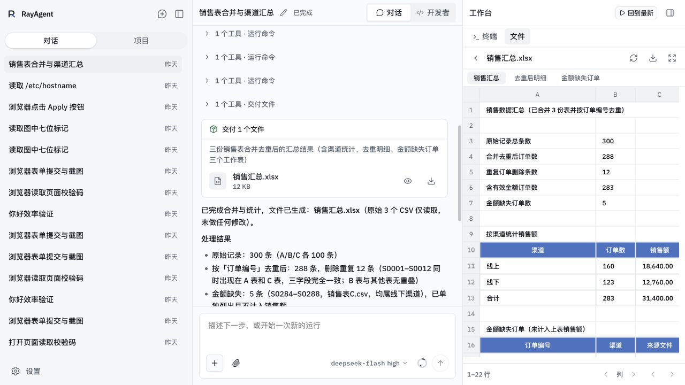
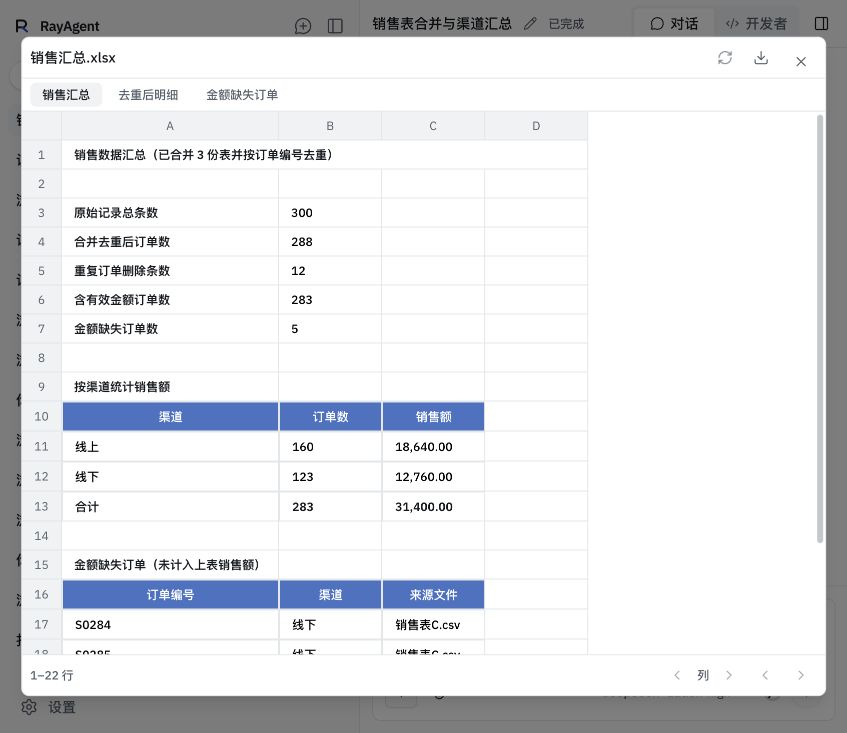

# 文件与截图统一查看验收

日期：2026-10-09。基线为 Git `06e9f409` 加本次未提交工作树。环境为 macOS 宿主机、默认本地 Compose 的 API/UI/Nginx 与本地文件存储；本次只读已有产物，不调用模型，不重新执行销售任务，不修改原业务文件。

## 结果与证据

| 条件 | 观察结果 |
|---|---|
| 后端定向检查 | 28 项通过：预览 12 项、项目下载 3 项、项目读取 5 项、附件产物 8 项。真实文件与解析子进程覆盖 CSV 引号/分页、XLS/XLSX 样式/合并格、公式缓存缺失、伪造维度、超过 5 MiB 的文本与工作簿、取消、损坏文件、项目版本/符号链接、Range、到期 410、ZIP 重名及下载 HEAD/GET。存储/仓库或项目根解析部分使用替身，不连接业务数据库 |
| 前端静态与组件检查 | 类型检查和本次改动文件的 ESLint 通过；共享查看器恢复、Markdown 分支、工作台宽度和过程组脚本通过。恢复检查挂载实际组件，HTTP 和基础 UI 为替身 |
| 构建与运行依赖 | API/UI 镜像构建通过，UI 生产构建通过；运行容器的 openpyxl 3.1.5、xlrd 2.0.2、defusedxml 0.7.1 与锁定版本一致 |
| 销售表真实页面 | 对话文件卡整卡单击直接弹出 CSV/Excel 大预览；工作台点击文件大小和行内空白在当前区域打开，标题点击展开。工作簿显示三个工作表、蓝色表头和金额格式，明细第二页显示 201–289 行 |
| 文件点击与焦点 | 实际点击交付文件图标、工作台大小/空白、键盘 Enter 均成功；Escape 关闭后焦点回到原文件卡，同一文件可重复打开。独立下载取得原文件且未触发预览；弹层初始焦点为 dialog，无自动下载提示 |
| 图片真实页面 | 已有表单截图从文件与浏览器两个页签均能放大；适应窗口图像不超出画布，原始尺寸与 1.25 倍缩放操作可用；对话图片单击后在同一弹层直接缩放，拖动画布后横向/纵向滚动分别增加 300/150 px，关闭回到原工作台 |
| ZIP 真实下载 | 点击全部下载得到单个 ZIP，含三份 CSV 与销售汇总.xlsx；包中工作簿字节与既有验收产物完全相同 |
| 环境保留 | 更新前确认没有 running 会话；模型配置字节哈希保持一致，原提问等待 run 仍为 waiting。服务更新后销售预览 HTTP 成功 |

图为更新后本地 RayAgent 真实页面，保留 1280×720 窗口。交付卡提供图标操作，工作台显示工作簿内容与关键格式，没有交付回执 JSON 或“正在跟随最新操作”常驻小字。

图为本地真实销售会话：单击交付文件整卡后直接弹出预览，文件读取与工作表切换沿用共享查看器；关闭回到原阅读位置。截图保留实际窗口尺寸。

## 验证条件与限制

全仓 `npm run lint` 未通过：既有 appearance-section.tsx 的挂载 effect 设置字体 state 触发一处错误，另有 24 项既有警告；该页面本次未修改，本次改动文件单独检查通过。未将完整 lint 记为通过。

现有可用项目为空，只验证项目文件页空状态；项目实际文件读取、版本与刷新由临时磁盘用例及组件检查覆盖。图片缩放、适应窗口与鼠标拖动经过真实页面核对，未做触屏验收。临时图到期通过服务和 HTTP 用例覆盖，没有改动线上图片到期时间。其他未验证范围与预算统一见[能力与边界](../../capabilities.md#文件预览与下载边界)。
