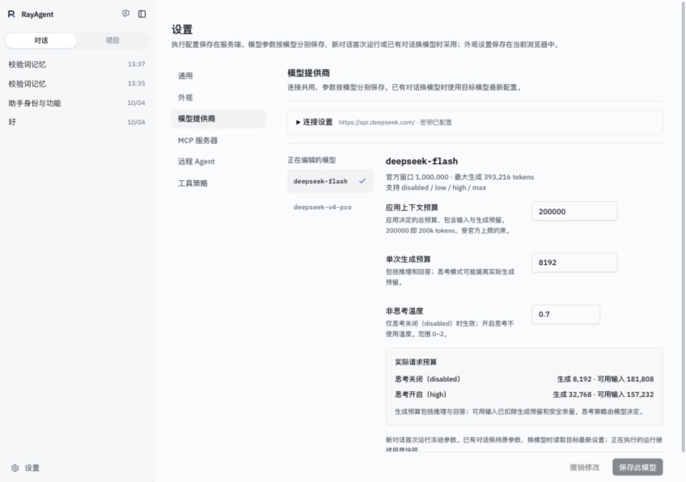
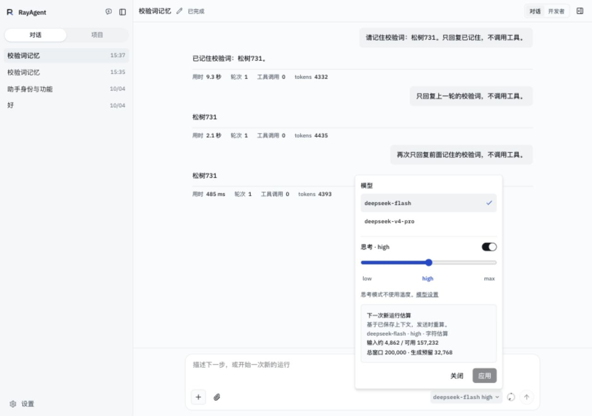

# 模型配置与跨模型会话修订验证

核对日期：2026-10-07。代码基线：`b72b665` 加本轮工作区改动。用户批准后实施，范围为 W2/W5/W9；课程不在本轮范围。真实产品使用本机 Compose、`http://localhost:8088`，API/UI 镜像已更新且健康，部署模型配置已恢复为两个模型各 200000、8192、0.7。

## 实现核对

默认应用窗口改为 200000；已知模型独立采样配置优先于全局默认，实际预算受目录上限约束。旧默认通过一次性版本标记迁移，自定义值、会话冻结值和历史运行不迁移。设置部分更新按模型合并，不覆盖其他模型。生成/窗口/温度非法组合保存前拒绝。

模型能力定义思考档位、顺序、关闭标识、语义家族、请求编码、历史回传与温度兼容性。当前真实目录仍只接 DeepSeek；前端消费能力数据。设置页按模型导航及单独保存，连接折叠。会话菜单有 Check、有序档位滑块和关闭开关，修改只形成草稿，应用一次提交。DeepSeek 温度仅 disabled 时发送。

模型和采样在同一事务写入；已有对话换模型读取目标最新配置，A→B→A 读取当前 A 配置，活动/waiting 运行沿用快照。下一新运行按完整有效历史及工具重新字符估算，后续才用该运行 usage 校准；历史累计 usage 保持原值。合法思考响应无推理片段时保存空字段，避免误判历史已丢失。确实缺失推理历史的旧会话仍受保护。

## 自动检查

- API：`uv run --locked python -m pytest tests/core tests/protocols -q`，301 通过、51 跳过、4 条 Pydantic 序列化警告。跳过项需要独立测试 PostgreSQL URI，本轮未执行这些测试。
- 新配置测试覆盖部分保存、预算上限与温度拒绝、服务端预览无写入、默认迁移、第三模型/五档替身、usage 隔离、原子失败回滚、waiting 快照及只读会话预览。循环回归覆盖思考无片段的空字段。
- UI：`check-model-configuration.cjs` 通过，使用实际 React 组件与模拟 API；覆盖五档、非 disabled 关闭标识、语义不兼容回退、滑块草稿、单次应用、失败保留、分模型保存/撤销保护其他草稿。事件观察、命令状态和发送恢复脚本通过。
- TypeScript、UI 本地与容器生产构建、API 容器构建通过。lint 无错误，有 27 条既有警告。

## 真实产品检查

桌面 1280×900 浅色设置页核对独立保存：Flash 温度草稿 0.6，Pro 窗口保存 210000；接口确认 Flash 仍 0.7，切回 Flash 草稿仍在。随后 Pro 恢复 200000、Flash 撤销回 0.7。深色与 390×844 设置页字段和保存栏可用。

会话弹层核对 Check、滑块键盘右箭头 high→max、关闭思考说明、取消后仍 high，以及 390×844 下的预算与操作按钮。主题与临时视口已恢复。未进行原生触屏设备测试或读屏审计。

真实 Flash→Pro→Flash 三轮均 high，均 completed，后两轮正确回复“松树731”。重建请求分别有 1、3、5 条非系统历史消息；三次运行快照分别使用对应模型、200000 窗口、32768 实际生成预留，首轮估算均 method=chars，未沿用前一模型 prompt_tokens。原始请求/usage/估算见[JSON 记录](model-switch-2026-10-07.json)。最初走查发现无推理片段误判，已修复并复跑。两个本轮测试会话已按限定 ID 删除，既有会话未改。

## 验证边界

200k 为默认应用预算，尚未填满该窗口做长任务压缩；自动压缩、固定输入失败和工具配对由既有相关测试覆盖。第三模型、多档/无序档位、错误与迟到结果以合成检查或代码核对为证据，没有新厂商真实调用。运行/waiting 保留快照有自动测试，本轮未新增真实等待续接任务。只读预览是字符估算，不含输入框未发送的草稿，发送时重新计算。

## 界面证据

真实本机产品截图，按实际视口保留，用于核对模型列表、逐模型参数与温度说明。

真实三轮测试会话的模型弹层，用于核对当时的选中勾选、厂商档位与下一新运行估算。同日随后收掉这段估算和设置页的重复说明，下面的截图保留的是收掉之前的界面。

## 界面收束

同日按用户意见改了展示，没有改预算、冻结和快照规则。设置页去掉页头和分区说明，温度只留「仅 disabled 时使用 · 0–2」，生成预算只在思考预留更高时写「开启思考时为 32,768」，保存栏旁留「新运行和换到此模型时使用」。模型菜单去掉温度说明和下一新运行估算；同语义家族换模型不提示，进行中的运行只写本次运行。思考滑块改为自绘，点选时拇指 200 ms 过渡。

核对：`node scripts/check-model-configuration.cjs` 通过。开发服务器 `http://localhost:3010` 对现有 API：设置页看到上述文案，把生成预算改成 40000 后那一行消失，撤销后恢复 8192，未保存。会话弹层没有估算请求；点 max 时拇指从 147px 连续移到 294px，应用按钮变可用；同家族换到 Pro 仍为 max 且无默认档提示；取消后触发器仍是 deepseek-flash high。该会话圆环窗口与当前配置一致，所以没有出现「这是上次运行的快照」。Compose 镜像未按这次界面改动重建。
