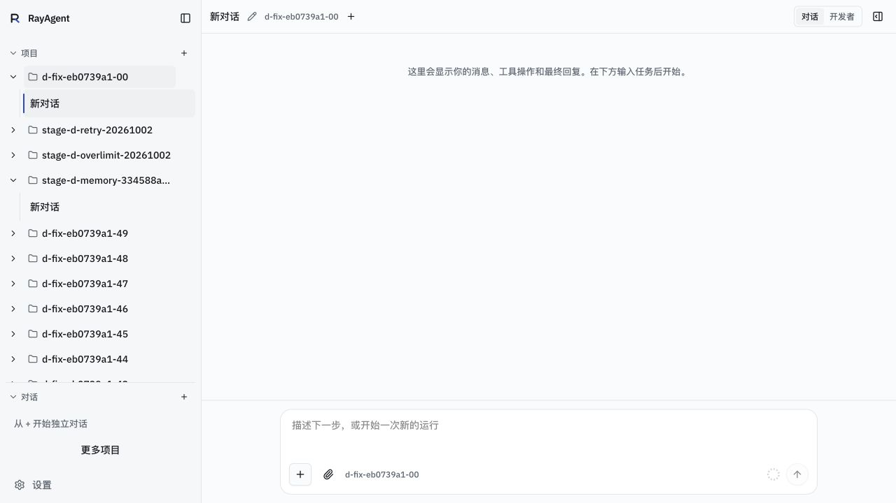
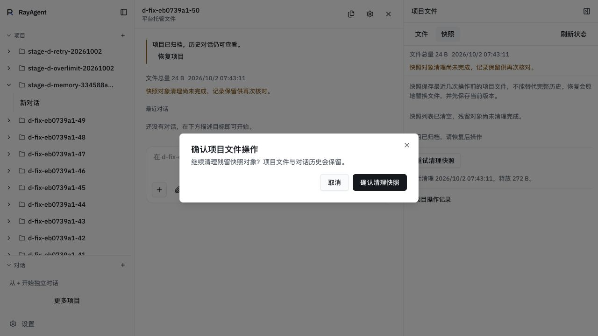
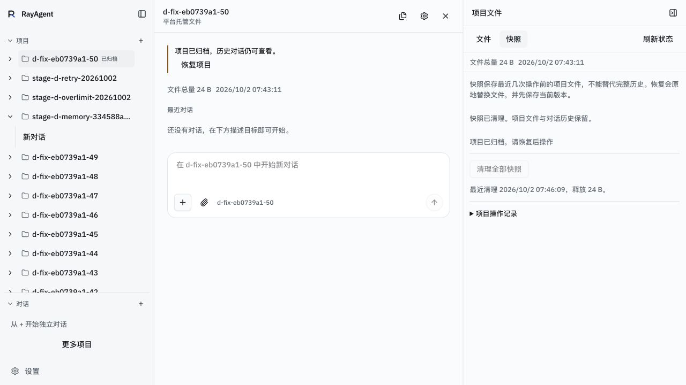

# 阶段 D 审计问题修复与复验（2026-10-02）

基线 `ecfc6c38d12f05d4f8831e600a839990e6256fb8`；验证时修复位于未提交工作树，随后按用户要求与本证据一并提交；无推送、课程修改或阶段 E 实施。完整源码哈希、镜像、HTTP 读回和资源范围见[原始条件](w11-stage-d-fixes-2026-10-02.json)。

## 修复范围

1. 归档清理在清单已删除、对象回收失败时，空列表仍允许「重试清理快照」，确认文案明确保留文件与对话；成功且没有残留对象后禁用清理。活动运行和文件操作占用仍禁止清理。
2. 项目选择器统一请求代次；切换项目/归档、关闭或重开弹框使旧请求失效。过期分页成功、错误和 finally 都不能覆盖当前列表、总数、错误或加载状态。
3. 导航在首屏 50 个项目之外补入当前会话所属项目；直接打开项目路由则按 id 定位。补入项置顶，读取对话失败保留当前项及错误，用户主动折叠不被刷新重置；归档补入项有标识及打开入口。

## 验证与覆盖边界

- UI 新增 `check-project-navigation-recovery.cjs`：5 组通过，使用实际组件与 React effects，传输和基础 UI 为替身。覆盖过期分页成功/失败、关闭重开、分页外会话/项目、错误保留、手动折叠和离开路由、空清单回收重试及占用限制。初版 next/link 替身导出格式错误导致组件无效；修正替身后复验通过。类型检查、定向 eslint 通过；全量 lint 为 0 errors / 25 既有 warnings，React renderer 弃用提示保留。
- API 八个文件共 **61 passed / 8.80s**：operations_pg、snapshots_pg、snapshot_disk、uploads、attachments_pg、delivery_pg、memory_pg、download。使用新建独立 PostgreSQL 数据库，运行后删除；真实临时磁盘，Docker/模型为替身。新增用例覆盖清单清空后对象回收失败，再次清理释放剩余字节并保留原文件与空对话。
- UI 两次生产镜像构建通过，最终版本包含补入项目置顶。仅重建及重启 manus-ui；API 产品未改动及未重建。API/UI/Postgres/Redis 均 healthy，实际访问 `127.0.0.1:8088`。
- 内置浏览器实际验证：新建 51 个唯一前缀项目，当前项目确实不在 API 首页；打开其空对话后项目与对话出现在导航顶部。项目选择器加载更多后切换归档，仅显示归档测试项；Escape 关闭。本地响应很快，此浏览器观察不等同于强制乱序，乱序由上述组件检查覆盖。
- 在独立工作进程对唯一测试项目的真实 PG/卷注入一次 collect OSError；主 API 不注入。首次删除清单释放 272 B，但保留 24 B 对象，gc_pending=true，快照列表为空。浏览器能打开重试确认弹框；取消后通过实际 HTTP cleanup 路由重试，释放 24 B、gc_pending=false，下载 probe.txt 前后 SHA256 相同。浏览器重新打开后显示已清理、按钮禁用；不把这条证据表述为浏览器执行最终清理。原文件哈希为 `3b4bee318aafe31fa14d8be946f1c56bcf3e6ec2cef2f0106499aa070ec3d7aa`。

截图来自本轮内置浏览器实际 1280×720 页面；第一张为最终置顶版本，确认弹框截图为置顶调整前版本，清理完成截图为最终版本。未声称窄屏复验。

## 剩余与资源

真实模型独立探测仍返回 HTTP 401，没有输出密钥或响应凭据片段。用户明确要求「先完成代码修复，模型验证保留待办」。跨对话摘要/记忆、等待审批、等待回复的真实模型场景仍待验收，不能用替身或本次 PG 测试代替。阶段 D 不标全部完成；阶段 E 留给用户。

只按预记录 id 清理本轮 51 个项目、1 个无运行/事件/沙箱的空会话、9 条项目审计、51 个目录；无交付副本。清理前后其他项目行完整哈希一致，既有项目与证据保留。独立回归数据库已删除，复用的测试 PG 容器保留。临时浏览器页已关闭。
