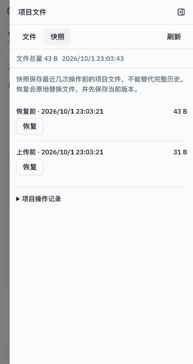
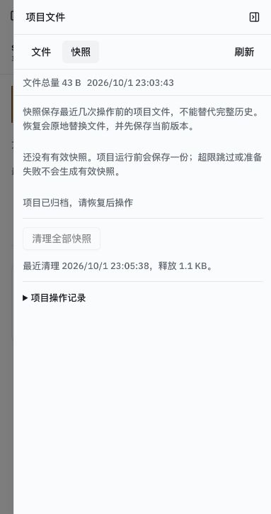

# 阶段 D 真实界面恢复失败、归档与清理

核对日期：2026-10-02，产品与运行源码未改变。完整提交 SHA、API/UI 镜像 ID、迁移 `f6cad3e75b86`、原始读回和测试资源范围见 [JSON](w11-stage-d-ui-repair-2026-10-02.json)。运行使用真实 Compose PostgreSQL 与托管卷，浏览器入口为 `127.0.0.1:8088`，Codex 内置浏览器标签页 3。

新建唯一测试项目 `a052fa5e-dcbc-4294-be72-930db218c59c`，在创建前记录清理范围。复用已提交的 [故障工作进程](w11-stage-d-restore-fault-worker-2026-10-01.py)，通过独立进程对该项目恢复覆盖阶段注入 OSError，真实持久操作进入 applying/failed。临时容器脚本随后移除。此注入不是 API 主进程退出或模型执行；API 主进程退出仍由此前单列证据覆盖。

真实界面显示「恢复未完成，文件可能处于混合状态」，发送与上传禁用，历史/文件只读仍可达。快照页标出固定恢复目标与恢复前保护，两种修复入口可达，普通恢复禁用。

实际从界面选择「回到恢复前」并点击网页确认。服务端占用释放，HTTP下载 `source.csv` 与 `extra/nested.txt` 字节符合恢复前版本；实际卷路径集合为 `extra`、`extra/nested.txt`、`source-link`、`source.csv`，链接目标为 `extra/nested.txt`，各属主均1000，根 inode 与注入前相同。两份固定快照仍在。

随后通过项目菜单归档，从已归档列表打开项目，两份快照与空对话历史保留。先记录限定清理范围，再在快照页点击清理与网页确认。真实快照页为空、按钮禁用、显示释放1.1KB；容器磁盘文件大小差实际为1142字节。清理后两份项目文件下载哈希不变，空对话仍在。最后点击「恢复项目」成功，归档状态解除，文件与历史保留。

覆盖边界：本轮只验证限定故障项目的真实浏览器回到恢复前、归档、清理与恢复归档；未将空对话算作真实模型历史。模型凭据401、完整文件夹入口、连续项目和最终阶段E尚待完成。测试项目与空对话暂保留，最后只按预记录范围清理；两个此前项目、凭据和审计文件保留。
