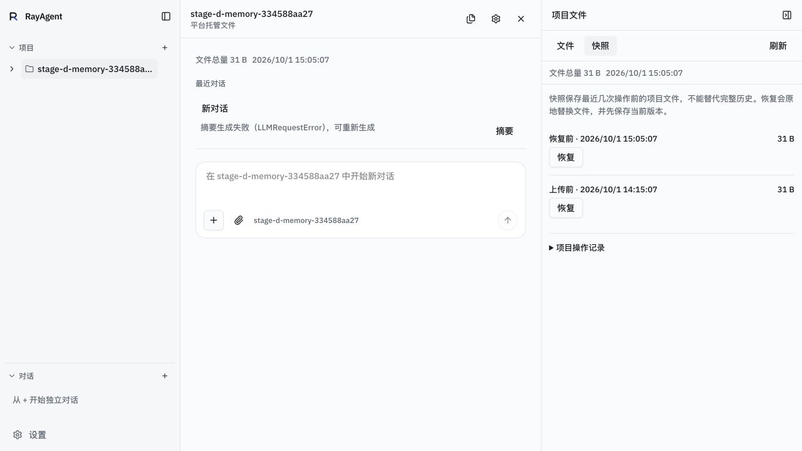
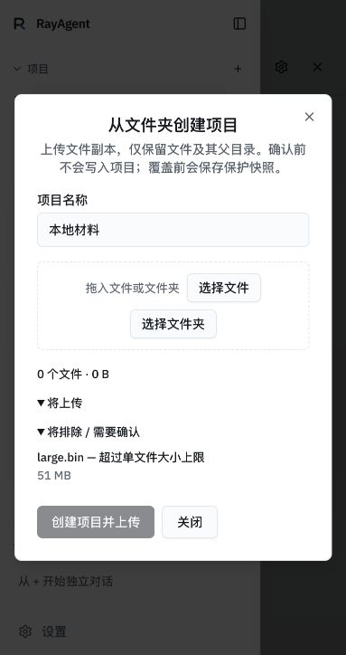
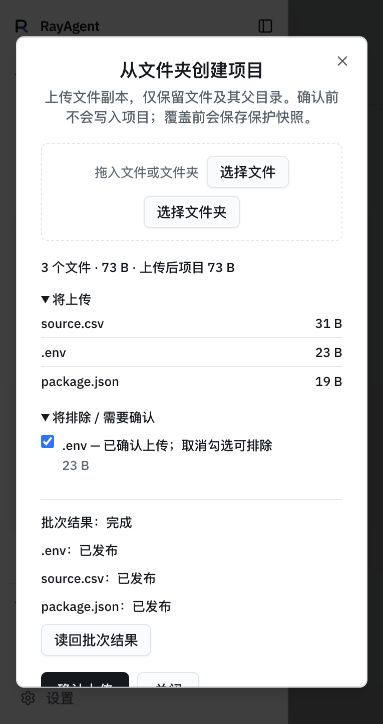

# 阶段 D 上传与恢复真实浏览器复验

核对日期：2026-10-01。运行入口 `http://127.0.0.1:8088`，Codex 内置浏览器；真实业务 PostgreSQL、Compose API 与托管卷。此记录不替代阶段 E 或连续模型项目。

恢复复验基线 `a22e1ca4cc22f53261c6d7792f060e9f4330e452`：实际点击快照恢复与网页确认，源 CSV 恢复为原哈希 `7d99d75e14563a94bb420dc1fd994a4e51d89be413bcd1deb9652cbd95e18125`，根目录 inode `[65025,398983]` 不变。新增恢复前快照 `a108afbc-aa6e-4ec9-90d6-74526d20a191` 的实际对象为恢复前覆盖内容，哈希 `b04131b78db649130873f1175691c8b18f9c076f4e72245d510673175a12ab23`。操作占用释放。旧原生确认阻塞和下载失败保留在 [JSON](w11-stage-d-ui-restore-download-2026-10-01.json)，本次网页确认通过。

上传基线及完整 UI 镜像 ID 见 [上传 JSON](w11-stage-d-ui-folder-2026-10-01.json)。目录输入原先在弹框延迟挂载时漏设 `webkitdirectory`，提交 `e0b753b` 改为 ref 挂载回调；实际 DOM 由无属性变为匹配一个目录输入。`tsc --noEmit`、定向 eslint、扫描运行脚本及 Docker 生产构建通过。API 与沙箱代码未改变。

真实浏览器选择 51 MiB 文件后显示「超过单文件大小上限」，0 个文件，创建项目并上传禁用，未点击受理。随后重新选择 `source.csv`、`package.json`、仅含虚构键值的 `.env`，默认仅前两项进入上传清单；勾选 `.env` 后重新扫描为 3 文件 73 B。勾选后控件名称变化导致工具验证旧名称超时，后续 DOM 已明确 checked，不重复点击。实际点击创建和上传，三项均显示已发布、批次完成。

新项目 `b764877f-1662-4482-80ee-204de6b38f1e`，未创建对话。三个持久副本实际 HTTP 下载字节和哈希与源文件相同；测试目录所有源文件哈希不变。清理范围在创建前记录，只允许此项目及唯一临时目录；此轮保留供后续验收，原记忆项目保留。

覆盖边界：点击目录入口没有返回可操作目录选择器或后备对话框，控制接口对隐藏目录输入直接点击返回 `no_visible_match`，文件选择事件等待超时。普通文件选择事件与上传成功，目录属性已实测；尚未把文件夹端到端、懒遍历真实浏览器或后备提示记为通过。真实模型仍返回 401，需要有效凭据后完成记忆及阶段 E 验收。未降低既定标准，未冻结或创建验收 tag。
