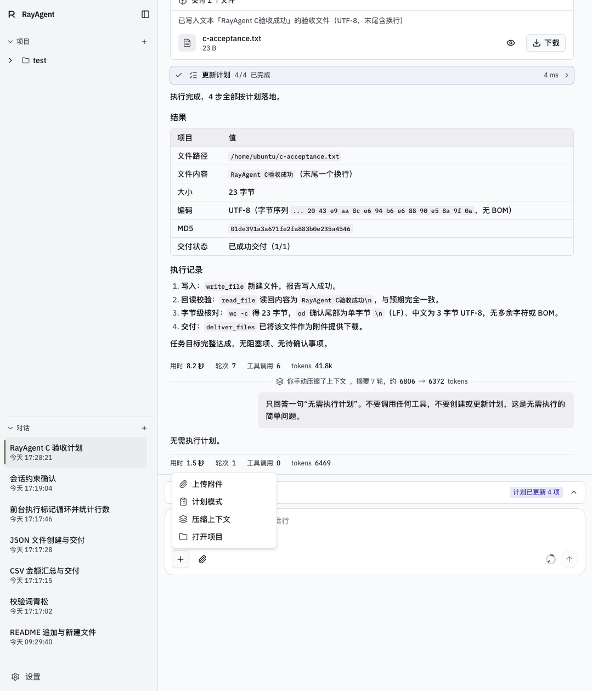
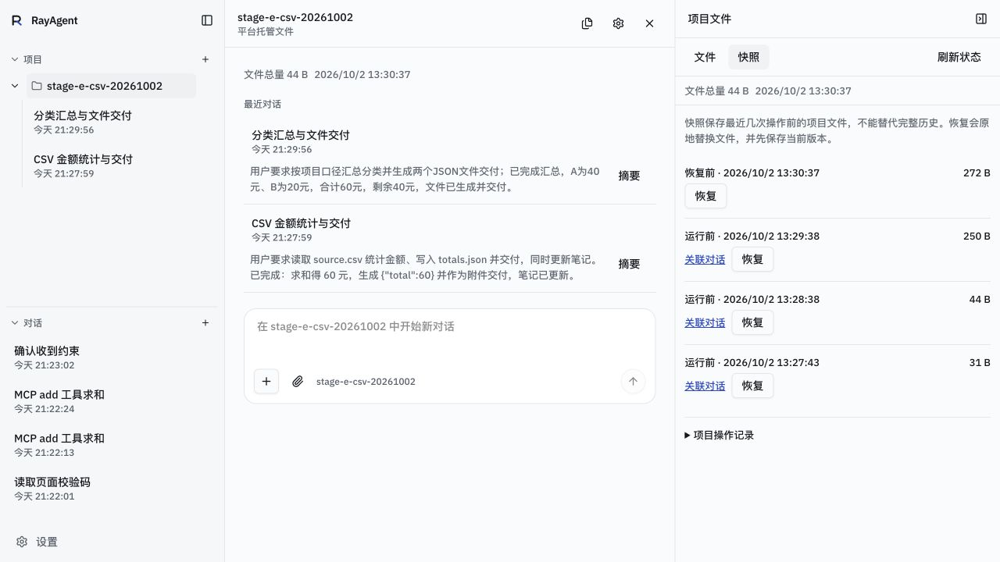

# W9–W11 最终验收（2026-10-02）

结论：按用户“尽快完成、测试和脚本从简”的要求，保留全部八类标准评测、外部工具界面回归和连续项目任务，取消每类第二次重复；[W11 文件保护验证](w11-file-safety-2026-10-02.md)的同版本故障注入、扫描、占用、归档与深浅主题证据沿用，不重复。标准八类单轮通过，连续项目与外部界面目标通过。单轮观察不外推稳定成功率。

## 冻结条件

产品提交 `89aa642d08137521e1099e11c0822ea0b5f6367f`；本轮只改文档和 UI 检查脚本的 toast 替身，产品代码、依赖锁、迁移与 Compose 没有变动。验收 tag `v2-projects` 随本次收口提交创建，不移动 `v2`。未推送、未修改课程。机器可读结果见[汇总 JSON](w9-w11-acceptance-2026-10-02.json)。

网关 `127.0.0.1:8088`；macOS Docker Desktop，动态沙箱；数据库迁移 `f6cad3e75b86`。API/UI/Postgres/Redis healthy。API 镜像 `sha256:766d33b91334d4f326997592f4e1309202785c2a7ea976dffc8bb98b336d692d`，UI `sha256:c425f52e6af5ca8b10ad67da0767b1bb15c4e59ac7271c9a8d1e7d5414cca6f6`，沙箱 `sha256:f93fe5fa1b441c84c5a4fb7622f2d56f92709684320f0bdc57f4bd48b8df33a2`。Compose 沿用当时项目验证的卷与 loopback 发布配置，无新增部署变更。

模型实际读回为 `deepseek-reasoner`，地址 `https://api.deepseek.com/`，temperature 0.7，max_tokens 8192，context_window 65536；Agent max_iterations 100、max_retries 3、max_search_results 10。项目摘要使用既有标题/摘要模型配置，来源以持久记录为准。密钥不入证据。策略 `mcp:*`、`a2a:*` 为 ask，其他 allow；外部服务均为本地受控夹具。

## 回归结果

| 检查 | 实际结果 |
|---|---|
| 既有 E1–E7、E6-deny | 各一次，8/8 通过，指标核对一致；E4 cancelled/user_stop，停止后文件不再增长；E7 压缩两次，结果与源文件检查通过 |
| API core + protocols | 独立临时 PostgreSQL 数据库，329 passed、2 个 Pydantic 序列化警告，39.64 秒；临时库已删除 |
| 沙箱现有 unittest | 3 项，OK，22.292 秒 |
| UI 类型、lint、build | 类型通过；lint 0 errors、25 条既有 warnings；生产 build 通过 |
| 六个现有 UI 检查 | 事件、斜杠、命令状态、发送恢复、工作台恢复、项目导航恢复均退出 0 |
| 受控浏览器界面 | 实际 browser_navigate/view/console_exec 后读回 E_UI_42；390×844 完成态、侧栏打开/关闭及 Esc 关闭通过；已恢复视口与侧栏 |
| MCP 界面 | 17+25 批准一次后结果42；8+9拒绝一次，denied_by=user，无执行结果，不换工具 |
| A2A 界面 | echo 返回 A2A_OK:echo；fail 的工具结果 success=false、remote_state=failed，界面如实报告 A2A_EXPECTED_FAIL，不重试 |

[标准评测报告](w9-w11-eval-2026-10-02-89aa642.md)保留完整条件、每项检查及原始 JSON。E7 临时窗口 24576/max_tokens4096，结束恢复65536/8192。UI 五例的运行、工具 outcome、最后回复在汇总 JSON。A2A 的对话“已完成”表示已完成报告远端失败，不能解读为远端任务成功。

工作台检查第一次因新引入的 sonner 未提供测试替身失败；补上无副作用 toast.error 替身后，六项独立检查全部通过。没有修改产品行为。临时读回脚本曾把列表字段当详情字段、把 run_id 当 id；修正读回后核对通过，不计作产品失败。容器内迁移检查曾误用需要本地锁文件的 uv 命令；改用已安装的 python/alembic 后读回 head，新建的临时 .venv 已移除。

## W9 输入与 W10 受理验证

2026-09-30真实界面核对加号短菜单、回形针、斜杠说明、纯圆环及浅色/深色390×844；会话f06a78fa-fc26-4a21-bbeb-9b41c41a9707有非空计划时显示“按计划执行”，执行后交付c-acceptance.txt，随后只回答无计划时不显示新的执行入口。手动压缩摘要7轮、估算6806→6372；重建界面后压缩中页头/状态行/侧栏/时间线同步转圈，完成后替换占位，后一次为当时用户验收、未单独留截图。

当次50项定向检查覆盖慢启动/迟到容器、固定输入422且不改记忆、附件同步失败保留id；UI五个脚本/类型/lint/build通过。首次发送失败或超时先读回、草稿恢复、不自动重发由测试和脚本覆盖，没有在浏览器注入502。默认发布127.0.0.1:8088，没有第二设备验证局域网。原镜像当时不含当前项目估算标记，最终产品已补齐；不把早期截图当作该功能证据。中文输入法组合期由脚本覆盖，早期键盘焦点环没有单独截图。

深色圆环关键截图见[上下文详情](w9-w11/context-dark.png)。首次失败、晚到响应和慢容器范围不能由最终完成态截图替代；最终六个UI检查再次通过，W11故障和等待验证见专项报告。

## 连续 CSV 项目

全部写入、发送、笔记编辑及恢复从真实产品界面操作，HTTP 只用于读回检查；没有新增永久项目评测脚本。项目 `d3cb240d-fabd-4c5d-9609-38e2533162b8`，两段对话、三次运行。

材料为31字节 source.csv（A10、B20、A30）。项目说明只输入一次“金额单位为元；不得覆盖原材料 source.csv。”；第二段只给分类/预算及交付要求，没有重复源材料或统计口径。第一段提示含预期 total=60，因此不把它作为独立推理能力测量；实际工具读取源文件、文件内容和后续分类/阈值仍分别核对。

| 运行 | 核对结果 | 模型请求/工具 | prompt/completion | 运行用时/环境准备 |
|---|---|---|---|---|
| 第一次 | totals.json total=60；Agent 写笔记版本2，自动摘要 ready/auto，source_seq44 | 5/6 | 25847/695 | 16.342秒/0.393秒 |
| 新对话 | categories.json A40、B20、remaining40；/tmp 产出副本保存至 outputs；重建请求含版本2笔记与前段auto摘要 | 6/6 | 34686/1178 | 17.163秒/0.347秒 |
| 用户编辑后 | 用户在界面加阈值25，版本4进入同一对话下一运行；threshold.json count_above=1；运行后 Agent 笔记版本5 | 5/4 | 44011/1296 | 17.447秒/0.289秒 |

人工业务操作按保存/发送动作计10次：创建项目、保存说明、上传一次、三次发送、开启第二段对话、保存阈值、选择恢复及确认各一次；不含导航点击、截图和读回探测。必须重复输入背景0次；这是本次固定场景的观察，没有旧项目基线，不宣称普遍节省比例。准备用时由 preparing 到 ready 事件计算，包含环境及快照，不单独假造快照性能。

恢复第二段运行前44字节快照后，只有 source.csv31字节和 totals.json13字节；categories、threshold和outputs副本路径消失，保护性的恢复前快照272字节仍在。源文件 SHA256 `7d99d75e14563a94bb420dc1fd994a4e51d89be413bcd1deb9652cbd95e18125`，本地原文件同哈希。totals SHA256 `45fe968ed74c8f0677cf5e392df6f833abc6924eed7acf062fb13da728826755`。

项目终态已停止旧沙箱；销毁检查时没有残留项目容器。无沙箱时交付卡103字节副本仍可下载，SHA256 `60c2c4ae7219687acfa8705cd71e2d6afb7754ceceee6b55daaa4d6a2b243499`。整项目ZIP解压只含source/totals，字节哈希一致。快照恢复只恢复文件，笔记/摘要保留当时内容，这是已确认边界。

截图来自真实1280×720产品界面。关键截图另保留[窄屏完成态](w9-w11/narrow-completed.jpg)和[远端失败](w9-w11/a2a-failure.jpg)，其余重复截图已清理。

## 与 W0 对照及覆盖边界

W0 E1–E6模型调用为10/16/10/3/9/7，本轮为2/4/5/2/4/2；W0 E4停止失败，本轮通过。模型从deepseek-flash变为deepseek-reasoner且只跑一次，耗时和token变化不能归因于代码或当作严格性能提升；没有新增稳定性统计。E7和项目场景无W0基线。

已有验证的上传/文件夹、容量降级、恢复中断修复、旧写入者停止、归档清理和waiting互斥沿用[W11专项验证](w11-file-safety-2026-10-02.md)及总计划关键证据。本轮不重复故障注入。Linux宿主机、长期TTL、多API实例、真实第三方MCP/A2A及长期摘要质量未验证；项目等待占用时首次发送可能留下空对话，没有创建重复运行；Agent可写入超过上传阈值的文件，快照可能降级。统一边界见[能力与边界](../../capabilities.md)。

## 清理与交付

按本轮记录的准确ID清理1项目、15对话、20运行、646事件、40项目审计、4快照、3副本、26文件元数据和13动态沙箱；托管项目目录已移除。收尾 projects/sessions/runs/project_audit_events 均为0；无其他对话需要保留。本地模型凭据保留，MCP/A2A列表恢复为空，工具策略恢复，临时HTTP和协议夹具已停止。Compose服务继续运行，独立测试PostgreSQL容器沿用原状态。

2026-10-02收敛时只保留关键证据；旧审计、临时脚本和复制归档已删除，原件可从Git提交2e68aa3追溯。本次整理没有重新运行产品测试，也不改变原验收条件。
