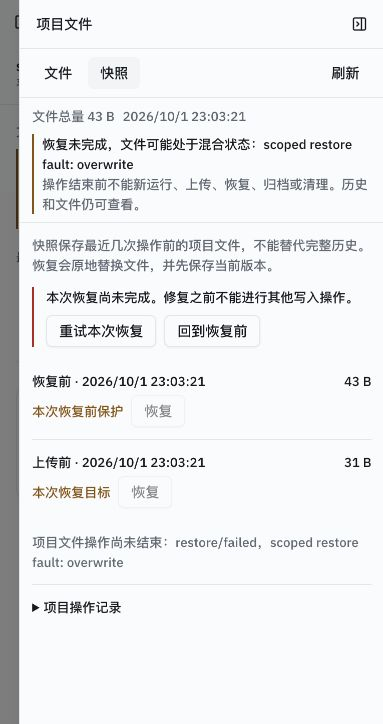

# 托管项目、记忆与文件保护验收

日期范围：2026-10-01 至 2026-10-03，综合回归在 2026-10-02。文件保护故障验证与后续上传观察保留各自版本和条件；本次文档合并没有重新执行。

结论：按用户“尽快完成、测试和脚本从简”的要求，保留全部八类标准评测、外部工具界面回归和连续项目任务，取消每类第二次重复；[文件保护专项](#文件保护与故障验证)的同版本故障注入、扫描、占用、归档与深浅主题证据沿用，不重复。标准八类单轮通过，连续项目与外部界面目标通过。单轮观察不外推稳定成功率。

## 冻结条件

产品提交 `89aa642d08137521e1099e11c0822ea0b5f6367f`；本轮只改文档和 UI 检查脚本的 toast 替身，产品代码、依赖锁、迁移与 Compose 没有变动。未推送、未修改课程。机器可读结果见[汇总 JSON](w9-w11-acceptance-2026-10-02.json)。

网关 `127.0.0.1:8088`；macOS Docker Desktop，动态沙箱；数据库迁移 `f6cad3e75b86`。API/UI/Postgres/Redis healthy。API 镜像 `sha256:766d33b91334d4f326997592f4e1309202785c2a7ea976dffc8bb98b336d692d`，UI `sha256:c425f52e6af5ca8b10ad67da0767b1bb15c4e59ac7271c9a8d1e7d5414cca6f6`，沙箱 `sha256:f93fe5fa1b441c84c5a4fb7622f2d56f92709684320f0bdc57f4bd48b8df33a2`。Compose 沿用当时项目验证的卷与 loopback 发布配置，无新增部署变更。

模型实际读回为 `deepseek-reasoner`，地址 `https://api.deepseek.com/`，temperature 0.7，max_tokens 8192，context_window 65536；Agent max_iterations 100、max_retries 3、max_search_results 10。项目摘要使用既有标题/摘要模型配置，来源以持久记录为准。密钥不入证据。策略 `mcp:*`、`a2a:*` 为 ask，其他 allow；外部服务均为本地受控夹具。

## 回归结果

| 检查 | 实际结果 |
|---|---|
| 既有 E1–E7、E6-deny | 各一次，8/8 通过，指标核对一致；E4 cancelled/user_stop，停止后文件不再增长；E7 压缩两次，结果与源文件检查通过 |
| API core + protocols | 独立临时 PostgreSQL 数据库，329 passed、2 个 Pydantic 序列化警告，39.64 秒；临时库已删除 |
| 沙箱现有 unittest | 3 项，OK，22.292 秒 |
| UI 类型、lint、build | 类型通过；lint 0 errors、25 条既有 warnings；生产 build 通过 |
| 六个现有 UI 检查 | 事件、斜杠、命令状态、发送恢复、工作台恢复、项目导航恢复均退出 0 |
| 受控浏览器界面 | 实际 browser_navigate/view/console_exec 后读回 E_UI_42；390×844 完成态、侧栏打开/关闭及 Esc 关闭通过；已恢复视口与侧栏 |
| MCP 界面 | 17+25 批准一次后结果42；8+9拒绝一次，denied_by=user，无执行结果，不换工具 |
| A2A 界面 | echo 返回 A2A_OK:echo；fail 的工具结果 success=false、remote_state=failed，界面如实报告 A2A_EXPECTED_FAIL，不重试 |

[标准评测原始 JSON](w9-w11-eval-2026-10-02-89aa642.json)保留各任务条件、逐项检查与完整结果。E7 临时窗口 24576/max_tokens4096，结束恢复65536/8192。UI 五例的运行、工具 outcome、最后回复在汇总 JSON。A2A 的对话“已完成”表示已完成报告远端失败，不能解读为远端任务成功。

工作台检查第一次因新引入的 sonner 未提供测试替身失败；补上无副作用 toast.error 替身后，六项独立检查全部通过。没有修改产品行为。临时读回脚本曾把列表字段当详情字段、把 run_id 当 id；修正读回后核对通过，不计作产品失败。容器内迁移检查曾误用需要本地锁文件的 uv 命令；改用已安装的 python/alembic 后读回 head，新建的临时 .venv 已移除。

## W9 输入与 W10 受理验证

2026-09-30真实界面核对加号短菜单、回形针、斜杠说明、纯圆环及浅色/深色390×844；会话f06a78fa-fc26-4a21-bbeb-9b41c41a9707有非空计划时显示“按计划执行”，执行后交付c-acceptance.txt，随后只回答无计划时不显示新的执行入口。手动压缩摘要7轮、估算6806→6372；重建界面后压缩中页头/状态行/侧栏/时间线同步转圈，完成后替换占位，后一次为当时用户验收、未单独留截图。

当次50项定向检查覆盖慢启动/迟到容器、固定输入422且不改记忆、附件同步失败保留id；UI五个脚本/类型/lint/build通过。首次发送失败或超时先读回、草稿恢复、不自动重发由测试和脚本覆盖，没有在浏览器注入502。默认发布127.0.0.1:8088，没有第二设备验证局域网。原镜像当时不含当前项目估算标记，最终产品已补齐；不把早期截图当作该功能证据。中文输入法组合期由脚本覆盖，早期键盘焦点环没有单独截图。

深色圆环观察保留为上述条件记录，界面截图不再单独占用关键证据入口。首次失败、晚到响应和慢容器范围不能由最终完成态截图替代；最终六个UI检查再次通过，W11故障和等待验证见专项报告。

## 连续 CSV 项目

全部写入、发送、笔记编辑及恢复从真实产品界面操作，HTTP 只用于读回检查；没有新增永久项目评测脚本。项目 `d3cb240d-fabd-4c5d-9609-38e2533162b8`，两段对话、三次运行。

材料为31字节 source.csv（A10、B20、A30）。项目说明只输入一次“金额单位为元；不得覆盖原材料 source.csv。”；第二段只给分类/预算及交付要求，没有重复源材料或统计口径。第一段提示含预期 total=60，因此不把它作为独立推理能力测量；实际工具读取源文件、文件内容和后续分类/阈值仍分别核对。

| 运行 | 核对结果 | 模型请求/工具 | prompt/completion | 运行用时/环境准备 |
|---|---|---|---|---|
| 第一次 | totals.json total=60；Agent 写笔记版本2，自动摘要 ready/auto，source_seq44 | 5/6 | 25847/695 | 16.342秒/0.393秒 |
| 新对话 | categories.json A40、B20、remaining40；/tmp 产出副本保存至 outputs；重建请求含版本2笔记与前段auto摘要 | 6/6 | 34686/1178 | 17.163秒/0.347秒 |
| 用户编辑后 | 用户在界面加阈值25，版本4进入同一对话下一运行；threshold.json count_above=1；运行后 Agent 笔记版本5 | 5/4 | 44011/1296 | 17.447秒/0.289秒 |

人工业务操作按保存/发送动作计10次：创建项目、保存说明、上传一次、三次发送、开启第二段对话、保存阈值、选择恢复及确认各一次；不含导航点击、截图和读回探测。必须重复输入背景0次；这是本次固定场景的观察，没有旧项目基线，不宣称普遍节省比例。准备用时由 preparing 到 ready 事件计算，包含环境及快照，不单独假造快照性能。

恢复第二段运行前44字节快照后，只有 source.csv31字节和 totals.json13字节；categories、threshold和outputs副本路径消失，保护性的恢复前快照272字节仍在。源文件 SHA256 `7d99d75e14563a94bb420dc1fd994a4e51d89be413bcd1deb9652cbd95e18125`，本地原文件同哈希。totals SHA256 `45fe968ed74c8f0677cf5e392df6f833abc6924eed7acf062fb13da728826755`。

项目终态已停止旧沙箱；销毁检查时没有残留项目容器。无沙箱时交付卡103字节副本仍可下载，SHA256 `60c2c4ae7219687acfa8705cd71e2d6afb7754ceceee6b55daaa4d6a2b243499`。整项目ZIP解压只含source/totals，字节哈希一致。快照恢复只恢复文件，笔记/摘要保留当时内容，这是已确认边界。

截图来自真实1280×720产品界面，保留用于说明恢复后的文件结果。窄屏、命令和远端失败的观察仍由正文与汇总 JSON 记载，不再保留重复界面截图。

## 与 W0 对照及覆盖边界

W0 E1–E6模型调用为10/16/10/3/9/7，本轮为2/4/5/2/4/2；W0 E4停止失败，本轮通过。模型从deepseek-flash变为deepseek-reasoner且只跑一次，耗时和token变化不能归因于代码或当作严格性能提升；没有新增稳定性统计。E7和项目场景无W0基线。

已有验证的上传/文件夹、容量降级、恢复中断修复、旧写入者停止、归档清理和waiting互斥沿用[文件保护专项](#文件保护与故障验证)及总计划关键证据。本轮不重复故障注入。Linux宿主机、长期TTL、多API实例、真实第三方MCP/A2A及长期摘要质量未验证；当时项目等待占用时首次发送可能留下空对话，没有创建重复运行（后续实现已改为受理成功才创建，当前事实见能力与边界）；Agent可写入超过上传阈值的文件，快照可能降级。统一边界见[能力与边界](../../capabilities.md)。

## 上传界面补充观察（2026-10-03）

工作树基于 `2e50c985440b0f3309102b61f1cf30f6e7ec3631`，当次 UI 修改尚未提交，仅重建 UI 与网关，未调用模型。macOS，本地 Node.js 24.12.0、容器 Node.js 22；开发页 3001 连接既有网关 8088。真实浏览器覆盖 1440×900 与 390×844、浅色生产页与深色开发页；合成目录用于层级、长路径、键盘与禁止项检查，不能证明完整原生文件夹选择。

实际选择 `source.csv`（26 bytes）和只含测试值的 `.env`（28 bytes），扫描确认后创建项目并上传两项，通过下载接口逐字节核对；重复 CSV 显示内容复用。项目归档、恢复及再次归档通过，没有创建对话或沙箱。自动检查的 TypeScript、lint、生产构建及命令、导航、发送、工作台、导入审核树均通过，lint 保留 25 条既有警告；后续侧栏细节另通过类型检查与生产构建，没有重复模型评测。

保留项目 `f3364701-53ad-4eb2-bf4b-51f736302db9`，最终归档，54 bytes 合成文件。CSV SHA-256：`abaa6a7da75b82c55acd037649ba3d45ef4d59a705741a58ff12d9dd53c6fb59`；.env：`60b1d68c141a6daa4bcc51cb68480cc2f75c6789f5ec6b540473497000eec62d`。当次 UI 镜像 `sha256:04623fa07edb60e6eef85b117f460b0573c90d7f88315c7d3aa89fa843b972ed`。完整旧报告可在 Git 提交 `06e9f409` 查阅；此观察不覆盖之后的记忆面板或字节进度修改。

## 清理与交付

按本轮记录的准确ID清理1项目、15对话、20运行、646事件、40项目审计、4快照、3副本、26文件元数据和13动态沙箱；托管项目目录已移除。收尾 projects/sessions/runs/project_audit_events 均为0；无其他对话需要保留。本地模型凭据保留，MCP/A2A列表恢复为空，工具策略恢复，临时HTTP和协议夹具已停止。Compose服务继续运行，独立测试PostgreSQL容器沿用原状态。

2026-10-02收敛时只保留关键证据；旧审计、临时脚本和复制归档已删除，原件可从Git提交2e68aa3追溯。本次整理没有重新运行产品测试，也不改变原验收条件。

## 文件保护与故障验证

整理日期：2026-10-02。本报告合并2026-10-01至10-02的独有验证，不是本次重新执行。各项代码SHA、镜像、测试ID、HTTP结果、文件哈希和首次失败保留在[原始数据合集](w11-file-safety-2026-10-02.json)；原始脚本和过程记录可在Git提交 `2e68aa3fbf1837fee06b80cf9abb1280af92e4d1` 的 `docs/plan/evidence/` 追溯。最终产品基线与完整回归见本报告前文。历史局部检查不冒充最终版本重跑。

### 所有权与旧写入者

2026-10-01，所有权实现基线 `203fa083138e4a03415dc90da6e3550b40b60ac8`，后续文件IO `abaff8bad86ad3c3da8222ae89c9895ef53a9a12`。真实命名卷子路径挂载验证ubuntu可修改/删除项目文件且看不到快照目录。真实Docker后台写入标记先增长；waiting提问容器保留，同项目其他旧写入者停止，标记不再增长，恢复后的字节不被旧进程覆盖。最终inspect使用State.Running；最初DockerClient上下文管理器误用、removing期间kill409均修正后复验。定向39项使用真实PG和Docker替身；文件IO19项使用真实临时磁盘，不能混称真实模型测试。

### 恢复异常与进程退出

2026-10-01，产品基线 `a22e1ca4cc22f53261c6d7792f060e9f4330e452`，API实现 `1a37012`，迁移 `f6cad3e75b86`。

- 独立worker在删除、覆盖、链接重建、属主设置四阶段分别注入OSError或退出73，各验证重试目标/回到恢复前，共16场景。80个写入请求409，32个只读请求成功。实际API重启后仍保留失败与固定快照引用；两种修复各8次通过。
- 实际HTTP恢复中另让API的PID1在四阶段退出，两种修复各4次，共8场景。HTTP中断、PID1标记与RestartCount从0至8共同证明退出重启；8次修复均核对路径、单文件/ZIP字节、链接目标、uid1000、根inode及快照引用。
- Docker die事件只曾直接观察后4条退出码73，没有保存完整8条；不补造事件。临时钩子删除、API重启后178个app Python文件与仓库哈希一致。

worker初始化Path误用、只读探针未初始化PG的首次失败保留于合集。修正探针后复验，不算产品失败。16+8个隔离项目及其目录、快照和审计按限定ID清理，不清理用户资源。

### 快照完整性、发布与回收

2026-10-02，八场景在对象写入、清单发布前/后、回收各注入OSError和worker退出73。已有ready快照保持可加载；同长度改写且恢复mtime仍计算出新哈希；相同内容复用对象，外部链接只记录目标文字。实际API重启后未发布对象/清单被收敛，回收pending可重试解除。

HTTP恢复遇损坏/缺失对象返回400，当前路径、字节、链接和根inode不变。501MiB稀疏文件使受保护恢复被拒；run来源helper记录skipped，但该helper没有发起真实run，不替代界面运行证据。ZIP不含外部链接或快照目录并带警告。

后续真实超限项目运行在任何工具事件之前显示保护跳过，之后因模型401失败；这是保护提示成功、模型任务失败。有效凭据重建API后的模型路径另由最终验收证明。

空清单但对象回收失败的审计修复在 `89aa642` 中：首次清理释放272B、剩24B对象，gc_pending=true；浏览器确认重试入口可达，取消确认后经HTTP重试释放24B，原文件哈希不变，浏览器读回按钮禁用。不能称这次最终清理由浏览器提交。

### 上传断连与批次收敛

2026-10-02，真实Nginx/HTTP、业务PG和托管卷。覆盖前保护快照成功；请求间批次占用持续，同项目chat/恢复/归档/清理/另一批次均409。第二文件丢弃完整响应体后读回已发布，同内容重传reused；第三文件multipart中断及错误哈希未发布，finish为partial_failure，新批次复用成功项、补齐失败项，下载字节正确。

第一次半关闭TCP写方向没有发布第二文件，断言失败；改为读取完整响应头后丢弃响应体再复验。该方法不证明响应头丢失后的UI恢复。到期测试把限定批次last_active_at改为601秒前，不是实际等10分钟。到期、实际API重启和显式取消均保留成功项、标记未发送项失败并释放占用；取消后迟到写入409。

### 真实界面修复、归档与上传

2026-10-02，真实项目 `a052fa5e-dcbc-4294-be72-930db218c59c` 经worker注入恢复覆盖失败。界面显示混合状态，发送/上传禁用，历史及文件只读可达。用户路径“回到恢复前”及确认后，下载字节、链接、属主和根inode正确，固定快照保留。归档后文件/空对话/快照保留；界面清理快照释放实际1142字节，文件哈希不变；恢复归档成功。空对话不算模型历史。

另一个项目 `c6900f0b-1373-4a2b-9f47-7b0845df3735` 在界面完成“重试本次恢复”，source.csv31字节、哈希、uid1000、链接和根inode539452正确。目录上传真实走通：普通文件和无package.json的build目录保留，.git及未勾选的.env未落地。工作区外交付副本部分失败后同copy key补存成功，没有新增工具事件。

### 模型等待与导航修复

2026-10-02，产品 `89aa642`，重建API载入本地有效凭据后，跨对话笔记/自动摘要、waiting_reply和waiting审批路径通过。等待期间另一次chat409，界面有返回占用对话及停止入口。审批写fourth.txt14字节，SHA256 `66f909178d786cb2cc15e69162e2448d71d36adfc2afb290144f8f122d422116`；策略已恢复为mcp/a2a ask。冲突发送先建空会话是已知UX边界，不会产生新运行。限定项目与六个会话随后清理。

同版本导航修复验证首50项之外的当前项目和会话仍置顶可达；切换归档与关闭重开使旧请求失效。真实浏览器验证可达性，强制乱序由实际React组件+传输替身检查覆盖。本轮最终六个UI检查和329项core/protocol检查通过，详情在最终验收。

### 覆盖边界

真实Docker、PG/磁盘、HTTP、浏览器与替身各自范围如上。不声称故障注入已在最终产品提交全部重复；当前综合回归与历史专项验证一起支持验收。Linux宿主机、多API实例、长期TTL、真实第三方协议服务和长期摘要质量仍未验证，统一见[能力与边界](../../capabilities.md)。
