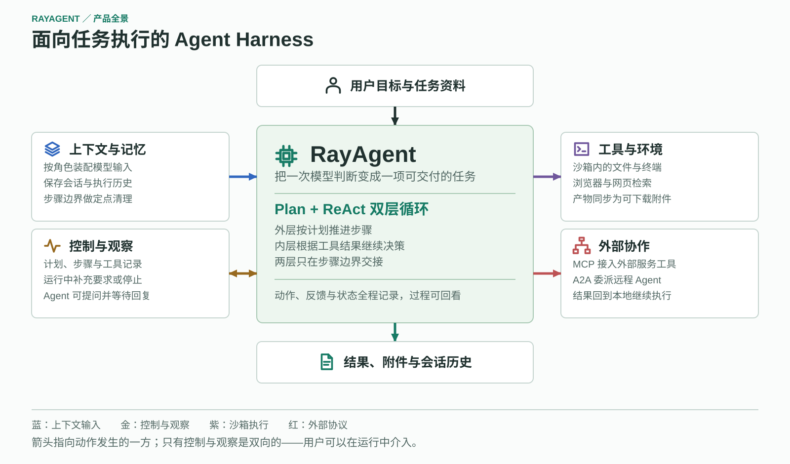

# RayAgent 产品说明

RayAgent 围绕会话组织任务：目标、输入资料、执行计划、工具记录和产物共同构成一次可查看的工作过程。本文说明用户在界面上能做什么、怎么判断任务是否真的完成。

本文只讲用户可见的部分，系统内部如何实现不在这里展开。

## 会话与任务

创建会话、发送目标、上传附件，也可以打开历史会话继续交流。上传的文件会同步到沙箱，作为任务可读取的输入。

Agent 收到目标后生成计划并逐步执行，根据每一步的结果调整剩余安排；页面同步展示步骤、消息和工具记录。执行过程中 Agent 可以发送进展通知，也可以向用户提问并等待回复。

运行中可以补充要求。补充的内容会在下一个事件交接点被读取，后续计划可能随之调整；正在执行的工具动作不会立刻中断，所以一个长时间运行的命令仍会跑完。

## 工具与执行环境

| 能力 | 已有操作 | 运行条件 |
|---|---|---|
| 文件 | 读取、写入、文本替换、内容搜索、文件查找 | 操作沙箱内文件；上传与交付依赖文件同步 |
| Shell | 执行命令、读取输出、等待进程、写入输入、终止进程 | 使用沙箱进程环境，权限和依赖取决于镜像 |
| 网页检索 | 按查询词检索并返回网页信息 | 需要搜索适配及目标站点可达 |
| 浏览器 | 导航、查看、点击、输入、按键、选择、滚动、脚本与控制台操作 | 需要沙箱浏览器可连接，目标页面可访问 |
| 用户交互 | 通知进展、提出问题并等待回复 | 由会话消息与任务输入承接 |

页面可以查看沙箱画面，文件、命令和浏览器操作都在这个执行环境中进行。环境按会话准备，动态创建与连接已有环境在配置上有差异。

页面上的工具记录面向用户观察，模型收到的工具结果是另一份内容；两者相关，但不是同一份完整数据。

## 外部工具与远程 Agent

MCP 把外部服务提供的工具接入任务。在设置中添加服务后，可以查看连接状态和发现到的工具，随后让 Agent 在任务中调用它们。

A2A 用于发现远程 Agent 并委派任务，支持提交后的状态查询和结果回传。远程工作的结果回到本地 Agent，参与后续执行。

两种协议都由本地 Plan + ReAct 使用。接入成功不代表支持协议的全部可选能力——需要多轮交互或额外授权的调用当前会按失败返回。

页面设置还可调整模型参数与服务地址。模型凭据与协议配置的填写位置和生效方式属于部署事项，不在本文展开。

## 观察、历史与交付

执行过程中页面持续展示消息、计划、步骤、工具及用量信息，刷新后仍可查看已保存的历史。模型生成期间可能暂时没有新内容，当前不逐字展示生成中的回答。

任务可以把指定的沙箱文件同步为消息附件。界面支持文件列表、适用格式的预览和下载，支持情况取决于文件类型。

## 怎么判断任务真的完成了

界面上的"结束"有几种不同含义，需要分开看：Agent 在等待回复、任务正常完成、执行失败、用户主动停止，都会让页面停止更新。当前的会话状态不区分"跑完了"和"被叫停了"，所以状态字段本身不足以判断结果。

建议按下面三步确认：

1. **看回复。** Agent 的总结说明了它认为做了什么，但这是它的陈述，不是证据。
2. **看工具记录。** 声称写入的文件是否有对应的工具调用记录，调用是否成功。
3. **看产物。** 需要取得成果时，确认消息里的附件能打开或下载。Agent 提到某个文件路径不等于交付完成。

还有几点值得提前知道：请求停止不会回滚已经产生的文件修改或外部副作用，也不保证沙箱里的子进程和远程任务同步结束；任务结束不会销毁沙箱；计划全部完成不等于目标达成，系统目前没有独立的成果验收机制，完整边界见[能力与边界](capabilities.md)。
