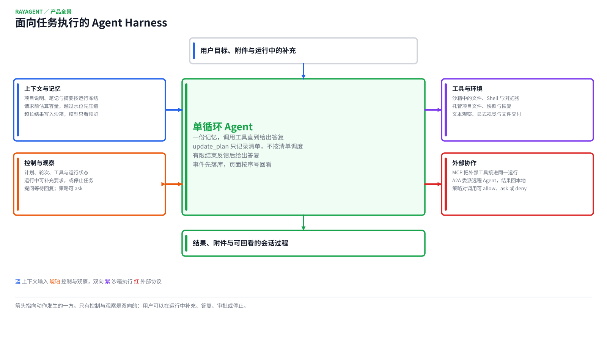

# RayAgent 产品说明

RayAgent 围绕会话组织任务：目标、输入资料、执行计划、工具记录和产物共同构成一次可查看的工作过程。本文说明用户在界面上能做什么、怎么判断任务是否真的完成。

*旧基线示意，W8 重绘：执行核心已由 Plan + ReAct 改为单循环 Agent，四组能力不变。*

本文只讲用户可见的部分，系统内部如何实现不在这里展开。

## 会话与任务

创建会话、发送目标、上传附件，也可以打开历史会话继续交流。上传的文件会同步到沙箱，作为任务可读取的输入。

Agent 收到目标后在同一个过程里调用工具、查看结果、决定下一步，直到给出最终回复。复杂任务会先列出计划清单，并在推进时更新各项状态，页面底部的任务进度显示这份清单；简单任务可能不列清单。调用工具前 Agent 可能附带一两句说明，作为进展旁白显示在消息流里。缺少必要信息时，Agent 会向用户提问并等待回复。

运行中可以补充要求。补充的内容会在当前这批工具动作结束后、Agent 下一次思考前读取；正在执行的工具动作不会中断，所以一个长时间运行的命令仍会跑完。

一次会话可以先后进行多次运行。运行过程中发送的内容进入当前这次运行；Agent 正在等你回复时，发送的是回答；这次运行结束后再发送，会开始新的一次运行。失败、停止或中断留下的过程留在会话记录里，再次发送相同内容不会把它们去掉。

## 工具与执行环境

| 能力 | 已有操作 | 运行条件 |
|---|---|---|
| 文件 | 读取、写入、文本替换、内容搜索、文件查找 | 操作沙箱内文件；写入的文件需经交付才成为附件 |
| Shell | 执行命令、读取输出、等待进程、写入输入、终止进程 | 使用沙箱进程环境，权限和依赖取决于镜像 |
| 网页检索 | 按查询词检索并返回网页信息 | 需要搜索适配及目标站点可达 |
| 浏览器 | 导航、查看、点击、输入、按键、选择、滚动、脚本与控制台操作 | 需要沙箱浏览器可连接，目标页面可访问 |
| 计划与交付 | 维护计划清单；把沙箱中的文件交付为消息附件 | 交付的文件必须已写入沙箱 |
| 用户交互 | 提出问题并等待回复 | 由会话消息与任务输入承接 |

页面可以查看沙箱画面，文件、命令和浏览器操作都在这个执行环境中进行。环境按会话准备，动态创建与连接已有环境在配置上有差异。

页面上的工具记录面向用户观察，模型收到的工具结果是另一份内容；两者相关，但不是同一份完整数据。

## 外部工具与远程 Agent

MCP 把外部服务提供的工具接入任务。在设置中添加服务后，可以查看连接状态和发现到的工具，随后让 Agent 在任务中调用它们。

A2A 用于发现远程 Agent 并委派任务，支持提交后的状态查询和结果回传。远程工作的结果回到本地 Agent，参与后续执行。

两种协议都由本地 Agent 循环作为工具使用。接入成功不代表支持协议的全部可选能力——需要多轮交互或额外授权的调用当前会按失败返回。

设置页分为通用、模型提供商、MCP 服务器和远程 Agent。通用设置与模型提供商保存在 API 的配置文件里，对所有会话生效；MCP 与远程 Agent 列表显示启用状态和配置摘要。工具策略分区已留出位置，内容尚未实现，当前工具调用不会在执行前询问。模型凭据的填写位置和生效方式属于部署事项，不在本文展开。

## 观察、历史与交付

执行过程中页面持续展示消息、计划清单、工具记录及用量信息。打开或刷新会话会先取回已保存的记录，再接上之后的新事件，已经看过的不会重复出现。用量来自每一轮结束时的记录。模型生成期间可能暂时没有新内容，当前不逐字展示生成中的回答。

Agent 通过交付工具把指定的沙箱文件上传为消息附件；只写入沙箱而没有交付的文件不会出现在附件里。界面支持文件列表、适用格式的预览和下载，支持情况取决于文件类型。

## 怎么判断任务真的完成了

界面上的"结束"有几种不同含义，需要分开看：Agent 在等待回复、任务正常完成、执行失败、用户主动停止、进程重启导致中断，都会让页面停止更新。会话状态分别是 waiting、completed、failed、cancelled、interrupted。completed 只表示循环正常结束，不表示目标达成。

建议按下面三步确认：

1. **看回复。** Agent 的最终回复说明了它认为做了什么，但这是它的陈述，不是证据。
2. **看工具记录。** 声称写入的文件是否有对应的工具调用记录，调用是否成功。
3. **看产物。** 需要取得成果时，确认消息里的附件能打开或下载。Agent 提到某个文件路径不等于交付完成。

还有几点值得提前知道：请求停止不会回滚已经产生的文件修改，也不保证远程任务同步结束；本次运行里已经启动的 Shell 会话会收到终止请求，但正在执行的那次工具调用可能没有完成记录。再次发送不会清掉上一次失败的工具记录和错误，刷新页面也不会把同一段过程显示两遍。任务结束不会销毁沙箱。API 重启后，当时还在运行的任务标为中断，等待回复的任务可以继续。计划清单全部勾选不等于目标达成，系统目前没有独立的成果验收机制，完整边界见[能力与边界](capabilities.md)。
