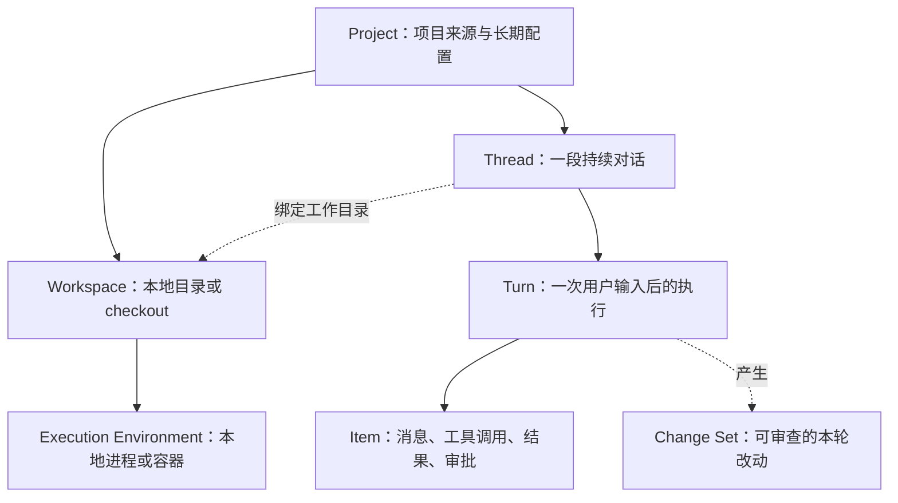

# RayAgent 向项目工作区 Agent 演进的初步调研

调研日期：2026-09-09。代码基线：RayAgent `a798654`；本机 learn-codex `bebbd85`。本文是方案评估，不表示已决定迁移或实现。现有架构以 [architecture.md](architecture.md) 为准，阶段进度仍只维护在 [PLAN.md](../PLAN.md)。

**建议：维持 RayAgent，围绕现有应用逐步学习和扩展工作区能力。当前没有证据表明二开成本高于独立重建；已有的循环、工具、协议、沙箱、存储与 UI 都有复用价值，也不需要先迁移 LangGraph。**

用户的路线标准是：只有当 RayAgent 的架构差距导致二开投入明显高于独立实现时，才考虑从零做 TS harness；全 TypeScript 并非必须目标。初稿把可接受的备选路线误当成技术栈偏好，现已据此修正建议。学习 harness 可以直接在现有 Python 实现上进行，不以重建产品为前提。

RayAgent 已经拥有“模型调用工具完成任务”的闭环。主要差距在于：让 Agent 长期、可靠、可审查地操作一个真实项目。添加项目列表和目录上传只解决入口，不能同时解决项目持久化、上下文、权限、修改归属和失败恢复。

## 1. 调研依据与边界

- **代码事实**：阅读主产品文档，沿路由后的应用服务、任务运行器、Plan/ReAct、模型适配、工具、沙箱、会话模型和 UI 事件入口核对；检索主产品是否存在工作区、补丁、审批、项目指令加载等实现。
- **教学参照**：浏览 learn-codex 01–28 的主题与方案，重点阅读 s01、s04、s05、s08、s09、s18、s20、s27 的实现或说明，以及 s28 的机制说明。不是逐行审计 28 章，也不是读取真实 Codex 全部源码。
- **官方核对**：阅读当前 OpenAI 的 app-server、sandbox、worktrees、AGENTS.md 文档，以及 LangChain/LangGraph 官方概览和持久化说明。外部信息可能更新，具体配置应再次以当时文档为准。
- **实际运行**：仅对当前 `ShellService` 做了一次无模型、无数据库的临时目录实验，结果见第 5 节。没有在本轮重跑 Compose、真实模型、MCP/A2A 或完整测试套件；既有验收记录见 PLAN。

下面明确标为“建议”“推断”“估算”的内容，不是当前代码已经具备的能力。对缺失项的判断限定为本次核对的主产品路径，不把 labs 或仓库里的教学文档算成产品功能。

## 2. Loop、自研、框架、harness 分别是什么

### 2.1 Agent Loop 是执行模式，不是一种框架

最小闭环是：给模型上下文和工具定义 → 模型返回工具调用 → 程序执行工具 → 把真实结果交回模型 → 模型继续行动或结束。

```text
用户目标与项目上下文
        ↓
      模型调用 ←────────────┐
        ↓                  │
  文本回复 / 工具调用        │
        ↓                  │
 校验参数与权限 → 执行工具 → 结果
        ↓
   本轮结束或等待输入
```

模型负责提出行动，程序负责执行、保存状态、提供边界与反馈。模型的“不再调用工具”只是结束本轮的常见信号，不自动证明用户任务已完成，更不证明代码正确；运行时仍需处理错误、拒绝、取消、预算耗尽和交付证据。

ReAct 描述推理与行动、观察交替的模式。它可以由原生 tool calling 实现，不要求解析可见的 `Thought/Action/Observation` 文本，也不意味着必须获取模型的完整内部思考。

### 2.2 RayAgent 的两层循环均由项目自己实现

| 位置 | 实际职责 |
|---|---|
| [BaseAgent.invoke](../ray_agent/api/app/domain/services/agents/base.py) | 工具调用解析、执行、结果回填、再次请求模型、迭代上限 |
| [PlannerReActFlow.invoke](../ray_agent/api/app/domain/services/flows/planner_react.py) | 规划、执行下一步、更新计划、总结的状态转换 |
| [OpenAILLM.invoke](../ray_agent/api/app/infrastructure/external/llm/openai_llm.py) | 通过 `AsyncOpenAI.chat.completions.create` 请求模型 |
| [pyproject.toml](../ray_agent/api/pyproject.toml) | 使用 OpenAI、MCP、A2A 等 SDK；没有声明 LangChain/LangGraph 驱动主循环 |

**“自研”表示控制流程由自己负责，不表示模型、HTTP 客户端、协议解析和数据库都要自己造。** 用 OpenAI SDK 不等于用 Agent 框架；使用 MCP/A2A SDK 也不改变 Loop 的归属。

### 2.3 三种实现方式的区别

假设任务是“修复分页错误，修改代码并跑测试”。三种方式都可以走“模型 → 工具 → 模型”，也都可以具有自主决策。

| 方式 | 你直接编写什么 | 依赖提供什么 | 你仍然必须负责什么 |
|---|---|---|---|
| 自研 Loop | 循环、状态转换、调度、错误与恢复策略 | 模型 SDK 和各类普通库 | 全部运行时契约及其测试 |
| LangChain Agent | 模型、工具、提示词、middleware 等配置与扩展 | 预制 Agent Loop、模型与工具抽象、生态集成 | 工作区产品、执行环境、业务状态、权限边界和评估 |
| LangGraph | State、节点、边、暂停点及恢复逻辑 | 编排运行时、checkpoint、流式事件、人工介入等机制 | 节点行为、持久化配置、外部副作用与项目资源管理 |

当前 LangChain 的 Agent 建立在 LangGraph 之上；LangGraph 也可以脱离 LangChain 的高层 Agent 使用。图中可以包含动态循环，并非只能执行固定流水线。以上能力定位依据 [LangChain 概览](https://docs.langchain.com/oss/python/langchain/overview) 和 [LangGraph 概览](https://docs.langchain.com/oss/python/langgraph/overview)。

LangGraph 保存的 checkpoint 是图状态；需要选用持久化后端，内存 checkpointer 不会跨进程重启保存。详见 [LangGraph 持久化](https://docs.langchain.com/oss/python/langgraph/persistence)。

工程上还要考虑这样的情况：工具已经修改文件或提交远程请求，但程序在保存结果前崩溃。重新执行节点可能重复副作用。因此，选择框架后仍需设计调用 ID、幂等性、结果确认、重放边界；保存消息不能自动解决这些问题。

**建议**：学习阶段先读懂并观察现有循环、状态与副作用；需要时补一个独立小实验。以后确实需要复杂分支、暂停恢复、并行汇合时，再用同一个任务做 LangGraph 对照实验。不要以“是否引入框架”衡量现代化程度。

### 2.4 Harness 比 Loop 大很多

本文将 harness 定义为：围绕模型运行、使它能持续完成实际任务的工程系统。包括工具契约、执行环境、权限、上下文组装与压缩、会话与执行状态、取消、长进程、错误处理、日志及评估。

RayAgent 已经有一套初步 harness：工具注册、沙箱、记忆、事件、任务协调和协议适配都是其中一部分。它不缺少“Agent 的本质”，而是尚未针对长期项目协作补齐这些机制。

模型能力非常重要，但有效输入、工具反馈质量和恢复策略会改变最终成功率。教学资料里“智能来自模型”的表述有助于划分职责，不宜理解为外围工程不会影响任务表现。

## 3. RayAgent 与 Codex 风格执行方式的关键区别

### 3.1 当前 Plan + ReAct 的行为

```text
创建计划
   ↓
取下一步 → ReAct 多轮工具调用 → 压缩执行记忆 → Planner 更新计划
   ↑                                             │
   └─────────────────────────────────────────────┘
没有下一步 → 总结 → 本轮结束
```

代码事实：`PlannerAgent` 和 `ReActAgent` 使用不同名称保存记忆；Planner 的 `tool_choice="none"`，从用户目标与步骤结果创建、更新结构化计划。外层流程在每个步骤后调用 Planner，执行器从工具反馈推进当前步骤。

推断：这种结构有利于把研究、资料搜集、报告交付等任务呈现为明确步骤；对“先读仓库再发现真正问题”的编程任务，也可以工作，但预先规划、逐步更新及 JSON 结果解析会增加交互成本和出错点。是否降低实际成功率需要同模型对照实验，不能仅从结构断言。

### 3.2 计划可以作为工具，而不必永远是另一层调度器

learn-codex 的 s05 演示了另一种策略：同一主 Agent 用 `update_plan` 保存并展示计划，用 Shell、文件等工具执行；模型根据反馈决定下一步需要读代码、改计划还是跑测试。两种方式的区别是“谁决定推进节奏”，不是“有没有规划”。

**建议**：保留现有 Flow 作基线。两种规划方式没有脱离场景的优劣；若后续具体任务表明有比较必要，可在 RayAgent 中实现可切换的 coding flow 做对照。改变编排策略不要求重写整个产品，本次调研不替换主循环。

### 3.3 API 形态不决定产品层级

RayAgent 当前使用非流式 Chat Completions，learn-codex 示例使用 Responses items。二者都能实现工具反馈循环。选哪种 API，应根据目标模型的工具调用、流式输出、推理项和上下文处理能力适配；把接口换成 Responses 不会自动得到 Codex。

代码事实：RayAgent 给 UI 发的是业务事件流；模型适配没有逐 token 流式返回，且设置 `parallel_tool_calls=False`，BaseAgent 也只保留第一条工具调用。这与“UI 使用 SSE”是两个不同层面的能力。

## 4. 项目工作区需要先成为独立的业务对象

当前 [Session](../ray_agent/api/app/domain/models/session.py) 直接关联 `sandbox_id`、`task_id`、附件、事件与两份 Agent 记忆，没有独立 Project/Workspace 领域实体。附件被 [AgentTaskRunner](../ray_agent/api/app/domain/services/agent_task_runner.py) 放入 `/home/ubuntu/upload/`，这套文件同步以会话附件和交付产物为中心。

这里的“会话级”不等于“一次用户输入”：现有会话可以多轮交互并持久化记忆，执行任务实例则具有自己的生命周期。缺少的是上层项目/工作区归属和跨会话协作契约。扩展时也不应把所有聊天历史合并成项目共享上下文；项目共享代码、规则和经选择的知识，会话继续保留独立目标与消息，执行轮次管理自己的运行状态。

建议的最小关系如下。这里 Workspace 指一个具体可操作目录，而 Project 指用户登记的长期项目。



这个划分解决几个具体问题：同一项目可以有多段对话；对话结束不删除项目；容器重建不丢代码；同一对话有多次执行；停止一次执行不等于会话永远结束；并行对话可以绑定不同 worktree。删除对话、删除工作区、删除原始项目必须具有不同语义。

这是一份建议模型，不是对 Codex 私有数据模型的描述。官方 app-server 公开了 thread/turn/item 及会话续接、事件等接口，可以借鉴其服务边界。见 [Codex App Server](https://learn.chatgpt.com/docs/app-server)。

“导入”还需要区分来源：

| 来源 | 实际含义 | 建议 |
|---|---|---|
| 本机目录 | Agent 直接或经 worktree 操作该目录 | 面向个人编程，优先选这一种；Web UI 连接本机运行服务 |
| Git URL | 在运行端 clone 一个受管理 checkout | 面向远程/云端产品；明确分支、凭据、依赖准备与改动交回 |
| ZIP / 目录上传 | 上传时刻的文件副本 | 可作导入方式，但后续编辑不会自动同步用户原目录 |

普通网页选中目录并上传文件，不等于云服务器获得持续操作本机原目录的能力。若希望像本地开发工具一样工作，需要本机 Agent 服务、桌面宿主或明确的文件同步机制。建议第一版只选一种导入方式；复用现有沙箱管理 Git checkout 与直接操作本机目录的成本不同，应在明确使用场景后确定。非 Git 目录可后续增加快照支持。

## 5. 差距清单：按用户能否放心使用排序

“已有基础”只表示相关代码存在，不等于本次完成了端到端验收。

| 能力 | 当前代码事实 | 到个人工作区 Agent 还缺什么 | 优先级建议 |
|---|---|---|---|
| 项目与工作区 | Session 关联沙箱及附件 | Project/Workspace、根目录、来源、跨对话复用、独立生命周期 | 首批 |
| 读写与检索 | 读文件、写文件、字符串替换、单文件搜索、glob、Shell | 项目内搜索约定、路径范围、忽略规则、补丁前置检查 | 首批 |
| 代码交付 | 文件预览与附件交付 | Git 基线、diff、未跟踪文件、用户已有修改保护、改动归属 | 首批 |
| 工具安全 | Docker 执行环境；有问用户工具 | 运行时强制权限、统一审批记录、Shell 与外部工具的边界 | 首批 |
| 项目上下文 | 固定系统提示词与会话记忆 | 项目规则发现、按需读代码、预算、结构化压缩摘要 | 首批 |
| 执行控制 | 进程内 Task、停止入口、输入队列、等待用户 | 明确 Turn 状态、中断结果、进程取消传递、重启后状态协调 | 首批至第二批 |
| 长进程与终端 | exec/read/write/wait/kill 接口 | 修复等待路径、增量输出、句柄生命周期，必要时加入 PTY | 首批至第二批 |
| UI 与协议 | HTTP/SSE、实时/历史事件、计划与工具组件 | 项目切换、文件树、diff、审批、终端；模型流式输出 | 首批至第二批 |
| 上下文续航 | 每步调用 compact；存储消息 | token 预算、长输出外存、摘要与原始历史分离、同一长 turn 的压缩 | 第二批 |
| 运行恢复 | PostgreSQL 保存历史；Redis 传递消息 | 持久执行记录、checkpoint、未知结果核实、防重复副作用 | 第二批 |
| 工程评估 | 核心/协议测试及既有页面验收 | 固定代码任务集、成功率、耗时/token、失败原因、轨迹回放 | 从首批开始 |
| MCP | 发现、名称映射、调用、结果及资源清理 | 工作区配置/凭据范围、执行位置、按需工具暴露 | 可后置 |
| A2A | 远程 Agent 发现、委派、状态轮询和取消适配 | 仅在真实跨服务协作需求下继续扩展 | 后置 |
| 内置浏览器 | Playwright/CDP、截图和 noVNC 展示 | 按需启动、预览端口路由、与代码工作区一致的环境 | 做前端验证时加入 |
| 本地子 Agent | Planner/Executor 角色分工；A2A 远程委派 | 独立上下文、父子生命周期、取消、预算、结果汇总、worktree | 后置 |

### 5.1 压缩不只是删掉浏览器输出

[Memory.compact](../ray_agent/api/app/domain/models/memory.py) 将 `browser_view` / `browser_navigate` 的结果设为 `(removed)`，并删除 `reasoning_content`；没有按 token 水位汇总历史、保留目标约束与未完成工作。这种压缩对长代码任务不够，Shell 和文件内容仍会持续累积。

建议区分：不可变原始轨迹、提供给下一次模型请求的工作上下文、跨会话项目知识。压缩的是模型工作上下文，不能为了省 token 一并丢掉审查和恢复依据。扩展后的摘要应保留用户目标、约束、文件与修改、验证结果、当前失败和待办，并保持工具调用与结果配对。

### 5.2 消息持久化与可靠执行是两件事

[RedisStreamTask](../ray_agent/api/app/infrastructure/external/task/redis_stream_task.py) 通过类级字典 `_task_registry` 保存实例，实际执行是 `asyncio.create_task()`。进程退出后这个对象消失；数据库里的 task_id 不会自动恢复执行。

建议第一版先保证：重启后能读取历史、检测未结束 Turn、标为中断并允许显式续接。之后再增加更复杂的自动恢复。文件变更、模型历史、进程状态、远程调用结果应分别核实；不要在恢复时直接重放所有写操作。

### 5.3 Shell 后台执行存在已复现的等待问题

[ShellService.exec_command](../ray_agent/sandbox/app/services/shell.py) 第 237、266 行对 `_start_output_reader` 创建的 Task 直接 `await`；读取器持续读取直到 stdout EOF，随后才进入注释中“最多等 5 秒”的逻辑。

本轮实际验证：在本机 macOS，以 API 已有虚拟环境解释器导入沙箱 `ShellService`，在临时目录执行 `sleep 6`；约 **6.02 秒**后返回 `status=completed`、`returncode=0`，没有在 5 秒返回 `running`。测试进程自然结束，临时目录自动清理。没有经 Docker、HTTP 或浏览器测试此路径。

这验证了该输入下提前返回机制未生效。推断：持续保持 stdout 打开的开发服务器可能一直占据本次调用。应先管理输出读取器的独立生命周期，再验证执行句柄、日志分页、取消及子进程回收；拥有 read/wait/kill 接口本身并不保证这些行为正确。

### 5.4 容器、工作区隔离、审批是不同机制

[DockerSandbox](../ray_agent/api/app/infrastructure/external/sandbox/docker_sandbox.py) 动态创建配置中没有项目卷绑定，且设置自动移除；它不能充当长期项目的唯一存储。固定 `SANDBOX_ADDRESS` 路径又可能让多个会话接入同一个已有环境，不能默认认为每会话天然隔离。

代码还存在需要单独验证的资源归属问题：已有地址的 `create()` 不填 `container_name`，但 `get(id)` 会填入；`destroy()` 按是否有该字段决定尝试删除容器。这与文档里“已有容器不由适配对象删除”的意图并不完全一致。本轮没有执行容器销毁，应在扩展前建立显式 ownership 并测试，而不是照文档假设它安全。

对真实本地项目，限制 `cwd` 只决定相对路径起点；Shell 仍能访问它有权限访问的其他路径。只检查文件工具的路径，也不能限制 Shell。Git worktree 主要隔离工作副本，不提供进程和网络安全隔离。审批则决定某个动作是否需人授权，两者要协同。

官方将 sandbox 和审批作为不同控制，且 sandbox 约束要作用于派生出的命令。见 [Sandbox](https://learn.chatgpt.com/docs/sandboxing)。worktree 的本地项目隔离用途见 [Worktrees](https://learn.chatgpt.com/docs/environments/git-worktrees)。

### 5.5 现有提示词也需要重新定位

[SYSTEM_PROMPT](../ray_agent/api/app/domain/services/prompts/system.py) 面向资料搜集和长文交付，包含长篇写作要求、自动确认命令建议及固定沙箱环境描述。这些规则适配当前产品取向，不应原样迁入长期代码协作。

当前主产品没有发现自动加载项目 AGENTS.md / SKILL.md 的运行路径。仓库根存在给开发助手使用的 AGENTS.md，不等于 RayAgent 产品自己的模型会读取它。扩展时应把系统约定、项目规则、用户指令、检索到的普通内容按来源区分；技能按需加载，并且不能靠提示词授予执行权限。官方项目指令机制可参考 [AGENTS.md](https://learn.chatgpt.com/docs/agent-configuration/agents-md)。

## 6. 沙箱、浏览器、MCP、A2A 是否符合方向

**总体符合，但要调整资源归属与优先级。**

- **沙箱**：适合在远端 checkout 中安装依赖、跑测试、启动预览。建议将持久工作区与可重建执行环境分开；本地产品则需要本机执行适配及实际可执行的权限边界。Docker 可以继续用，全 TS 不意味着把容器、Git 或 OS 隔离设施也重写一遍。
- **浏览器**：对前端页面验证和资料查阅有价值。目前 `_create_task()` 先准备 browser，运行器又检查完整沙箱服务；建议按工具需求初始化，让代码问答、文件修改不必依赖浏览器就绪。云端预览还需要解决工作区服务地址、端口和浏览器所在网络的关系。
- **MCP**：保留为外部能力适配层。当前 stdio MCP 由 API 进程侧启动，并合并进程环境，不是自动运行于会话沙箱；文件系统型 MCP 的根目录和凭据范围必须显式绑定。接了 MCP 并不会自动获得项目索引、权限或隔离。
- **A2A**：适用于委派给独立部署的远程 Agent。它不自动共享本地文件系统，也不等于本地子 Agent 调度；共同编辑仓库仍需传递 repo/ref、工作区或补丁等显式契约。个人编码 MVP 暂时可以没有 A2A。

Planner 与 Executor 的角色分工、同进程子 Agent、A2A 远程委派是三种不同关系。只有前者或接通后者，都不能直接认定已经拥有完整多 Agent 工程能力。

## 7. 三条路线与选择依据

| 路线 | 最适合的目标 | 可复用部分 | 主要成本 | 本次建议 |
|---|---|---|---|---|
| A：RayAgent 继续 Python 二开 | 在现有项目上学习 harness，并逐步支持项目协作 | FastAPI 分层、模型/协议适配、沙箱、会话、UI | 增加工作区模型，改文件持久化与执行控制；按需评估 coding flow | **推荐，当前采用的演进方向** |
| B：独立 TS harness | 已有证据表明重建总成本低于二开 | 设计经验、工具/事件契约、测试场景；部分 UI 可迁移 | 重新实现并验证运行时、协议和产品闭环；Python 业务代码不能直接复用 | 保留备选，当前未满足重建条件 |
| C：TS 产品 + Codex app-server | 快速体验高能力工作区产品、专注交互 | 现成 Codex 引擎及公开协议 | 运行时依赖 Codex，内核控制与亲手实现的练习减少 | 作为对照原型 |

路线 C 有公开官方入口：app-server 用于富客户端集成，包含认证、历史、审批和事件等接口；但当前文档也标注实验性及传输限制，评估时应固定版本，不直接假设为稳定的生产服务。该路线的产品外层可以写 TS，底层并不是你从零写的 TS harness。依据：[Codex App Server](https://learn.chatgpt.com/docs/app-server)。

**Python 不构成能力上限。** 两种语言都能实现上述设计。TS 的类型共享和 Node 工具链可以作为选型因素，但不是当前重建的理由。改语言不会自动解决状态、权限和恢复；学习这些机制也不要求换语言。

应以相同功能范围和质量标准比较二开与重建：工作区、改动保护、恢复和评估，两条路线都要做；重建还需重新实现与验证已有资产。当前差距能沿现有分层逐步处理，没有发现必须推倒重来的结构性障碍。后续若具体功能试验暴露出大量不可复用的耦合，再重新估算，而不是仅凭与 Codex 的形态差异决定重建。

## 8. RayAgent 渐进扩展的候选边界

先面向单用户、一个导入方式、一个工作区同时一个写入中的 Turn，沿用现有 Web UI。本机目录还是沙箱中的 Git checkout，待产品规格确定，不把本机服务或 CLI 当成已选需求。单写限制也要考虑用户编辑器的并发修改，补丁应用前仍检查文件是否变化。并行工作区、云端多租户、IDE 全量能力、插件市场和自动协作暂时后置。

```text
现有 Web UI
     ↓  类型化请求与事件
现有 API / Agent 服务逐步扩展
     ├─ Project / Workspace / Thread / Turn
     ├─ Context：项目规则、按需读取、摘要与预算
     ├─ Flow / Loop：保留 Plan + ReAct，按需比较其他策略
     ├─ Tool Runtime：参数校验、权限、执行、取消
     ├─ Store：事件、调用记录、会话索引
     └─ ExecutionAdapter
          ├─ Container：复用现有沙箱，补工作区持久化与归属
          └─ Local：仅在确定直接操作本机项目时增加
```

复用已有文件、搜索和 Shell 工具，优先补项目内检索、补丁与 diff，并修复进程执行和取消语义；`update_plan` 仅在比较另一种编排策略时考虑。Git status/diff 初期可封装 CLI，不必先设计一个庞大的 Git 工具系统；仓库检索先用文件树、ripgrep 和按需读取，不必立即上向量库或 LSP。

沿用现有 API 分层、PostgreSQL、Redis 和 UI 事件链路，无需为了扩展工作区同时替换存储或拆分更多服务。逐步为事件增加明确的会话、执行轮次和工具调用归属及顺序，支持 UI 重连去重补齐；具体字段与迁移另行设计。

补丁工具要考虑匹配失败、用户同期修改和部分应用失败；展示 diff 要包含新增文件，并区分用户原有修改。`git diff` 能看到差异，但不会自动告诉你哪部分是 Agent 写的；会话分叉也不会自动复制文件状态。这些契约比选哪个 Web 框架更关键。

| 建设顺序 | 交付闭环 | 验收条件 |
|---|---|---|
| 1：现有闭环观察 | 在当前沙箱内指定临时仓库，真实模型读、改、测、给出 diff | 能定位一个已知错误并修复；测试确实运行，改动可检查；记录现有限制 |
| 2：工作区扩展 | 导入/登记项目、多对话、项目规则、持久历史、UI 入口 | 重新打开对话仍绑定同一目录；删除对话不删项目；已有修改保留 |
| 3：执行可靠性 | 取消、长进程、压缩、执行记录、审批 | 停止后子进程状态明确；重启后无静默重放写操作；压缩后不丢约束 |
| 4：按需要扩展 | worktree、浏览器预览、MCP、本地子 Agent | 并行任务修改不互相覆盖；扩展工具遵守相同工作区与权限契约 |

### 工作量粗估

以下保留初步规划区间，不是代码量测量、同范围原型对照或交付承诺，也不足以单独证明某条路线成本更低：假设一名熟悉所选技术栈的开发者全职投入，允许 AI 协助，单用户、一个 OS、一个模型提供方、一个导入方式，不做完整编辑器和云端多租户。具体规格确定后应重新拆分估算。

- RayAgent 二开至“Git 项目导入 → 对话修改 → 测试 → diff”的受限 MVP：约 **2–4 周**。
- 独立 TS 内核做到类似的个人 MVP：约 **4–8 周**；最小命令行闭环会早得多，但不等于已完成可日常使用的产品。
- 两条路线若继续补齐上下文续航、取消、进程管理、审批、崩溃协调和固定任务集回归，均应另预留 **1–3 个月**迭代；学习时间、兼容平台和沙箱要求可能使范围明显扩大。

不适合给“距离 Codex 还有百分之多少”的数字：产品边界和质量标准并未完全确定。当前已经具备 Agent 执行原型；可靠的工作区协作需要上表多条纵向能力共同完成，不能按 MCP/A2A/浏览器等模块数量换算完成度。

## 9. 如何使用 learn-codex 学习，而不把示例误当成产品

建议结合 RayAgent 的真实行为阅读，优先顺序为：

| 主题 | learn-codex | 对照 RayAgent / 练习目标 |
|---|---|---|
| 循环与工具 | s01、s02 | BaseAgent、BaseTool、OpenAILLM；画出一次工具调用的输入输出 |
| 计划策略 | s05 | PlannerReActFlow；比较外层计划执行与计划工具 |
| 工作区边界 | s03、s04、s18、s28 | DockerSandbox、ShellService；区分授权、隔离、worktree |
| 上下文与会话 | s08、s09、s10 | Memory、Session、固定 prompts；区分历史、上下文、项目规则 |
| 错误与长任务 | s11、s13 | BaseAgent 重试、RedisStreamTask、Shell 输出；复现并解释失败 |
| 服务与扩展 | s19、s20、s27 | MCPTool、AgentService、SSE；理解内核与产品入口的边界 |
| 后续专题 | s06、s07、s12、s14–s17、s21–s26 | 按实际产品需要学习子 Agent、技能、协作、自动化和产品接口 |

本机资料入口为 `/Users/lrq/work/learn-codex/README-zh.md`；章节实际是它下面并列的 s01–s28 目录，不全在 s01 中。

具体要注意三处教学简化：

1. s04 的代码明确说明是用户态路径检查和命令启发式，不是实际 OS 强制隔离；不能把它作为执行任意项目命令的安全边界。资料中的平台实现细节也可能过期，例如当前官方 Linux 说明包含 bubblewrap，不能只记一个 Landlock 名称。
2. s18 可以帮助理解独立 checkout，但“这就等同 Codex Cloud 内部实现”的泛化不成立。本文只确认公开 worktree 行为，不据此推断云端私有实现。
3. s20/s27 的组合与服务类适合观察机制挂载点；离线脚本模型成功、内存会话能查到或日志能读回，都不能证明真实模型表现、重启续跑和重复副作用已处理。

学习时可以用离线 demo 确认程序控制流，再用真实模型和固定仓库任务衡量效果。建议固定一组小任务：解释模块、修复失败测试、跨文件小修改、读取项目规则、运行长测试并取消、压缩后续做、重启后续接、保护用户未提交修改。记录 diff、测试结果、失败分类、耗时和 token，避免只凭某一次回答看起来聪明就决定路线。

建议下一项观察围绕 RayAgent 现有 Plan + ReAct 完成“临时 Git 仓库里的读→改→测→diff”，理解经过哪些层以及限制出现在哪里；再确定工作区扩展规格。单 Agent 方案作为以后按需比较的独立实验，不是二开的先决条件。当前无需为这次调研调整执行计划的阶段状态。
