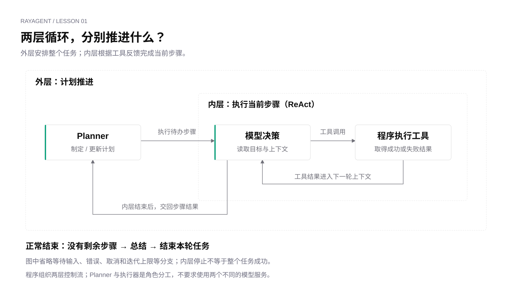
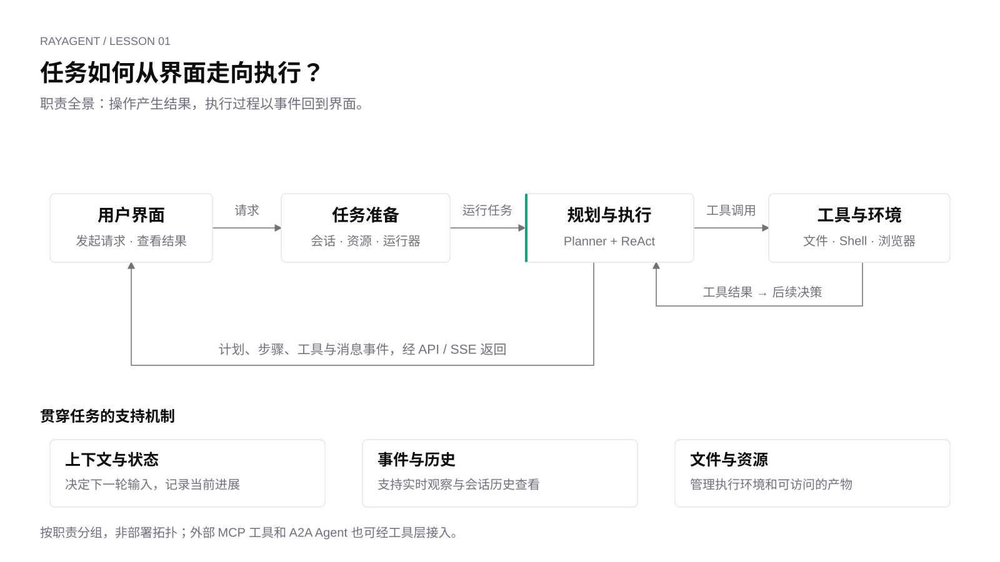

# 认识 RayAgent：从一句请求到任务完成

假设你向 RayAgent 发出一条请求：

> 在沙箱工作目录创建 hello.txt，写入 hello，再读取文件，告诉我里面是什么。

这句话很短，却包含几个不同的问题：系统怎样理解目标？谁真正创建文件？写入失败后怎么办？页面上的计划和工具记录从哪里来？最后一句“已经完成”，又依据什么？

本章沿着这条请求，理解 RayAgent 如何把目标变成行动，再根据执行结果继续推进。无需启动服务，我们先看清整个过程。

下面用一条可能的执行过程说明机制；计划如何拆分、工具调用几次，取决于模型响应和执行结果。

## 从回答走向行动

如果模型只返回“文件已创建，内容是 hello”，我们得到的是一段文本。要完成请求，系统还需要让某个程序真正写文件，并取得执行结果。

在 Agent 系统中，可以先把这件事分成三种职责：

| 职责 | 在文件任务中做什么 | 产生什么 |
|---|---|---|
| 模型决策 | 根据目标与已有信息，提出写入或读取操作 | 工具调用请求，或文本结果 |
| 程序执行 | 解析调用、找到工具，把操作交给执行环境 | 成功、失败、文件内容等执行结果 |
| 流程控制 | 把结果带入下一次决策，决定是否继续、等待或结束 | 下一轮执行及任务状态变化 |

模型提出“写入文件”的工具调用，不等于它直接访问了磁盘。工具调用是一份交给程序的操作请求；程序执行以后，结果才成为模型下一步可以使用的信息。

例如，读取返回 `hello`，模型便有了确认内容的依据；读取返回“文件不存在”，下一步的依据就变了。此时系统需要把错误带回决策过程，而不是照着原先的说法继续宣称成功。

**让行动产生反馈，再让反馈影响后续行动，是理解 Agent 的起点。**

## 让工具结果进入下一次决策

先暂时拿掉界面、数据库和规划层，只看最小执行过程：

1. 把目标、上下文和可用工具交给模型。
2. 如果模型请求调用工具，程序执行它。
3. 把工具结果加入上下文，再次请求模型。
4. 继续处理新的调用，或结束本次执行。

这就是本课程所说的工具反馈循环。它描述的是一种控制结构，可以用普通函数和循环实现，也可以借助框架组织；框架名称本身并不能说明反馈和停止是如何处理的。

对于文件任务，可能先请求写入，再根据结果请求读取，最后生成回答。也可能在某一轮请求多个工具，或者在失败后尝试其他操作。关键不在于固定调用顺序，而在于**下一次决策能够看到此前执行的结果**。

还有一种很容易混淆的循环：终端不断等待用户输入，每收到一句就回答一次。那是用户交互循环。如果程序执行一次工具后就强制生成最终回答，它仍不能展示多轮自主执行。判断它是不是工具反馈循环，要看执行结果是否真的参与了下一轮决策。

循环也必须有边界。模型不再请求工具、执行达到上限、出现错误或需要用户补充信息，都可能改变执行方向。具体系统如何处理这些情况，需要看实现，不能从“有一个循环”推导出“它会可靠地一直做完”。

## 两层循环，回答两个问题

RayAgent 在工具反馈循环之外，又安排了一层计划推进。

内层回答的是：**当前这一步怎样完成？**

外层回答的是：**整个任务接下来做哪一步？**

负责规划的角色称为 Planner，负责推进当前步骤的角色称为执行器；产品里这个执行器是 ReAct Agent。所谓“理解目标”，发生在这次规划调用中：Planner 根据用户请求提出可推进的计划，并不是另有一套独立的理解模块。对文件任务而言，Planner 可以把目标拆成“创建文件”和“读取确认”。执行器拿到其中一步后，再决定使用什么工具、如何处理返回结果。

当前步骤成功结束后，外层把计划与步骤结果交回 Planner，更新后续安排。如果这一步失败，本轮任务会停在这里，而不是自动改写计划再往下走；用户可以在同一会话里再发消息重试。

这意味着，一个计划步骤不必对应一次工具调用。“整理一个目录”可能需要列出文件、读取内容、执行命令等多次操作。反过来，也不能认定“写入”和“读取”必然会被拆成两个计划步骤；这个拆分只是本章便于理解的例子。

图中画的是步骤成功后的正常推进路径。内层交回步骤结果，外层更新计划后继续选取待执行步骤；没有剩余步骤时进入总结。等待输入、错误和取消没有全部画入图中，它们会中断或改变这条路径。

这里的 Planner 和执行器是程序中的两个 Agent 角色，并不要求使用两个不同的模型服务。它们可以使用同一个模型服务，只是收到的任务说明和上下文不同：一个安排任务，一个处理当前步骤。何时调用哪个角色、何时交回结果，由程序组织。

两层循环给复杂任务提供了“任务安排”和“局部执行”的分工，但也增加了计划更新等模型调用。它是一种设计选择。是否需要独立 Planner，要看任务是否受益于这种分工，不能仅凭层数判断优劣。

## 围绕循环，系统还要做什么

即使上述循环已经能够完成文件操作，它距离一个 Web 产品仍有一段距离。

用户需要知道任务有没有开始，文件需要有明确的执行位置，工具结果需要传回来，页面刷新后还应能查看历史。RayAgent 围绕核心循环安排了一组运行机制：

图按职责分组，不是部署拓扑。任务准备、流程与工具适配主要在 API 一侧；实际文件操作发生在沙箱中。外部能力也不都运行在沙箱里。

沿文件任务看，这些职责分别解决了什么问题？

**先让请求成为可执行的任务。** 用户在会话里发送消息后，服务端需要接住它，准备执行资源，再启动规划与执行过程。这样，用户的一句话才成为有运行状态、能够被观察和控制的任务。

**给操作一个真实的执行位置。** 文件工具把写入、读取请求交给沙箱接口。这里的 hello.txt 属于沙箱执行环境，不能因为用户通过本机浏览器发出请求，就认为它写到了本机项目目录。理解操作时，需要同时确认“做什么”和“在哪里做”。

**把执行过程变成可观察的信息。** 开始执行某一步、准备调用工具、工具返回、生成消息，这些变化会形成事件。服务端持续把这些事件送到页面，前端据此更新计划和时间线；事件也会保存到会话中，供以后查看。图中的 SSE，就是这种持续向页面发送事件的连接方式。

因此，页面上的工具记录并非只能靠解析模型的一段自然语言来猜测。系统有专门的事件表达“哪个工具被调用了、返回了什么”。模型逐字生成一段回答，与系统报告“工具开始执行”“工具已经返回”，表达的是不同层次的信息。

**让信息具有合适的生命周期。** 模型下一次请求需要上下文，页面重新打开需要会话历史，文件需要存储与访问方式。这些信息不能一概叫作“记忆”：它们的使用者、保存位置和存活时间不同。例如，模型需要看到刚才读取出的内容，页面需要保存这次读取的记录，而用户还可能需要稍后下载文件。三者关联，却承担不同用途。

保存了历史，也不等于能够自动恢复执行。假设系统在写完文件、尚未读取时停止，重新打开页面看到了“写入完成”，只能证明记录还在。要接着读取，系统还需要知道从哪一步继续、文件是否仍然存在，以及能否安全地重做此前操作。这是恢复执行要额外解决的问题。

本课程把围绕模型、支持它持续完成任务的这组运行机制称为 **harness**：它包括如何组织上下文与控制流、连接工具和执行环境、记录状态、提供观察与验证。这里用这个词描述工程职责，不把它当作某个特定框架。Agent Loop 是其中的核心控制机制，整个产品还必须处理循环周围的问题。

## 外部能力如何进入任务链

当任务从读写文件扩展到浏览网页、访问外部工具或委托远程 Agent，核心问题仍然相似：如何发出操作、取得结果，再让结果进入后续决策？

RayAgent 的内置文件、Shell 和浏览器工具提供执行能力。MCP 用于接入外部工具，A2A 用于接入远程 Agent；当前产品把这两类外部调用接入已有工具层。它们扩展可调用的能力，主执行流程仍由 Plan + ReAct 组织。

把外部调用放回任务链，就能提出具体问题：工具在哪里被发现，结果怎样返回，连接何时关闭，远程失败怎样影响当前任务。协议的作用也因此有了位置。

## 怎样判断任务真的完成了

一次工具调用返回了、一个步骤结束了、整轮任务停止了、用户目标达成了，是不同的判断。

例如，读取工具可以返回“文件不存在”。调用有了结果，但用户要求的内容还没有读到。即使页面不再更新，也可能是任务遇到错误而停止，不能据此认定目标已经实现。

对本章的请求，验证仍然很具体：是否发生真实写入？随后读取到了什么？是否符合用户要求？模型的一句“完成了”需要这些执行结果作为依据。

反馈循环让系统有机会根据事实继续行动，状态和事件让人看见过程，而验证负责判断结果是否满足目标。理解这几者的分工，才能看清一个 Agent 产品真正承担了哪些工作。

## 从整条链路看向第一个接口

独立脚本会让单层机制更容易被看见；完整产品还会多出状态、资源和交互问题。下一章从这条链路的第一个具体接口开始：**程序怎样把信息交给模型，又怎样理解模型返回的内容？**

[课程目录](README.md) · [下一章：与模型交互](02-model-interaction.md)
