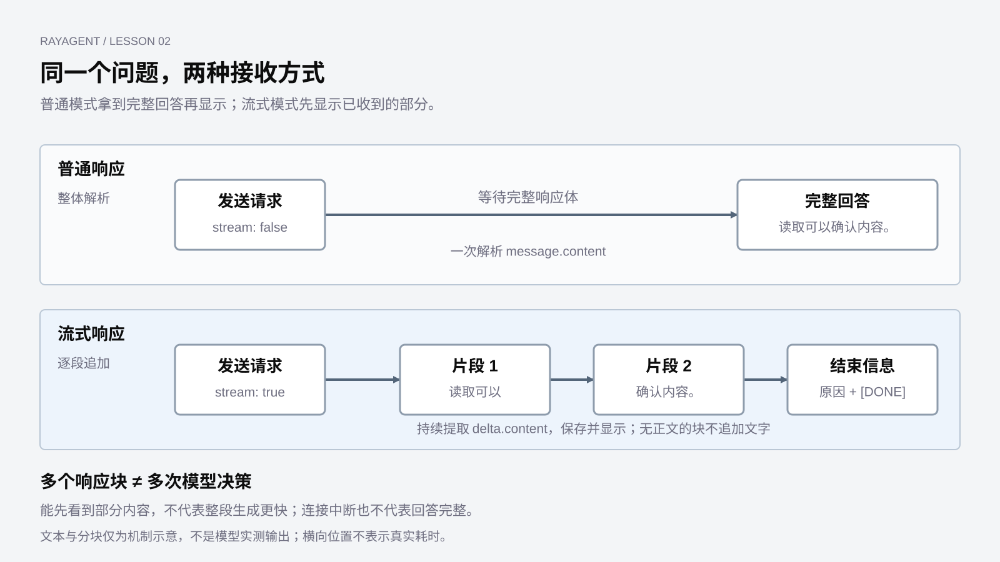

# 与模型交互

上一章中，Agent 会根据目标和工具结果决定下一步。但程序并不能直接把一句话“放进模型脑中”。它需要构造请求，发送给模型服务，再理解返回的数据。

Harness 在这一层承担模型交互的适配职责：把任务信息构造成请求，将响应还原成后续流程可使用的结果，并识别不完整或失败的交互。以下用一种具体接口观察这些职责；其他接口的字段和会话管理方式可能不同。

本章用 labs 中的独立脚本观察 **OpenAI 兼容的 Chat Completions**，不必启动 RayAgent。产品使用同一类客户端，不是本章实验脚本。地址、模型和密钥从 `LLM_API_KEY`、`LLM_MODEL_NAME`、`LLM_BASE_URL` 读取，可与 `ray_agent/.env` 使用同一组。Anthropic Messages 是另一套接口形状，当前产品不走那条客户端。

读结构即可跟上；要运行脚本，条件和命令见[基础实验运行指南](../labs/foundations/README.md#模型交互对照)。未配置真实模型密钥时，外部调用为 `unverified`，正文与图中的回答都是示意。

先把文件任务缩小成一个问题：

> 请用一句话说明：为什么写入文件后还要读取确认？

这次只让模型解释理由，不要求它操作文件。我们用这个输入观察一次交互：问题怎样进入请求，回答从哪里取出，以及为什么同一个回答可以等到最后一起显示，也可以逐段显示。

## 模型收到的是一份请求

在聊天界面里，我们看到一个输入框；在程序里，一次调用至少需要表达三件事：请求交给哪个服务、使用哪个模型、让模型读取哪些消息。

本章以 OpenAI 兼容的 Chat Completions 为例。下面是一份简化的请求正文，省略了服务地址和鉴权信息。`model` 写成占位，脚本运行时使用 `.env` 里的 `LLM_MODEL_NAME`：

```json
{
  "model": "your-model",
  "messages": [
    {"role": "user", "content": "请用一句话说明：为什么写入文件后还要读取确认？"}
  ],
  "stream": false
}
```

这里的 `model` 是服务识别的模型标识，不是本地 Python 类。具体取值由环境变量决定，不代表课程要求使用某个最新版本。

`messages` 是这次交给模型的消息序列。每条消息既有内容，也有角色。`user` 表示用户的输入，`assistant` 表示助手的历史回复，`system` 常用于提供行为说明。角色是请求结构的一部分，不需要在文本前手写“用户说：”来代替。

为什么它是一组消息，而不只是一个字符串？因为下一次提问可能依赖之前的交互。例如，我们已经问过“写入后为什么要读取”，接着又问“那读取失败呢”，第二个问题需要前面的背景才能准确理解。

在本章的这类请求中，程序需要把希望模型使用的历史放进消息序列。重复使用同一个 HTTP 客户端，并不意味着历史会自动加入下一次请求。客户端连接的复用，与模型看到了什么，是两回事。

因此，**模型交互的第一个工程问题，是把需要的信息明确放进请求。** 单次调用可以很短，但它的输入边界要清楚。

### 比较两次调用，先明确哪些条件相同

假设普通脚本回答“读取能确认内容”，流式脚本却回答“读取还能发现路径错误”。这不说明流式模式更聪明：两次生成本来就可能措辞不同，也可能使用了不同模型、消息或服务默认参数。

如果要研究接收方式，应保持服务、模型标识与消息一致，只改变流式开关，并记录实际发出的生成参数。没有显式设置的参数应注明“使用服务默认值”，不能事后假定它们相同。固定条件有助于解释差异，但不保证每次输出逐字一致。

| 记录内容 | 帮助排除什么混淆 |
|---|---|
| 服务地址、接口类型、模型标识与调用时间 | 同名模型可能由不同服务提供，服务配置也可能变化 |
| 消息内容、顺序及提示版本 | 问题相同，不表示实际请求的上下文相同 |
| 实际发送的生成参数与流式设置 | 输出上限等参数变化可能影响结果，不能都归因于流式 |
| 响应完整性、服务返回的请求标识和用量（若有） | 分开检查这次调用是否结束、消耗多少及如何定位 |

实验记录中不保存密钥；消息包含私人内容时，也需按观察目的脱敏。本章的本地夹具固定响应，适合检验客户端是否正确接收；评价真实模型的回答质量还需要实际调用和明确的判断标准。

## 服务返回的数据不只有回答

请求成功以后，普通响应通常是一个完整的 JSON 对象。可以把它看成一个信封：里面有回答，也有标识、结束原因和用量等信息。

下面是用于解释结构的示意数据，不是本次真实模型输出：

```json
{
  "choices": [{
    "message": {
      "role": "assistant",
      "content": "读取可以确认文件实际保存的内容是否符合预期。"
    },
    "finish_reason": "stop"
  }]
}
```

本章只处理一个候选回答，所以取 `choices[0]`。其中 `message.content` 是要展示的正文，`finish_reason` 说明生成为何结束。打印整个 JSON 适合观察结构，界面展示则需要从中提取需要的字段。

同一条 `assistant` message 上，正文在 `content`，工具调用在 `tool_calls`，二者是不同字段，不是两种 HTTP 响应。本章只看 `content`，后续再处理 `tool_calls`。

结束原因也不能忽略。对本章的文本回答，`stop` 表示正常停止；`length` 表示触及长度限制，已经收到的文字可能只是一部分。这些字段属于 [OpenAI Chat Completions](https://platform.openai.com/docs/api-reference/chat/create) 的契约；labs 实际打到的兼容服务说明见 [DeepSeek Chat Completions](https://api-docs.deepseek.com/api/create-chat-completion/)。

这就有了两层判断：HTTP 请求是否成功，以及返回的模型结果是否完整、可用。网络连接成功，不代表输入一定被接受；收到一段文本，也不代表它已经说完。

响应还可能带有 `usage`，记录服务端报告的输入、输出和总 token 用量。它与客户端统计的正文字符数不是一个口径，也不等于本次调用的货币费用。服务没有返回用量，表示没有拿到这项观测，不能当成“消耗为零”。流式接口能否返回用量、是否需要另加选项，应核对对应服务；本章流式脚本跳过无候选回答的统计块，没有把它们汇总展示。产品中的单次用量与累计记录留到事件和评估章节对照。

还应再区分一层：模型响应完整，不代表用户目标已经达成。`stop` 只说明这次生成正常结束；需要执行动作的任务，还要继续处理调用、取得观察并检查结果。

还要保留上一章的边界：即使模型解释了“应该读取确认”，也没有真的读取文件。本章拿到的是文本回答，程序怎样读取 `tool_calls` 并执行，是另一个问题。

## 普通输出与流式输出，改变的是接收方式

普通模式下，程序等到完整响应到达，再解析并显示回答。等待期间，用户通常看不到正文。

流式模式下，服务把生成中的结果分成多个块返回。程序收到可显示的文本片段后，就可以立即追加到界面或终端，不必等整段回答结束。



图中的文字与分块是机制示意，不表示实际模型一定这样回答，也不是耗时测量。

流式改善的是“多久能看到第一部分内容”，不能据此认定整段生成一定更快。网络传输、服务端和客户端缓冲、终端刷新都会影响实际观感。一次请求即使返回了很多块，仍然是一次模型请求，不是 Agent 又做了很多轮决策。

另外，响应块不等于一个汉字，也不必对应一个 token。对接收程序而言，重要的是正确处理片段，而不是假定每次读到的东西都有固定长度。

## 从片段拼回回答

普通响应提供完整的 `message`；本章接口的流式响应提供增量 `delta`。可以把增量理解为“在已经收到的内容上，这次又增加了什么”。

例如，下面三段数据事件可以逐步组成一句话；最后一行是流结束标记，不是可解析的 JSON：

```text
data: {"choices":[{"delta":{"content":"读取可以"},"finish_reason":null}]}

data: {"choices":[{"delta":{"content":"确认内容。"},"finish_reason":null}]}

data: {"choices":[{"delta":{},"finish_reason":"stop"}]}

data: [DONE]
```

`data:` 是事件传输格式的前缀，后面的 JSON 才是本次数据。最后的 `[DONE]` 是该接口的流结束标记，不是 JSON，也不是回答正文。完整消息、流式增量与结束标记见 [OpenAI Chat Completions](https://platform.openai.com/docs/api-reference/chat/create)；labs 所用兼容服务的对应说明见 [DeepSeek](https://api-docs.deepseek.com/api/create-chat-completion/)。

消费它的过程可以用简化 Python 表达。`data_events` 代表已提取的事件数据，辅助函数代表解析与完整性检查，省略 HTTP 连接、超时和错误处理，不是可独立运行的脚本：

```python
parts = []
finish_reason = None
saw_done = False
for data in data_events:
    if data == "[DONE]":
        saw_done = True
        break
    chunk = parse_json(data)
    text = content_delta(chunk)
    if text:
        parts.append(text)
        print(text, end="", flush=True)
    reason = chunk_finish_reason(chunk)
    if reason is not None:
        finish_reason = reason

result = "".join(parts)
check_response(result, finish_reason, saw_done)
```

这里特意写成“如果带有正文增量”。有的块只携带角色，有的只说明结束原因，还有的提供用量统计。接收程序不能假设每一块都有可以直接打印的文字。

同样需要区分两个结束：连接断了，与收到了接口规定的结束信息。假设只收到“读取可以”就断开，屏幕上已有文字，但它仍是部分结果。不能把“循环没有更多数据可读”直接解释成“回答完整”。

这些细节让流式客户端比普通客户端多承担一项职责：**在接收过程中维护一个尚未完成的结果。** 它既要及时显示，也要保留完整性判断。

## 在实验中看清两个 stream

本章使用 `labs/foundations/` 下的两个独立脚本：`3_4_Chat Completions API调用.py` 和 `3_4_Chat Completions API流式调用.py`。它们按 OpenAI 兼容的 Chat Completions 构造请求，使用相同的问题与 `LLM_*` 配置，分别展示完整响应和逐段回答。运行条件见开头链接的基础实验指南。

本地 HTTP 夹具可以核对请求构造、解析和逐段消费，不能证明模型会生成哪句话。

理解流式脚本时，有一个很容易忽略的实现细节：同一个名字 `stream` 出现在两个不同位置。

下面取自调用方式，省略鉴权、消息等内容，不能单独运行：

```python
payload["stream"] = True  # 发给模型服务的请求正文
with requests.post(url, json=payload, stream=True) as response:
    ...
```

其中 `payload` 表示已经构造好的请求正文。两处开关分别影响不同参与者：

| 位置 | 谁读取这个值 | 控制什么 |
|---|---|---|
| JSON 正文中的 `stream` | 模型服务 | 选择逐段返回结果 |
| `requests.post` 的 `stream` 参数 | Python HTTP 客户端 | 不预先读取整个响应体，允许逐段消费 |

如果只开启第一处，服务可能确实在逐段发送，但客户端仍先等完整响应到达。随后再遍历那些行，终端也可能一下子显示全部结果。这不能展示真正的边接收边输出。[Requests 的响应体处理说明](https://requests.readthedocs.io/en/latest/user/advanced/#body-content-workflow)明确区分了默认下载完整响应体与 `stream=True` 的行为。

两处都开启之后，程序再逐行取出事件，提取正文片段，并让终端及时刷新。实验使用较小的读取块来便于观察，重点是控制缓冲，不是推荐生产系统逐字节读取。循环放在 `with` 内，使响应在退出时能够关闭。

运行普通脚本时，可以观察完整 JSON 与提取后的回答；运行流式脚本时，可以观察逐段显示、最终拼接内容及结束原因。两次调用的措辞不必完全相同：我们对照的是接收过程，不能把输出文字恰好一致当作实验成立的条件。

## 这一层还不是 Agent Loop

到这里，程序已经能够构造消息、调用模型、接收完整或分段响应，并区分正文与结束信息。

但它仍然只是在完成一次模型交互。流式脚本中的循环是在读取同一次响应，既没有根据反馈重新请求模型，也没有执行文件操作。把这个接收循环与 Agent 的决策循环区分开，后面的控制流程才不会混淆。

接下来的问题是：如果同一条 message 带的不是解释文字，而是 `tool_calls`，程序应该怎样理解并执行它？

[上一章：认识 Agent Harness：从一句请求到任务完成](01-the-rayagent-system.md) · [课程目录](README.md) · [下一章：工具与行动](03-tools-and-actions.md)
