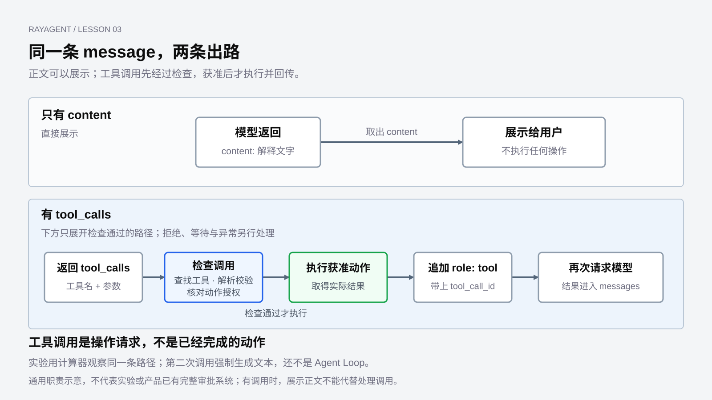

# 工具与行动

上一章里，程序已经能构造请求、取出 `content`，并区分完整响应与流式片段。但要完成文件任务，模型给出的往往不是一段解释，而是一份操作请求。

本章仍用 labs 中的独立脚本观察 **OpenAI 兼容的 Chat Completions**，不必启动 RayAgent。地址、模型和密钥继续从 `LLM_API_KEY`、`LLM_MODEL_NAME`、`LLM_BASE_URL` 读取。读结构即可跟上；要运行脚本，条件和命令见[基础实验运行指南](../labs/foundations/README.md#工具调用与结构化输出)。未配置真实模型密钥时，外部调用为 `unverified`，正文与图中的调用都是示意。

把上一章的解释题收回到行动：

> 请把 hello 写入工作目录的 hello.txt

这次希望模型提出写入，而不是说明“为什么要写入”。实验脚本用计算器观察同一条执行路径，并不在本机或沙箱里写这个文件。

## 同一条 message，两条出路

上一章已经说过：正文在 `content`，工具调用在 `tool_calls`，二者是同一条 `assistant` message 上的不同字段，不是两种 HTTP 响应。

如果模型只解释，结构仍和上一章一样，程序取出 `content` 即可展示。如果模型决定行动，同一条 message 会带上 `tool_calls`。下面是用于解释结构的示意数据，不是本次真实模型输出：

```json
{
  "choices": [{
    "message": {
      "role": "assistant",
      "content": null,
      "tool_calls": [{
        "id": "call_write",
        "type": "function",
        "function": {
          "name": "write_file",
          "arguments": "{\"filepath\":\"hello.txt\",\"content\":\"hello\"}"
        }
      }]
    },
    "finish_reason": "tool_calls"
  }]
}
```

这里要先看清几件事实。

`tool_calls` 是一份交给程序的操作请求：调用哪个工具、参数是什么。模型并没有因此访问磁盘。`arguments` 此时还是字符串，不是已经解析好的 Python 对象；程序必须先解析，才能执行。

结束原因也会变。上一章的文本回答常见 `stop`；提出工具调用时，接口用 `finish_reason: "tool_calls"` 表示“生成停在这里，因为下一步该由程序执行”。它同样属于 [OpenAI Chat Completions](https://platform.openai.com/docs/api-reference/chat/create) 的契约。

## 先声明，模型才能提出调用

模型并不会自动知道系统里有哪些可执行能力。请求里除了 `messages`，还要带上工具声明。下面是一份简化的请求片段，省略了服务地址和鉴权：

```json
{
  "model": "your-model",
  "messages": [
    {"role": "user", "content": "请把 hello 写入工作目录的 hello.txt"}
  ],
  "tools": [{
    "type": "function",
    "function": {
      "name": "write_file",
      "description": "创建或覆盖写入一个文本文件",
      "parameters": {
        "type": "object",
        "properties": {
          "filepath": {"type": "string", "description": "要写入的文件路径"},
          "content": {"type": "string", "description": "要写入的文本内容"}
        },
        "required": ["filepath", "content"]
      }
    }
  }]
}
```

声明告诉模型三件事：工具叫什么、什么时候该用、参数应是什么形状。实现函数留在程序一侧。模型看到的是这份说明，不是 `write_file` 的源代码，更不是沙箱磁盘。

因此，**工具调用的第一个工程问题，是把可执行能力明确写进请求。** 在本章的接口用法中，声明让模型知道本次可用的能力及参数形式；模型偶然生成一个工具名，不构成程序接受该调用的依据。

声明也只是约束，不是保证。模型可能漏掉必填项、写出不合法的 JSON，或提出一个请求里并不存在的名字。这些都要由程序在执行时处理，不能假定“既然返回了 tool_calls，参数就一定可用”。

## 程序执行，再把结果送回去

接到 `tool_calls` 之后，程序要完成一次交接：确认工具可用、解析并校验参数、执行，再把结果送回模型。下面是包含执行前检查的通用教学流程，不表示本章实验已经实现全部访问控制：

```text
把这条 assistant message 追加到 messages
如果带有 tool_calls：
  对每一项调用
    确认 name 属于本次允许调用的工具，并找到实现
    把 arguments 从字符串解析成参数，检查结构与执行范围
    允许执行时调用实现，得到结果；否则按策略拒绝或暂停
    已取得成功或错误结果时，追加 role: tool，带上 tool_call_id
    需要暂停时保存待处理状态，等待条件满足后再继续
  所有调用都有结果后，用更新后的 messages 再次请求模型
否则：
  使用 content 作为回答
```

`role: tool` 不是又一段助手旁白。它要挂上对应的 `tool_call_id`，告诉模型：这是刚才那次调用的执行结果。少了这一条，下一次请求里的模型就看不到真实写入是否发生、返回了什么。



图中的字段与文件操作是机制示意，不表示实际模型一定这样调用。

这条路径改变的是职责分工：模型提出“做什么”，程序控制“能否执行、怎样执行、在哪里执行”，再取得实际结果。对文件任务来说，读取返回 `hello`，下一步才有确认内容的依据；读取返回“文件不存在”，下一步的依据就变了。没有执行、没有回传，模型仍然只是在说话。

## 参数正确，还要满足执行条件

工具声明、参数校验和执行授权回答不同的问题。声明让模型知道如何提出调用；校验检查输入能否被实现使用；执行授权决定这项操作在当前任务中是否允许发生。

例如，`filepath` 是字符串，只能说明类型合适。它仍可能指向工作目录之外，或覆盖不该修改的文件。程序需要结合工具的能力范围、任务权限和执行环境作出判断。这些检查属于 Harness 与工具实现的责任，写在模型提示里不能代替实际约束。

失败也应成为明确的结果。读取遇到“文件不存在”时，可以把错误类型和必要信息关联到原调用，让后续决策知道发生了什么。对于不能自动继续的操作，系统也可以拒绝或等待人工处理；是否重试由控制策略决定，不能把所有错误包装成成功文字。

本章计算器实验展示名称分派、参数处理与结果回传；它没有因此构成通用的权限系统。设计自己的工具时，应分别检查参数结构、允许的操作范围和失败反馈，而不是从一次调用成功推断这些边界都已具备。

## 在实验里看一次执行

本章的主观察脚本是 `labs/foundations/3_7_为ReAct Agent添加计算工具.py`。它按 Chat Completions 声明一个 `calculator`，在模型返回 `tool_calls` 后按名字执行，再把结果以 `role: tool` 追加到消息里。运行条件见开头链接的基础实验指南。

脚本文件名和类名里有 ReAct，控制流却不是持续反馈。`process_query` 在执行工具后，第二次调用使用 `tool_choice="none"`，强制模型只生成文本。外层 `chat_loop` 是用户交互循环：每输入一句，最多走完这一次执行。这正是第 01 章说过的情形——执行一次工具后就收口，还不能展示多轮自主执行。

计算器也只是便于观察的替代物。它在本进程里用 `eval` 计算表达式，既不是产品的文件工具，也不经过沙箱。不要把一次本地计算写成“已经完成了 hello.txt 任务”。

理解脚本时，有一个实现细节会影响判断：第二次调用被写成了“生成最终回答”。

```python
second_response = self.client.chat.completions.create(
    model=self.model,
    messages=self.messages,
    tools=self.tools,
    tool_choice="none",
)
```

`tool_choice="none"` 禁止模型再次提出工具调用。程序因此得到一段可以打印的 `content`，但这也关掉了“根据结果继续行动”的可能。本地夹具可以核对：声明进入请求、`arguments` 被解析、工具真正执行、结果带着 `tool_call_id` 回到 `role: tool`、第二次调用带上 `tool_choice="none"`。夹具不能证明真实模型一定会提出这次调用。

运行脚本时，可以给一句需要计算的问题。若模型返回 `tool_calls`，终端会先打印工具名和执行结果，再打印第二次调用生成的文本；若模型直接用 `content` 回答，程序不会执行计算器。两种结果都能成立，对照的是分流，不能把“一定算出某个数字”当作实验成功的条件。

## 约束输出，不是执行动作

`tool_calls` 还可以用来要求模型交出符合 schema 的数据。这和“请程序去做事”共用字段，职责不同。

`3_8_Pydantic解析数据.py` 不调用模型。它把一段假想的 `arguments` 字符串校验成对象：合法数据得到 `name` / `age` / `email`，年龄为负或邮箱不合法时失败。这展示了解析之后的字段校验；成功解析 JSON 并不等于满足数据规则。

`3_8_Pydantic结合Tool Calls实现数据提取.py` 在请求里声明 `UserInfo`，并用 `tool_choice` 强制模型走这个工具。程序随后读取 `tool_calls[0].function.arguments`，校验后打印姓名。这里没有可执行的业务函数，模型交出的是结构化数据。

`3_9_JSON Output示例.py` 更不经过 `tool_calls`。它要求 `response_format: json_object`，结构出现在 `content` 里，再交给 Pydantic 校验。

| 做法 | 模型交出什么 | 程序有没有执行动作 |
|---|---|---|
| 工具调用 | `tool_calls` 里的名字与参数 | 有，按名字调用实现并把结果送回 |
| 强制 tool_choice 抽取 | 符合 schema 的 `arguments` | 无，只是把字段校验成对象 |
| `json_object` | `content` 里的 JSON 文本 | 无，只是解析正文 |

三种做法都在约束模型的输出形状。第一种还会让程序实际执行工具；执行可以读取信息、完成计算，也可以改变外部状态。文件任务需要的是第一种：提出 `write_file`，由程序写入，再把结果送回。后两种有助于看清 `arguments` 和 `content` 都可能携带结构化数据，但不能代替执行。

## 一次回传还不是 Agent Loop

到这里，程序已经能够声明工具、识别 `tool_calls`、执行实现，并以 `role: tool` 把结果送回模型。

它仍然只覆盖一次交接。实验脚本在回传之后强制生成文本；如果第二次响应里再次出现 `tool_calls`，这条路径也不会继续执行。把“完成了一次工具调用”写成 Agent Loop，会把后面的控制问题提前结束。

接下来的问题是：工具结果回来之后，程序怎样决定继续调用、换一个动作，或停下来？

[上一章：与模型交互](02-model-interaction.md) · [课程目录](README.md) · [下一章：Agent Loop 与 ReAct](04-agent-loop-and-react.md)
