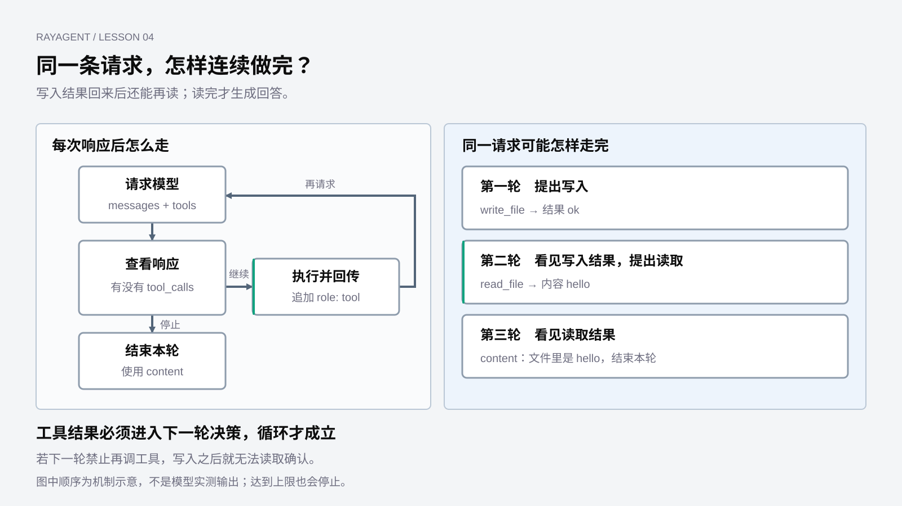

# Agent Loop 与 ReAct

上一章完成了一次交接：程序读到行动请求，执行工具，把观察送回模型。这还不是循环。循环要问的是：下一次返回若仍是行动，程序会不会停手？

本章仍用 labs 中的独立脚本观察 **OpenAI 兼容的 Chat Completions**，不必启动 RayAgent。配置继续读 `LLM_*`。读结构即可跟上；要运行脚本，条件和命令见[基础实验运行指南](../labs/foundations/README.md#工具反馈循环)。未配置真实模型密钥时，外部调用为 `unverified`，正文与图中的调用都是示意。

## Agent Loop 看的是返回类型，不是技术栈

Agent Loop 是程序自己的重复过程。它和用哪家 SDK、字段叫什么名字无关。每一次模型返回后，程序只先问一件事：**这一轮是行动请求，还是可以交给用户的终端消息？**

是行动请求，这一轮就不能结束。程序执行该行动，把观察写进上下文，再进入**同一套**判断：再请求模型，再看返回类型。用 `for`、`while` 还是函数自调用，只是写法；过程都是带着新观察，回到「看模型这一次给的是什么」。

是终端消息，这一轮才正常收口。常见形态是一段给用户的文本，并且不再附带行动。同一条回复里既有文字又有行动请求，仍算行动轮：

```text
assistant: 我先把文件写好。
行动请求 → write_file(filepath=hello.txt, content=hello)
```

这段话只是同行说明。程序仍须执行，再走同一套判断；不能看见文字就收口。

协议会给行动请求起不同的名字：旧文档里的 `function_call`、当前产品和实验使用的 `tool_calls`、另一套接口里的 `tool_use`。工具也可能是 `shell`、`write_file` 或别的实现。名字变了，Loop 的规则不变：**行动不是终点；程序必须再走同一过程。**

终端消息是正常收口，不是唯一出口。迭代上限、执行失败、等待用户，也会打断循环。那是边界，不是另一套原理。

用户在终端里一句一句输入，是另一层循环。Agent Loop 发生在同一次查询内部：还没有下一条用户指令，程序已经可能连续行动了好几次。

## 落到本课的接口

本章观察的 Chat Completions 里，行动请求落在 `tool_calls`，观察以 `role: tool` 回传，正常的终端消息常常是不再带 `tool_calls` 的 `content`。旧字段 `function_call` 只表示当时一次只能提一个函数，判断方法相同。

因此，上一章的伪代码还缺最后一步：执行之后，不要换一套规则。可以写成：

```text
把用户请求追加到 messages
重复
  请求模型
  把这条 assistant message 追加到 messages
  如果这一轮是行动请求：
    执行
    把观察以 role: tool 追加到 messages
    再进入上面的「请求模型」
  如果这一轮是终端消息：
    使用这段文本，结束本轮
必要时用次数上限打断，避免行动一直不出现终端消息
```

和「做一次工具就强制出字」的差别不在会不会执行，而在执行之后还许不许再出现行动。有的实验会在第二次请求上加 `tool_choice="none"`，等于人为关掉 Loop。

## 为什么必须再进入同一过程

把文件任务写完整，就能看见这条规则为什么不能省：

> 请把 hello 写入 hello.txt，再读取文件，告诉我里面是什么。

示意如下，不是本次真实模型输出。

**第一拍是行动。** 模型给出写入请求。程序执行，得到观察，循环不能停。

```text
user: 请把 hello 写入 hello.txt，再读取文件，告诉我里面是什么。
assistant: 行动请求 → write_file(filepath=hello.txt, content=hello)
tool: {"ok": true, "filepath": "hello.txt"}
```

到这里只完成了上一章会做的事。若程序把「已经执行过工具」当成结束，或锁住下一轮行动，确认就做不成。

**第二拍仍是行动。** 程序再进入同一过程。模型看见的是刚才那条观察，不是自己的口头记忆，于是给出读取请求。

```text
assistant: 行动请求 → read_file(filepath=hello.txt)
tool: {"filepath": "hello.txt", "content": "hello"}
```

**第三拍才是终端消息。** 模型看见文件内容，不再请求行动，只留下给用户的文本。Agent Loop 在这一轮正常结束。

如果第二拍的观察是「文件不存在」，下一拍的行动或文本都会变。Loop 不保证固定的写、读、答，保证的是：**只要还在给行动，程序就必须再判断一次。**



图只画类型判断：行动就执行、回传、再进入同一过程；终端消息才正常收口。文件任务只是同一规则下可能连续两拍行动。

## ReAct 是每一拍里如何决定

Agent Loop 回答「还要不要再走一拍」。ReAct 回答「这一拍里，模型依据什么提出行动」。

一拍可以看成：根据已有观察做决定（Thought），提出行动（Action），环境给出观察（Observation）。观察由程序写入 `role: tool`，不是模型的旁白。下一拍的决定必须看见它。

Thought 不必写成 `<think>` 或单独一段标签。模型在同一条 `assistant` message 里留下 `content`，同时带上 `tool_calls`，就是当代接口上常见的「边说明、边行动」。没有标签，不代表没有决定；第二拍改去读取，本身就是看见写入结果之后的决定。

反过来，只要求模型写出思考步骤，却在第一次行动后锁死工具，并不是 ReAct。名字里带 ReAct、提示词里带 Thought，都代替不了「观察进入下一拍」。没有看见观察就声称任务完成，正是第 01 章说过的口头成功。

产品里负责推进当前步骤的执行器也叫 ReAct Agent：提示要求分析现状、选择工具、再迭代，行动仍走 `tool_calls`，循环仍按「有行动则继续」推进。那是同一原理落在产品角色上，外层如何拆步骤留给第 07 章。

## 实验里谁在维持这套判断

主观察脚本是 `labs/foundations/4_1_工具反馈循环.py`。它在内存里提供写入和读取，用带上限的循环重复同一套判断。运行条件见开头链接的基础实验指南。

它能转，是因为再次请求时没有把行动关掉：

```python
response = self.client.chat.completions.create(
    model=self.model,
    messages=self.messages,
    tools=self.tools,
)
```

本地夹具可以核对：连续两拍行动会发出三次模型请求，后两次都不带 `tool_choice`；第一次就给出终端消息则不再执行工具；行动一直不结束时按上限报错。夹具不能证明真实模型一定会先写后读。

`3_7` 和 `4_3` 在第一拍行动之后加 `tool_choice="none"`，把 Loop 掐断；`4_3` 多了思考标签和流式拼包，控制流没有变。`4_4` 用函数再次进入同一过程，规则相同，但没有次数上限；注释写成“生成最终回复”，代码却会继续看返回类型，以代码为准。那份实验的报销规则不是产品行为。

| 程序在行动之后做什么 | Loop 还在不在 |
|---|---|
| 再请求，仍接受行动请求 | 在；`for` 或自调用都是同一过程 |
| 再请求，但禁止行动 | 不在；被收成一次工具调用 |
| 行动一直出现，又没有上限 | 过程没变，只是可能停不下来 |

上限、失败和等待用户，用来避免「永远等不到终端消息」。有 Loop，不等于任务已经完成。内存里的 `hello.txt` 只证明观察可以进入下一拍，不证明文件进了沙箱。

这些越积越长的 `messages` 里到底有什么、能放多长，是下一个问题。

[上一章：工具与行动](03-tools-and-actions.md) · [课程目录](README.md) · [下一章：上下文与记忆](05-context-and-memory.md)
