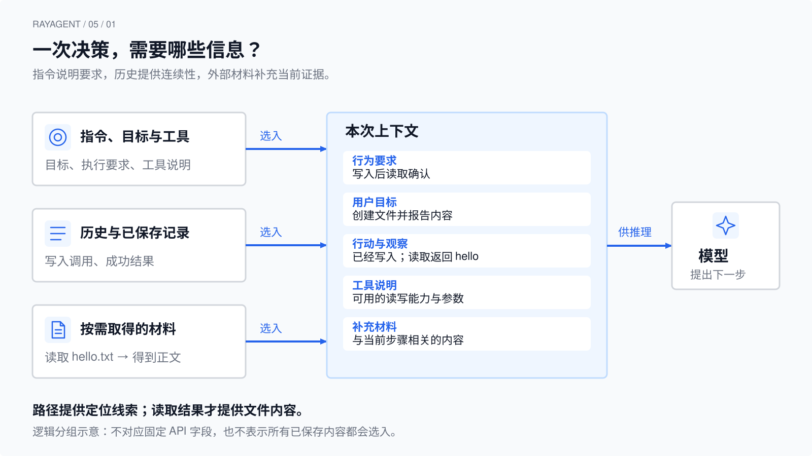
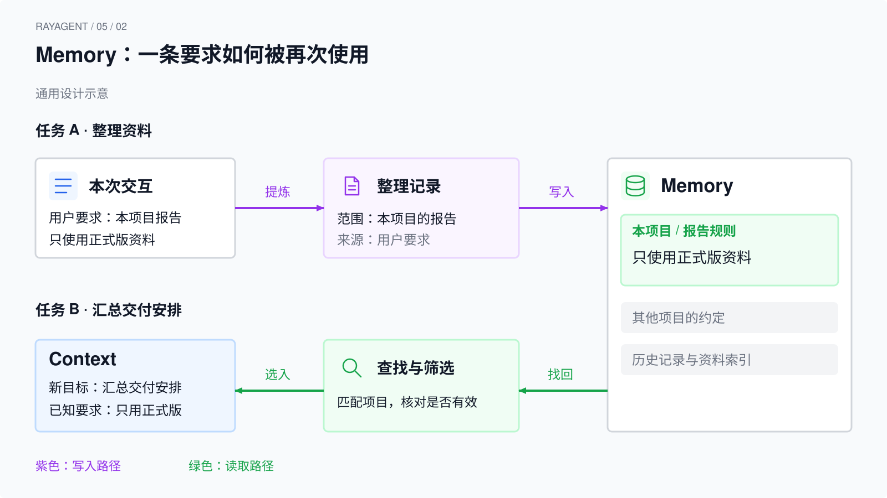
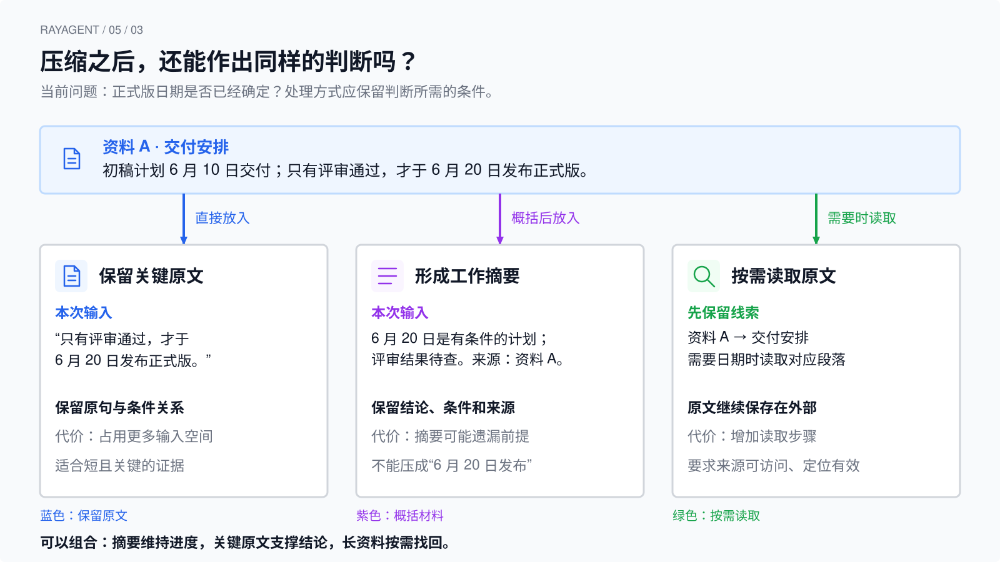

# 上下文与记忆

上一章中，Agent 执行写入、读取，再根据工具返回的内容回答用户。这个过程能够连续推进，除了程序一直在循环，还有一个条件：每次决策时，模型都能获得继续任务所需的信息。

这些信息从哪里来？刚才的操作需要保留多久？任务执行几十步以后，还应该把全部历史交给模型吗？如果明天再处理类似任务，今天的发现又怎样派上用场？这些问题把我们带到上下文与记忆。

本章先讲通用机制，再用独立实验和 RayAgent 对照。无需启动产品；文件操作与资料整理都是教学示例，不代表某次真实模型输出。实验条件和命令统一见[基础实验运行指南](../labs/foundations/README.md#请求工作集)。

## 从连续行动看信息需求

继续使用文件任务：

> 请把 hello 写入 hello.txt，再读取文件，告诉我里面是什么。

开始时，Agent 需要知道目标、可用工具，以及“写入后要读取确认”的要求。执行写入后，它又需要知道写入是否成功；执行读取后，它需要得到实际文件内容。目标没有变，支持决策的信息却在变化。

这里可以区分三件事：环境发生了什么、程序记录了什么、模型本次获得了什么。文件确实写入磁盘，属于环境变化；程序收到成功结果，属于取得了观察；把观察交给下一次模型调用，才使它能够参与后续判断。

模型训练中学到的知识可以帮助它理解“文件”“写入”和“验证”，但不能证明当前环境中的 hello.txt 已经创建。本章讨论的记忆，是应用在运行过程中保留并再次使用的信息。普通推理调用不会因为执行了一次工具，就自动把这段经历训练进模型参数。

因此，连续执行需要解决两类相互关联的问题：**这一步应该提供什么信息，以及哪些信息值得保留到以后。** 上下文侧重前一个问题，记忆机制让后一个问题有了实现方式。

## 上下文包含哪些信息

上下文（context）可以理解为模型在一次推理中可利用的输入信息。它既可能包含用户刚说的话，也可能包含应用准备的指令、此前的行动记录、工具返回的观察，以及从外部读取的资料。支持多模态输入时，图片等内容也可以成为上下文的一部分。

聊天界面中，用户通常只看见自己的输入和助手的回答。程序实际提供给模型的内容往往更多。以文件任务为例：

| 信息 | 例子 | 对当前决策的作用 |
|---|---|---|
| 行为指令与约束 | 写入后应读取确认 | 说明执行要求和回答边界 |
| 用户目标 | 创建 hello.txt，写入 hello | 说明本次要完成什么 |
| 已有行动记录 | 刚才提出了 write_file | 说明此前尝试过什么 |
| 工具观察 | 写入成功；读取内容为 hello | 提供执行结果作为判断依据 |
| 工具说明 | read_file 的用途与参数 | 说明接下来有哪些可调用能力 |
| 按需取得的材料 | 文件片段、网页正文、项目说明 | 补充完成任务所需的具体知识 |

这些内容可以通过不同接口字段传递。在本课使用的 Chat Completions 中，消息主要放在 `messages`，工具说明放在 `tools`。这不意味着所有请求参数都是上下文：鉴权信息、超时配置等承担调用管理职责，不是交给模型理解任务的材料。



图中的各类材料是逻辑分组，不规定它们必须对应独立消息或某个框架组件。外部文件通过读取、内容提取等步骤，才能成为可用材料；只提供路径时，模型获得的是定位线索，尚未获得正文。

还要区分“可用的信息”和“可信的事实”。工具可能返回错误，网页可能已经过时，助手之前的推断也可能不成立。上下文提供判断材料，不能保证模型正确理解或使用它们。组织输入时保留来源、时间和“已确认／待核实”的区别，能够让后续判断有更明确的依据。网页正文即使包含命令式语句，也应作为待处理的资料，不应因为被读入就升级为系统指令。

从这个角度看，上下文工程（context engineering）关注的不仅是提示词怎么写，还包括信息的获取、选择、组织与更新。Anthropic 的[上下文工程说明](https://www.anthropic.com/engineering/effective-context-engineering-for-ai-agents)也把系统指令、工具、外部数据和消息历史放在同一个持续管理的问题中讨论。对于 Agent，这项工作会随着每一次反馈重复发生。

## 上下文如何随行动变化

在最简单的实现中，程序保存一份消息列表，每次收到新响应或工具结果就追加进去，下一次请求再发送这份列表。文件任务的一条可能轨迹如下：

| 请求时刻 | 已保留的信息 | 本次新增的信息 | 可以支持的判断 |
|---|---|---|---|
| 写入前 | 指令、目标、工具说明 | 尚无执行观察 | 选择怎样创建文件 |
| 写入后 | 上述信息 | 写入调用及成功结果 | 判断是否继续读取确认 |
| 读取后 | 上述信息及写入记录 | 读取调用及返回的 hello | 根据读取结果回答内容 |

第二次调用之所以表现得像“记得刚才的事”，是因为历史又参与了输入。在本课这种由客户端管理历史的调用方式中，程序要显式发送需要的消息。某些服务支持会话标识或服务端续接，由服务维护历史；那只是把历史管理的一部分交给服务端，不能推导出模型会自动访问所有过去的交互。

用下面的简化伪代码，可以看清连续性的来源。它省略了协议字段和异常处理：

```text
历史 ← 指令与用户目标
重复：
    本次上下文 ← 历史与可用工具说明
    响应 ← 请求模型（本次上下文）
    将响应追加到历史
    如果响应没有工具调用：结束
    执行工具，将结果追加到历史
```

这里没有独立的检索器，也没有摘要服务，保存和再次发送已经构成最简单的任务内记忆。随着任务变长，程序可以从历史中选择一部分，再和其他材料组装输入；模型使用的上下文便不再等于全部历史。

上下文也需要更新。假设第一次读取得到 `hello`，后来用户要求改成 `world`，旧观察仍然能说明文件曾经是什么，却不能代表修改后的状态。若要确认修改结果，就需要新的读取。把“旧内容为 hello”和“新内容尚未确认”保留下来，比让两条没有时间关系的内容并列更容易理解。

工具反馈还带有协议上的关联。在 Chat Completions 消息中，调用请求和对应的 `tool` 结果通过调用标识关联。整理历史时应维护有效的调用—结果结构；较早的一组交互可以整体换成摘要，但不能任意留下悬空结果或未配对的调用。本章的“遗漏观察”只用于分析信息缺口，不是一份可以直接发送的残缺请求示范。

## 记忆让信息能够再次使用

任务内连续行动只是记忆的一种用途。把任务扩大一点：

> 阅读三份关于项目交付的资料，整理一份报告，列出结论、依据和尚未解决的问题。

Agent 读完第一份资料后，需要记住发现和待查项，才能继续对照第二份。报告完成后，某些信息可能还有复用价值：用户要求报告始终附来源、某个目录存放正式资料、一次失败说明了什么限制。

应用层记忆（memory）是为后续使用而保留信息，并让这些信息能够被找回、更新的机制。它可以很简单，也可以包含复杂的提炼和检索。理解它时，先看使用范围和内容用途，再看存储技术。

### 按使用范围区分

**任务或会话内的记忆**维持正在进行的工作，例如消息历史、资料阅读进度、当前发现和未完成事项。它常被称为短期记忆。这里的“短期”主要描述使用范围；即使写入数据库保存了很久，它仍可能只供同一会话使用。

**跨任务或跨会话的记忆**让后续工作复用信息，例如经确认的用户偏好、项目约定、过去任务中形成的可用经验。它常被称为长期记忆。能够跨会话使用，还需要有相应的查找和作用域管理，不能只凭“数据落盘了”来判断。

这是一种工程上常见的分类，并非统一标准。例如 [LangGraph 的记忆概览](https://docs.langchain.com/oss/python/concepts/memory)就按会话内和跨会话的召回范围作区分。阅读具体系统时，应核对其术语定义。

### 按保存的内容区分

在资料整理任务中，还可以从用途观察几类内容：

| 保存内容 | 示例 | 再次使用时需要注意什么 |
|---|---|---|
| 事实与偏好 | 用户要求报告中的结论附来源 | 适用哪个用户、哪类报告，是否已被新要求替代 |
| 事件与经历 | 上次读取资料 B 失败，返回权限错误 | 当时的条件是否仍然成立 |
| 做法与经验 | 比较交付日期前，先确认资料版本 | 经验依据是什么，能否适用于这次任务 |

在一些记忆设计中，它们分别借用“语义记忆”“情景记忆”“程序性记忆”等名称。术语有助于区分用途，但并不要求建立三套数据库，也不表示 Agent 具有人类相同的记忆机制。

原始历史与提炼后的内容各有价值。历史能保留当时说了什么、做了什么；一份工作摘要则能直接告诉下一步“已读哪些资料、发现了什么、还缺什么”。摘要更便于使用，但也可能漏掉前提或把推断写成结论。经验更进一步，需要判断哪些做法值得复用，不能把一次偶然成功自动提升成通用规则。

因此，记忆的质量不能只用保存条数衡量。长期留下错误结论，可能让多个后续任务重复同一个错误；保留来源、适用范围与更新条件，才有机会在使用时重新核对。

## 从保存到使用，中间发生了什么

假设上一次报告任务留下了一条记录：“比较交付安排时，以正式发布版本为准。”新任务开始后，这条记录需要经过怎样的过程，才能影响本次报告？



图展示通用设计过程，不是 RayAgent 的现有组件图。读取路径把已有记忆带入决策，写入路径处理本次产生的新记录；两条路径可以采用不同的触发时机。

**先决定保存什么。** 程序可以按规则记录原始交互，也可以让模型提炼摘要或候选经验。提炼后的内容需要标明性质：用户明确提出的要求、工具报告的事实、模型尚未核实的判断，不应该被压成同一种结论。在报告示例中，“资料 B 的发布日期较新”并不足以推出“资料 B 一定取代 A”。

**再决定如何保存和更新。** 简单偏好可以存成键值，阅读进度可以写入笔记，完整记录可以放在数据库。若发现原记录已经不适用，应该更新、标记失效或删除。还要能区分不同用户和项目，避免把某个项目的交付规则带到另一个项目。

**下一次使用前，选择或检索相关内容。** 已知记录的键或文件路径时，可以直接读取；按时间找最近交互时，可以过滤历史；问题表述不固定时，可以使用关键词或语义检索。向量检索通常把文本转成向量，用相近程度寻找候选材料。它解决的是一种查找问题，不能独自完成记忆的写入、更新和正确性判断。

**最后，把选出的内容组织进上下文。** 对本次交付报告，相关记忆可以作为背景说明，并附上适用项目和来源。如果找回十条几乎重复的记录，全部加入未必更有帮助；如果找回的是旧规则，还需要与当前要求核对。检索返回的是候选材料，程序或模型仍需判断是否适用。

这个过程也解释了记忆与检索增强生成（RAG）的关系。RAG 通过检索外部材料为生成提供依据；材料可以是公共文档，不一定来自过去的交互。记忆则关注运行中哪些信息需要保留并复用，可以借助检索，也可以只用一个直接读取的偏好文件。两者可以结合，但不能互相替代定义。

写入时机同样有取舍。工具结果通常要及时进入下一次决策；提炼跨任务经验则可以在阶段结束后完成。同步提炼会增加当前任务的等待，延后处理则可能让紧接着发生的任务暂时拿不到新记忆。设计应根据“多快必须可用”作选择。

## 为什么不能一直追加全部信息

对于 hello.txt，完整历史很短，原样发送很容易理解。但阅读三份长资料时，工具正文、重复片段、失败重试和草稿都会积累。此时限制不仅来自存储容量，还来自模型单次处理信息的容量与效果。

### 上下文窗口是一项容量约束

上下文窗口通常以 token 为单位。Token 是分词器处理文本的单位，不固定等于一个字、一个词或一个字符；中文、代码、数字的切分也可能不同。只数消息条数或正文字符，无法准确得到模型的输入 token 数。

指令、历史、工具说明等都可能占用输入预算，服务端的消息编码也有开销。许多模型还需要在窗口内为生成留出空间，并另设输出上限；具体计算方式取决于模型和服务，不能把一个接口的规则套给所有模型。可对照服务的[上下文窗口说明](https://platform.claude.com/docs/en/build-with-claude/context-windows)，用匹配的计数工具估算，并在实际调用后检查用量统计。

下面只作容量算术示意，数字不对应某个型号：假设一个窗口可容纳 32,000 token，计划为输出预留 4,000，指令和工具说明已占 3,000，那么在这一简化假设下，历史与资料最多还剩 25,000 token 的预算。若三份资料本身就占 30,000，增加数据库容量并不能让它们同时进入这次输入。

超过窗口时，服务可能拒绝请求，也可能在明确启用的机制下截断或压缩。不能假定它会自动、无损地挑出最重要的部分。应用需要知道自己保留了什么，也需要为接下来可能出现的工具结果留有余量。

### 装得下，也需要检查使用效果

更长的输入通常增加处理开销，具体延迟和费用还受模型、服务及缓存机制影响。更重要的是，内容进入窗口不等于模型能稳定利用所有细节。

[《Lost in the Middle》](https://arxiv.org/abs/2307.03172)在其测试模型和任务中观察到，相关信息所处的位置会影响表现，位于长输入中间时可能更难被利用。这是特定实验的结果，不应写成所有模型在所有任务中的固定规律；它提醒我们，窗口规格与实际任务表现需要分别验证。

资料报告还会遇到另一种问题：三份文档互相引用，旧版与新版交错，某个日期反复出现，却只有一处说明它已经取消。即使容量足够，也需要保留版本和关系，让关键例外容易辨认。上下文管理的目标，是为下一步提供充分、相关、可核对的信息。

## 怎样在有限空间内保留判断依据

继续看报告任务。假设资料 A 的原文说明：“初稿计划于 6 月 10 日交付；只有评审通过，才于 6 月 20 日发布正式版。”当前需要判断正式版日期是否已经确定。

同一份材料有几种处理方式：



图中的日期和材料是教学示意，不对应实际项目安排。三个方案都需要服务于同一个判断问题，不能只比较哪个文本最短。

**保留原文**让模型直接看到日期与条件的完整关系，适合较短、关键、即将引用的段落。但若每次都保留所有资料全文，其他必要信息可能失去空间。

**形成摘要**可以写成：“正式版暂定 6 月 20 日，前提是评审通过；尚无通过记录。来源：资料 A，交付安排。”这样保留了日期、条件、待核实事项和定位线索。如果压成“正式版 6 月 20 日发布”，虽然更短，却把条件性的计划变成了确定事实。

**保留定位线索，按需读取**可以先保存“资料 A → 交付安排 → 正式版日期待核实”。真正需要日期时，再读取对应段落。它减少常驻上下文，但增加读取步骤，并要求原文仍然可访问、定位线索仍然有效。Anthropic 的[按需获取上下文讨论](https://www.anthropic.com/engineering/effective-context-engineering-for-ai-agents)也描述了利用路径、链接等轻量标识，在需要时加载材料的方式。

这些方法可以组合：常驻摘要保留目标和进度，关键结论旁保留短证据，长篇原文留在外部等待检索。最近几轮交互往往适合保留原貌，便于继续当前操作；较早内容则根据用途整理。

另一种常见做法是只保留最近若干条消息，形成滑动窗口。它实现简单，但消息“最近”并不代表最重要。用户开头提出的“报告只比较正式版”，可能比最近十条重复读取记录更关键。因此，按时间裁剪时仍应单独维护当前目标和有效约束。

无论采取哪种方案，都要检查压缩后的上下文还能否回答几个具体问题：目前要完成什么，已经确认什么，哪些仍是推断，下一步缺什么，以及需要时能去哪里核对原文。它们比“缩短了多少百分比”更接近任务能否继续的条件。

对于需要审查的过程，可以另存原始轨迹，把给模型的摘要视为一种派生表示。这样能回查摘要是否遗漏前提。不过，这需要实际设计独立保存路径；直接覆盖原消息内容，本身不会额外保留一份原文。

## 回到实验与 RayAgent

前面的概念适用于多种 Agent 实现。现在可以用它们观察现有代码承担了其中哪些职责。

### 实验展示最小的上下文积累

`labs/foundations/4_1_工具反馈循环.py` 保存一份消息列表，把模型响应和工具结果追加进去，再请求模型。文件工具使用进程内数据，适合观察“新观察参与下一步”，不代表文件已经进入产品沙箱。

`labs/foundations/5_1_观察请求工作集.py` 则不调用模型。它构造写入前、写入后、读取后三份消息快照，输出观察是否出现。阅读时先对照本章的三次请求表，看写入结果和读取结果分别从哪一次开始可见。

脚本还输出几组字符统计，但它们只是不同的教学口径：`wrapped_chars` 使用自定义角色包装，`request_chars` 是内容字符与工具声明序列化长度之和，没有在前者基础上继续累加。它们不能表示真实服务端编码，也不能作为 token 预算。删除最后一条工具结果的对照，只检查消息中缺了什么，不验证服务是否接受那组消息。

`4_2_计算消息上下文长度.py` 使用本地分词器，对一段纯文本和另一条聊天消息分别计数。当前两个样例的正文不同，所以不能把数值差全归因于角色包装。它还依赖完整词表，真实运行仍为 `unverified`；真实模型的 token 用量也未在本章验证。

这些实验支持“信息进入请求”和“计数需要明确口径”的观察，没有实现摘要、跨任务记忆或语义检索。本章后半部分的通用策略是理解和评估实现的工具，并非这些脚本已经展示的能力。

### 产品保存消息，并做局部清理

RayAgent 的 `Memory` 模型中，核心内容是 `messages` 列表。Agent 基类首次准备消息时加入系统提示，随后追加新消息；调用模型时读取这份消息，并另外取得工具说明。它还按会话和 Agent 名称加载、保存记忆，所以这条产品路径中的消息管理不只发生在进程内。

这对应前面介绍的会话内记忆。将其持久化，不等于已经建立跨任务的用户偏好、项目经验提炼和检索机制。查看实现时，可以在 `ray_agent/api/app/domain/services/agents/base.py` 对照 `_ensure_memory`、`_add_to_memory` 和 `_invoke_llm`，分别观察加载、追加保存和组装调用。

产品也有一个名为 `compact()` 的操作，位于 `ray_agent/api/app/domain/models/memory.py`。当前实现会把 `browser_view`、`browser_navigate` 对应工具消息的正文替换为 `(removed)`，并移除消息中的 `reasoning_content` 字段。计划流程在步骤成功后调用执行器的记忆压缩，再进入计划更新。

这里的压缩是按字段和工具类型清理内容，没有生成语义摘要，也没有在这段实现中按 token 预算选择相关材料。它会改变保存的消息表示；清理后的占位内容不能还原此前网页正文。其他未命中的长结果仍可能保留，所以仅有这个函数不能保证后续输入总能装进窗口。

如果要评价这种处理是否适合任务，应追问：刚删除的内容后续还需要吗，能否再次读取，保留的消息是否足以支持下一步？这些问题来自通用机制，也能帮助我们准确理解当前设计的取舍。以上产品说明经过源码静态核对，本章没有启动产品验证运行表现。

沿着这一章再看 Agent Loop，每一次“继续”都伴随一次信息准备：保留当前目标，加入新的观察，处理已经失效或过大的内容，并在需要时找回外部材料。下一章进入完整产品，观察这些信息怎样与计划、工具执行和界面记录一起支撑一条任务。

[上一章：Agent Loop 与 ReAct](04-agent-loop-and-react.md) · [课程目录](README.md) · [下一章：运行 RayAgent：观察一条完整任务](06-run-rayagent-one-complete-task.md)
