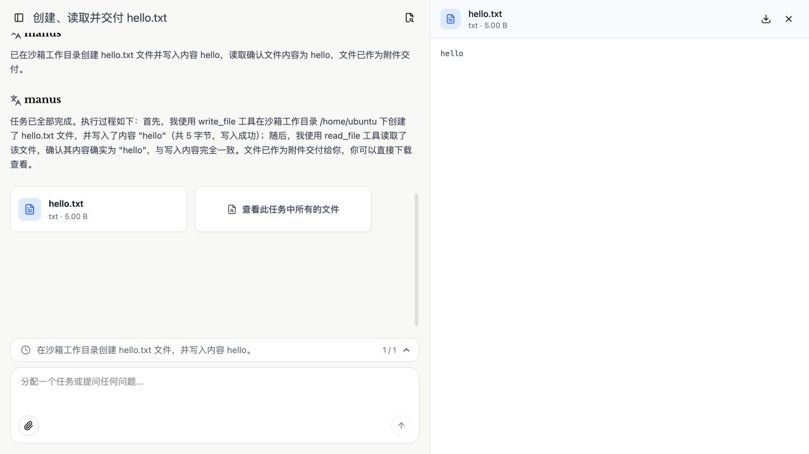
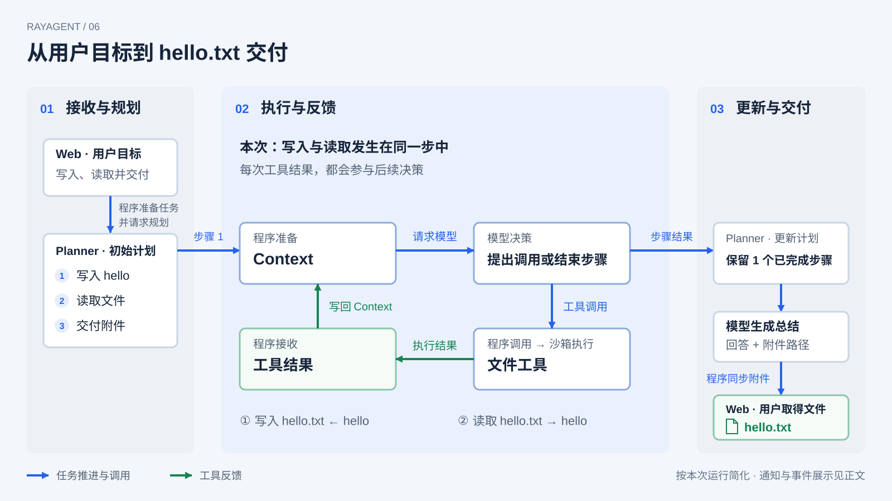
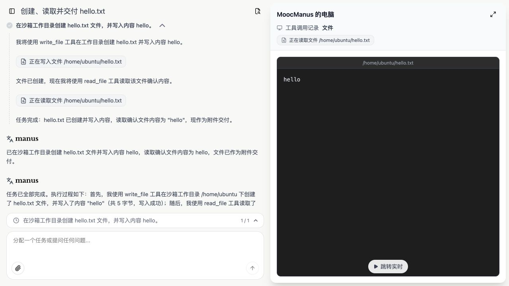
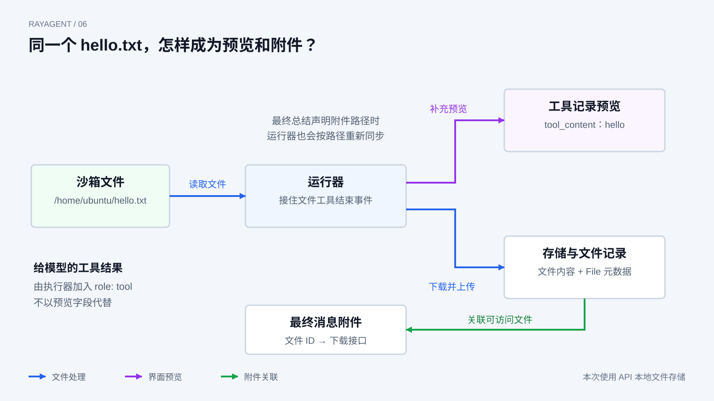

# 从 Agent Loop 到完整 Harness

前几章中，我们分别看过模型调用、工具执行、反馈循环和 Context。它们在独立实验里已经能够形成一个小的执行过程：程序请求模型，执行模型提出的工具调用，再把结果交回去。

把这些机制放进 RayAgent，一条任务还会经过消息承接、执行资源准备、计划推进、事件展示和文件交付。本章沿一次真实的 hello.txt 任务，把这些交接连起来：**信息谁准备，控制谁推进，工具结果回给谁，产物落在哪里？**

本章的页面、事件与文件观察来自 2026 年 9 月 11 日的一次本机 Compose 运行。运行入口与配置见[应用指南](../ray_agent/README.md)。阅读时不必先启动服务；想复现时，可以在 Web 新建任务并提交下面的请求。模型可能选择不同的步骤与调用顺序，我们对照的是交接机制。

## 先看这次任务交付了什么

本次从 Web 提交的完整请求是：

> 在沙箱工作目录创建 hello.txt，写入 hello，再读取文件，告诉我里面是什么，并将文件作为附件交付。

这个任务刻意保持简单。内容只有 hello，容易直接核对；操作同时包含写入、读取和交付，足以让我们观察一次任务中的几种不同结果。

执行结束后，页面出现总结和 hello.txt 附件。打开附件，内容是 hello，界面标注大小为 5.00 B。进一步核对沙箱中的文件、API 本地存储中的副本和下载接口返回的文件，三者均为 5 字节的 `hello`。

这是本次真实界面截图，保留了产品现有的 MoocManus / manus 名称。左侧是总结与附件入口，右侧是最终附件预览。它展示的是交付结果；文件怎样到达这里，还需要向前追踪。

本次过程还有一个容易忽略的变化：初始计划列了“写入、读取、交付”三步，但执行器在第一步中已经完成了写入和读取，并发出交付说明。随后计划更新为一个已完成步骤，所以最终页面显示 `1 / 1`。这不是三步都各执行了一次，而是计划在取得步骤结果后发生了变化。

## 用户消息怎样进入持续执行

在页面上，用户完成的是输入和发送；在服务端，这条消息先要找到所属会话，再进入任务运行过程。会话给消息、历史和文件提供关联位置，任务则承担本轮工作的执行。两者关联，但不是同一个对象。

RayAgent 的应用协调层接收消息，检查是否需要创建任务。创建时，它取得或准备沙箱，获取运行所需的资源，并把执行工作交给任务运行器。这里的“运行器”可以理解为负责接收任务输入、组织流程、处理输出的程序对象，不是另一个模型。

接下来，用户消息被包装成输入事件，放进任务的输入流，程序启动任务。运行器取出消息后，把它交给 Plan + ReAct 流程。这样，Web 请求与任务执行之间就建立了明确的交接：前者承接用户输入，后者推进规划、模型调用和工具操作。

这次消息没有上传附件，所以没有输入文件需要先同步到沙箱。另一个实现细节是：当前任务准备还会获取沙箱浏览器实例，即使任务只要求写文件。资源准备沿用产品的通用路径，不等于模型实际调用了浏览器工具。

下面把本次任务分成接收与规划、执行与反馈、更新与交付三个阶段。沿蓝色箭头可以读清任务怎样推进；中间的绿色反馈路径说明工具结果怎样进入下一次决策。图中的“程序”按动作标明信息准备、工具调用和结果接收，并不代表这些工作由一个函数完成。

中间的环在本次步骤一中先完成写入，再完成读取；三次通知调用没有逐项画出。工具结果沿绿色路径交回模型，步骤结果则向右交回规划流程。本次更新后只保留一个已完成步骤，再生成总结并同步附件。程序在执行过程中也持续发送事件，最右侧只表示最终文件交付，不表示页面此前没有收到进展。

## 第一次决策需要哪些信息

任务开始后，并不是把用户的一句话原封不动地交给一个模型，然后一直等待。程序会根据当前角色和工作阶段准备输入。

首先，Planner 接收规划所需的信息，返回任务安排。本次创建计划的调用在日志中使用了禁止工具调用的设置，并要求结构化输出；它要产生的是计划，而不是在这一轮直接写入文件。随后，程序选出待执行步骤，交给执行器。

执行器需要同时知道原始目标和当前步骤。这个区别很重要：当前步骤写着“创建文件并写入 hello”，原始目标却还包含读取与附件交付。本次执行器在第一步中继续读取文件，与它的输入并非只有步骤标题这一实现事实相吻合；至于模型为什么作出这一选择，不能仅凭日志确定。

对照源码，执行器准备输入时涉及以下内容：

| 信息 | 由哪里准备 | 在本次任务中的作用 |
|---|---|---|
| 行为说明 | 执行器的系统提示 | 说明角色、执行与回复要求 |
| 用户目标与当前步骤 | 步骤执行时组装的提示 | 保留整项请求，并指出当前要推进的工作 |
| 已有消息与观察 | 按会话、Agent 名保存的消息 | 让后续调用使用此前响应和工具结果 |
| 工具说明 | 工具对象提供的声明 | 让模型知道可以提出哪些调用及参数 |

这些信息分布在消息和工具声明中，并不都挤在一个用户字符串里。模型也没有直接读取会话数据库或沙箱文件：程序负责把需要的信息组织到请求中。

这张表根据输入组装代码整理。本次运行日志确认了模型调用阶段及工具调用设置，但没有捕获完整出站请求正文，因此不能把表中的概括当作逐字的实际请求转录。

如果希望定位这项交接，可以在 `ReActAgent.execute_step` 看用户目标和步骤怎样组成查询，在 `BaseAgent._invoke_llm` 看保存的消息与工具声明怎样交给模型客户端。这里需要理解的是谁准备什么，而不是记住这些函数名。

## 写入结果怎样参与后续行动

本次事件记录中，模型发起的工具调用按先后顺序如下。`calling` 与 `called` 是同一次调用的两个阶段，不能算成两次操作。

| 顺序 | 工具调用 | 本次作用 |
|---|---|---|
| 1 | `message_notify_user` | 告知准备写入文件 |
| 2 | `write_file` | 将 hello 写入 `/home/ubuntu/hello.txt` |
| 3 | `message_notify_user` | 告知准备读取确认 |
| 4 | `read_file` | 读取同一路径 |
| 5 | `message_notify_user` | 告知操作完成并准备交付 |

因此，本次共有五次模型发起的工具调用，其中两次操作文件，三次通知用户。没有发生独立的“交付工具”调用；通知里说“现作为附件交付”，还不是文件已经完成附件同步的证据。

先看写入这一次。模型返回工具名称和参数，执行器解析参数、找到文件工具。文件工具再把请求交给沙箱接口，实际写入发生在沙箱里。模型提出的路径是 `/home/ubuntu/hello.txt`，后续读取使用同一个路径。

执行器取得工具结果后，会形成调用结束事件，并把结果组织成 `role: tool` 消息，带上对应的 `tool_call_id`。下一次模型调用使用更新后的消息，模型才有机会依据写入结果继续提出动作。这里正是前几章的工具契约、Agent Loop 和 Context 在产品中的结合。

与此同时，事件沿流程交给运行器，运行器处理展示所需的信息，再把事件送向页面并保存。也就是说，一次工具执行产生的结果会服务于不同使用者：模型需要它来决策，用户需要它来理解进展，历史记录需要保留发生过什么。

读取后，执行器继续取得模型返回的步骤结果，并把它交回规划流程。本次随后的计划更新只留下已完成的第一步，流程再进入总结。我们在这里先看清“工具结果交给执行器、步骤结果交回规划流程”这两个交接；两层循环如何决定后续步骤，在下一章展开。

## 页面记录为什么不能直接当作模型输入

点击本次读取记录，右侧可以看到文件内容 hello。左侧既有“我将使用……”这样的通知，也有写入、读取工具记录。

截图中的“正在写入”“正在读取”是当前界面沿用的记录标签。取图时任务已经完成，接口状态为 `completed`，且已有 `done` 事件；这些标签不能单独用来判断任务仍在运行。

更关键的是，**右侧预览内容与返回模型的工具结果并不是同一个字段。** 执行器把工具的原始结果带回后续消息；运行器则会为文件工具事件补充 `tool_content`，让界面能够直接展示文件正文。

当前实现中，当运行器接到文件工具的 `called` 事件，只要参数带有文件路径，就会再通过沙箱接口读取文件，用于填充预览，并同步文件到存储。这条处理路径位于 `AgentTaskRunner._handle_tool_event`。

这意味着，即使刚完成的是写入工具，写入记录也能带上文件预览。那次为预览发生的读取是程序自动处理，不是模型又提出了一个 `read_file` 请求。统计模型行动时要看工具调用记录及关联标识；研究底层文件访问时，则还要算上这些程序操作。

同样，本次会话接口返回的文件工具记录包含名称、参数、状态和预览内容，并没有暴露内部完整的 `function_result`。接口里看到了 hello，证明预览包含这些内容；要解释什么进入模型，仍要核对执行器构造工具消息的路径，不能直接把预览字段当作模型输入。

## 沙箱文件怎样成为最终附件

文件已经写入沙箱，用户下载时却不必直接连接沙箱磁盘。中间的文件同步和元数据关联，把执行环境中的资源变成了应用可交付的产物。

运行器按路径从沙箱下载文件，再调用文件存储服务上传内容，取得文件记录，并把沙箱路径关联到这份记录。本次使用 API 的本地文件存储，文件内容落在 API 的文件目录中；文件标识、名称、大小等信息则用于关联会话和附件。

图把存储内容与关联记录合并表示，具体元数据由应用与数据库管理。给模型的工具结果沿执行器消息路径传递，不以右侧预览内容代替。

最终总结还会声明要交付的附件路径。运行器处理这条消息时，按路径再次同步文件，将附件替换成可以访问的文件记录，然后把消息交给页面。因此，“工具执行后同步”和“最终消息附件同步”是两个可能发生同步的时机。

这也解释了通知与交付之间的区别：模型可以先发通知说“现作为附件交付”，但页面需要拿到文件记录，下载接口还需要能够返回实际内容，交付链才有可核对的结果。

本次最终文件的对应关系如下：

| 位置 | 本次观察 |
|---|---|
| 沙箱工作文件 | `/home/ubuntu/hello.txt`，内容为 5 字节的 hello |
| API 本地存储副本 | 根据附件的存储 key 找到对应文件，字节内容与沙箱一致 |
| 最终消息附件 | 文件名 hello.txt，大小 5，携带文件 ID 与原沙箱路径 |
| 下载接口 | 按最终文件 ID 下载，返回同样的 5 字节 hello |

这些对应关系说明本次任务不仅生成了总结，也交付了可读取的文件。它们没有证明沙箱文件与存储副本之后会持续自动保持一致；同步发生在具体处理时机，文件的生命周期和访问契约还需要单独研究。

## 再看这条完整任务

刷新页面后，本次的工具记录、总结和附件仍可查看。这个观察证明历史展示在本次运行中可用，不代表已经验证中断恢复、跨会话项目记忆或所有失败路径。

沿着这条任务，我们可以把四种交接说清楚：应用协调与执行器准备不同阶段的信息；任务运行器和规划流程推进控制；文件工具把沙箱结果交回执行器，结果进入后续消息；运行器再把文件同步并关联为用户可以取得的附件。

完整 Harness 就体现在这些机制共同工作时形成的行为中。单独看模型调用，只能知道它返回了什么；把执行、反馈、记录与交付连起来，才知道一句用户请求如何成为一个实际完成的任务。

本次初始计划有三步，最终却只保留一步，而这一步中又包含多次工具调用。这个现象把下一个问题带了出来：**Planner 与执行器怎样分工，步骤结果如何影响后续计划？**

[上一章：上下文与记忆](05-context-and-memory.md) · [课程目录](README.md) · [下一章：规划与内外层循环](07-planning-and-nested-loops.md)
