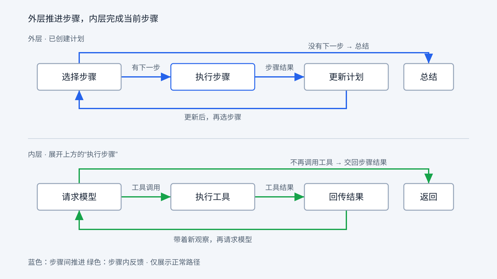

# 规划与内外层循环

第六章的文件任务留下了一个问题：初始计划列出写入、读取、交付三步，执行器却在第一步中完成了多次工具调用，更新后的计划只剩一个已完成步骤。为什么一个步骤能做这么多事？原来的后两步又由谁决定不再执行？

第四章学过的 Agent Loop 仍然适用：程序请求模型，处理工具调用，把结果交回模型，再请求；模型不再提出工具调用时，这次循环正常收口。到了 RayAgent，需要再问一句：**这次收口的是当前步骤，还是整项任务？**

## 一项任务、一个步骤与一次工具调用

“创建 hello.txt，写入 hello，再读取并交付”是用户目标。计划可以把目标拆成几个步骤，但步骤描述仍是一项要完成的工作，并不是一条已经确定的工具指令。

例如，“创建文件并确认内容”这个步骤可能需要写入、读取两次行动；如果读取失败，执行器还可能检查路径再决定怎么处理。程序不能仅凭步骤标题，预先确定内部会调用多少次工具。

三者的区别可以这样理解：

| 层次 | 表达的内容 | 文件任务中的例子 |
|---|---|---|
| 整项任务 | 用户最终想得到什么 | 得到包含 hello 的文件，并能下载 |
| 计划步骤 | 当前安排执行哪部分工作 | 创建文件并写入内容 |
| 工具调用 | 这一次具体请求执行什么 | `write_file`，携带路径和内容 |

工具调用有参数和执行结果；步骤需要结合这些结果形成工作结论；整项任务还需要判断剩余安排与最终交付。它们可以碰巧一一对应，但程序不能依赖这种巧合。

这也解释了为什么内层仍然需要第四章的反馈循环。拿到一个步骤，并不意味着已经知道执行它的所有动作。执行器要根据实际观察逐次决定，直到交回步骤结果。

## 单个 Loop 已经能行动，为什么还要计划

单个 Agent Loop 可以连续调用很多次工具，也可以根据上下文调整行动。它并非只能做简单任务，复杂任务也不天然要求再包一层循环。

显式计划解决的是另一个组织问题：怎样让“整项工作还剩什么”成为程序可以读取、展示和更新的对象，而不只存在于模型的消息上下文里。

假设任务是整理一批记录并生成报告。执行器正在处理某个文件时，可以依据工具反馈决定如何读取、转换或重试；整个任务还需要记住报告尚未生成、哪些数据已经处理，以及新的发现是否改变后续安排。程序可以在步骤之间设置一次交接，把局部结果交回整体安排，再选择下一段工作。

这样做的收益是获得明确的步骤边界和调整时机。代价则是增加规划调用、结果传递与计划维护。对于 hello.txt 这样的短任务，一次普通 Loop 就可能足够；第六章仍然经过规划，是因为它沿用了 RayAgent 的主流程，不能用这个案例证明规划层必不可少。

还要区分“模型写了一份计划”和“程序使用计划推进任务”。只有文本列表，程序未必会按它选步骤；只有创建计划而没有执行后的更新，也还不是这里讨论的计划反馈过程。

## 外层是程序，Planner 是其中一个角色

RayAgent 把职责分给 Planner、执行器和流程程序。外层循环并不是 Planner 自己不停地调用工具。

| 参与者 | 接收什么 | 产出或决定什么 |
|---|---|---|
| Planner | 用户目标；更新时的当前计划与步骤结果 | 初始计划或剩余步骤安排 |
| 执行器 | 原始请求、当前步骤、已有消息与工具说明 | 工具调用，以及最后的步骤结果 |
| 流程程序 | 计划、步骤状态与角色返回的事件 | 选择步骤、调用角色、更新流程状态或结束 |

Planner 创建与更新计划时使用禁止工具调用的设置，并要求 JSON 输出。它在这些调用中提出安排，文件操作由执行器后续发起。流程程序解析这些安排、保存步骤列表，并按状态决定接下来调用谁。

这里的“两个 Agent”主要体现为不同的角色、提示和消息记录。在当前流程构造中，Planner 和执行器接收同一个 LLM 对象，按各自名称管理记忆；不是必须部署两个不同模型，也不是两个角色并行工作。

所以，“外层计划循环”的完整含义是：**程序反复选择步骤、等待执行结果、请求计划更新，再选择步骤。** Planner 参与其中，流程程序负责维持这个顺序。

## 内层结束以后，控制交回哪里

先看正常执行路径。程序取得一个待执行步骤，把它和原始请求交给执行器。执行器内部就是熟悉的循环：模型提出工具调用，程序执行并回传观察，模型再决定。一次步骤执行可以经过多轮模型请求。

模型最后不再请求工具时，当前调用收口。不过，它返回的内容在这里承担的是步骤结果，通常包含 `success`、`result` 和 `attachments`。执行器还要解析和处理这些内容，再把控制交回流程程序。它不是只要看见文字就宣布整项任务完成。

流程随后调用 Planner，把当前计划和刚取得的步骤结果用于更新。再回到选择步骤的位置时，使用的是更新后的列表。仍有待执行步骤，就再次进入执行器；没有下一步，正常路径转入总结。



图的上半部分按步骤推进，下半部分展开其中的“执行步骤”。两条回路各自只返回一个位置：外层回到选择步骤，内层回到请求模型。这里画的是正常路径，错误、等待和取消另行处理。

用简化 Python 可以直接看出调用关系。下面的辅助函数代表相应职责，并非产品源码，也不是可独立运行的脚本；省略了事件、记忆维护、迭代上限和异常处理。

```python
def execute_step(goal, step):
    messages = prepare_context(goal, step)
    while True:
        response = call_model(messages)
        messages.append(response)
        if not response.tool_calls:
            return parse_step_result(response)
        for call in response.tool_calls:
            result = execute_tool(call)
            messages.append(tool_message(call.id, result))


def run_task(goal):
    plan = create_plan(goal)
    while True:
        step = next_pending_step(plan)
        if step is None:
            return summarize(plan)
        result = execute_step(goal, step)
        record_step_result(step, result)
        plan = update_plan(plan, result)
```

`execute_step()` 中的 `return` 只把步骤结果交给 `run_task()`，不会结束外层。外层收到结果后更新计划，再取下一步。**你已经学过的 Agent Loop，就在外层调用的这个函数里。** 产品将这两种重复过程分布在不同对象中，原理仍是调用、反馈与返回。

## 看一次外层真正返回的过程

第六章的真实任务在第一步执行后就进入了收尾，没有展示更新后再执行第二步。下面用一个不同任务做教学推演，不是本次产品运行记录：

> 读取已有的记录文件，整理其中的问题，再写一份简短报告。

假设初始计划是“检查记录”和“生成报告”。第一步的内层可能先列目录，再读取文件，最后返回“发现三类问题”的步骤结果。读文件后模型不再请求工具，这次内层就收口了，但报告还没生成。

外层拿到结果，请 Planner 更新剩余安排。假设更新后仍保留生成报告这一步，并把刚发现的问题纳入步骤描述。程序再次选择步骤，第二次调用执行器；这一次的内层可能写入报告、读取确认，再交回报告路径与结果。

更新后没有待执行步骤，外层才进入总结。这里发生了两次步骤执行，每次内部又可能发生多次工具调用。第二次进入执行器也不意味着自动清空历史：当前实现会沿用执行器的消息记忆，步骤之间还有局部清理；因此，步骤分工不等于上下文完全隔离。

这个推演只用来展示反馈位置：工具结果改变当前行动，步骤结果改变后续安排。真实模型可能采用不同计划与调用序列。

## 三步为什么可以变成一步

回到第六章已经观察到的过程：初始计划包含写入、读取与交付，执行器在第一步中发出了五次工具调用，其中两次操作文件，三次通知用户。随后计划只保留一个已完成步骤。

执行器的输入同时包含原始请求和当前步骤，因此它能看到读取与交付要求，不只看到第一步的标题。这是代码事实。模型具体为什么选择在第一步继续读取，不能仅凭输入结构和日志确定。

计划更新时，Planner 根据步骤结果重新安排剩余工作，程序保留已经结束的部分，再替换后续步骤。用这次任务说明：

| 时机 | 计划中的步骤 |
|---|---|
| 第一步执行后、更新前 | 写入：已结束；读取：待执行；交付：待执行 |
| 更新后 | 写入：已结束 |

后两步从待办中移除，外层再取步骤时就没有下一项了，随后进入总结与交付。这张表概括已观察到的计划变化，不是模型响应的逐字转录。

因此，初始计划是一份可调整的安排。它没有把执行器的行动硬性限制在步骤标题之内，也不要求每一步都原样执行一次。

## 内层停了，外层怎么办

执行器不再提出工具调用后，还需要解析和处理步骤结果。随后，外层主要有三种去向：

| 情况 | 外层接下来做什么 |
|---|---|
| 步骤正常结束，更新后仍有待办 | 再选一步，重新调用执行器 |
| 步骤正常结束，更新后没有待办 | 进入总结 |
| 步骤状态为 `FAILED` | 中止本轮，不进入计划更新 |

最后一种情况需要与模型报告“未成功”区分。当前实现接受有效步骤结果后，将步骤标为 `COMPLETED`，另外保存模型返回的 `success`。因此，`success=false` 可以随结果交给 Planner 调整后续工作；解析失败或执行错误等导致的 `FAILED` 则走中止分支。不能把两者都概括为“失败就重新规划”。

这些条件决定程序往哪里走，并没有独立证明用户目标已经达成。内层停止、步骤结束和结果得到验证，仍然是不同的判断。

## 显式计划带来的收益与代价

对于“先检查记录，再根据发现生成报告”这样的任务，显式计划提供了清楚的交接点：局部执行得到结果，整体安排据此调整。用户能看到步骤进度，程序也能读到还剩哪些工作。

代价是额外的规划调用与协调。如果步骤切得太碎，更新计划的开销可能超过收益；步骤边界含糊，执行器可能重复做事；步骤结果遗漏关键限制，后续安排也可能偏离实际。hello.txt 这样的短任务就可能由单个 Agent Loop 直接完成。

选择双循环，取决于任务是否需要这些步骤间的交接，而不是循环层数越多越好。至于用户中途补充要求、执行超时或需要暂停时，谁来改变推进过程，是下一章的任务。

[上一章：从 Agent Loop 到完整 Harness](06-from-agent-loop-to-harness.md) · [课程目录](README.md) · [下一章：任务执行与控制](08-task-execution-and-control.md)
