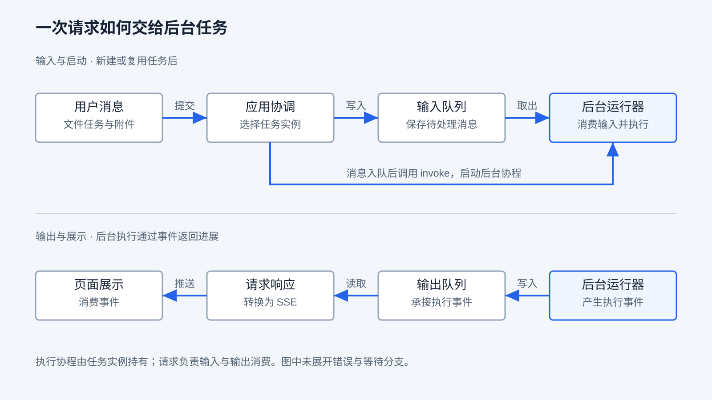
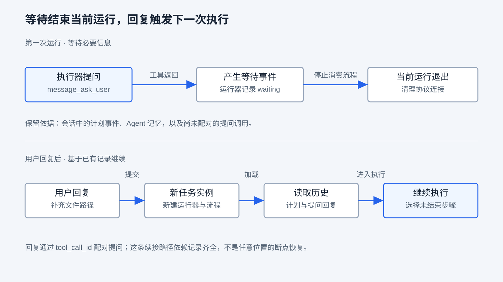
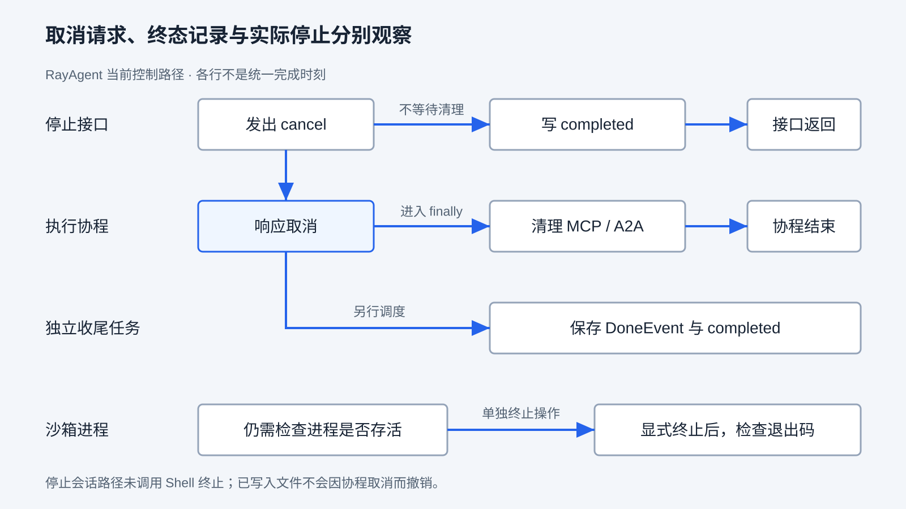

# 任务执行与控制

上一章解释了计划如何驱动步骤、工具结果如何推动下一轮决策。但有了两层循环，还不能回答用户在运行时遇到的问题：提交消息后由谁继续执行？补充一句话会影响哪一步？需要确认时停在哪里？点击停止之后，沙箱里的命令是否还在运行？

本章研究模型循环外面的执行控制。沿用创建、读取 `hello.txt` 的文件任务，再引入缺少路径和长操作两个变体，区分启动、补充输入、等待、取消与执行限制。阅读前应理解工具调用及第七章的内外层循环；无需先部署产品。运行条件与命令分别链接 API 和沙箱指南。

## 请求交出去了，谁让任务继续

用户提交“写入 hello，再读取确认”，页面可能持续显示几十秒进展。在这段时间里，有三个不同的对象：请求负责接收输入和返回事件，后台执行负责调用模型与工具，会话负责关联多次交互及其记录。一次会话可以有多次执行；一次请求结束也不直接说明整个目标已完成。

Harness 要把用户输入交给一个有明确归属的执行单元，并保留观察和控制它的入口。执行单元可以是同进程协程，也可以是独立工作进程。前者交接简单、共享对象方便，但依赖当前进程存活；后者便于分配负载，却要额外处理任务认领、重复投递和跨进程取消。选择消息队列本身，并不会自动完成这些职责。

RayAgent 采用同进程后台协程。应用协调先查会话与关联任务，需要时准备沙箱、浏览器和运行器，把用户消息写入输入流，再调用任务的 `invoke()`。任务适配用 `asyncio.create_task()` 启动运行器；运行器消费输入，进入上一章的规划与执行流程。输出事件则经过输出流、请求响应与 SSE 映射返回页面。



图中上下两部分是同一执行过程的输入与输出方向。启动箭头表示消息入队后尝试启动任务；同一个任务实例已经在执行时，`invoke()` 不会再启动第二个执行协程。运行器一旦发现输入流为空就会退出，并不是永久驻留、持续监听新消息的工作进程。

具体承接条件在 [AgentService.chat](../ray_agent/api/app/application/services/agent_service.py)：只有会话状态为 `running` 且进程内能找到关联任务时，消息才交给已有任务；其他情况创建新任务。输入输出流虽然在 Redis 中，持有协程的任务注册表仍在 API 进程内。重启之后如何判断哪些工作可以继续，是第九章的问题。

因此需要分别观察请求与执行。当前聊天请求没有在结束分支调用任务取消，而显式停止走另一条接口；从源码可以判断二者不是同一个控制动作。这不等于已经证明所有断连时机下的后台执行和事件回放都可靠，本章没有进行真实 SSE 断连实验。

## 运行中补充消息，在哪个时刻生效

假设 Agent 正准备读取 `/old.txt`，用户又说：“改为读取 `/new.txt`。”系统可以采用几种策略：等当前工作全部完成后再处理；在交接点切换输入；或者取消当前工作后重新开始。它们对响应速度、已发生副作用和实现复杂度有不同影响，正文需要明确当前策略，不能只说“支持多轮对话”。

RayAgent 把新消息放入输入流。运行器每处理并发布一个流程事件，就检查输入流是否出现新消息；若有，退出当前流程的消费，转而取下一条消息。此时会话通常仍为 `running`，流程会调整历史消息并进入重新规划。

下面是突出交接位置的简化 Python，省略附件、错误标记、用量与资源清理，不是可独立运行的脚本：

```python
async def consume_inputs(task):
    while not await task.input_stream.is_empty():
        message = await take_message(task)
        async for event in run_flow(message):
            await publish_and_save(event)
            if is_wait_event(event):
                await save_status("waiting")
                return
            if not await task.input_stream.is_empty():
                break  # 转向下一条输入，不再消费当前流程
    await save_final_status()
```

注意检查发生在“一个事件交接之后”，并不专门等待一个计划步骤结束。工具调用前会产生 `calling` 事件，调用后产生 `called` 事件，二者之间才执行工具。如果新消息在前一个交接点被发现，原工具可以尚未执行；如果在后一个交接点才被发现，文件写入等副作用可能已经发生。耗时调用期间如果没有新事件交接，补充输入也不能立即被这段检查发现。

本章的确定性夹具就在 `/old.txt` 的 `calling` 事件发布时注入新输入。结果是：旧调用没有进入文件工具，流程重新创建计划，只读取 `/new.txt`。这证明所控制时刻的分支行为；它不证明任意时刻补充消息都能阻止旧动作，也不代表模型一定能合理整合新要求。

### 同一个执行实例，与同一个用户请求

还要区分“重复启动协程”和“重复提交消息”。当前任务适配能避免同一实例在运行中再次启动协程；但聊天入口不会依据消息内容消除重复提交。相同文字连续提交两次，仍会写入两条输入。事件回放游标用于定位输出读取位置，也不承担业务请求去重。

这项实例内检查同样不能推导为“一个会话永远只有一个执行者”。会话状态查询、资源准备、任务创建和状态更新之间存在异步交接，当前创建路径没有会话级的原子认领。Redis 输入流的弹出锁只保护该流的一次取出操作，并不覆盖会话任务创建；多个 API 进程也各有自己的任务注册表。本章静态核对了这些边界，没有实测多进程竞争或给出并发排他保证。

如果产品要求重复点击只启动一次业务操作，就要先定义什么算同一请求，再考虑请求标识、原子认领与动作结果查询。即使消息去重成功，也还需要判断已经执行的外部动作能否安全重试；相关中断窗口由第九、十六章接着讨论。

## 缺少信息时，等待需要留下什么

把文件任务改成“读取那份文件”，但没有提供路径。模型可以询问路径，真正的暂停却需要 Harness 来完成：把问题展示出去，停止进一步行动，记录等待原因，并让后续回复能够找到此前的问题和任务。

一般设计可以保留一个挂起的协程，也可以结束这次执行，在收到回复后重新组装运行环境。保留协程便于沿原控制位置继续，但长期占用运行对象，且进程丢失时不能靠原调用栈恢复；重新组装有利于释放连接，却要求明确保存计划、上下文、待回答问题和继续条件。无论采用哪一种，只保存一个 `waiting` 字符串都不够。

RayAgent 的等待由几层协作实现。消息工具 `message_ask_user` 本身只返回成功，并没有在工具函数里等待用户。执行器识别它的工具事件：调用前把问题转成助手消息，调用后发出 `WaitEvent`。运行器看到等待事件，保存 `waiting` 并退出；协议连接清理仍会执行。执行器和运行器这两层的配合，才让“询问”成为“暂停”。



图中的继续以此前记录齐全为条件。用户回复到来时，聊天入口会创建新的任务、运行器和流程对象；会话中已有沙箱可尝试复用，不能把新运行器理解成必然新建沙箱。流程读取会话最新的计划，发现状态为 `waiting` 后直接进入执行阶段，再选择未结束步骤。

回复如何与原问题关联？等待发生时，ReAct 记忆末尾通常保留着尚未配对的 `message_ask_user` 调用。新的流程会调用 [BaseAgent.roll_back](../ray_agent/api/app/domain/services/agents/base.py)：如果末尾是这个提问，就把用户回复包装成对应 `tool_call_id` 的工具结果；若末尾是其他未配对工具调用，则删除末尾消息。它调整的是后续模型请求的消息结构，**不会撤销文件写入或外部操作**。

本章夹具先固定模型输出“请提供文件路径”，确认只发出等待、没有文件读取，也没有 `DoneEvent`；再创建新运行器，读取保存的计划和记忆。输入 `/hello.txt` 后，第一次模型请求已经包含原提问对应的回复，流程读取该文件并正常结束，没有再次创建初始计划。

这里验证的是正常等待交接：模型响应、仓库与沙箱使用本地替身，计划和事件在每次保存时保留快照。真实模型会不会主动询问、回复内容是否足够、进程中断后记录是否完整，仍需分别验证。尤其是等待退出前后恰好又有消息入队、历史计划缺失等情况，不能凭这条成功路径认定支持任意断点恢复。

## 等待确认，怎样才构成执行授权

缺少路径是信息不足；目标路径已经存在、是否允许覆盖，是授权问题。两者都可能表现为“问用户一句话”，但继续执行所需的条件不同。补充路径让任务知道操作对象，批准覆盖则明确允许某个动作影响某个对象。

以覆盖 `/home/ubuntu/hello.txt` 为通用教学场景，一条可检查的审批至少要关联：发起请求的用户与会话、待执行的工具及参数、文件路径、准备写入的内容或版本，以及本次批准适用的范围。用户应能审阅“把这个文件替换成这些内容”后作出决定。允许后由执行侧核对动作仍与批准内容一致；拒绝后就不能执行该动作，需要结束或提出新的方案；如果路径、内容或待覆盖版本变化，原批准是否还有效也必须重新判断。

其中的职责分工很关键：模型可以提出动作和解释原因，Harness 根据授权记录决定是否放行动作，执行环境再限制动作实际能够访问的资源。提示里写“危险操作先询问”只能影响模型选择；按钮上显示“同意”也需要有动作关联和执行检查，才能形成技术约束。沙箱的权限与隔离在第十一章展开。

当前 RayAgent 已有询问、等待与回复续接，但这条路径没有建立上述动作绑定的审批记录，也没有通用的执行前审批闸门。调用文件工具前有参数解析和工具分发，不能据此写成“覆盖操作已经获得用户批准”。消息工具说明中的“寻求确认”描述了用途，并不证明完整授权系统已经实现。

这一设计讨论承接第三章的工具契约边界；本章不为配合教材新增审批产品功能。

## 点击停止之后，要确认到哪一层

再把案例改成长操作：进程每隔一小段时间向临时文件追加一行。用户按下停止时，至少有三个需要区分的对象：调用模型或工具的执行协程、沙箱里的操作系统进程，以及已经写入的文件。

对协程请求取消，只能沿该执行链传递取消。Python 的 `Task.cancel()` 会安排在后续执行机会向协程抛出 `CancelledError`，协程可以在 `finally` 中清理资源；发出请求不等于协程已经退出。官方文档也区分取消请求与实际取消结果。见 [Python 3.12 的任务取消说明](https://docs.python.org/3.12/library/asyncio-task.html#task-cancellation)。

RayAgent 的停止路径更值得逐层看：[AgentService.stop_session](../ray_agent/api/app/application/services/agent_service.py) 查找任务，调用同步的 `task.cancel()`，随后直接把会话写为 `completed`。任务适配发出协程取消请求，并移除任务注册项，没有在停止接口里等待运行器清理完成。

运行器捕获取消后，另外调度一个收尾协程，用新的工作单元尝试保存 `DoneEvent` 和 `completed`，然后重新抛出取消；原执行协程在 `finally` 中清理 MCP/A2A 工具资源。这里独立写库是为避开被取消执行上下文的影响，不是对写入成功的持久保证；写入失败仍可能发生，清理分支也会记录并捕获部分异常。



图中执行协程的协议清理与独立收尾写入没有统一完成顺序。确定性夹具把清理暂时阻塞，观察到停止调用已经返回，任务注册项已移除，`completed` 和 `DoneEvent` 已记录，但执行协程仍未结束。放行清理后，协程才结束。因而这些状态与事件都不能单独证明资源清理完成，更不能证明用户目标成功。

当前会话状态包括 `pending`、`running`、`waiting`、`completed` 和 `failed`，没有单独的 `cancelled` 状态。正常结束和取消路径都可能写入 `completed`；失败流程也可能以 `DoneEvent` 收口。解释任务结果时，应结合错误、停止记录与实际产物，而不是把 `done` 翻译成“目标验收通过”。

### 协程退出，为什么进程还能继续

Shell 命令通过沙箱服务创建操作系统进程。停止会话的路径没有调用 Shell 的进程终止接口；运行器的协议清理也不会自动销毁沙箱。销毁沙箱是另一个资源操作，不能用“任务已取消”推定它已经发生。

本章直接运行实际 `ShellService`，在临时目录启动单个 Python 进程持续追加文件。观察顺序如下，字节数是本次运行记录，不是固定预期输出：

| 观察点 | 本次结果 | 可以支持的判断 |
|---|---|---|
| 等待进程结束，1 秒到期 | 返回等待超时，进程仍存活 | 等待超时没有终止操作 |
| 取消执行命令的调用协程 | 协程已取消，文件由 50 字节增至 53 字节 | 调用停止后，进程仍能产生副作用 |
| 显式调用进程终止 | 返回 `terminated`，实际退出码 `-15`，文件停止增长 | 本次单进程已退出 |
| 检查文件并回收实验资源 | 53 字节内容仍在；脚本随后删除临时目录 | 取消与终止都不负责撤销此前写入 |

这个实验运行于宿主机的沙箱 Python 环境，未经过 HTTP、API 停止接口、Docker 或真实模型。它与运行器夹具提供两段互补证据，不能拼接成一次完整产品端到端验收。脚本使用 `exec` 把 shell 替换为目标进程，方便明确回收对象，所以也没有验证多层子进程、忽略终止信号或远程服务的取消传播。

源码还显示，当前 `exec_command` 会等待输出读取器结束；不能只根据后面存在“等待 5 秒后返回 running”的分支，就认为所有长命令都会在 5 秒内返回。本地实验在取消前也观察到执行调用尚未返回。需要定位长命令阻塞时，应同时看读取器、进程和调用状态。

对于真正的任务取消确认，需要先定义要停止哪些对象，再逐项取得依据：不再调度后续行动、当前执行退出、相关远端工作收到取消且结束、必要连接已清理。已有文件或外部写入若要撤销，还需要单独的补偿或版本策略。不同工具的取消能力由各自实现决定；MCP/A2A 的传播细节留给对应章节。

## 次数、时间和消耗，分别限制什么

取消由外部请求触发；执行预算则让程序在没有用户盯着时也能约束消耗。设计预算前先明确它限制的对象：一轮工具反馈、一次请求、一轮用户任务，还是整个会话。范围不清楚，就容易把局部限制误写成全局保证。

| 控制方式 | 约束对象与用途 | RayAgent 当前边界 |
|---|---|---|
| 迭代上限 | 防止一次内层调用无限反复执行工具与请求模型 | `max_iterations` 用于 `BaseAgent.invoke`，默认 100；不累计整个计划或会话的全部行动 |
| 尝试次数 | 限制一次模型或工具调用失败后的重复尝试 | `max_retries` 默认 3，代码循环表示最多 3 次尝试；不等于整个任务最多重试 3 次 |
| 请求超时 | 避免一次网络等待无限持续 | 模型适配传入 `timeout=3600`，沙箱 HTTP 客户端配置 `timeout=600`；这些请求配置不是用户任务总时限 |
| 进程等待超时 | 限制调用方等多久才重新判断 | Shell 的 `wait_process` 默认等待 60 秒，到期报错；不自动杀掉进程 |
| 协议操作预算 | 限制连接、发现或远程调用 | MCP/A2A 有各自的超时配置与边界，不能替代整个本地任务的统一截止时间 |
| 单次输出限制 | 控制一次模型回复的最大输出规模 | 模型配置有 `max_tokens`；不能代替输入、重试和多次调用的总消耗限制 |
| 总时限与总消耗预算 | 给整个任务规定时间、token 或费用上限 | 已检查的主协调和运行路径没有统一的总截止时间或消耗达到阈值后的强制停止机制；已有用量累计用于记账 |

次数上限也不能直接换算成模型请求数。当前基础循环先请求一次模型，再进入迭代循环；每轮可能执行工具并再次请求模型，模型调用和工具调用内部还可能重试，计划中的不同阶段也会另行调用 Agent。必须沿实际控制位置解释配置，不能只看字段名字。

一个具体边界是：设置 `max_iterations=1`，第一次模型提出读取文件，工具执行后第二次模型给出最终文字。基础循环在下一轮开头才检查是否还存在工具调用，此时循环已耗尽，会先发出超限错误。夹具将上限改为 2 后，同一响应序列才进入正常停止分支。在步骤执行路径中，执行器收到超限错误会按失败处理。这个例子说明上限约束的是当前实现的循环次数，也提醒我们验证边界输入，而不只测试“持续调用工具会不会最终报错”。

### 怎样形成真正的任务预算

通用设计可以在任务开始时记录总截止时间，并在每次请求或动作前计算剩余时间，把单次允许等待时间限制在剩余额度以内；达到截止时间后停止调度，并进入取消与清理。某个工具不响应取消时，仍需记录未完成清理，而不能仅凭计时器到期宣布执行已停止。

token 或费用预算则需要区分请求前的估计与请求后的实际记账。只在模型返回后累计，可能在发现超限时已经消耗了额度；若要求更严格的上限，就要在发出请求前预留额度，返回后结算，多执行者还需共享同一份额度。费用还依赖价格和计费口径；缺失用量不应按零处理。这里讲的是设计条件，RayAgent 的用量展示和累计不能据此称为强制预算系统。

上限触发后的交付也属于控制设计：保存已经确认的成果、标明未完成部分和停止原因，使用户能够判断是继续、缩小任务还是结束。模型“不再调用工具”、程序“停止调度”和用户“目标已完成”是三个需要分别验证的判断。

## 用观察检验自己的理解

可以先推演，再对照实验，不要求每位读者都运行完整产品。API 的确定性控制用例见[测试指南](../ray_agent/api/README.md#测试与数据库迁移)，实际 Shell 进程实验见[沙箱控制观察](../ray_agent/sandbox/README.md#任务控制观察)。前者固定模型响应，后者不经过产品请求链。

若具备完整产品环境，可按以下情境补充观察。每次记录会话标识、触发时刻和实际证据；模型没有进入预期路径时，记录它实际做了什么，不把任务描述当作执行事实。

| 情境 | 要保留的证据 | 要回答的问题 |
|---|---|---|
| 写入并读取 `hello.txt` | 工具记录、最终状态、读取内容 | 正常收口是否真的交付了目标？ |
| 缺少路径，收到提问后补充 | 等待事件、回复、前后计划和执行输入 | 回复如何找到此前问题，继续依据是什么？ |
| 运行中提交新的读取路径 | 新消息与工具调用的相对时刻、实际访问路径 | 新输入是在动作前还是动作后生效？ |
| 同一会话重复提交 | 输入条数、任务实例、实际工具调用次数 | 实例内防重入是否被误认为请求去重？ |
| 长操作中请求停止 | 停止响应、终态、协程和进程状态、文件变化、清理记录 | 哪些对象已经停止，哪些还未得到确认？ |

长操作应只写入可回收的临时目录，并保留独立终止入口；验证之后回收实验进程与目录。实验脚本已经这样处理。本轮 Docker 未运行，真实 Web 等待、取消、重复提交及完整服务链路均为 `unverified`；已有第六章成功任务也不能覆盖这些控制路径。

读完本章，应能解释下面三个判断：

1. 页面显示 `completed`，但文件仍在增长，并不自相矛盾：状态写入与进程停止属于不同层。需要追查停止是否传播到真正的执行对象。
2. 用户回复“可以”，并不足以单独证明覆盖动作获准：还要知道批准关联的路径、内容、版本和执行前检查。
3. 有迭代上限和 token 统计，也不代表任务已有总预算：必须找到跨调用累计的额度、强制检查位置和触发后的停止处理。

等待和取消都依赖“哪些信息留下来了”。接下来转向状态与持久化，进一步区分会话记录、内存执行对象和外部副作用，以及这些东西能否支持后续恢复。

[上一章：规划与内外层循环](07-planning-and-nested-loops.md) · [课程目录](README.md) · [下一章：状态与持久化](09-state-and-persistence.md)
