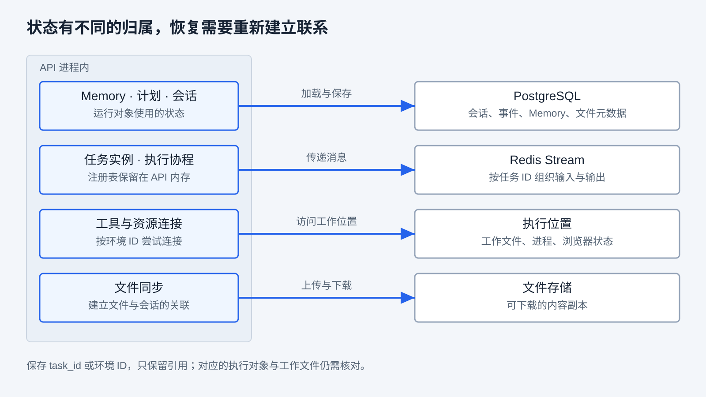
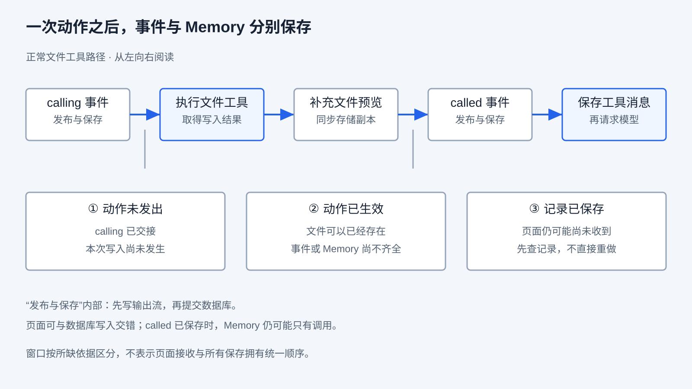
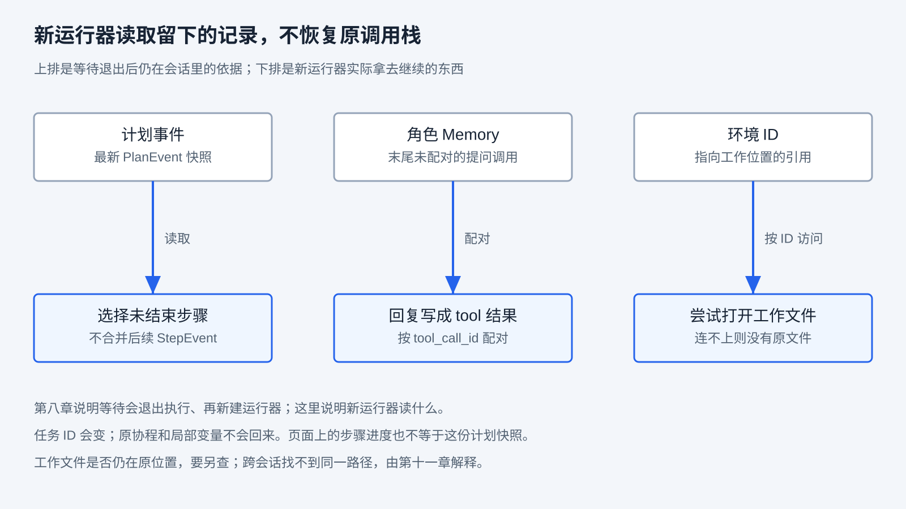

# 状态与持久化

上一章把循环外面的控制讲清了：等待会结束这次执行再组装，补充输入在事件交接处改道，停止可以先写下终态。这些动作都留下一个共同问题：执行停住以后，哪些东西还在？收到回复时为什么能新建运行器？点击停止后，工作文件为什么还可能继续变化？

继续沿用前文的任务：创建 hello.txt，写入 hello，再读取确认并作为附件交付。假设文件刚写完，读取还没发生，执行就在这里中断。重新打开页面看到了写入记录，是否就能继续？应该重新写入，还是直接读取？本章研究这些判断需要什么依据。

阅读前应理解第五章的 Context 与 Memory、第七章的步骤与工具调用，以及第八章的启动、等待与取消。无需先启动产品。正文先解释机制，再对照源码、确定性夹具和一次真实的同会话等待续接；运行条件链接所属指南，意外崩溃的情境均为推演，不冒充已完成的故障实测。工作文件写在执行位置（RayAgent 称之为沙箱）；本章只把它当成与会话记录寿命不同的外部副作用，容器归属和隔离留到第十一章。

## 执行停住以后，要分清什么还在

第八章已经说明：请求、后台执行、会话不是同一个对象。停住之后，现场还会再裂开——程序里的记录、进程里的协程、工作位置上的文件，不必一起留下，也不必一起消失。

第一章提醒过：重新打开页面能看到“写入完成”，只能说明记录还在。第六章的真实任务也只验证了成功任务刷新后能查看历史和附件，没有验证在写入中途重启后继续。

这里把几个动作分开定义。**保存**是把信息写入某个存储；**持久化**使信息能够超出当前内存对象的寿命而保留，具体能承受什么故障取决于存储和部署条件。**历史回放**是重新读取记录并构建可见过程，不重新执行记录中的工具。**恢复执行**则是依据可用记录和当前环境重新推进工作，需要安排真正的执行者，并判断哪些动作仍然需要做。历史可回放与执行可恢复相关，却没有必然的包含关系。

这些问题可以先看成一张地图。每种情况都要分清留下的是哪一类状态；RayAgent 的选择写在第三列，后文先讲要设计什么，再对照当前怎么做。

| 停住之后要分清什么 | 常见策略 | RayAgent 当前怎么做 |
|---|---|---|
| 新执行者靠什么继续 | 挂起原协程，或退出后按保存条件再组装 | 读取最新计划事件和角色 Memory；工作位置只保存引用，能连上再用 |
| 事件已交出时，记忆是否已经写完 | 以步骤为界，或以事件交接为界 | `yield` 之后才继续；事件和 Memory 不是同一时刻写完 |
| 终态写下后，外部副作用还在不在 | 记录终态，或连文件/进程一起停 | 会话可以写成 `completed`；工作文件不随取消回滚 |
| 刷新后看见历史，是否有人在跑 | 回放历史，或恢复执行 | 能看见写入记录，不等于有执行者 |

读表时先抓住两个区分：**历史回放不等于恢复执行**；**程序里的记录不等于工作位置上的文件**。同一项任务没有一份总状态，页面上的、进程里的、已经写下的会分开留、分开丢。下面按这些问题分别说明。

## 同一项任务，状态分别归谁

对应表中要继续执行的那一行：停住之后，请求、后台执行和会话各自还指向什么。第五章区分了“环境发生了什么、程序记录了什么、模型本次获得了什么”。现在把观察时间延长到对象销毁或进程退出之后：工作位置中的 hello.txt、数据库中的写入记录、下一次请求中的工具结果，可能分别保留，也可能分别丢失。

不要把这件事理解成「文件进存储、计划和记忆进数据库」。核心是它们会分开消失，系统也不会自动对齐成一份：

| 寿命 | 还在不在取决于什么 | 表中的典型对象 |
|---|---|---|
| 这次请求临时组装 | 这一次连接或这一次模型调用是否还在进行 | Context、页面展示 |
| 当前进程里的执行现场 | 这条协程和这个 API 进程是否还活着 | Flow 局部状态、执行协程、任务注册表 |
| 进程之外还能再找到的 | 记录、引用或外部对象本身是否仍可访问 | Memory 与计划事件、会话里的 ID、Redis 流、工作文件、附件 |

第三类内部仍不是同一份东西：ID 只是引用，记录是快照，工作文件才是真正改过的世界。状态也不只是一枚 `running` 标签。下面这张细表按对象写出存放位置；阅读时先对上寿命，再用第三列判断「停住之后该去查哪一份」。

| 信息或对象 | 寿命 | 当前由谁维护、保存在哪里 | 再次使用时要检查什么 |
|---|---|---|---|
| 本次 Context | 这次组装 | Agent 用消息、提示和工具说明组装模型请求 | 请求需要重新构造；已保存的 Memory 不等于完整请求转录 |
| 页面展示 | 这次组装 | 前端从历史详情和实时事件派生 | 当前画面代表哪份记录，不能作为后台运行对象本身 |
| Flow 状态、局部变量、执行协程 | 当前进程 | API 进程内的流程与任务对象 | 没有原调用栈时，需由程序重新选择入口 |
| 任务注册表 | 当前进程 | `RedisStreamTask` 类维护的进程内字典 | 当前 API 进程是否持有该实例；数据库有 task_id 不代表查得到 |
| Planner / ReAct 的 Memory | 进程之外 | Agent 在内存中使用，按会话 ID 和 Agent 名称保存到 PostgreSQL | 读取到哪次保存；调用与结果是否配对，清理后还剩什么 |
| 计划及步骤 | 进程之外 / 当前进程 | Flow 使用内存中的 Plan；计划和步骤事件分别进入会话历史 | 最新计划快照是否包含最近步骤变化，不能只看页面进度 |
| 会话状态、任务 ID 与环境 ID | 进程之外 | 会话仓库保存到 PostgreSQL | ID 指向的执行对象和工作位置是否仍可找到 |
| 输入与输出消息 | 进程之外 | Redis Stream，按任务 ID 建立流 | 消息是否仍在、是否被消费、是否仍有对应的读取者 |
| 工作文件、进程与浏览器状态 | 进程之外 | 实际执行位置 | 位置是否仍在、内容是否改变；路径字符串不能保存文件内容 |
| 附件记录与存储内容 | 进程之外 | 数据库维护元数据和关联，文件存储保存内容 | 存储副本能否访问、对应哪个时刻；不自动还原全部工作文件 |

这张表按“对象归谁”排列，不按数据库表排列。当前实现里，会话历史、附件元数据和两份 Agent Memory 都作为会话记录内部的 JSONB 列保存，没有独立的事件表或记忆表；因此“历史里有多少条事件”是在一条会话记录内部计数，而不是查一张按事件展开的表。核对位置见[素材索引](map.md#第-09-章素材)。



图按存放位置分组：左侧多是当前进程里的对象，右侧是进程之外还能再访问的位置。箭头由使用方指向被访问的位置，不表示所有内容都经过同一次事务。API 重建执行对象时，可以重新读取数据、访问工作文件，却不能从 task_id 取回已经消失的 Python 调用栈。会话里的环境 ID 和 task_id 一样，只是引用。

第五章所说的会话内 Memory，即使保存很多天，使用范围仍然是该会话。跨会话偏好或项目经验还需要额外的查找与作用域机制。另一方面，Memory 中被 `compact()` 替换掉的网页内容，不能靠重新加载同一份消息恢复原文；保存了处理后的表示，并不意味着另有原始副本。

“保存多久”也没有一个全局答案。当前 Compose 为 PostgreSQL、Redis 和本地文件存储配置了数据卷，Redis 还启用了 AOF，并设置 `maxmemory` 与 `allkeys-lru`。这些配置不能被概括成无限保留或零丢失。卷、数据库记录和 Redis 键各有删除条件；执行位置何时回收，在第十一章展开。本章核对配置与读写路径，没有测量所有故障下的保留保证。

## 一次写入，怎样变成多份记录

对应表中的第二行：事件已经交出时，记忆是不是同一时刻写完。第六章已经说明，同一个工具结果有不同使用者：执行器把它送回模型，运行器补充界面预览并保存事件，文件同步把内容变为可交付副本。本章要进一步问：这些动作是不是同时完成？

在当前正常文件工具路径中，模型响应先保存到角色 Memory，其中可能有尚未配对的 `write_file` 调用。执行器交出 `calling` 事件；运行器处理、发布并保存这个事件后，流程继续，才实际调用文件工具。工具返回后，执行器交出 `called` 事件，运行器再补充预览和文件同步，并把事件写入输出流及会话历史。

**直到外层继续消费事件，执行器才把工具结果加入本轮的 `tool_messages`。** 当前响应包含的工具处理完后，下一次 `_invoke_llm` 会先保存这批消息，再请求模型。因此，工具结束事件已被记录时，角色 Memory 仍可能停留在只有调用、没有结果的位置。工具事件里的 `function_result` 和 Memory 里的 `role: tool` 消息属于两条保存路径。

下面把单次文件调用的交接简化成 Python。辅助函数代表已核对的职责，省略多工具、附件细节、错误、等待和重试；不是可独立运行的脚本：

```python
async def one_action(call):
    # 模型返回的 assistant 调用消息此前已经保存。
    await publish_then_save(calling_event(call))
    result = await execute_tool(call)
    await enrich_file_preview_and_sync(call, result)
    await publish_then_save(called_event(call, result))
    await save_tool_message(call.id, result)
    return await request_next_model()
```

真实代码通过异步生成器分层交接。`yield` 把事件交出去之后，生产者暂停；下一次消费才继续执行后面的语句。这正是第八章补充输入可以在事件交接处改变流程的原因，也让“事件已经交出”与“消息已经保存”之间存在可以观察的间隔。

还有另一个顺序：[AgentTaskRunner._put_and_add_event](../ray_agent/api/app/domain/services/agent_task_runner.py) **先向 Redis 输出流发布，再把事件加入数据库会话**。页面读取输出流与数据库写入可以交错，不能把图画成“先提交数据库，之后页面才可能看见”。本地夹具让会话仓库在保存时失败，观察到输出队列已有事件而历史为空；它验证调用顺序，不代表已经实测数据库故障下的页面表现。



图只展开一次成功的文件工具调用。上排是保存顺序，下排是中断时缺什么依据；竖线从对应步骤连到窗口，不表示页面接收与所有保存拥有统一顺序。每个“发布与保存”内部仍分为输出流发布和数据库提交；文件同步也可能另行失败。正常情况下这些记录最终能够衔接，但中途出错时，它们不必停在同一位置。

### 事务能保护哪一段

数据库工作单元在正常退出时提交，在异常路径尝试回滚。仓库执行了更新语句，与工作单元成功提交，是两个时刻。当前 UoW 的部分提交或关闭异常还会被记录并安排后台清理，因此仅看仓库方法返回，不能替代确认提交结果。

更重要的是，这个数据库事务没有把工作文件写入、Redis 发布和文件存储操作一起纳入。数据库回滚不能自动让 hello.txt 回到旧内容，也不能撤回已经发布的事件。即使几类记录最终都进入 PostgreSQL，它们若由不同工作单元分别提交，也不自动形成一份共同快照。

通用设计可以将需要一起变化的数据库记录放在同一事务中，或先在数据库中记录待发布事件，再由发送程序投递；后者还要处理重复投递。它们能缩小某些不一致窗口，不能独自解决外部文件已经写入、结果却没有返回的问题。本章解释这些设计条件，RayAgent 当前路径仍需按实际提交边界理解。

## 三个中断窗口，需要不同的判断依据

对应表中的第三行：终态写下之后，工作文件为什么还可以继续变。继续推演写入 hello.txt 的任务。下面的“未发出”“已生效”是观察者在受控实验中知道的事实；恢复程序只看到残留记录时，未必能判断自己处于哪个窗口。

| 中断位置 | 实际可能留下什么 | 继续前缺少什么 | 直接重做的风险 |
|---|---|---|---|
| 动作尚未发出 | 调用消息或 `calling` 记录；本次动作尚无副作用 | 能否确认没有发出、当前目标与执行条件是否仍有效 | 单凭 `calling` 不能排除动作随后已执行但未记录 |
| 动作已经生效，结果尚未可靠保存 | 文件已写入；事件、Memory 或调用方结果可能缺失 | 从工作位置查询结果，关联操作和资源，确认是否仍有执行者 | 追加、发送等动作可能再次生效；重做不能只由“没看到成功”决定 |
| 结果已保存，页面尚未收到 | 指定存储中的结果存在，页面仍是旧视图 | 保存的是事件还是 Memory；历史读取或消息流是否能取得它 | 为补页面展示而重新提交任务，会把读取记录变成再次行动 |

第二个窗口还包含调用方根本没拿到响应的情况：写入已经落到工作文件，返回途中断开。调用方收到超时，只知道没有及时拿到结果，不能据此断定写入没有发生。这也承接第八章的“等待超时不终止进程”。

第三个窗口同样需要具体化。如果只保存了工具事件，Memory 还没有结果，恢复模型输入的问题依然存在；如果文件副本已上传，但会话关联没提交，文件存在也不代表用户已有下载入口。反向窗口也可能出现：页面先看到输出流事件，数据库稍后才提交。

本章的确定性用例实际执行了临时文件写入，在 `called` 交接时序列化会话：文件为 `hello`，保存的 Memory 末尾仍是 `write_file` 调用，没有对应工具结果。继续消费时，结果随后进入 Memory；在该点停止消费并新建 Agent 整理消息时，末尾调用可被删除，文件却仍为 `hello`。这验证了记录间隔和消息回滚的作用范围，不是一次 API 崩溃恢复实验。

## 等待后，新的运行器怎样接续

对应表中的第一行：新执行者靠什么继续。正常等待与任意时刻崩溃的区别，在于前者走了明确的交接路径。通用做法可以尝试恢复原来的调用栈，也可以按保存下来的计划、记忆和环境引用重新组装运行。恢复调用栈便于接着上一行代码往下走，但进程一丢就没有原栈；重新组装能换执行者，却要求继续条件写清楚。第八章已经选择退出后再组装，现在看组装时实际读到什么。

聊天入口创建新任务和运行器，并按会话里保存的环境 ID 尝试连接原来的工作位置。新流程依据 `waiting` 进入执行阶段，从最新计划事件取计划，再选择未结束步骤。若记忆末尾是待配对的提问调用，就把回复包装成该调用的工具结果，供后续模型请求使用。



这不是在上一条 Python 语句后恢复原协程。下面用简化 Python 表达已有等待路径的职责，假定会话记录齐全、计划存在且工作位置仍可访问，省略资源构造与事件处理，不能独立运行：

```python
async def continue_waiting(session, reply):
    plan = session.get_latest_plan()
    agent = create_agent(session.id)
    await agent.roll_back(reply)  # 加载 Memory，尝试配对末尾提问
    step = plan.get_next_step()
    async for event in agent.execute_step(plan, step, reply):
        yield event
```

这里仍然重新进入当前步骤的执行器。模型依据保存的观察和回复提出下一次动作；程序没有恢复一个精确到工具调用后某行代码的检查点。计划缺失、末尾有复杂的多调用组合或保存不完整时，不能拿这段单次提问的正常路径作保证。

### 最新计划，与页面显示的进度

第七章已经展示，一步可能包含多次工具调用，所以计划步骤本来就不足以表示步骤内的位置。当前实现还有一个更具体的区别：`Session.get_latest_plan()` 倒序查找最近的 `PlanEvent`，没有将其后的 `StepEvent` 重新合并进计划；前端展示则会将计划事件之后的步骤事件应用到页面列表。

例如，初始计划快照中步骤一为 `pending`，随后 `StepEvent` 记录它开始运行，页面可以显示运行中。此时等待退出，新 Flow 读取的最新计划仍可能把步骤一列为 `pending`。`get_next_step()` 会选择未结束步骤，`pending` 和 `running` 都属于这一范围，但页面的当前进度与恢复所用快照仍不是同一个表示。

这也意味着，步骤已经完成、尚未产生下一份计划快照的中断窗口需要单独检查。旧快照可能仍将该步骤列为未结束，不能仅凭页面上的完成标记认定恢复一定跳过它。本章序列化夹具验证了等待时的快照差异；该完成窗口的真实故障注入留到第十六章。

### 本次同会话的实际观察

本次通过真实聊天 API 提交文件任务，明确要求先写 `/home/ubuntu/ch09-resume.txt`，内容为 `hello-ch09`，再询问并等待；收到回复后读取并交付。请求经现有模型、Redis、PostgreSQL 和执行位置处理，没有用夹具替换产品执行。

等待时，会话为 `waiting`，有 `wait` 事件，工作文件为 10 字节的 `hello-ch09`，ReAct Memory 末尾保留提问调用。随后在**同一个会话**回复继续，观察到任务 ID 改变，指向工作位置的 ID 保持不变。模型接着调用 `read_file`，没有再次调用 `write_file`；最终会话为 `completed`，有 `done`，附件下载得到相同字节。新打开页面并刷新后，询问、回复、工具记录和附件仍可查看。

这次也出现了第七章熟悉的现象：初始计划有三步，写入、提问和续接读取实际都发生在第一步内，后续计划收缩为一个已完成步骤。等待时数据库中的初始计划仍为 `pending`，步骤开始事件已是 `running`。因此，续接后再次进入“写入”步骤标题，不能被直接计作又执行了一次写入，仍要核对真实工具调用。

第八章此前的文件缺失观察涉及不同会话：在一个会话创建文件，在另一个会话提供该路径，后者的工作位置中找不到它。它说明路径依赖执行位置，不证明同一会话等待后丢失文件；为什么不同会话各有一份工作现场，由第十一章解释。本次补上了同会话的正常续接证据；没有重启 API、替换执行位置或验证任意中断恢复，模型也不保证在每次同类任务中作出同样的行动选择。

## 刷新、重连与重启分别改变什么

对应表中的第四行：重新打开涉及哪个组件，决定了需要恢复什么。刷新浏览器通常只重建页面状态；API 重启则会丢失内存中的任务对象；执行位置被替换时，即使 API 和数据库都还在，工作文件也可能已不可访问。

| 情境 | 可以沿哪条路径重新取得信息 | 不能据此推断什么 |
|---|---|---|
| 页面刷新或重新打开 | 前端加载会话详情与文件列表，由事件重建展示 | 不表示任务从某个工具断点恢复 |
| SSE 连接重建 | 在关联任务仍可读取等条件下，按事件游标读取输出流 | 游标不是业务去重键，也不保证任意时刻所有事件都补齐 |
| 正常等待后回复 | 新建任务与 Flow，加载计划和 Memory，按环境 ID 尝试访问原工作位置 | 不保留原调用栈；不是通用动作级检查点 |
| API 进程重启 | 数据库和工作文件可能仍在；进程内注册、协程与局部状态丢失 | Redis 有消息不表示有人自动认领并继续 |
| Redis 重启或消息不再可用 | 取决于实际存储与保留条件；数据库历史可独立存在 | 数据库历史不自动补回输入队列、执行者或所有未提交事件 |
| 工作位置不可用 | API 可以尝试再准备执行位置，附件存储可能仍可下载 | 新位置不自动拥有原文件、进程、浏览器状态 |

当前聊天入口仅在收到消息时按会话状态和任务查找结果决定是否创建新任务。若只有无消息的连接请求，找不到任务，就不会靠数据库中的 task_id 自动重建执行。旧会话仍标为 `running` 时收到新消息，Flow 进入重新规划；这也不同于 `waiting` 的继续执行分支。第八章已经区分过补充输入（同一条执行改道、通常再规划）和等待续接（新建执行、进入未结束步骤）。

消息的消费语义同样重要。当前 Redis 输入队列的 `pop()` 在取出时删除消息，随后运行器才处理它；这不是“执行完成后再确认消费”的工作队列。取出后进程丢失，即使历史中保存了用户输入，也需要明确的再调度策略才能重新处理。输出流的游标则解决从哪里继续读取，不能代替输入重投或动作结果查询。

工作文件能否按原 ID 再次打开、打不开时会得到怎样的新位置，在第十一章展开；文件如何变成可下载附件，在第十二章展开。

## 怎样决定下一次动作能否重做

面对“动作可能成功，但本地没有结果”的窗口，单纯多保存一份计划不能消除不确定性。程序还需要理解动作的语义，并取得与这次动作相关的证据。这也接上第八章：实例内防重入不能当成请求去重，更不能当成外部写入的恰好一次保证。

先回到第三章的文件工具。固定路径、固定内容，且期间没有其他写入者时，把文件覆盖为 `hello` 两次，最终正文可以与一次相同；但向已有日志追加 `hello` 两次，会留下两份内容。前一种操作在这个明确的结果口径下具有幂等性，后一种则没有。不能把“覆盖通常得到相同正文”扩大成没有任何副作用：修改时间等元数据可能变化，其他执行者写入的新内容也可能被覆盖。

这给恢复设计提供了几条相互配合的办法。

**先查询已有结果。** 文件仍在原工作位置时，可以读取内容并检查路径、版本和必要的操作标识。当前内容为 `hello` 能证明现在的正文，却未必证明是哪次调用写的。如果任务只要求最终内容正确，这可能足够；如果要求恰好追加一次，就需要能区分记录来源的依据。

**为同一业务操作保留稳定标识。** 通用的幂等键需要在重试时复用，由执行侧把它与参数及处理结果关联，并处理并发到达。只有生成一个 ID、没有原子检查与结果保存，仍会重复执行。Chat Completions 的 `tool_call_id` 在当前路径用于调用与结果配对；新任务 ID、事件游标也各有用途，不能自动当作业务去重键。

**在明确边界保存检查点。** 一份用于继续执行的快照应表达目标、已确认进度、待完成事项，以及必要的资源引用和未决动作。保存越频繁，通常越能减少丢失的进度，但会增加写入和一致性维护；按步骤保存更简单，却无法独立定位步骤内部的工具动作。即使动作前后都保存，外部生效与本地记录之间仍可能有间隔，需要结果查询或幂等执行配合。

**确定谁有权继续。** 如果原执行者可能仍在写文件，第二个执行者不能仅凭旧 `running` 标签就接管并重复动作。通用设计可通过原子认领、租约或版本检查协调所有权，还要防止旧执行者在失去所有权后继续写入。第八章的实例内防重入和 Redis 弹出锁没有覆盖全部会话创建与外部写入过程，不能作为这项保证。

这些办法针对不同缺口。无法查询结果、无法安全重做时，应保留不确定状态并说明需要的确认，而不是将“没有成功记录”直接改写成“没有执行”。如果要撤销已发生的动作，则要另外设计补偿或版本恢复；删除一条 Memory 消息不会完成这些工作。

## 用观察检查恢复依据

可以先给每个判断找出对应证据，再决定是否需要运行。定向夹具和运行命令见 [API 测试指南](../ray_agent/api/README.md#测试与数据库迁移)；完整产品条件见[应用运行指南](../ray_agent/README.md)。

同会话实验可以按“写入—询问—回复—读取”观察，等待时与完成后分别记录会话、任务和工作位置标识，比较计划快照、步骤事件、末尾消息、文件内容和附件下载。模型未进入等待时，记录实际行为；不要把题目里写了“等待”当作已取得暂停证据。正文中的 API 实验和页面刷新验证属于正常路径，确定性夹具只控制局部交接，两者都不代替第十六章的故障实验。

读完本章，可以对照开头的表检查理解：页面有记录只说明这次组装或已经写下的快照还在，不等于当前进程里还有执行者，也不等于工作文件还在。

1. 数据库中有 `called`，Memory 末尾却只有调用，是否矛盾？先查两条保存路径与事件交接顺序，再判断恢复输入缺什么。这就是第八章补充输入能插进交接处的原因。
2. 等待后新运行器为什么能继续，却不是原协程接着跑？它读取的是计划事件、Memory 和提问配对；task_id 会变，调用栈不会回来。
3. 页面显示步骤运行中，新流程取出的步骤却是 `pending`，是否一定是数据库丢数据？先区分最新计划快照与前端合并步骤事件的展示。
4. 新任务拿到了原环境 ID，是否足以宣布恢复成功？还要确认工作位置仍在、内容与当前目标一致，并核对实际后续行动和交付。连不上时会发生什么，见第十一章。
5. 追加调用超时后没有成功事件，是否应该立刻重试？结果未知时，应先查询或依据幂等机制判断，否则可能重复追加。页面显示 `completed` 也一样：终态记录不代替工作文件已经停住。

下一章转向这些记录本身：现有事件能证明发生过什么，又代替不了执行。

[上一章：任务执行与控制](08-task-execution-and-control.md) · [课程目录](README.md) · [下一章：事件与可观察性](10-events-and-streaming.md)
