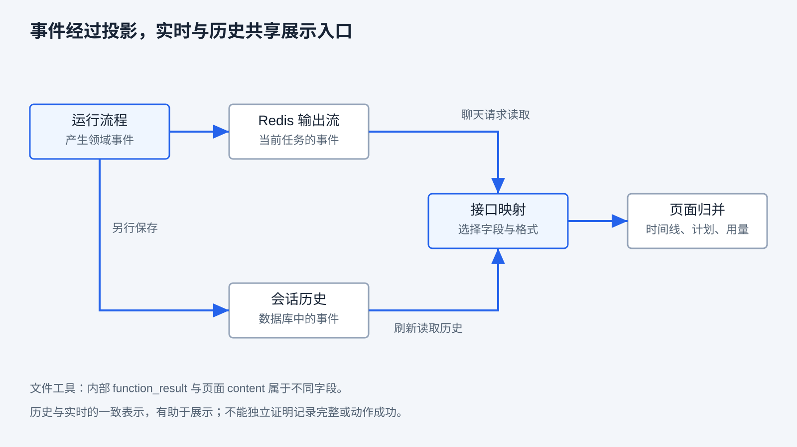
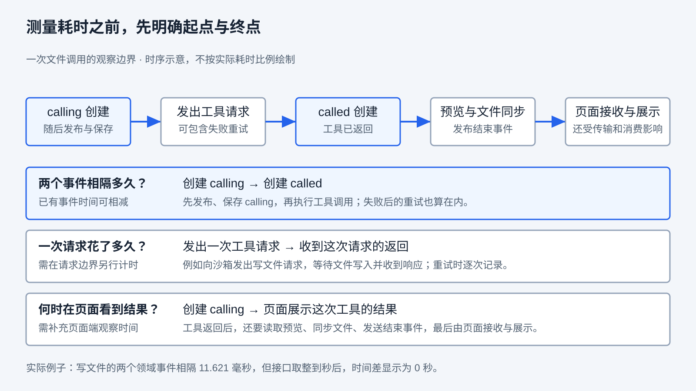

# 事件与可观察性

第九章区分了保存、回放和恢复：工具事件已经保存，Memory 可能还没有结果；页面显示的步骤进度，也可能不同于新 Flow 读取的计划快照。接下来的问题是：我们怎样知道这些事情发生过，又能从现有记录中判断到哪一步？

继续看写文件、等待回复、再读取并交付的任务。假如页面停在“正在读取”，可能是文件读取尚未返回，也可能是事件尚未传来，或者只是历史记录仍沿用这个标签。观察系统的任务，就是让这些解释有办法被区分，而不是仅仅让页面不断出现新内容。

本章承接第二章的响应接收、第六章的工具预览、第八章的执行控制和第九章的保存边界。无需先运行产品；我们沿已有真实任务核对事件、历史与用量，再用本地夹具检查映射和解析。具体环境与命令分别见 [API 指南](../ray_agent/api/README.md#测试与数据库迁移)和 [UI 指南](../ray_agent/ui/README.md#事件观察)。本章没有新增界面截图，也没有把局部夹具当作真实断连验收。

## 从“页面没变化”到可以回答的问题

用户说“卡住了”，描述的是体验，还没有指出故障位置。程序需要留下能区分不同情况的证据：有没有接收请求，是否进入步骤，是否发出工具调用，调用是否返回，事件有没有发布，页面是否已经消费。

**可观察性关注的是根据系统输出理解运行状态与问题原因的能力。** 日志多、事件多，都不保证能够回答问题。如果记录没有关联标识，我们可能把另一个会话的读取当成当前任务的进度；如果只有结束消息，没有起点和中间交接，就很难定位时间花在哪里。

可以把常见证据放在同一任务里理解：

| 证据 | 在文件任务中回答什么 | 单独使用的局限 |
|---|---|---|
| 业务事件 | 哪个步骤开始、哪次工具调用返回、什么时候等待 | 只覆盖代码选择发出的变化，未必包含每次底层尝试 |
| 运行日志 | 哪段程序进入了什么分支，调用失败时有什么上下文 | 自由文本不一定能稳定关联，也不等于用户可见历史 |
| 指标 | 一组任务的延迟、失败次数和已记录用量如何变化 | 聚合结果通常不能独自解释某一次失败 |
| 调用追踪 | 一次请求经过哪些操作，它们的父子关系与时间区间是什么 | 需要传播关联信息并覆盖关键边界，时间相邻不能替代因果关联 |
| 产物检查 | 文件实际内容是否符合要求，下载是否可用 | 证明结果，不自动解释过程为何这样发生 |

[OpenTelemetry 的信号概览](https://opentelemetry.io/docs/concepts/signals/)将日志、指标与追踪作为不同观察信号。这里借用这些通用职责理解问题，不要求安装该框架，也不表示 RayAgent 已经具备完整的追踪和指标平台。当前产品主要提供业务事件、控制台日志、用量累计与产物入口。

对 Agent 还要保留第一章的区别：模型说“文件正确”是一条陈述，工具读取和实际文件是进一步的依据。记录过程有助于评价结果，却不能自动成为独立的目标验收器；任务质量和评分方法由第十六章展开。

## 一次工具执行，怎样成为页面记录

第六章已经看到，文件工具结果既要进入模型输入，也要用于页面展示。本章只沿展示路径继续追踪。

执行器产生领域事件，表达程序中的变化，例如“准备调用读取”和“读取调用返回”。运行器接到文件工具结束事件后补充预览与同步信息，再写入 Redis 输出流并保存会话事件。聊天请求从输出流取出事件，经接口映射转换为 SSE 数据；前端解析后，将它归并到时间线、步骤列表或用量展示中。

刷新时走另一条入口：会话详情读取数据库事件，使用同一个映射器转换，前端再归一化和构建展示。历史读取并不重新调用文件工具。实时与历史采用相同接口表示，有助于保持展示一致；是否记录齐全，仍受第九章的发布与提交间隔影响。



图中的“接口映射”是一道信息选择边界。数据库事件与页面事件不是逐字段相同的对象，实时流与历史详情也不等于两份独立的执行证据。

### 映射保留了什么，又省略了什么

以文件工具为例，领域事件保存 `function_result`，表示工具返回的结果；运行器还补充 `tool_content`，例如额外读取的文件预览。接口把后者映射为 `content`，没有将前者作为通用字段暴露给页面。

因此，页面预览里有 `hello`，说明预览取得了内容，不能直接推断原工具返回了哪个成功标志，也不能把预览当作模型收到的完整工具消息。对于 MCP/A2A，协议工具扩展内容还会携带 `outcome`，具体能力要按对应类型读取，不能把文件工具的映射规则套到所有工具。

计划也经过投影。领域 `PlanEvent` 含计划 ID、目标、步骤和计划事件阶段；接口计划事件主要保留步骤列表，没有直接提供计划 ID、目标和 `created/updated/completed` 阶段。步骤接口中的 `status` 来自步骤自身状态，而不是直接复制事件的 `started` 等阶段名称。

本章定向测试将领域事件序列化后重新读取，确认实时映射与历史映射一致，同时核对工具结果的省略和计划字段的投影。这证明这些固定输入经过转换后的行为；不证明所有页面字段都可以反推出完整内部状态。

## 两种流，传递的是不同东西

第二章的模型流式响应，是一次模型请求中逐段返回的增量。产品页面的事件流，则可以包含计划、工具、消息、等待与结束，横跨多次模型请求和工具执行。

| 对照 | 模型响应流 | RayAgent 任务事件流 |
|---|---|---|
| 观察单位 | 一次生成中的响应片段 | 一项运行中的业务变化 |
| 典型内容 | 正文或工具参数增量、结束信息 | `plan`、`step`、`tool`、`message`、`usage`、`wait`、`done` |
| 循环在做什么 | 接收并拼接一次响应 | 持续消费任务不同环节产生的事件 |
| 收口说明什么 | 本次模型交互结束 | 某个业务控制事件发生，或传输连接结束；二者还需区分 |

当前产品的模型适配等待完整 Chat Completions 响应，没有启用 `stream=True`。它仍能通过 SSE 持续向页面发送任务事件。因此，“页面有流式进展”不能证明模型正文正在逐 token 传输；一次 `message` 事件也不是固定数量的 token。

`async` 同样不等于流式显示。异步函数可以等待完整模型响应后才返回；异步生成器可以在多个时刻交出事件；HTTP 传输还需要正确编码、接收与解析。基础实验中的异步 HTTP 有助于理解等待与调度，不能独立证明产品已经实现事件回放或完整追踪。

### SSE 如何划分事件

SSE 在文本流中用字段表达事件类型与数据，并用空行分隔事件。下面摘取真实写入结束事件中的部分字段，省略工具参数与预览；这是一条事件，不是两个模型响应块：

```text
event: tool
data: {"event_id":"1789222490172-0","tool_call_id":"call_12e236d521824d0db22f8298","function":"write_file","status":"called"}

```

网络的一次读取不一定对应一条完整事件：可能只到 JSON 中间，也可能一次带来多条。因此客户端需要保存未完成片段，解码 UTF-8，识别完整事件，再解析其中的 JSON。SSE 文本格式和原生 `EventSource` 行为见 [HTML 标准](https://html.spec.whatwg.org/multipage/server-sent-events.html#server-sent-events)。

RayAgent 使用 POST 请求和 `fetch` 读取流，自己实现解析与重连逻辑。路由把类型放在 `event:`，把业务字段放在 JSON `data:`；这里使用的游标是 JSON 中的 `event_id`。不能将它自动等同于原生 `EventSource` 的 `id:` 字段及 `Last-Event-ID` 请求头。前端会保存该业务游标，在后续无新消息的聊天请求体中传回它。

### 接收完字节，仍要判断收到了什么

本章本地脚本把同一份 LF 分隔事件按逐字节方式切开，包括中文 UTF-8 字符，再交给实际 UI 解析函数。结果与整块输入相同；非法 JSON 则进入错误回调。这样的验证检查客户端在受控分块下的处理，不证明所有网络边界都正确。

脚本还确认了两个当前限制：结束时即使没有空行，只要尾段 JSON 完整，解析器也会尝试分派它；CRLF 恰好在 `\r` 与 `\n` 之间分块时，逐块行尾替换会误造空行，本例中的 `tool` 类型变成默认 `message`。前一种行为不同于标准要求的丢弃未以空行结束的事件，见 [SSE 解析规则](https://html.spec.whatwg.org/multipage/server-sent-events.html#event-stream-interpretation)。

这两项在脚本输出中明确标为“限制观测”，没有把它们当成符合性通过，也没有为了教材改写产品解析逻辑。它们说明：页面没有按预期归类事件，可能发生在接收与解析层，不一定是工具没有执行。完整断连、重连与各种分块组合仍需专门验收。

## 怎样把请求、步骤、调用与产物连起来

一个 `called` 事件首先要能找到对应的 `calling`。两者是不同事件，各有事件 ID；它们共享 `tool_call_id`，才表示同一次逻辑工具调用的两个阶段。相同函数名或相同文件路径不足以区分重复读取。

关联还需要作用域。事件属于哪个会话，由会话记录、接口路径和任务流提供；不是每条事件都内嵌一个完整的会话、执行、步骤、模型请求标识链。当前字段能够支持部分关联，其他关系需要结合运行顺序或日志推断。

| 需要关联的对象 | 当前可用依据 | 仍缺什么或需要注意什么 |
|---|---|---|
| 用户输入与会话 | 请求路径的会话 ID，历史中的用户消息 | 没有覆盖全部事件的统一业务 turn ID；本轮划分要结合用户输入 |
| 会话与任务执行 | 会话的 task_id，按任务 ID 命名的 Redis 流 | 等待续接会更新 task_id，单个当前值不保存完整执行谱系 |
| 计划与步骤 | 领域计划 ID，步骤 ID，计划与步骤事件 | 接口不直接提供计划 ID；重新进入步骤时需区分执行次数 |
| 工具调用的两个阶段 | 相同 tool_call_id，不同事件 ID | ToolEvent 没有直接带 step_id 或模型请求 ID |
| 模型调用与用量 | UsageEvent 的 Agent 名，日志中的会话前缀和模型名 | 用量事件缺少独立模型请求 ID、父调用、重试序号与模型名 |
| 工具路径与最终附件 | 工具参数 filepath，附件 filepath、文件 ID 和存储 key | 同路径可同步多次；没有自动形成“本次调用产生这个版本”的唯一关系 |

前端的工具归属体现了这项限制：步骤开始后，它记住当前步骤，将随后工具加入该步骤；通过 `tool_call_id` 合并调用阶段。用户消息会清除当前步骤上下文，后续同名步骤可以建立新的展示项。这是按照事件顺序构造界面，不是沿每条工具事件中的父步骤字段重建调用树。

因此，`calling` 与 `called` 在页面合成一条记录，并不表示历史只有一个事件；反过来，保存了很多事件，也不能按条数算执行了多少次。当前 `_invoke_tool` 可以在一对工具事件之间重试多个底层调用，本章夹具就让第一次读取抛错、第二次成功：沙箱替身被调用两次，仍只有一对 `calling/called`。

通用追踪设计会为一次操作保留开始、结束、状态与关联 ID，并以父子关系或链接表达模型调用、工具和外部请求之间的联系。它能帮助定位某次尝试和区分并发执行，但需要各层实际传播信息；不能只给所有日志加上同一个会话 ID 就认定完整链路已经建立。RayAgent 当前的这些 ID 各自有用途，不等于已实现统一追踪。

### 沿第九章的真实任务做一次关联

本章复核第九章已经完成的同会话实验，没有重新发起模型任务。该会话写入 `/home/ubuntu/ch09-resume.txt`，等待回复，再读取并交付 `hello-ch09`。两轮实时响应保存的事件，与本次重新读取的历史详情共 32 条，映射后的类型和数据逐项一致。

其中有 8 条普通工具事件，对应 4 次逻辑调用：一次写入、一次读取和两次通知。`message_ask_user` 的事件在执行器中转成询问消息与 `wait`，因此不能用普通 `tool` 事件数量覆盖所有消息工具动作。事件还有 3 条计划、3 条步骤、9 条用量，以及消息、标题和结束记录。

写入的两个阶段共享上例的调用标识，读取使用另一调用标识。最终消息携带文件 ID `ef168841-8ac7-452a-87f7-4a7f4d26e414`；第九章已经验证该附件下载为 10 字节的 `hello-ch09`。结合路径、调用阶段与最终附件，可以解释这次任务的交付；不能据此声称所有产物都带有唯一的调用来源或持续版本追踪。

完整会话标识、原始运行日期与本次复核范围保留在制作进度中。这里使用已有真实任务来检查关联，成功路径不覆盖乱序、缺失、重复投递或并发工具的全部情况。

## 有时间戳，就能知道慢在哪里吗

首先要明确时间戳属于什么时刻。领域事件的 `created_at` 在事件对象创建时设置，不是数据库提交时间，也不是浏览器接收时间。当前接口映射把它转换为整数秒，会丢失亚秒精度。

真实写入的 `calling` 与 `called` 创建时间分别为 `14:14:50.148833` 和 `14:14:50.160454`（原运行容器时间为 UTC），差约 11.621 毫秒；接口中的两个值都为 `1789222490`。相减为零不能说明调用不耗时，只说明秒级表示无法区分这两个时刻。读取也有类似情况，领域事件间隔约 8.517 毫秒，接口时间同样落在一秒内。

即使用领域时间相减，也要说明边界：`calling` 事件先交给运行器发布保存，然后工具才开始；`called` 在工具返回后创建，后续预览与文件同步还没完成。所以这个差值包含调用前事件交接和可能的重试等待，却不包含调用后的全部同步、传输与页面渲染，不宜命名为“纯文件系统耗时”。



图中的工具请求与页面接收是解释所需的边界，不表示产品已经为它们保存独立计时事件。要评价用户体验，可以测从提交到首个有效进展、到最终交付的时间；要定位执行瓶颈，则需在模型请求、工具请求、文件同步等边界分别测量。等待用户回复应单独识别，否则长等待会被误算成模型很慢。跨服务时间还需要核对时区与时钟；测单进程间隔时可用单调时钟避免系统时间调整影响。

当前记录没有为每个模型请求提供独立的起止事件和完整延迟分解。日志能帮助按会话缩小范围，但不能在缺少请求关联或精确边界时，凭两行最近的日志就断言全部时间属于某次模型调用。

## 用量累计能说明多少消耗

第二章已经说明，字符数与 token 不是同一口径，缺失用量也不是零。现在把单次服务返回的用量放进多次调用、多轮输入的任务里看。

模型适配读取响应中的 usage，Agent 将它转换成 `UsageEvent`，运行器累计会话和本轮用量，再把累计值写入事件。新的用户输入重置本轮计数；新任务启动时，可以从已保存事件重建累计。因此第九章等待后的新任务仍能沿用此前的会话记账。

本章复核的真实任务共有 9 条用量事件，其中 Planner 2 条、ReAct 7 条，均标记 `available=true`。按单次 `total_tokens` 求和得到 45,384，与最后事件中的会话累计一致；等待前一轮为 17,680，回复后的本轮为 27,704。日志中还能按会话找到 9 条模型请求记录，模型标识为 `glm-5.2`。这些数值属于那次实际运行，不是本章新增调用或固定任务成本。

核对累计时，应累加**单次值**，而不是把每条事件中已经累计的 `session_total_tokens` 再相加。下面用简化 Python 表示一种观察办法，假定输入是未重复的用量事件；它保留缺口，不是产品累计函数的替代实现：

```python
recorded_total = 0
unknown = 0
for event in usage_events:
    if not event.available or event.total_tokens is None:
        unknown += 1
    else:
        recorded_total += event.total_tokens
report(recorded_total=recorded_total, calls_without_total=unknown)
```

产品在没有 total 时会使用可得的输入、输出字段相加，并把缺失分量按零参与计算。这是当前记账的处理方式，不代表缺失部分实际没有消耗。`available=true` 也只说明至少有可用字段，不保证每一个字段齐全；展示累计时应说明数据覆盖情况。真实样例中的数值核对使用有 total 的事件。

### 有累计，并不等于完整账本

UsageEvent 在模型调用返回后才构造。网络或服务错误没有返回 usage，就缺少这次尝试的观测；代码也没有把每次底层尝试单独保存成完整账本。

当前 `_invoke_llm` 会暂存本轮尝试得到的 usage。空响应后重试，最终取得有效回复时，会把暂存事件一起返回；如果全部尝试耗尽并抛出异常，这批暂存事件不会沿正常返回路径交给运行器。本章固定两次空响应，确认模型替身调用两次且各自返回用量，外层仍未收到 UsageEvent；若第二次改为有效回复，则两次用量都被交出。

这说明用量事件条数不总等于实际请求尝试数。相反，如果历史存在重复的用量事件，当前累计函数也没有按事件 ID 去重，就可能重复相加。真实样例的事件与总数能相互核对，不能被扩大为所有失败与重复路径下的计费准确保证。

token 总数还不是费用、质量或执行预算。费用取决于服务计价和相应类别，质量要看结果，总预算要有执行前检查与强制约束；第八章已经讨论过记账与限制之间的区别。本章不根据 token 数推算未经核对的费用。

## 连接结束、业务结束与观察缺失

一条 SSE 连接关闭时，客户端只是没有更多字节可读。它可能已经收到 `wait`，也可能收到 `done` 或 `error`，还可能什么终态都没收到。第二章的“连接结束不等于响应完整”，在这里变成“传输结束不等于任务成功”。

当前前端用 `SSE_STREAM_END` 通知上层流结束，并结合收过的事件决定是否继续建立无新消息的流；收到 `done`、`error` 与用户主动中止也有不同处理。后台聊天入口读取关联任务的输出流，需要任务可找到且读取循环仍成立。游标有助于定位下一次读取，却不能修复已经丢失的任务注册或保证终态之后所有尾部事件都补齐。

与此同时，原始前端事件列表采用追加方式，并未统一按 event_id 去重；部分页面记录会按 tool_call_id 或步骤上下文归并。这些展示规则不能作为“传输恰好一次”或“任务执行恰好一次”的证据。历史刷新是重新取数据库记录，也不等于重新执行遗漏的工具。

排查时可按同一个事件或调用逐层询问：执行器有没有产生记录，运行器是否发布与提交，接口映射留下哪些字段，解析器是否识别出类型，页面是否合并或过滤了它。当前信息不能直接证明某一层已经成功时，应写明缺少观测；“没看到事件”可以是动作没发生，也可以是记录或传输丢失，需要进一步证据区分。

## 留下足够证据，也控制记录范围

比较两次运行，除了事件，还要知道条件是否相同。模型标识、实际发送参数、提示与工具版本、输入文件初态和运行环境，都会影响调用路径。当前配置接口提供的是可变配置，事后读取的值不一定等于当时使用的值。

对本章复用的任务，原日志能确认模型名、工具开关与部分输出模式，已有记录能确认输入、沙箱与文件结果；完整出站请求没有捕获，温度等当时参数也没有完整的逐次快照。因此，不能把本次复核包装成严格固定全部条件的性能基准，更不能从一次成功任务评价模型优劣。

通用的观察记录可以保留运行基线、模型与关键参数、提示或工具定义版本、输入版本、事件标识、错误类别和产物校验值。原始输入与响应确有排障价值时，再按用途限制访问和保留时间；没有必要为了证明一次读取得到了 `hello` 而保存整份私人文档。

当前日志可以包含输入片段、工具结果，DEBUG 级别还会记录完整模型响应。接口省略某些字段是投影，不是通用脱敏。配置仓库避免写入模型密钥，也不能据此认定所有工具参数、错误文本和历史内容都经过敏感信息过滤。正文与验证记录只保留所需标识、统计和短内容，不复制凭据；当前系统未由本章新增统一脱敏、保留期限或追踪平台。

## 用一条任务检查自己的观察依据

可以先选同一会话中的一对工具阶段，核对事件 ID、调用 ID、参数和时间，再沿路径找到预览及最终附件。接着比较实时记录与历史投影，检查哪些字段只在内部存在；最后求和单次用量，并标出未知字段和无法关联的尝试。

本章的验证包括实际映射器与 Agent 的五项新用例、七项既有用量用例、四项状态用例，以及实际 UI 模块的本地解析与归并观察。UI 脚本确认三项正常行为，并明确展示两项解析限制；没有启动浏览器来模拟这些分块。真实任务部分是对第九章运行的重新核对，不是新一轮模型或故障实验。

读完后，应能解释：为什么 8 条工具事件不代表 8 次行动，为什么 `called` 不等于目标成功，为什么零秒差不等于零耗时，为什么累计 token 仍可能有观察缺口，以及为什么连接结束不能替代终态与产物检查。

事件帮助我们定位“发生在哪一层”，但工具真正访问的文件、进程与浏览器仍在执行环境里。下一章进入沙箱，研究这些资源的边界、归属与生命周期。

[上一章：状态与持久化](09-state-and-persistence.md) · [课程目录](README.md) · [下一章：沙箱与执行环境](11-sandbox-and-execution-environment.md)
