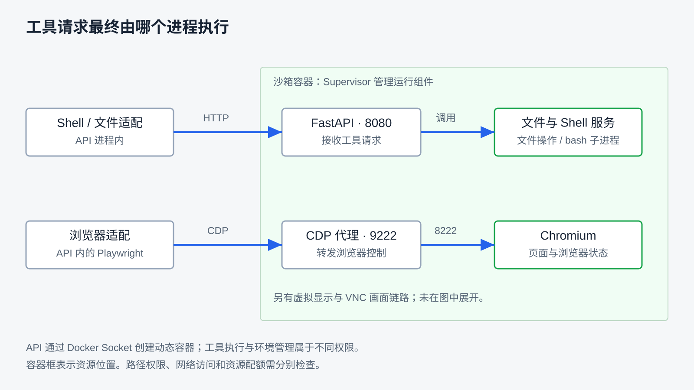
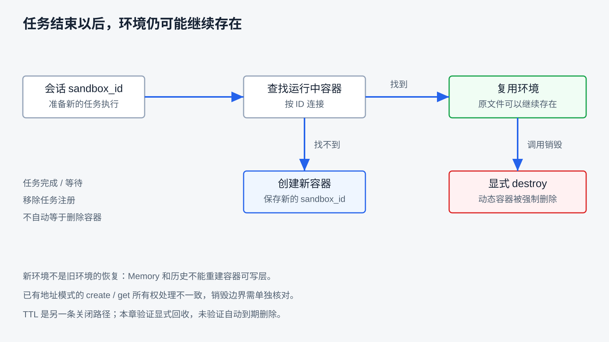

# 沙箱与执行环境

上一章用事件判断「发生过什么」。写入记录可以写进数据库，文件却在某个执行位置里。同会话等待续接，第九章还能读回那份文件；换一个会话去读同一路径，却可能找不到。把工作目录指定为 `/home/ubuntu`，工具是否就只能访问那里？任务显示结束以后，文件和进程又由谁清理？

这些问题都需要找到工具实际执行的位置。本章承接第三章的工具契约、第八章的执行控制和第九章的状态归属，解释执行环境的权限、软件与资源条件，以及它们的生命周期。可以先阅读机制，再按[沙箱指南](../ray_agent/sandbox/README.md#执行环境观察)运行受控观察；完整容器观察的条件见 [API 指南](../ray_agent/api/README.md#沙箱环境观察)。本章不需要模型调用。

## 工具说明之外，还需要一个执行位置

模型给出“读取 `/home/ubuntu/hello.txt`”，只是提出了动作和参数。这个路径不是跨机器通用的文件标识：API 进程、沙箱容器和宿主机即使都有这个名字，也可能指向不同内容。真正执行读取的进程，使用的是它能看到的文件系统和它的操作系统权限。

**执行环境是动作发生时可使用的文件、进程、网络、软件与权限条件。** 工具契约说明如何提出请求；执行环境决定请求落地时能做什么。一个合法路径字符串不能证明访问已获授权，一句“只在工作目录操作”也不能自动改变操作系统权限。

限制文件工具只读取一个目录，却允许 Shell 执行任意 `cat`，限制仍可能从另一条路径绕过。有效边界要覆盖能产生同类副作用的入口。通用设计可以使用路径策略、低权限身份、受限挂载、网络策略和资源配额；它们解决不同问题，需要分别落实。第八章的审批解决是否允许这次动作，环境约束解决动作执行时实际能触及哪些资源。

这些问题可以先看成一张地图。每种情况都有不止一种策略；RayAgent 的选择写在第三列，后文先讲要设计什么，再对照当前怎么做。

| 执行时要设计什么 | 常见策略 | RayAgent 当前怎么做 |
|---|---|---|
| 动作在哪落地 | 本机进程，或独立环境 | 文件和 Shell 在沙箱进程里执行；浏览器另走 CDP |
| 相同路径为何有时找不到 | 共享工作区，或每会话一份环境 | 按 `sandbox_id` 复用运行中容器；找不到再创建 |
| 工作目录是不是围栏 | 约定 `cwd`，或路径策略 / 挂载 / 权限 | `cwd` 只解释相对路径；没有目录白名单 |
| 「在容器里」是否等于隔离 | 文件系统、网络、身份、配额分别做 | 文件随容器分开；同网络可达；服务是 root；未设容器配额 |
| 任务结束谁回收 | 随任务销毁，或会话级保留，另加 TTL | `done` 不 `destroy`；适配层与验证脚本可显式删除动态容器，产品没有对外接口 |
| 本机调试是否等于产品环境 | 同一套边界，或实验条件分开写 | 只起 Python API 时，文件和 Shell 落在宿主机当前身份上 |

读表时先抓住两个区分：**工具契约和工作目录约定，都不是操作系统边界**；**每个会话一个容器，不等于租户隔离；任务结束，也不等于环境回收。** 下面按这些问题分别说明。

## 动作最终由哪个进程执行

对应表中的第一行：请求发出之后，真正碰文件和进程的是谁。可以把工具跑在 API 进程里，也可以交给独立环境。前者实现简单，边界就是这台机器上的当前身份；后者便于按会话隔离可写层，但要另管创建、连接和回收。

| 选项 | 换来什么 | 要另外补什么 |
|---|---|---|
| 在 API 进程内执行 | 没有跨服务调用，交接直接 | 边界只剩宿主机当前身份；慢操作会和 API 抢同一进程 |
| 交给独立执行环境 | 按会话分出可写层，便于替换和回收 | 创建、寻址、就绪探测、连接失败与回收都要自己实现 |

RayAgent 的文件和 Shell 工具经适配向沙箱发起 HTTP 请求，由沙箱里的服务执行：文件走 Python 文件操作，Shell 用 bash 启动子进程。浏览器另走 Playwright/CDP，不经过文件服务。



图中的容器框表示资源在哪里，不代表访问已经过授权检查。API 在当前 Compose 中还挂载了 Docker Socket，用来动态创建容器；这是管理执行环境的权限，和沙箱内一次读写不是同一级能力。动态容器的创建参数没有把该 Socket 再挂进去。

创建任务时还会准备浏览器适配，因此即使只写文件，也会走完整沙箱的准备路径。只启动沙箱 Python API、不启动完整容器时，文件和 Shell 会落在宿主机当前身份下，也不会自动出现 Chromium 或容器隔离。这两种实验条件不要合成一次验收。

## 相同路径，为什么有时找不到文件

对应表中的第二行：路径相同，不表示是同一份文件。可以让所有会话共享一个工作区，也可以为每个会话准备一份环境。共享便于交接，却容易读到别人的文件；按会话分开可写层，则同一路径在另一个环境里可以不存在。

| 选项 | 换来什么 | 要另外补什么 |
|---|---|---|
| 共享工作区 | 换会话也能拿到同一份文件 | 访问范围要靠鉴权或目录划分，否则就是共用一块磁盘 |
| 每会话一份环境 | 文件天然分开，改坏了只影响自己 | 等待续接要记住引用；环境不在时无法凭记录恢复可写层 |

先把三个标识分开：

| 对象 | 保存或管理什么 | 不能据此推断什么 |
|---|---|---|
| 产品会话 | 消息、计划、Memory、事件，以及当前 `sandbox_id` | 数据库记录在，不代表容器仍在 |
| 一次任务执行 | API 中的执行协程与输入输出流 | 等待续接可以换任务，不必换沙箱 |
| Shell 会话 | 沙箱进程内的命令、输出与子进程句柄 | 同一标识不代表一个持续运行的登录终端 |

创建任务时，先按会话的 `sandbox_id` 查找仍在运行的容器；找到就复用，找不到才创建并保存新 ID。下面是省略网络与保存错误的简化 Python：

```python
sandbox = await find_running_sandbox(session.sandbox_id)
if sandbox is None:
    sandbox = await create_sandbox()
    session.sandbox_id = sandbox.id
    await save_session(session)
runner = make_runner(session, sandbox)
```

重新建立适配对象，不等于重新建立环境；新建环境，也不等于恢复旧环境。第九章同会话等待续接时，任务 ID 变了，沙箱 ID 不变，文件仍在。本章绕过模型和数据库，直接创建两个真实动态容器：向第一个写入标记，按 ID 重新连接后读到原文，第二个相同路径不存在。它证明这次容器复用与文件分离，不代替多用户隔离验收。

旧容器已经不在时，新容器只能提供新的执行位置，不能凭 Memory、路径或事件恢复旧可写层。产物如何另存，由第十二章解释。

### Shell 标识保留了记录，没有保留全部终端状态

每次命令都创建新子进程；同一 Shell ID 若还有旧进程，会先尝试终止再启动新的。记录可以续接，进程状态却不是持续的登录终端。

受控观察先在一次命令中设置环境变量并 `cd ..`，下一次用同一 ID、显式传入原工作目录，变量是 `unset`，目录回到原处。文件能保留，是因为两个子进程访问同一文件系统；需要传递状态时，应重设参数或写进文件，不能根据界面上的终端外观猜测。取消命令、终止单个进程、结束进程树和删除容器，仍是不同动作。

## 工作目录不是文件访问围栏

对应表中的第三行：工作目录主要决定相对路径如何解释。Shell 的 `cwd` 指定命令从哪里开始；绝对路径仍从该进程可见的文件系统根解析，`..` 可以访问父目录，符号链接可以指向别的位置。只有另行实施路径策略、文件系统挂载或权限限制，工作目录才可能成为受保护范围的一部分。

当前文件请求的路径是字符串，说明文字要求绝对路径，但没有据此建立目录白名单。普通读写直接进入文件操作；Shell 只设置 `cwd`，没有把它变成根目录或访问检查。

本章观察在一个临时目录里建立 `work/` 和它旁边的 `outside.txt`，再在 `work/` 内建立指向后者的符号链接。文件服务可以通过 `work/../outside.txt` 和链接读到相同标记。全部文件都由实验创建，所谓“外部”仅指教学指定的 `work/` 之外；它证明该目录不是服务强制的边界，不是容器逃逸实验。

## 「在容器里」不等于已经隔离

对应表中的第四行：文件系统分开、网络不可达、低权限身份、资源配额，是不同的隔离轴。可以只做其中一条，不能把「跑在容器里」读成四条都已落实。

| 隔离要覆盖什么 | 通用做法 | RayAgent 当前的取值 |
|---|---|---|
| 文件系统 | 独立可写层，或只挂载必要目录 | 动态容器各自一份可写层；文件系统分开 |
| 网络 | 独立网络、出口白名单、关闭非必要端口 | 接入共享 `SANDBOX_NETWORK`；未做出口白名单 |
| 身份与权限 | 非特权用户，只授予完成任务所需能力 | 服务以 root 运行；镜像内另有 `ubuntu` 用户，默认未切换 |
| 资源配额 | 分别限制 CPU、内存、进程数与磁盘 | 创建参数没有设置这些上限 |

运行在容器里，只直接保证第一行。其余三条要单独核对；一条没做，不会因为另一条做了而自动补上。这几条轴还解释了一件事：同一份创建参数换一台宿主机、换一个网络配置，第二行到第四行的答案都可能变，所以“容器名叫 sandbox”不构成结论，核对时要按部署条件重查。

**文件系统分开最容易被误读成整体隔离。** 两个容器有各自的可写层，仍可以接入同一个 Docker 网络。`localhost` 只指当前网络命名空间的回环地址。本章让第一个临时沙箱请求第二个的状态接口，得到 HTTP 200，没有携带认证信息；这些接口也没有调用者身份检查。这说明本次部署中容器间可达，不能把“每个会话不同容器”直接写成租户隔离。

**身份这一条是最容易漏掉的。** 当前服务以 root 运行，Shell 子进程没有切换身份：Shell 请求只带命令、工作目录和会话标识，没有以哪个用户执行这一类字段。`HOME=/home/ubuntu` 只是主目录取值，不会把 root 变成 ubuntu；镜像里创建了 `ubuntu` 用户并配置免密 sudo，但默认并没有用它执行命令。文件工具另有 `sudo` 参数，影响的是文件操作自身尝试以提权方式执行，不构成按动作分级的授权；同一个动作换成 Shell 表达时，这条参数也不存在。root 在容器内并不自动等于能访问宿主机所有文件；反过来，容器内 root 和浏览器的 `--no-sandbox` 等选项，也不能解释成已具备最小权限。浏览器行为在第十三章展开。

**配额要单独设，缺省不等于无限也不等于已限制。** Docker 可以设置 CPU、内存和进程数上限，当前动态创建没有显式加上这些配额。没有设上限，不代表宿主机资源无限。我们没有用耗尽资源来测试限制。

**软件条件同样属于执行环境。** 镜像里预置了 Python、Node、Chromium（安装包名为 `chromium`）、curl、wget 与包管理器，还写好了软件源。这意味着模型不仅能调用被封装成工具的动作，还能在容器内安装依赖或下载脚本，工具清单描述不了这条路径。这里只描述镜像内容，不代表已经验证过实际的软件版本组合；`HOME=/home/ubuntu` 只是主目录变量，执行身份仍是 root，两者不要混为一谈。

网络出口是另一个容易只看一半的地方。本章的本地实验只访问自己启动的回环 HTTP 服务，说明子进程能够发起网络请求。两种观察都没有连接公网；出口、DNS 和受限网络仍未验证。动态创建会把代理变量写进容器环境，但代理地址是流量出口的指向，不是“只允许访问这些目标”的名单。若要限制外发，需在实际执行路径落实允许的地址和数据，不能只靠工具说明。

## 谁创建，谁复用，谁负责回收

对应表中的第五行：连接可以关闭，外部资源是否删除要另行确定所有者。动态环境通常由创建它的系统负责回收；共享的已有环境则要遵守外部生命周期。

回收策略不是只有一种。可以让环境随任务结束一起销毁，也可以按会话保留一段时间，再加一个到期时间兜底。随任务销毁简单、残留少，但同会话的后续输入必须重建环境，之前写入的文件也就不在了；按会话保留便于等待续接和多次提交，代价是环境中可能长期放着用户数据，需要额外的到期和清理机制。选择哪一种，要先回答“同一份工作区预期活多久”。

RayAgent 把决定权放在 API 侧的销毁逻辑，而不是沙箱自己：动态创建会保存容器名，显式销毁按这个名字强制删除。已有地址模式下适配对象不保存外部容器名，它的销毁不会删除那个容器。



本章实际创建的两个容器都走这条路径删掉，并再次查询确认不存在。这里验证的是主动销毁，不是到期回收。

已有地址模式下，“会不会删掉别人的容器”没有统一答案：按地址创建时适配对象不带上容器名，它的销毁不会删除外部容器；按 ID 取回时会把该 ID 当作容器名保存，销毁就对这个名字执行强制删除。同一个模式里两条路径的处理并不一致，所以既不能写成“已有沙箱永远不会被删除”，也不能写成“销毁一定会删掉外部容器”。该分支只做静态核对，正文没有对外部容器执行销毁。

### 任务结束，不等于环境消失

对应表中的第五行后半：正常运行结束后，运行器清理协议连接并移除进程内注册，并不销毁沙箱。保留环境能够支持后续输入，因此界面上的 `done` 不能证明文件、浏览器或容器已经回收。应用关闭路径会尝试销毁仍登记的任务，但不能把“有销毁方法”写成“退出时一定清理所有沙箱”。本章未模拟应用关闭故障，第十六章承接。

TTL 表示资源打算活多久。它的机制在沙箱进程里：服务启动时按读到的超时配置设定一个倒计时，到点关闭 Supervisor；Supervisor 退出后容器随之结束，配置了自动移除的容器会被 Docker 删除。另有一个中间件在每次沙箱 API 请求时延长倒计时，也就是**有请求就保活**，所以“到期”指的是这段时间内没有活动。

这套机制在当前部署中确实已经启用：查询运行中容器的超时状态会返回 `active=true` 和剩余秒数，说明计时器已经设好。但启用的是沙箱自己读到的默认值（60 分钟），并随请求延长；产品侧设置的 `SANDBOX_TTL_MINUTES` 并不会改变它——创建容器时写入的超时变量名，和沙箱进程读取的不是同一个，二者没有别名映射。

机制已启用，仍然不等于回收已经被观察到。要确认一次到期回收，需要看到倒计时归零、Supervisor 退出、容器消失这一串结果；反过来，只读到“机制存在”或只看到一个剩余秒数，都不能推出某个具体容器已经被清理。本章只验证显式删除；自动到期的完整观察、崩溃后清理和进程树回收仍标为 `unverified`。

## 用观察结果判断边界

对应表中的第六行：一个环境检查应先写明操作对象、预期限制和可观察结果。把临时目录的 `work/` 当作候选边界，若服务读到旁边的受控标记，应得出“工作目录未限制这条访问”，而不是笼统地说“沙箱失效”。容器级文件分离、网络分离和宿主机边界是不同问题。

本章本地脚本检查路径、Shell 状态、回环网络、身份继承与资源清理；Docker 脚本检查两个专用容器的重新连接、文件分离、同网络访问、运行配额和显式删除。第八章的单进程脚本另行复跑。命令和前提统一维护在[沙箱指南](../ray_agent/sandbox/README.md#执行环境观察)与 [API 指南](../ray_agent/api/README.md#沙箱环境观察)。

若具备完整产品环境，可以从同一张表继续往下问。每次只改变一项条件，并记录会话、容器标识、触发时刻和实际取值：

| 情境 | 要保留的证据 | 要回答的问题 |
|---|---|---|
| 同会话等待后继续，再换一个会话读同一路径 | 前后 `sandbox_id`、两边的文件读取结果 | 复用的是什么，分开的又是什么？ |
| 在 `work/` 内用 `..` 和符号链接读取旁边的文件 | 请求路径、返回内容、实验目录范围 | 工作目录是约定还是强制边界？ |
| 在 Shell 中查询当前用户与权限 | `id` 结果、`HOME`、实际文件属主 | 容器内以什么身份执行动作？ |
| 从一个容器请求另一个容器的接口 | 目标地址、状态码、是否携带认证 | 容器间是否可达、调用者是否被识别？ |
| 查看运行中容器的资源限制 | CPU、内存、进程数上限的实际取值 | 有没有配额，超限时行为是否被定义？ |
| 显式删除容器后再次查询 | 删除返回、再次查询结果、容器列表 | 主动回收是否真的生效？ |
| 任务正常结束后查看容器 | 终态、容器是否仍存在、文件是否可读 | `done` 之后环境是否已经回收？ |

本章脚本已做前六行中的路径、身份、回环网络、配额与显式删除部分，但容器间互相请求是临时容器之间的观察，不是租户隔离验收；最后一行没有实验，只从运行器清理路径做静态核对。

这些实验没有调用模型，也没有做页面提交、真实用户鉴权、容器逃逸、公网外发或故障恢复。已有实现的缺口不妨碍学习通用方法，但设计建议不能成为产品能力声明。

读完本章，可以对照开头的表检查理解：

1. 同路径找不到文件，先查是不是另一个执行位置，而不是先怪 Memory 丢了记录。
2. 工作目录约定挡不住 `..` 和符号链接；路径策略、挂载和权限要另做。
3. 服务以 root 运行、没有目录白名单时，「在沙箱里」不等于只能碰 `/home/ubuntu`。
4. 两个容器文件分开，仍要检查它们是否在同一网络上能互访；文件系统一条不能代表另外三条隔离轴。
5. 容器里预置的工具链可以装依赖、下脚本，工具清单不是能力边界。
6. 页面上的 `done` 不能证明容器和进程已经回收；显式销毁和到期回收是两条不同的路，读到 TTL 机制也不等于这次部署已经触发。

环境里的文件存在，只完成了交付的一部分。容器被回收后，用户还能否下载，需要另一套保存与访问机制；下一章继续追踪文件怎样成为任务产物。

[上一章：事件与可观察性](10-events-and-streaming.md) · [课程目录](README.md) · [下一章：文件与任务产物](12-files-and-artifacts.md)
