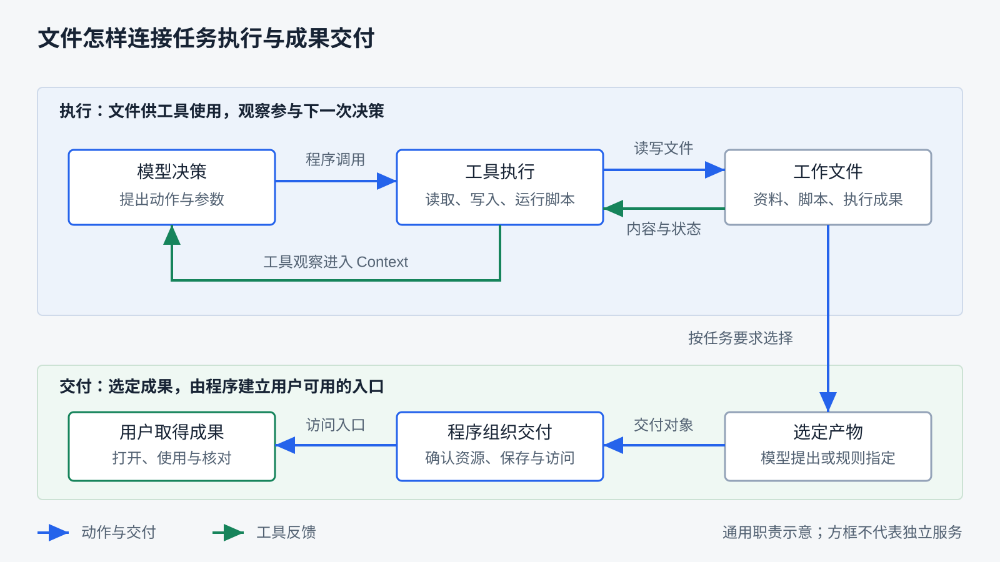

# 文件与任务产物

用户上传一份数据，要求 Agent 分析并交付报告和图表。执行过程中，Agent 可能读取原始数据、编写处理脚本、保存中间结果，再生成报告。最后用户需要拿走的，可能只有报告和图表，也可能还包括可复现分析的脚本。

这个教学场景提出了两组问题：文件如何进入执行环境，怎样被工具使用，哪些内容需要交给模型？工作完成后，又由谁选出成果、建立访问入口，并确认用户实际拿到了它？本章研究的核心是：**Harness 如何组织执行所需的文件，并把执行成果交给用户？**

阅读前应理解第三章的工具执行、第五章的 Context、第九章的状态归属和第十一章的执行环境。正文先解释通用职责，再对照 RayAgent 的实现；开篇分析任务用于推演，不是本章已完成的产品实测。可以直接阅读，运行观察的条件见 [API 指南](../ray_agent/api/README.md#文件与产物观察)和[应用运行指南](../ray_agent/README.md)。

## Agent 为什么需要文件

对话能够表达目标、行动和观察，但很多工作需要一个能被工具反复使用的位置。分析脚本要读取数据，解释器要执行脚本，后续步骤要使用前一步生成的结果，用户还要打开最终报告。文件使这些内容能够在工具调用之间继续存在，并以程序或用户需要的格式被使用。

从任务用途看，可以先区分下面几类材料：

| 用途 | 分析任务中的例子 | Harness 需要安排什么 |
|---|---|---|
| 输入资料 | 用户提供的数据、参考文档 | 让执行工具能找到并读取，向模型提供位置与必要说明 |
| 执行材料 | 处理脚本、配置文件 | 让后续动作使用正确的内容、路径和执行条件 |
| 中间结果 | 清洗后的数据、计算结果、草稿 | 支持步骤衔接，决定是否保留以及何时重新生成 |
| 交付成果 | 报告、图表、复现脚本 | 按用户目标选定，提供可访问的结果与使用说明 |

这是用途划分，同一文件可以承担多种用途。脚本起初只是执行材料，用户要求复现分析时，它也成为交付成果。截图可以帮助模型或用户观察过程；只有当任务需要截图作为结果时，它才承担交付用途。

**任务产物的意义来自任务目标。** 工作目录中的所有文件、工具运行日志和最终答案，不应未经选择就全部打包交给用户。反过来，需要可复现结果的任务，如果只交付报告而遗漏脚本和必要输入说明，也可能交付不完整。

RayAgent 已有上传附件、文件工具、Shell 和文件下载入口，可以作为研究这些用途的载体。但当前没有按上述用途分类管理文件的独立系统。这张表提供的是分析任务与设计 Harness 的方法，不能读成产品已经维护了四类文件状态。

## 文件怎样参与任务执行

文件进入任务后，需要先成为工具可用的资源，再通过观察影响模型决策。这两步由不同的机制完成。

### 先准备工具能够使用的位置

用户上传成功，只说明接收端拿到了内容。若工具在独立执行环境里运行，Harness 还要安排文件如何到达那里：可以复制到工作目录，可以挂载已有存储，也可以提供工具能够使用的远程地址。复制便于按任务分开使用，但要处理传输和命名；挂载减少搬运，却要约定读写范围与共享方式；远程读取则依赖连接及访问凭据。这些选择应与第十一章的环境边界一起考虑。

准备工作至少要回答：哪个环境持有文件、工具使用什么路径、输入是否已经就绪、后续动作是否允许修改它。希望保留原始资料时，可以使用只读输入或生成工作副本；多个步骤交换文件时，需要约定位置和格式。目录命名帮助协作，访问限制仍需由实际权限机制落实。

RayAgent 把用户附件先存入文件存储，运行器再复制到沙箱的上传目录，并把成功附件的路径交给流程。文件工具和 Shell 使用沙箱中的文件。这里已经体现了“接收用户文件”和“准备执行输入”两项职责；当前按文件名构造目标路径，同名输入可能覆盖，不能假定系统自动区分资料版本或保留只读原件。

### 再通过工具把必要观察交给模型

模型知道一个路径，不等于已经获得文件内容。Harness 需要让工具执行读取，并把返回的内容组织进后续 Context。对大型数据，程序可以在文件上完成筛选和计算，只把字段、样本或统计结果交给模型；对短文档，也可以直接返回正文。选择什么内容进入请求，要按当前决策需要安排，具体方法承接第五章。

在分析场景中，模型可以先查看数据结构，再提出脚本写入和执行。脚本直接使用完整数据，工具把执行状态、错误或关键结果返回模型；模型据此修正脚本或继续生成报告。文件保留工具需要的材料，工具反馈提供下一步决策的依据，两者共同支持任务推进。

这条循环也有时效边界。工具读过文件以后，消息中的内容是一份观察；文件随后被改写，旧观察不会自动更新。继续行动前若依赖当前内容，就需要重新读取或检查相关变化。保存消息也不会自动保存可供工具执行的整个工作目录。

RayAgent 的文件读取结果可以包含正文，经工具消息加入 Memory，并用于后续模型调用；Shell 可以执行脚本并把结果反馈给流程。工具预览另供页面展示，不等于模型得到的完整消息。当前系统不会自动替每项任务设计数据抽样与文件依赖管理，这些仍要由任务策略、工具能力及后续工程设计承担。

这张图表示通用职责，方框不要求对应独立服务。上半部分说明文件如何参与执行循环，下半部分说明工作成果怎样走向用户；输入准备在上文展开。图中的“选定”可以由模型提出，也可以由任务规则约束；“组织交付”由程序落实，具体保存和访问方式见后文。

## 工作成果怎样成为交付物

脚本运行结束、报告文件存在，仍需要把它与用户要求的结果对应起来。在开篇任务中，Harness 应能区分清洗数据、调试日志、报告和图表，并组织用户真正需要的交付集合。

首先要决定如何选定成果。可以让模型声明要交付的文件，适合名称和数量随任务变化的情况；可以约定输出目录或文件清单，便于程序按规则收集；也可以由专门的导出工具返回产物引用，减少模型猜测路径。灵活选择需要更多检查，严格约定则要求执行过程遵守输出契约。模型与规则可以配合，不必只选一种。

随后，程序需要把交付声明落实为用户可用的结果：定位实际资源，检查它是否存在、是否属于允许交付的范围，按保存策略处理内容，建立任务与产物的关联，最后提供访问入口及必要说明。这些检查可以分布在工具、运行器、存储和接口中，单靠模型写一句“报告已完成”无法完成交接。

产物记录的价值是让后续使用者能回答“这是什么、从哪里取得、属于哪项工作”。名称和类型帮助用户选择打开方式，任务关联和来源帮助解释结果，访问引用帮助程序找到内容。需要哪些字段取决于产品用途；把执行环境内的路径直接显示给用户，通常还不足以建立用户能够使用的入口。

RayAgent 使用消息附件声明路径，运行器据此尝试保存文件，并将实际文件信息放入附件事件，页面据此提供预览和下载。它已有这条基本交接，但没有完整的产物用途分类、依赖清单或统一内容质量检查。用户要求多份成果时，还需要逐项核对声明和实际交付，不能仅看附件列表非空。

## 保存与访问方式有哪些选择

组织交付不必固定为“从沙箱复制到对象存储”。关键是使用者能在约定条件下取得结果，具体架构取决于环境寿命、共享需求和保存成本。

| 设计问题 | 可选策略 | 主要取舍 |
|---|---|---|
| 内容放在哪里供用户使用 | 直接访问工作区；另存交付副本 | 前者搬运少，但依赖工作区可用；后者便于独立保留，需要处理传输和关联 |
| 什么时候保存 | 明确交付时保存；阶段完成或特定动作后自动保存 | 前者聚焦选定成果；后者保留中间进展，但容易产生额外内容与存储成本 |
| 入口代表什么内容 | 当前工作文件；某次确认的快照 | 前者随工作更新；后者便于复核，但需要明确新旧结果的关系 |
| 用户怎样取得内容 | 经应用服务读取；使用受控的存储地址 | 都要安排访问范围、有效期和失败反馈，不能只提供一个看似可用的链接 |

保存与交付也不必同时发生。系统可以持续保存中间成果，最终只交付选定部分；用户可以先取得阶段结果，任务再继续。因而“已经保存”“已经展示为附件”“整项任务完成”不能合并成同一个状态。

RayAgent 同时存在工作区读取和存储下载两条路径：按会话与路径读取沙箱当前内容，按文件 ID 下载保存副本。带文件路径的文件工具完成事件会触发自动同步尝试，消息附件另有交付同步；Shell 写文件不会自动走文件工具的同步分支。这说明是否保存由程序选择的触发点决定，不能由“某个工具碰过文件”推断。

快照语义只需抓住一个边界：如果已经交付的报告后来又被修改，用户打开旧附件时，究竟应看到原报告还是当前报告？RayAgent 的旧消息附件仍可按原 ID 下载旧副本；这不等于系统已有完整版本管理。选择哪种语义，要依据用户是否需要追溯已交付结果。

## 交付以后，谁负责访问与保留

用户能够下载一次，只证明当时访问成立。若产品允许之后重新打开任务，Harness 还需要对保留期限、访问对象和清理责任作出安排。

先确定使用者：结果只属于发起任务的用户，还是允许团队或后续任务继续使用？任务与产物的关联帮助定位文件，访问权限则决定谁可以取得内容。难以猜测的标识不能替代权限检查；执行工具可以读到某个文件，也不自动意味着该文件应被交付出去。

再确定寿命：输入资料、中间文件和已交付结果可以采用不同保留规则。临时执行环境回收后，用户可能仍需要报告；需要复现分析时，报告之外的脚本和依赖说明也可能需要保留。长期留下所有文件会增加成本，过早删除则会破坏后续使用，两者需要结合任务约定选择。

最后确定清理依据。可以随任务保留期到期处理，可以在没有有效引用后回收，也可以采用存储生命周期规则。无论哪种，都应考虑仍在使用的链接、历史附件和共享引用。移除某个页面条目，不等于所有使用者都不再需要内容。

RayAgent 的工作文件依赖沙箱环境，保存副本具有独立的存储寿命；当前文件列表和历史附件可能分别引用文件。现有文件存储协议没有删除操作，应用尚无完整副本回收流程，本章也没有多用户访问验收。这些差距用来识别工程责任，不能把保留与权限策略写成产品已实现的能力。跨会话长期使用文件的组织方式由第十七章继续讨论。

## 怎样判断交付成立

交付检查应沿用户目标逐项进行。“分析并提供报告和图表”包含多个结果，只确认其中一个文件存在不够。可以依次核对下面几层证据：

| 检查层次 | 要回答的问题 | 可以取得的证据 |
|---|---|---|
| 对象与范围 | 选中的是否是要求的成果，有没有遗漏或误带材料？ | 用户要求、交付清单、文件用途与来源 |
| 资源与访问 | 文件实际存在吗，预期用户能否取得？ | 文件检查、访问响应、失败原因 |
| 内容与形式 | 取得的是目标文件吗，能否按预期打开和使用？ | 下载字节、格式解析、图表或文档查看 |
| 任务要求 | 内容是否回答了问题、计算是否正确？ | 针对目标的核对规则、计算复查或人工审阅 |

前几层可以由确定性程序完成一部分，最后一层往往需要任务相关的验证。下载字节一致证明内容交接一致，不能证明报告结论正确。第十六章进一步研究如何组织验证与评估；这里先建立交付时应留下什么证据。

失败也要回到正确的责任位置。输入没有准备好，应让执行流程知道缺少资料；生成失败，需要继续行动或报告无法完成；保存、访问失败，则需要明确哪些成果尚未交到用户手中。重新生成、重新上传和重新提供入口解决的是不同问题，不能遇到任何失败都从头执行任务。

RayAgent 对声明了路径却全部同步失败的交付会发出错误事件，正常收尾将本轮记为失败；部分附件失败时，现有全空检查不会触发。文件工具后的自动同步异常主要记日志，输入附件复制失败也没有统一的缺失通知。因此观察这个产品时，要区分工具操作结果、交付处理结果和用户可见结果，不能把任务状态当作完整的交付清单。

本章已有文件任务证据支持写入、读取、同步与下载的基本交接；确定性测试及数据库观察进一步核对了部分失败和保存边界。它们不证明开篇分析任务已被端到端验证，也不覆盖大文件、并发、环境删除后的下载或多用户访问。具体运行条件、已得证据和缺口统一见[制作进度](progress.md#第-12-章文件与任务产物)。

可以用以下问题检查自己是否理解了这些职责：

1. 用户上传数据后，工具可读与模型已知之间还差哪些步骤？如果数据过大，怎样让后续决策获得必要观察？
2. Agent 生成了脚本、清洗数据、日志和报告，依据什么选择交付物？用户要求可复现分析后，这个选择怎样变化？
3. 一个工作区只保留十分钟，用户却需要一周后取回报告，保存与访问策略应怎样安排？代价是什么？
4. 两个预期附件只成功交付一个，应记录哪些信息、反馈给谁，如何避免重做已经成功的计算？
5. 用户能打开报告，为什么任务仍可能没有完成？还需要什么证据？

这些判断共同回答本章的问题：文件先被组织成执行可用的材料，通过工具观察参与决策；选定的成果再由程序落实保存、访问和结果反馈。下一章转向浏览器，研究另一类工具如何观察环境、执行动作，并把外部材料带回任务。

[上一章：沙箱与执行环境](11-sandbox-and-execution-environment.md) · [课程目录](README.md) · [下一章：浏览器如何成为工具](13-browser-as-a-tool.md)
