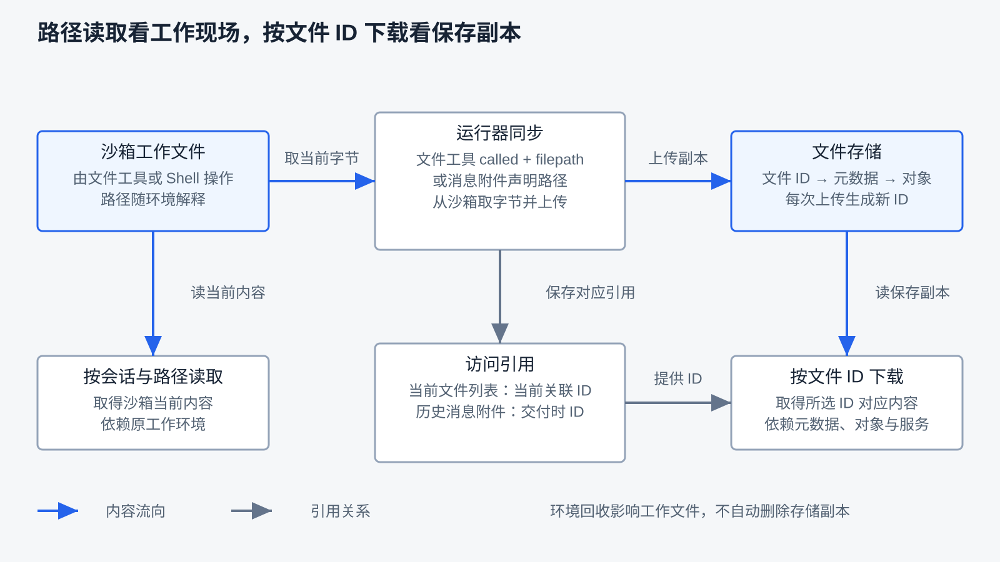
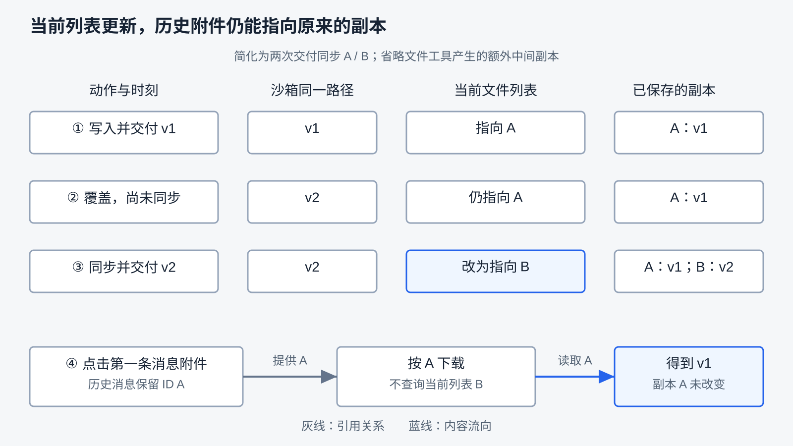

# 文件与任务产物

上一章说明：任务结束不等于执行环境回收，工作文件也不会随 `done` 自动消失。但环境最终被回收以后，用户还能不能拿到成果？这需要另一套保存与访问机制。

先沿用文件任务：把同一路径写成 `v1`，再覆盖为 `v2`，读取并交付。沙箱里该路径最后是 `v2`，会话当前文件列表可以只剩一条，文件存储里却留下多份内容。再多问一步：如果此前已经交付过 `v1`，后来点击那条历史消息里的附件，应该得到 `v1` 还是 `v2`？只知道“文件已经保存”还回答不了这个问题。

本章追踪内容如何离开执行位置、记录如何指向副本，以及失败和清理会影响哪一层。阅读前应理解第三章的工具执行、第五章的 Context 与 Memory、第九章的保存和第十一章的执行环境。阅读与确定性核对无需模型；真实 Agent 任务需要完整产品和模型配置。运行条件见 [API 指南](../ray_agent/api/README.md#文件与产物观察)、[沙箱指南](../ray_agent/sandbox/README.md)与[运行指南](../ray_agent/README.md)。

## 交付时要分清什么

文件存在于执行位置，只说明工作过程留下了内容。要成为用户可访问的任务产物，还需要选择交付对象、保存可取回的内容，并建立明确的访问引用。自动保存的中间文件、页面截图和最终附件可能共用存储，但用途不同，不能把“存下来了”直接当成“满足任务要求”。

| 交付时要设计什么 | 常见策略 | RayAgent 当前怎么做 |
|---|---|---|
| 工具写成功后，内容在哪 | 直接写最终位置，或先写工作区再保存副本 | 文件工具写沙箱；存储同步是后续动作 |
| 什么时候保存副本 | 按需取回、显式交付、特定动作后自动保存 | 带 `filepath` 的文件工具完成事件，以及消息附件路径，触发同步 |
| 同一路径再次变化，如何识别内容 | 固定地址覆盖，或每次保存生成新标识 | 每次上传生成新文件 ID；当前列表替换已找到的旧条目 |
| 用户看到哪一版 | 始终访问当前文件，或访问某次保存的快照 | 按路径读取沙箱当前内容；按文件 ID 下载对应副本 |
| 副本什么时候可以删 | 核对引用、保留期限，或交给存储生命周期 | 尚无副本删除路径；当前列表和历史附件可能分别引用文件 |
| 同步失败如何反馈 | 保留旧结果、报告失败、重试或补偿 | 新上传失败保留旧条目；交付全部失败会发错误事件，部分失败仍有缺口 |

下面围绕这张表说明机制。先记住：**工作文件、引用记录和存储副本是不同对象；工具成功、保存成功、用户取得正确内容也是不同判断。**

## 文件实体与消息中的内容有什么不同

模型给出 `/home/ubuntu/report.md`，只是提出位置。文件工具把请求交给沙箱文件服务，真正读取或修改的是那个执行环境可见的文件系统。路径字符串不是跨环境通用的资源身份，也不证明对应内容现在还存在。

工作文件位于 Context 和 Memory 之外，但消息里可以有文件内容。例如写入调用的 `content` 参数包含待写正文，读取结果可以包含原文或截取片段。RayAgent 把工具结果序列化成 `tool` 消息，加入 Memory 并供后续模型调用使用；这不是只记录路径和摘要。

两边的区别在于更新方式：文件可能被下一次操作覆盖，消息中的内容仍代表上一次写入参数或读取结果。再次获得当前内容，需要重新读取。即使 Memory 保留了全文，也不等于系统保存了可下载的文件，更不等于能恢复整个工作环境。

因此，判断“写入成功”时先看工具报告的操作结果，再看内容是否已被保存到交付位置。预览卡片、附件和存储副本都是另外的交接结果，不能由一句成功消息全部推出来。

## 什么时候把工作文件保存成副本

保存时机决定了系统能保住哪一段成果，也决定了存储和传输成本。

| 策略 | 适合什么情况 | 需要承担什么代价 |
|---|---|---|
| 用户要取文件时再从工作区读取 | 工作环境长期可用，不需要保留中间快照 | 环境消失后无法取回；取得的是当时的当前内容 |
| 明确交付时保存 | 希望产物列表只呈现选定结果 | 未交付的中间成果仍依赖环境；交付失败需要反馈 |
| 特定动作后自动保存 | 希望任务未结束时也保留阶段成果 | 多次读取也可能重复保存；需管理副本、引用和失败 |

RayAgent 同时使用后两种。运行器处理 `file` 工具的 `called` 事件时，如果参数含 `filepath`，会先读取预览，再尝试从沙箱下载当前文件并上传存储。消息事件的附件若声明了路径，运行器也会尝试同步，因此交付可能再次保存刚刚读过的同一份内容。

这个触发条件不能扩大成“碰过文件就会同步”。文件查找不一定带 `filepath`；Shell 写入不会走文件工具分支。工具完成事件也不等于工具成功，当前预览处理没有以原工具的成功标志作为统一闸门；前置读取若抛异常，后续同步会跳过。每次触发只是一次尝试，不能保证已经留下副本。

**路径用于定位工作文件，文件 ID 用于访问某次上传的副本。** 同一路径多次同步会产生不同 ID；内容相同的读取与交付也可能重复上传。当前没有按内容哈希去重，也没有根据工具调用参数重建当时版本：同步再次按路径取字节，若文件在两次操作之间被改写，副本保存的是取字节时读到的内容。

浏览器截图另走上传路径。运行器上传截图后，把地址放入工具事件的截图字段，不向会话当前文件列表添加条目。它是过程观察材料，可以被历史工具事件引用，不能仅因它也在文件存储里就称为最终交付物。

### 输入资料也需要进入执行位置

用户上传附件时，内容先进入文件存储。任务运行器按附件 ID 下载，再复制到沙箱的 `/home/ubuntu/upload/{filename}`，供工具读取。目标路径由文件名拼接，同名附件成功上传到同一位置时，后者会覆盖前者；原先存储副本的 ID 则可以不同。

这条反向路径需要独立考虑：交付保存失败影响用户取结果，输入复制失败影响 Agent 能获得哪些资料。当前输入同步只把成功附件的路径交给流程，未统一生成缺失附件错误；模型可能从后续读取失败中发现问题，但不能假定它一开始就知道少了资料。

## 两个访问入口为什么会给出不同内容

一条入口按会话和路径请求沙箱当前内容，依赖工作环境仍可访问。另一条按文件 ID 请求文件存储，取得该 ID 对应的保存副本，依赖存储元数据、对象及下载服务可用。附件预览也可能使用后一条下载接口，不能仅凭页面上写着“预览”就判断来源。



图中的蓝线表示内容流向，灰线表示引用的保存或使用；图省略了接口适配与事务细节。会话当前文件列表和历史消息附件都能提供 ID，但含义不同：列表指向当前关联的文件，历史附件记住那次交付的文件。

假设文件已写成 `v2`，同步前执行中断。只要原沙箱还在，交互式读取就可能拿到 `v2`；下载入口没有新版 ID，可能仍能下载之前的 `v1`。如果工作环境也消失，才会失去这份尚未同步的新内容。第八章已经说明，取消不自动撤销文件副作用；这里也不能把执行中断等同于两个位置都没有内容。

反过来，副本已经保存而事件尚未发布时，存储里可能有文件，用户却还看不到对应附件。因此，当前列表中没有路径不能证明副本不存在，有一条记录也不能证明底层对象仍可读。检查时应分别核对引用、下载响应和实际字节。

## 同一路径覆盖以后，历史附件指向哪里

覆盖工作路径和替换当前列表，都不必改动历史交付。一个简化推演可以把它们分开。以下 A、B 是便于阅读的文件 ID 别名，只画两次明确交付的同步，省略文件工具可能额外生成的中间副本：

第一次交付时，沙箱是 `v1`，当前列表和第一条交付消息都指向 A。覆盖为 `v2` 以后、再次同步以前，工作文件已经变化，但 A 仍保存 `v1`。第二次同步生成 B，再交付 B，当前列表改指向 B，第一条消息的附件 ID 仍是 A。

此时点击旧附件，是按 A 找副本，不需要先查询当前列表，也不会因为工作路径已覆盖而自动下载 B。



RayAgent 的当前文件列表保存在会话 `files` 中，历史消息附件则保存在会话事件中，此外文件存储还维护独立的文件元数据和实际字节。替换 `files` 里的条目，不会重写已有事件中的附件 ID。前端历史附件保留该 ID，下载接口直接按 ID 读取存储副本。

所以“用户只能下载最后一版”不准确。当前列表可以呈现最新关联，历史消息仍可能提供旧版入口。现有实现没有完整的版本号、版本链和按路径查询版本历史的接口；能够重新下载某次历史附件，不等于已经具备版本管理系统。

### 按路径查找，按标识移除

更新当前列表时，先按路径找到旧条目，再按旧文件 ID 移除它，最后加入新副本的记录。这里的“去重”是列表维护规则，匹配依据是路径，删除操作接受的是 ID；不是按 ID 判断两份内容是否相同。

制作本章时发现原调用方把路径传入按 ID 删除的接口，导致旧条目始终没有被移除。这是接口契约错误，修复后新会话的串行同步可以替换旧条目；存储仍会生成新副本。已有多条重复记录的会话不会因此自动整理成一条，输入附件也另走添加路径，不能把这个修复推广成全局唯一性保证。

下面是突出成功和失败顺序的简化 Python，省略资源关闭、具体仓库接口和异常反馈：

```python
old = await find_current_file(path)
new = await upload_copy(await read_working_file(path))
# 新上传失败时，还没有删除旧关联。
async with database_transaction():
    if old is not None:
        await remove_reference(old.id)
    await add_reference(new)
```

本轮修订按这个顺序处理替换：先成功上传，再在同一数据库事务里移除旧条目并添加新条目。关联写入失败可以回滚列表修改，但数据库事务不会撤销已经写出的存储对象。这是跨存储交接的边界；更完整的系统可设计待确认状态、重试和补偿，当前未实现。多个同步并发读取同一旧条目时，还需要独立的并发控制，以上顺序不构成并发唯一性保证。

## 副本由谁保留，什么时候才能清理

清理前要先确定“谁还需要这份内容”。沙箱工作文件跟随执行环境生命周期；当前列表和历史事件跟随会话记录；存储副本及文件元数据有自己的寿命。文件从当前列表移除，最多说明这一个引用消失，不能据此宣布整个对象已无引用。

常见策略有三种：维护引用关系，在最后一个有效引用解除后回收；按会话或项目的保留规则统一处理；由存储设置保留期限。第一种需要覆盖历史附件、工具截图等引用来源；第二种需要明确共享文件如何归属；第三种实现较直接，却可能让历史消息里仍可见的链接过期。用户已获得的链接与重下载承诺，也要纳入保留规则。

RayAgent 的文件存储协议只有上传、下载和生成地址，没有删除操作；当前应用没有副本回收流程。因此可确定的是“旧副本仍保留”，不能笼统写成“旧副本全部失去引用”。本地存储按文件 ID 查元数据，再按 key 找磁盘对象；仅有 ID、仅有数据库行或仅有文件字节，都不足以证明完整下载链路可用。

本章的清理讨论说明设计责任，不要求现在新增垃圾回收或版本服务。若以后实现清理，应先列出引用来源与保留语义，再决定删除条件。访问范围同样要按实际接口检查，随机 ID 本身不能代替权限规则；本章没有做多用户访问验收。

## 同步失败怎样影响任务结果

附件路径是模型提出的交付声明，Harness 需要把它变成可访问的对象，并反馈转换是否成功。当前实现已有部分检查，但各入口的行为不相同：

| 失败位置 | 当前反馈 | 仍需分清的边界 |
|---|---|---|
| 文件工具完成后的自动同步 | 捕获异常并记日志，不由此单独发错误事件 | 工具动作可能已成功，新的预览副本却没有保存 |
| 消息声明了路径，所有附件都未同步成功 | 输出空附件消息，再发 `ErrorEvent`；正常收尾将本轮标为 `failed` | 当前错误文案倾向于“文件不存在”，未准确区分上传失败等原因 |
| 多个交付附件只有部分成功 | 保留成功附件；现有全空检查不会触发 | 不保证每个承诺交付的文件都已可用 |
| 用户附件复制到沙箱失败 | 记录异常或忽略失败结果，只传入成功附件路径 | 没有统一的输入缺失通知，也不能假定模型主动察觉 |

因此，“附件不是内容正确性的担保”仍然成立，但不能说“失败只在日志里、任务永远不失败”。应把声明、系统检查与实际可下载结果分开核对。错误事件也不是准确的故障根因，排查时还要结合日志和存储响应。

按字节核对适合验证是否拿到了那份保存内容；文件内容是否满足用户目标，还需要针对任务的验收标准。例如报告可以完整下载却遗漏结论，图片可以有正确大小却画错对象。第十六章进一步讨论结果验证与评估。

## 用观察判断交付是否成立

观察应同时记录会话、路径、文件 ID、触发动作和实际字节，再问不同层是否一致。

| 情境 | 要保留的证据 | 要回答的问题 |
|---|---|---|
| 同一路径写两次再交付 | 工具记录、当前列表、副本与下载字节 | 当前入口拿到哪一份，保存了几份副本？ |
| 先交付 A，再覆盖并交付 B | 两条消息的附件 ID、各 ID 下载内容 | 更新当前列表是否改变历史交付？ |
| 上传失败或关联保存失败 | 旧列表、新上传结果、事务后列表 | 失败是否丢失旧入口，是否留下未关联副本？ |
| 部分附件失败与全部失败 | 声明路径、成功附件、错误事件 | 哪种失败被系统显式报告？ |
| 删除执行环境后再次下载 | 环境状态、路径读取与下载响应 | 哪个入口依赖工作环境？ |
| 上传同名输入附件 | 存储 ID、沙箱路径与读取内容 | 存储副本和工作位置在哪一侧发生覆盖？ |

已有真实 Agent 任务验证了同路径覆盖后的 `v2` 交付，下载与沙箱读取字节一致。修复前的重复条目和修复后的单条记录是当前列表行为的对照，不用于推断版本查询或自动清理。详细条件归[制作进度](progress.md#第-12-章文件与任务产物)。

本轮确定性测试检查了列表替换、上传与关联失败、全量与部分附件失败，以及历史附件不被替换改写；真实 PostgreSQL 与本地存储观察检查了数据库替换、回滚和旧副本读取。后者用内存字节替代沙箱下载，不连接模型，不代表一次真实用户操作全流程。

删除环境后的下载、同名输入覆盖、完整故障页面表现、断连、大文件、并发覆盖与多用户访问仍未实测。已有真实任务没有删掉环境再下载，不能声称观察表全部通过。

读完本章，可以用以下问题检查理解：

1. 文件已覆盖，为什么 Memory、工具预览和下载附件仍可能保存旧内容？
2. Shell 写出的文件什么时候能成为附件，为什么不能靠“所有文件动作都会同步”来推断？
3. 当前列表指向 B，历史消息仍指向 A，分别下载会得到什么？
4. 上传失败和数据库关联失败发生在不同位置，各应保留什么、可能多出什么？
5. 文件从当前列表消失，为什么还不能立即删除副本？
6. 下载字节一致证明了什么，又不能证明哪些任务质量？

文件交付解决了如何保存和取回内容，内容的来源与可信程度还要另看。下一章转向浏览器，研究 Agent 怎样观察页面、执行动作，并处理页面材料进入 Context 的边界。

[上一章：沙箱与执行环境](11-sandbox-and-execution-environment.md) · [课程目录](README.md) · [下一章：浏览器如何成为工具](13-browser-as-a-tool.md)
