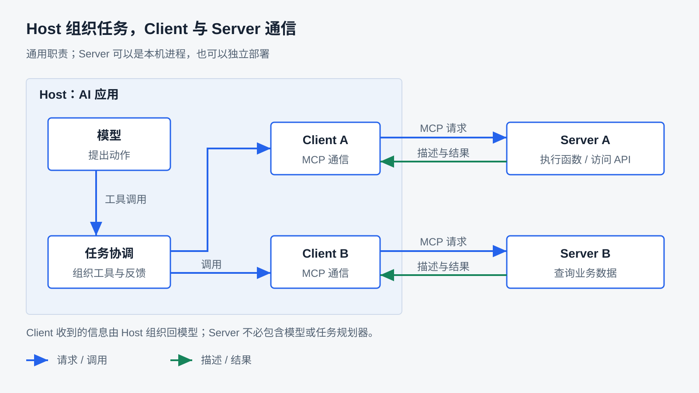
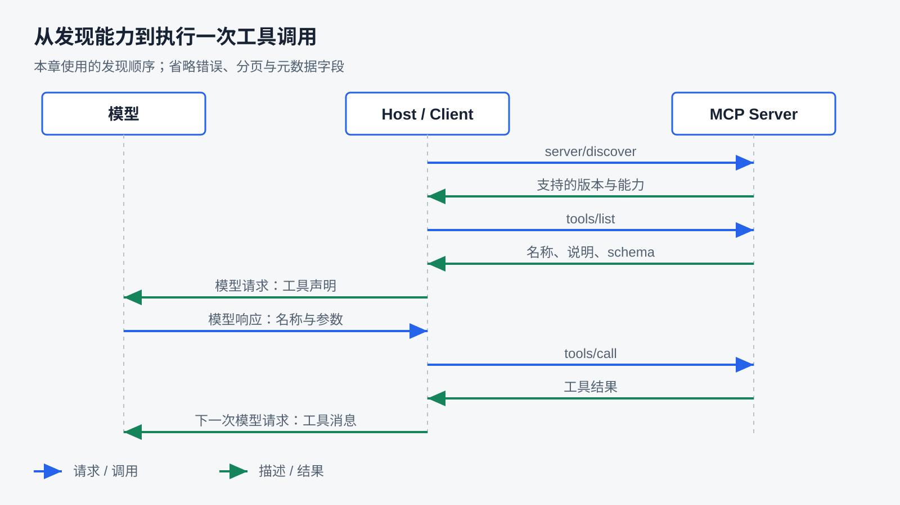
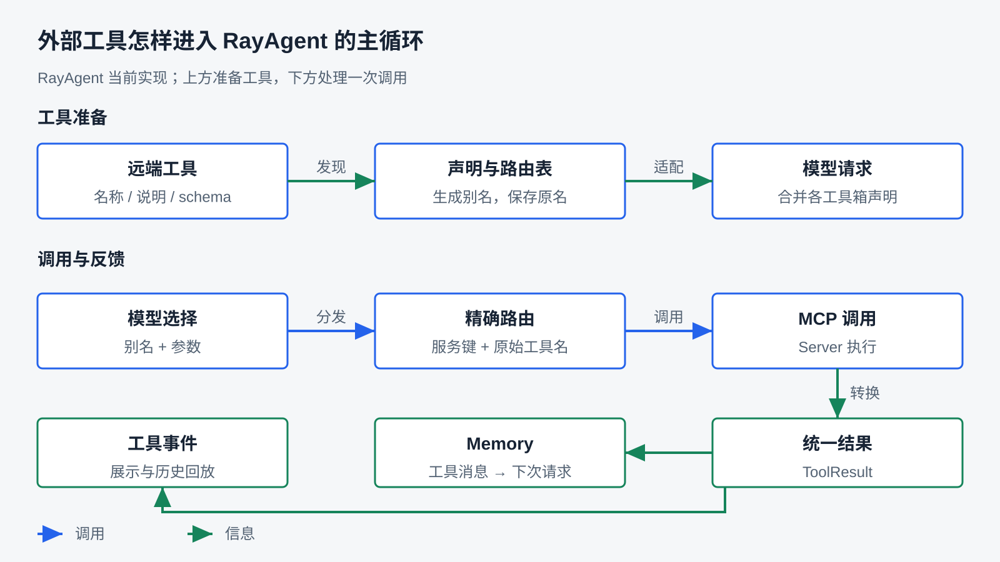

# 通过 MCP 接入外部工具

前面几章已经建立了任务执行的基本关系：模型提出动作，Harness 选择工具执行，再把观察交给模型。第十三章用 Playwright 接入浏览器，说明即使底层库能够控制页面，应用仍要组织工具说明、参数、状态与结果。

如果能力由另一个程序提供，接入时就多了一组问题。这个程序可能由其他团队维护，也可能部署在另一台机器上。Harness 怎样知道它提供什么、需要哪些参数、怎样表达失败？每增加一种服务，都要为它重新编写一套发现和调用逻辑吗？

本章研究：**外部能力怎样通过共同协议被发现和调用，又怎样进入已有的 Agent 执行链？** 我们会从 MCP 的概念与职责讲起，拆开一轮真实通信需要的约定，再通过实验和 RayAgent 研究工具适配、连接管理与失败处理。既要知道 MCP 怎样工作，也要能够判断哪些问题适合交给协议、哪些仍由 Harness 围绕任务承担。

阅读前应理解第三章的工具契约、第四章的反馈循环、第八章的执行控制和第十一章的执行环境。本文使用项目锁定的 **Python SDK `mcp==2.2.0`、协议 `2026-07-28`**；它们是库版本与协议版本，不是同一个编号。实验运行条件集中在[基础实验指南](../labs/foundations/README.md#mcp-22-可复现基线)，产品配置与验收入口见 [API 协议指南](../ray_agent/api/README.md#mcpa2a)。本章已有本地协议运行证据，新增真实模型和 Web 任务验证的范围另在结尾说明。

## 为什么外部能力需要共同的接入约定

### 从知道一个函数，到认识一个服务

调用本地函数时，调用方通常已经知道函数名、参数和返回类型。它可以直接导入代码，调用 `add(17, 25)`。第一个问题是参数是否符合函数契约，通信细节往往不需要单独处理。

如果加法由另一个进程提供，调用方还要知道怎么找到它、怎么把参数送过去、怎么接收返回值。对一个固定 HTTP API，可以按它的文档编写适配：把本地参数转换成请求，把响应转换成本地结果。这种方案直接，也容易表达特定业务规则。

服务数量增多以后，重复工作会变得明显。一个服务用某种字段描述参数，另一个服务用另一种错误格式；某些能力支持列举，另一些要事先写死。应用还要把它们各自的描述改成模型接口接受的工具声明。不同 Agent 应用可能又把这些工作做一遍。

**MCP（Model Context Protocol，模型上下文协议）提供一套共同的通信与能力描述约定。** 服务端按约定描述工具，客户端按约定发现和调用。调用方可以复用协议层，而不必为每项能力重新设计消息格式。MCP 的范围是应用与能力提供方之间的信息交换；怎样使用模型、组织 Context 和推进任务，由应用决定。见[官方架构概览](https://modelcontextprotocol.io/docs/2026-07-28/learn/architecture)。

### 共同协议减少什么，仍留下什么

| 接入方式 | 调用方需要事先知道什么 | 适合的条件与代价 |
|---|---|---|
| 本地函数 | 可导入的实现、函数契约 | 实现与应用共同部署，调用直接；依赖和权限通常与进程绑定 |
| 专用 API 适配 | 服务地址、认证、各接口与返回规则 | 固定业务容易精确控制；不同服务需要分别适配 |
| MCP 接入 | 连接配置，以及支持的协议和能力 | 可复用发现与调用逻辑；仍需部署、认证、工具选择和结果适配 |

一个内部系统只需要调用两项长期稳定的接口时，专用适配可能已经足够。多个应用希望使用同一批能力，或服务希望独立发布自己的工具描述时，共同协议的价值更明显。MCP Server 也可以在内部调用已有 API；协议接入并不要求重写底层业务。

统一了调用形式，业务含义也不会自动统一。两个服务都提供 `search`，一个搜索文档，另一个搜索客户；参数同为 `query`，权限、数据范围和结果含义仍可能不同。Harness 需要理解这些差异，决定哪些工具适合当前任务。

这里还要分清三件事：**知道服务地址、发现它的工具、让模型使用这些工具**。MCP 的工具发现通常从一个已知服务开始，不意味着自动寻找互联网上的所有服务。工具被列出来后，Host 也可以筛选，而不必全部放入模型请求。哪些描述进入 Context，承接第五章的信息组织问题。

RayAgent 的连接入口是配置中的服务集合。它按配置连接启用的服务，把成功发现的工具暴露给执行 Agent。这是一种具体策略：配置决定接入范围，当前实现没有另一个按任务检索、挑选远端工具的机制。

## MCP 是什么，各个角色怎样协作

### Host、Client 和 Server 分别负责哪一段

MCP 中的角色描述的是职责，不要求每个角色都对应一台机器：

- **Host** 是组织 AI 功能的应用。它管理用户交互、模型调用与能力使用，例如本课程中的 RayAgent。
- **Client** 是 Host 内部与某个 MCP Server 通信的组件。它处理协议交互，把发现的信息和调用结果交给 Host。
- **Server** 是按 MCP 约定提供能力的程序。它可以是本机子进程，也可以是独立部署的服务。

一个 Host 可以管理多个 Client，对接不同 Server。Server 也可以不使用模型，只提供确定性函数。把一个程序称作 MCP Server，并不意味着它是远程 Agent，更不意味着它会自行规划任务。[官方角色说明](https://modelcontextprotocol.io/docs/2026-07-28/learn/architecture)



图中先看清边界：模型交互发生在 Host 一侧；MCP 连接发生在 Client 与 Server 之间。底层能力可以是函数、数据库或已有 API。业务能力运行在哪里，要沿 Server 的实现继续追踪，不能从“MCP 工具”这个名字推断它运行在 RayAgent 沙箱里。

例如，labs 的 stdio 客户端从当前 Python 环境启动计算器服务；HTTP 代码执行实验在服务端进程所在环境运行代码。二者都没有因为使用 MCP 就自动进入产品沙箱。

### 模型工具调用、协议调用与执行不是同一件事

第三章已经介绍模型接口中的 tool calling：应用把名称、说明和参数 schema 交给模型，模型返回想调用的函数名与参数。此时并没有自动执行函数。

接入 MCP 后，Host 把这个选择映射为发给 Server 的 `tools/call` 请求。Server 收到请求，再找到实际实现去执行。这三段可以分开看：

| 层次 | 传递的内容 | 谁负责解释和执行 |
|---|---|---|
| 模型接口 | 工具名称、参数，以及 `tool_call_id` 等关联信息 | Host 消费模型输出 |
| MCP 协议 | `tools/call` 方法、目标工具名、参数和 JSON-RPC 请求 ID | Client 与 Server 按协议交互 |
| 业务实现 | 数据库查询、计算、文件操作或外部 API 调用 | Server 内部代码及其依赖 |

两种调用标识也各有用途。模型的 `tool_call_id` 关联模型提出的调用与工具消息；JSON-RPC `id` 关联一次协议请求与响应。应用可以记录二者的对应关系用于追踪，但它们不天然相同，也不等于业务系统的幂等键。

这解释了为什么**不调用模型，也能验证 MCP**：客户端直接调用工具即可。本地实验先验证通信与执行，ReAct 实验再把模型放进来。只有后一类实验才能观察模型是否选对工具、是否根据结果继续。

### MCP 不只有 Tools

协议还定义其他能力。先建立地图，避免把 MCP 理解成“远程函数调用”的别名：

| 能力 | 交换什么 | 典型用途 | 应用还要决定什么 |
|---|---|---|---|
| Tools | 可调用功能的描述、参数与执行结果 | 查询记录、计算、修改业务对象 | 是否允许调用，调用后怎样判断结果 |
| Resources | 由 URI 标识的内容 | 文档、数据库结构、应用数据 | 何时读取，哪些内容进入 Context |
| Prompts | 可复用的交互模板与消息 | 按约定格式组织分析或写作请求 | 何时选用，怎样与任务和已有指令组合 |

Resource 的 URI 是资源标识，不保证是本机路径或可直接下载的网页地址。客户端可以列举并通过 `resources/read` 读取内容，也可能使用参数化的资源模板。取得内容之后，如何选择、裁剪、保存以及交给模型，仍要承接第五章和第十二章的职责。[Resources 规范](https://modelcontextprotocol.io/specification/2026-07-28/server/resources)

Prompt 则提供可获取的模板，参数可以用于填充模板。它帮助复用交互方式，但不会自动成为主循环的系统提示，更不会自动获得高于用户目标的权限。Tools、Resources、Prompts 的常见交互方式有所区别，但协议并不强制所有 Host 使用相同的界面。[服务端能力说明](https://modelcontextprotocol.io/docs/2026-07-28/learn/server-concepts)

例如，一个资料服务可以同时提供“搜索资料”的 Tool、“资料正文”的 Resource 和“比较两份资料”的 Prompt。这个例子说明能力组合，不代表 RayAgent 已实现三条路径。当前产品主要集成 Tools；没有完整的 Resource 浏览读取、Prompt 选择应用界面。

还有需要用户补充输入、订阅变化等交互。它们会影响调用过程，后文会交代相关边界；本章不把协议可选能力的存在写成产品已经支持。

### 协议、SDK 与应用适配如何分工

协议规定双方能交换什么消息、字段有什么含义、何时允许继续。SDK 把一部分约定落实为代码：启动或连接传输、序列化消息、关联请求响应、解析结果，并提供高级接口。应用适配则围绕产品决定采用哪个版本、配置哪些服务、怎样映射名称和处理失败。

因此，读 `await client.list_tools()` 时要看到它后面的协议请求；读一个原始 JSON 请求时，也不必认为生产代码应该自行维护全部消息处理。研究手写消息有助于理解 SDK 隐藏了什么，实际工程是否自行实现，需要比较维护成本和特殊需求。

RayAgent 使用官方 Python SDK，并在其外包了一层管理器。它没有重新实现整个 MCP，也没有把自己的任务循环交给 SDK。两层代码各自解决不同问题。

## 一次发现与调用，协议里实际发生了什么

### 先读懂消息的外壳

MCP 的基础消息采用 JSON-RPC 2.0。可以把它理解成“用 JSON 表达一次远程方法调用”的约定。请求包含方法与参数，响应通过相同 ID 回到原请求；通知不等待对应响应，因此不带请求 ID。见[基础消息规范](https://modelcontextprotocol.io/specification/2026-07-28/basic)。

下面是按本章加法示例构造的一次请求，用于讲解字段，并非产品抓包。元数据中的客户端名为教学值：

```json
{
  "jsonrpc": "2.0",
  "id": "call-1",
  "method": "tools/call",
  "params": {
    "name": "add",
    "arguments": {"a": 17, "b": 25},
    "_meta": {
      "io.modelcontextprotocol/protocolVersion": "2026-07-28",
      "io.modelcontextprotocol/clientInfo": {"name": "lesson-client", "version": "1.0"},
      "io.modelcontextprotocol/clientCapabilities": {}
    }
  }
}
```

读这份消息时先分清两层名称：`method` 是 MCP 方法，这里表示调用工具；`params.name` 是服务提供的工具，这里才是 `add`。`arguments` 才会进入业务函数。`_meta` 带的是协议交互信息，不是模型历史消息。

`jsonrpc: "2.0"` 表示消息外壳使用 JSON-RPC 2.0，不是 MCP SDK 版本。`id` 用于请求响应关联；应用重试时即使使用一个新的请求 ID，也不会因此获得业务去重保证。

### 版本与能力怎样被确认

本章协议版本采用每次请求携带版本与能力元数据的方式，不依赖旧版 `initialize` / `initialized` 建立协议级会话。客户端可以通过 `server/discover` 查询服务支持的版本、能力与自报身份。Server 必须实现这个方法，但客户端并非每次调用前都必须重新发现，也可以在已知条件下直接发请求并处理不兼容错误。[发现规范](https://modelcontextprotocol.io/specification/2026-07-28/server/discover)

发现回答的是“双方可以使用哪些约定”，工具列表回答的是“具体有哪些工具”，二者不能合并。`capabilities.tools` 不等于已经拿到了 `add` 的参数定义。服务自报的名称与版本也主要用于识别和诊断，不能据此判断身份可信。

下面是发现结果的简化示意，只保留本节关心的字段：

```json
{
  "jsonrpc": "2.0",
  "id": "discover-1",
  "result": {
    "resultType": "complete",
    "supportedVersions": ["2026-07-28"],
    "capabilities": {"tools": {}},
    "_meta": {
      "io.modelcontextprotocol/serverInfo": {"name": "lesson-server", "version": "1.0"}
    }
  }
}
```

通用客户端可以按目标范围选择兼容版本，代价是维护多套行为。只支持一个版本更容易固定和验证，但会拒绝不兼容服务。RayAgent 与本地实验选择后一种：Client 固定为 `2026-07-28`，随后显式发送发现请求，检查对端支持列表，再采用返回的能力信息。当前不降级到旧版。

因此，网上出现的 `initialize()` 示例未必错误，但它可能属于另一版协议。理解时应分别核对规范日期、SDK 版本与实际消息，不能把不同版本的方法拼成一条流程。SDK 中仍使用 `session` 这样的对象名，也不意味着新版协议仍有旧式服务端会话；对象可以承担客户端请求管理工作。

### 工具列表怎样成为可调用契约

客户端通过 `tools/list` 获取工具描述。下面是一个简化工具定义，形状与本章加法夹具一致，省略 SDK 可能生成的标题等字段：

```json
{
  "name": "add",
  "description": "返回两个整数之和",
  "inputSchema": {
    "type": "object",
    "properties": {
      "a": {"type": "integer"},
      "b": {"type": "integer"}
    },
    "required": ["a", "b"]
  }
}
```

工具名称用于定位，描述帮助理解用途，JSON Schema 表达参数结构。这里要求两个整数；“把自然语言描述读懂”和“检查参数是否符合结构”是不同工作。Host 可以在调用前校验，Server 仍需检查输入与业务权限。把 schema 放进模型请求，并不能替代执行端校验。

工具也可以声明输出 schema，约束结构化结果；注解可以描述某些行为特征。但这些元数据不能替代实际执行限制，Host 不应仅凭工具自称只读就推断它没有副作用。定义与结果格式见 [Tools 规范](https://modelcontextprotocol.io/specification/2026-07-28/server/tools)。

列表可能分页。响应中的 `nextCursor` 是继续读取的位置，客户端应把它传入下一次请求，直到没有后续游标；游标作为不透明值传回，不自行推算其含义。只读第一页可能悄悄漏掉工具。[分页规范](https://modelcontextprotocol.io/specification/2026-07-28/server/utilities/pagination)

RayAgent 会读取全部页，检查重复工具名和重复游标。这样既避免遗漏，也避免在异常分页中无限循环。一个服务的发现失败被记录在该服务下，其他成功服务仍可以保留。

### 服务端怎样把函数发布为工具

服务端 SDK 可以从函数注册中生成工具描述，并把协议调用分发回函数。下面简化自产品加法夹具，省略调用日志和其他工具：

```python
from mcp.server import MCPServer

server = MCPServer("lesson-calculator", version="1.0")

@server.tool()
def add(a: int, b: int) -> int:
    """返回两个整数之和。"""
    return a + b

if __name__ == "__main__":
    server.run(transport="stdio")
```

`@server.tool()` 注册函数。函数名、类型标注与说明为 SDK 构造工具定义提供依据；收到 `tools/call` 后，SDK 解析请求并调用对应函数，再把返回值包装成协议结果。普通函数本身不需要知道 JSON-RPC 请求 ID，也不需要访问模型。

开发者仍然负责函数的业务含义：输入是否属于允许范围、是否可以访问某项资源、失败应该怎样表达。SDK 可以处理格式和分发，却不能从一个 `int` 类型推断这个数字是金额、数量还是账户标识。类型约束与业务授权需要分别落实。

labs 的计算器采用字符串表达式，产品夹具采用两个整数。前者方便观察请求透传，后者更容易核对固定参数与确定结果。本文的 `add` 消息示意与产品夹具对应，不能把它当成 `6_6` 实际公布的工具名。

### 调用以后，返回的是什么

前面的 `tools/call` 可以得到如下完成结果。它是教学示意，与产品夹具加法返回数值的含义一致：

```json
{
  "jsonrpc": "2.0",
  "id": "call-1",
  "result": {
    "resultType": "complete",
    "content": [{"type": "text", "text": "42"}],
    "structuredContent": {"result": 42},
    "isError": false
  }
}
```

最外面的 `id` 关联协议请求；`resultType` 帮助选择结果处理分支；`content` 提供内容块；`structuredContent` 提供便于程序使用的结构化值。结构化结果由服务产生，与模型接口中的结构化输出是两种机制。

`content` 不保证只有一项文本，也可能包含图像、音频或资源相关内容。Host 必须决定怎样保留、展示和交给模型。只取 `content[0].text` 是简化处理，不能作为通用接入方式。RayAgent 的具体处理会在后文展开。

还要特别注意：**业务失败可以被成功传输。** JSON-RPC 响应有正常的 `result`，其中 `isError` 却可以为真；这表示工具执行失败，而不是“根本没有收到响应”。反过来，如果 Server 把“数据库查询失败”仅作为普通字符串返回，协议层可能仍把它当作正常结果。

labs 的计算器捕获异常后返回 JSON 字符串，HTTP 代码工具也把部分执行错误拼成普通字符串。它们很适合说明这个边界：文本里有“错误”，并不自动让协议中的失败标记成立。产品测试的 `fail` 工具则明确返回 `is_error=True`，可以验证本地 `success=False` 的映射。不能用自然语言包含什么词，代替结构化错误语义。

### 有些调用需要再补一轮信息

有的服务完成动作前还需要用户输入。新版协议可以返回 `resultType: "input_required"`，携带输入请求；支持该能力的客户端取得输入后，带着对应响应与必要的请求状态，再发起后续请求。这是协议中的多轮交互，不是模型自动再想一遍就能完成。[多轮请求规范](https://modelcontextprotocol.io/specification/2026-07-28/basic/patterns/mrtr)

Host 需要决定怎样展示问题、等待用户、保存待续信息，以及怎样继续原动作。这会与第八章的等待控制发生联系。RayAgent 当前不接续这种交互：它允许 SDK 返回该结果类型，但将其转换为 `input_required` 失败，告知当前产品不支持。接入新版 SDK 不等于已经完成产品交互。



图中显示本章采用的发现与调用顺序。前两次请求由应用发起，不需要模型参与；工具描述交给模型之后，模型才提出业务调用。所有箭头标的是职责交接，协议元数据和错误分支在正文中解释。

## 同一套协议，怎样通过不同通道通信

### stdio：由客户端启动并连接子进程

stdio 使用进程的标准输入和标准输出传送消息。客户端启动 Server 程序，向其 stdin 写入请求，从 stdout 读取协议输出。消息按行分隔；运行日志应写向 stderr，避免普通 `print` 混入协议通道。通信格式与边界由 [stdio 规范](https://modelcontextprotocol.io/specification/2026-07-28/basic/transports/stdio)定义。

这条路径不要求对外开放 HTTP 端口，但依赖客户端所在环境能够执行配置的命令。`command`、`args`、工作环境与可访问文件都与子进程启动位置有关。在 Docker 中运行 RayAgent API 时，stdio 命令由 API 容器启动，不会自动变成宿主机命令，也不会自动跑进另外的沙箱容器。

本地 `6_6` 提供计算器 Server，`6_7` 客户端用 `sys.executable` 启动它。两者使用同一 Python 解释器环境，减少“客户端装了 SDK、子进程却找不到依赖”的问题。下面摘取客户端的关键步骤，省略导入、路径准备与结果断言：

```python
server_params = StdioServerParameters(
    command=sys.executable,
    args=[str(server_script)],
    env={},
)
async with Client(server_params, mode=PROTOCOL_VERSION, cache=None) as client:
    await adopt_protocol(client)
    tools = (await client.list_tools()).tools
    result = await client.session.call_tool("calculator", {"expression": "17 + 25"})
```

`adopt_protocol` 是本项目实验的辅助函数：显式发现并检查版本，采用对端能力。它不是 MCP 方法名。`async with` 的作用也不只是缩短代码，而是为 Client 与其通信资源建立进入、使用、退出的范围。

本轮运行得到 `calculator`，调用返回 42；ExitStack 版本用 `6 * 7` 也得到 42。这两次都由客户端直接决定调用，证明发现和执行成立，不证明模型能够自行选择工具。

计算器实现使用 `eval`。它服务于受控的本地实验，不能从“通过 MCP 暴露”推断已经获得安全的表达式执行环境。协议规定怎么调用函数，不会改变函数本身能够做什么。

### Streamable HTTP：连接独立运行的服务

HTTP 模式下，Server 独立启动，Client 访问其 MCP endpoint。部署方维护服务进程，客户端通常只管理连接和请求。这样便于跨机器使用或让多个应用共享服务，但要处理地址可达性、认证、代理与网络失败。

在 `2026-07-28` 中，客户端把每条 JSON-RPC 请求放进独立 POST；响应可能是一份 JSON，也可能是与该请求关联的 SSE 流。客户端需要支持两种响应形式，不能无条件调用 `response.json()`。请求还需携带协议要求的元数据与 HTTP 头。该版本已经移除旧式协议会话和 GET 流入口，不应把旧版连接步骤拼到当前流程中。[Streamable HTTP 规范](https://modelcontextprotocol.io/specification/2026-07-28/basic/transports/streamable-http)

“无协议级会话”不等于业务无状态。服务可以维护数据库、账号或任务数据；客户端也可以保留 HTTP 连接池和已发现工具。要分清协议要求每次请求带什么，与应用选择在内存或数据库保留什么。

labs 的 `6_9` 启动本地代码执行服务，客户端调用 `run_code` 执行 `print(17 + 25)`，本轮得到文本 `42`，临时代码文件随后删除。调用使用的是服务端环境中的 `uv`，并不通过产品 Shell 工具。该服务关闭了本地实验的 DNS rebinding 检查，不能把这套启动参数与任意代码执行函数直接当作公网部署方案。

stdio 的计算器与 HTTP 的代码执行器业务不同，所以这两组结果只证明两条入口分别走通，不构成性能或业务行为的传输对照。产品协议夹具提供了同一个 Server 的两种启动方式，可以在保持功能一致时进一步观察连接差异。

### 传输选择会改变哪些工程责任

| 问题 | stdio | Streamable HTTP |
|---|---|---|
| 谁启动服务 | 通常由客户端启动子进程 | 服务由部署方先启动 |
| 能力在哪里执行 | 子进程所在环境 | HTTP 服务所在环境 |
| 配置中最关键的内容 | 命令、参数、环境变量 | URL、认证配置、网络条件 |
| 关闭客户端后 | 需要处理子进程及其通信资源 | 关闭客户端资源不等于关闭独立服务 |
| 常见排查入口 | 命令是否存在、依赖是否齐全、stdout 是否混入日志 | 地址是否可达、认证是否接受、响应类型与代理行为 |

两者都需要超时和清理，也都不能仅凭一次连接成功就推断工具执行正常。使用 HTTP 不意味着所有故障都来自网络；stdio 也可能启动成功但返回非法消息。

第十章的任务事件 SSE 是 RayAgent 向 UI 展示执行过程的路径。MCP 的 SSE 是 Client 与 Server 之间的一种响应形式。产品会把协议结果转换成自己的工具事件，但两条流不会自动一一映射。看见 UI 的“正在调用”也不能证明远端已经执行到了哪一步。

### 手写请求与 SDK 实验怎样配合阅读

`6_5` 手写高德请求适合观察两处转换：`tools/list` 的工具描述怎样变成模型工具声明，模型输出的参数怎样进入 `tools/call`。但它直接解析 JSON、只取首个文本块，并没有完整实现本章协议基线，不能作为当前通用客户端范本；真实调用还依赖凭据和对端支持。

`6_7_ReAct-Agent-with-mcp` 再把这些交接放进反馈循环：发现工具、调用模型、执行模型选择、追加工具结果、再次请求模型。它实际连接本地计算器，代码中的高德 URL 并未作为该连接的目标。脚本采用递归继续，没有产品的完整迭代控制与结果适配，本轮未新增真实模型运行。

这些实验各自只承担一层观察：基础客户端隔离协议，ReAct 脚本展示模型反馈，产品展示机制组合。运行命令统一见[实验指南](../labs/foundations/README.md#mcp-22-可复现基线)，不用沿文件编号把所有脚本依次跑完才能理解正文。

## 发现的工具，怎样进入 RayAgent 的任务循环

### 配置可用与任务可用之间还有一次交接

用户在设置中添加服务后，产品能够读取配置并探测工具。设置页探测创建临时管理器，发现后关闭资源；任务运行时使用自己的管理器再初始化。因此设置中的“已连接”是那次探测的观察，不是一个永远保持有效、直接交给所有任务复用的连接。

任务创建时，应用把 MCP 配置用于组装 `MCPTool` 与管理器；运行器开始执行时初始化外部工具。修改配置后应按产品指南新建任务验证，不能假定现有任务的工具集合已经热更新。配置与可用状态分别维护，也使服务暂时离线时仍能被禁用或删除。

初始化会把各启用服务的发现工作并行展开，在总体预算内保留成功项。当前策略允许部分能力缺失，而不是要求所有服务都成功后才能工作。这提高可用性，但 Host 仍需让使用者理解任务缺了什么能力；“没有被发现”不能简单解释为“这个服务没有该工具”。

### 远端 schema 怎样成为模型工具声明

管理器从工具描述中取名称、说明和 `input_schema`，构造模型接口所需的声明。下面是按照实现压缩的 Python，省略循环和类型声明：

```python
model_tool = {
    "type": "function",
    "function": {
        "name": alias,
        "description": f"[{server}] {remote_tool.description or remote_tool.name}",
        "parameters": remote_tool.input_schema,
    },
}
```

这里发生的是协议格式向模型接口格式的适配。协议 JSON 中的 `inputSchema`，在 Python SDK 对象中是 `input_schema`，到模型声明中又放在 `parameters`。字段写法不同，职责却连续：描述调用所需的输入。

RayAgent 当前将成功发现的工具全部加入该工具箱。工具越多，请求中的描述越多，模型选择也越复杂。针对不同业务，可以考虑按任务筛选、按需发现或分阶段暴露，但都要保证模型看到的工具与执行时允许调用的集合一致。这些是设计选择，当前产品没有完整的工具检索机制。

同样，MCP schema 能表达的结构不一定与所有模型服务接受的 schema 子集完全一致。当前代码基本直接传递参数定义，没有通用 schema 降级层；接入复杂工具时，需要核对模型接口约束，不能仅凭 MCP 发现成功推断模型请求也会接受。

工具列表还有时效问题。每次使用前重新发现，信息较新但有延迟；初始化时固定列表，执行更简单，却可能漏掉新增工具或继续持有已移除的名称；支持变化通知的系统还可以在收到通知后刷新。刷新时也要考虑正在执行的调用，不能只更新 UI 列表。

RayAgent 当前初始化一次后复用本地列表，清理时再清空，没有订阅工具列表变化的流程。SDK 的 `cache=None` 关闭其缓存，不会让应用层的 `_tools` 和路由表自动变成实时数据。若服务在任务中途改变工具，本地列表与实际能力可能分离，应把“何时刷新”作为独立策略验证。

### 多个服务同名时，怎样路由到正确实现

假设文档服务与客户服务都提供 `search`。模型接口不能只得到两个无法区分的名称。Host 可以要求全局唯一、增加命名空间，或生成别名再保存精确映射。选择应同时考虑可读性、长度限制和冲突处理。

RayAgent 采用“可读前缀加哈希”的名称：从配置中的服务键与远端工具名生成安全字符前缀，再追加由完整二元组计算的摘要。即使 `a.b` 与 `a_b` 清洗后相同，也能继续区分。它还保存 `alias → (server, original_name)` 的路由表，而不是收到调用后靠拆字符串猜来源。

调用时，`MCPTool.has_tool()` 只认已发现的精确别名；管理器查路由，再用 Server 认识的原名发起请求。这一层既适配模型命名约束，也避免多个 Server 的工具混到一起。名称哈希用于标识，不提供授权或保密能力。



图中上半部分是能力进入模型请求，下半部分是一次调用与结果反馈。发现得到的名称与 schema 留在进程内工具对象中，不等于把 Server 代码加载进模型，也不等于把连接持久化进数据库。

### 主循环怎样消费协议结果

BaseAgent 汇总所有工具箱的声明，交给模型。模型返回工具名后，主循环找到对应工具箱，发出 `calling` 事件，再调用适配器。MCP 管理器完成路由与协议交互，把结果转换为统一的 `ToolResult`。

正常返回后，主循环发出 `called` 事件，把结果序列化进 `role: tool` 消息，再进行下一次模型调用。ReAct 仍负责后续决策，外层计划仍负责步骤组织。MCP 增加的是能力接入路径，现有 Plan + ReAct 不因此被替换。

不同的协议结果需要在转换时保留含义。RayAgent 使用 `success`、`message` 和 `data` 表达结果，保留结构化内容及错误分类；`is_error=True` 映射为本地失败。二进制编码不原样灌入结果，而用长度与省略标记替代；文本超过 16000 字符、列表超过 100 项时显式标注截断。`0`、`False`、空字符串和空列表则保留，避免把有效空值误认成缺失。

这是一种控制输出体积的产品策略。代价是模型未必能取得完整材料，图像数据也不会仅因 MCP 支持图像就变成可供视觉模型使用的输入。需要完整文件或图像时，应另行设计读取、保存或多模态交接，接回第五章、第十二章与第十三章的问题。

运行器还把相同本地结果放入 `ProtocolToolContent.outcome` 供 UI 展示和历史回放。前端结果面板与模型工具消息使用不同的载体，不能把页面显示的几个字段当作模型收到的全部内容。现有往返测试核对这条事件结构对空值和失败结果的保留，但不证明业务答案正确。

## 接通以后，Harness 还要承担什么

### 谁拥有连接，谁负责退出

一个 Client 常包含传输读写任务、请求等待者和异步上下文。关闭它不是简单地把变量设为 `None`：还需要让等待中的调用得到结果或取消，并按正确顺序退出底层资源。

只有一个连接、资源范围固定时，`async with` 容易表达生命周期。连接数量由配置决定时，可以使用 `AsyncExitStack` 动态进入资源，并在退出时按逆序关闭。本地 ExitStack 实验展示这种组织方式。但它不会自动解决跨 asyncio Task 进入与退出带来的问题；某些 SDK 底层的取消作用域需要在同一任务里成对处理。

RayAgent 为每个 MCP 连接创建一个后台任务。它拥有 Client、传输与退出栈，从发现到清理都在这个任务中完成。其他调用方把“工具名、参数、等待结果的 Future”放入队列，再等待结果。Future 可以理解为一个将来会被填入结果的对象，不是新的远端任务。

下面是教学简化模型，用来解释归属，省略发现、超时和异常处理：

```python
async def own_connection(target, requests):
    async with Client(target, mode=PROTOCOL_VERSION, cache=None) as client:
        while True:
            name, arguments, reply = await requests.get()
            result = await client.session.call_tool(name, arguments)
            if not reply.done():
                reply.set_result(result)
```

真正实现还会完成发现、处理每次调用，并在关闭时处理当前和排队中的等待者。任务运行器最终请求清理，但实际退出 Client 的是连接所属后台任务。这区分了“谁发起关闭”与“谁执行资源退出”。

这个方案减少跨任务清理风险，也带来约束：同一连接按队列串行执行；一个调用的取消会关闭该连接，可能影响同连接其他等待者。产品主循环当前本来就逐个执行工具，但若未来增加并发调用，需要重新评估这一策略，而不是把串行队列视为协议要求。

### 预算分别约束哪一段

| 预算 | RayAgent 中约束的位置 | 不能据此推断什么 |
|---|---|---|
| `connect_timeout` | HTTP 连接、写入与连接池等待的相关超时 | 不等于整个工具调用的上限 |
| `discovery_timeout` | 单个连接建立与工具发现 | 不等于所有服务整体准备时间 |
| `discovery_budget` | 多个服务并行发现的总体等待预算 | 清理取消的工作也可能花时间 |
| `call_timeout` | 连接任务取出请求后的一次协议调用 | 不包含此前排队的全部等待时间 |

这些预算回答不同的资源占用问题。把它们都设成同一个数并不会让系统更容易理解；应根据服务数量、典型延迟和交互需要安排。

当发现预算耗尽，未完成服务会被取消并留下错误。工具调用超时则返回 `timeout`，说明远端结果未知，并关闭该连接。后续调用无法假定连接仍然可用；自动重连与是否重放业务动作，是另外两个决策。

### 失败要在哪一层解释

| 观察 | 应怎样理解 | 后续首先核对什么 |
|---|---|---|
| 服务没发现成功 | 准备阶段缺少能力 | 地址、命令、协议版本、预算和认证 |
| JSON-RPC `error` | 对端报告协议请求处理错误 | 方法、参数和错误码 |
| `isError=True` | 工具执行明确失败 | 业务原因、输入和允许的补救 |
| 响应结构非法 | 不能按预期协议解释结果 | 对端实现、版本和内容格式 |
| 超时或断连 | 本地未取得确定结果 | 远端是否已经产生效果 |
| `input_required` | 服务需要产品尚未接续的交互 | 是否具备输入、等待和续接路径 |

RayAgent 把这些情况转换为不同的 `error_kind`。这些分类便于模型和用户区分缺口，但错误标签本身不会完成恢复。

适配器对超时与常见协议、传输失败返回 `ToolResult`，没有自动重放请求。BaseAgent 的通用工具重试处理的是抛出的异常；收到一个 `success=False` 结果，会正常交回模型，而不是由这个异常重试循环再次发送。模型后续仍可能主动提出新调用，因此“适配器不自动重试”不等于整个系统已经保证业务至多执行一次。

对于只读查询，重新获取通常较容易安排；对于创建记录、发消息或提交订单，要考虑远端已经执行、仅响应丢失的情况。可以使用业务幂等键、查询执行结果或由人核对，但应由业务接口与 Host 共同设计。JSON-RPC ID 只关联消息，不会自动撤销或去重副作用。

### 取消和资源关闭不等于业务回滚

当前协议的取消方式与传输有关：stdio 使用引用原请求 ID 的取消通知；Streamable HTTP 的 SSE 响应流关闭构成该请求的取消信号。客户端不再等待之后，服务仍可能已经执行完某些动作，取消也不会回滚已发生的外部效果。规范中的取消信号与业务补偿是两种职责。[取消规范](https://modelcontextprotocol.io/specification/2026-07-28/basic/patterns/cancellation)

RayAgent 的调用方被取消时会请求关闭连接后台任务，再向上继续传播取消。后台任务负责退出 SDK 上下文，为未完成等待者留下连接关闭结果。这里能静态确认的是本地控制路径；具体传输消息与远端是否及时停止，还需要相应观察。

本轮 stdio 测试连续三次初始化、发起延迟调用、取消和清理，核对本地子进程退出及后台任务没有残留。它支持这条本地生命周期结论，不证明任意 Server 内部启动的其他进程都被终止，也不证明远端业务效果已撤销。

### 认证、行动授权与内容信任怎样衔接

认证配置让服务判断请求来自谁；授权决定这个身份能访问什么。HTTP 的 MCP 授权框架涉及资源服务器、授权服务器和客户端之间的令牌获取与使用，Host 需要配合相应交互。RayAgent 当前只提供静态请求头配置，没有完整 OAuth 流程。[授权规范](https://modelcontextprotocol.io/specification/2026-07-28/basic/authorization)

即使令牌允许修改某类记录，也仍要判断当前用户任务是否要求这次修改。服务可访问、工具已发现、动作获准，是不同层次。Host 可以按任务减少暴露的工具，为关键副作用安排确认，或由服务在执行端限制操作范围；仅在工具说明里写“谨慎使用”不足以落实权限。

stdio 也有身份与访问范围。RayAgent 构造子进程环境时合并 API 进程环境与配置中的 `env`，后者覆盖同名项；子进程并不会只看见那几个显式填写的变量。这意味着执行身份、继承配置和文件访问范围需要按环境实际分析，不能把“本地进程通信”当作隔离机制。

外部服务提供的工具描述和结果还会进入模型上下文。它们可以帮助决策，也可能夹带不属于用户目标的指令。第十三章对网页材料的判断同样适用：来源信息可以记录，但不能自动提升为行动授权。当前产品没有完整的工具来源信任分级与逐次审批机制。

适配器把部分错误概括成不包含 URL、请求头或环境变量的消息，减少意外暴露。但远端工具主动返回的文本仍可能含敏感内容；这不等于一个覆盖配置、日志、工具结果和模型请求的通用脱敏系统。

## 怎样判断这次接入设计成立

回到开篇的问题，MCP 让能力提供方与使用方能够遵守共同的发现和调用约定。Server 描述能力并执行，Client 处理协议，Host 把这些能力组织进模型与任务循环。协议成立以后，工具选择、资源归属、结果消费和副作用控制仍需要依据业务安排。

可以沿一条新工具接入任务检查证据：

| 要证明的事情 | 可以观察什么 | 证据的边界 |
|---|---|---|
| 服务可以通信 | 版本发现、工具列表、响应解析 | 不证明模型已经看见工具 |
| 工具可以执行 | 确定输入与返回值，明确失败结果 | 不证明所有参数和权限都正确 |
| 能力进入主循环 | 模型请求中的声明、调用路由、工具消息 | 不证明模型每次都选择合理 |
| 控制与清理成立 | 超时、取消、部分失败、资源退出 | 不证明远端副作用被回滚 |
| 用户任务完成 | 业务结果、交付物与用户要求逐项对应 | 不能仅用连接状态或工具成功代替 |

本章已有两个 stdio 客户端与 HTTP 实验的运行结果；API 协议测试共 24 项通过，包含 MCP、A2A 及共同事件/配置边界，其中 MCP 相关用例覆盖发现、分页、命名、结果、超时与取消清理。它们使用本地确定性服务，不调用真实模型，也不经过完整 Web 页面。测试通过不能表述为“本轮完整产品任务已验收”。具体条件与缺口见[制作进度](progress.md#第-14-章通过-mcp-接入外部工具)。

理解这些机制后，可以再比较两种业务条件。少量固定服务、调用顺序明确时，可以预先配置工具、保持较简单的连接管理。服务很多、权限随用户变化时，就需要重新考虑按身份发现、工具筛选、缓存更新与连接复用。变的是策略与成本，共同的判断仍是：模型看见什么、程序允许什么、远端执行什么、结果怎样回来。

用下面的问题检查自己能否独立分析一次接入：

1. 一个服务只提供 HTTP API，什么时候值得再包装 MCP，什么时候专用适配已经足够？
2. MCP Client 发现 `search` 后，还需要哪些步骤，模型才可能调用它？
3. 为什么 `tools/call`、模型 tool calling 和服务端函数调用要分别观察？两种调用 ID 各关联什么？
4. 两个服务都提供 `search`，名称、描述和路由分别解决什么问题？
5. Server 返回普通文本“执行失败”，与 `isError=True` 有什么不同？会怎样影响 Host 的判断？
6. 工具列表只读到第一页，或者运行期间工具列表变化，当前实现会有什么边界？准备怎样验证？
7. stdio 配置在 API 容器里执行一条命令，它使用谁的依赖、身份和环境变量？
8. 调用超时后为什么不一定应该重试？如果必须可靠重试，需要业务端提供什么条件？
9. MCP 返回了一张图，为什么还不能断言视觉模型已经看见它？
10. 若要支持 `input_required`，除了 SDK 解析，还需要在任务状态、用户交互和资源保留上增加什么交接？

MCP 提供的是跨程序协作的共同基础；Harness 的工程能力体现在把它与任务约束、信息组织和执行反馈接起来。下一章转向 A2A：当对端提供的是能够持续执行任务的 Agent，发现、调用、状态与结果的交接又有哪些不同？

[上一章：浏览器如何成为工具](13-browser-as-a-tool.md) · [课程目录](README.md) · [下一章：通过 A2A 协作远程 Agent](15-agent-collaboration-with-a2a.md)
