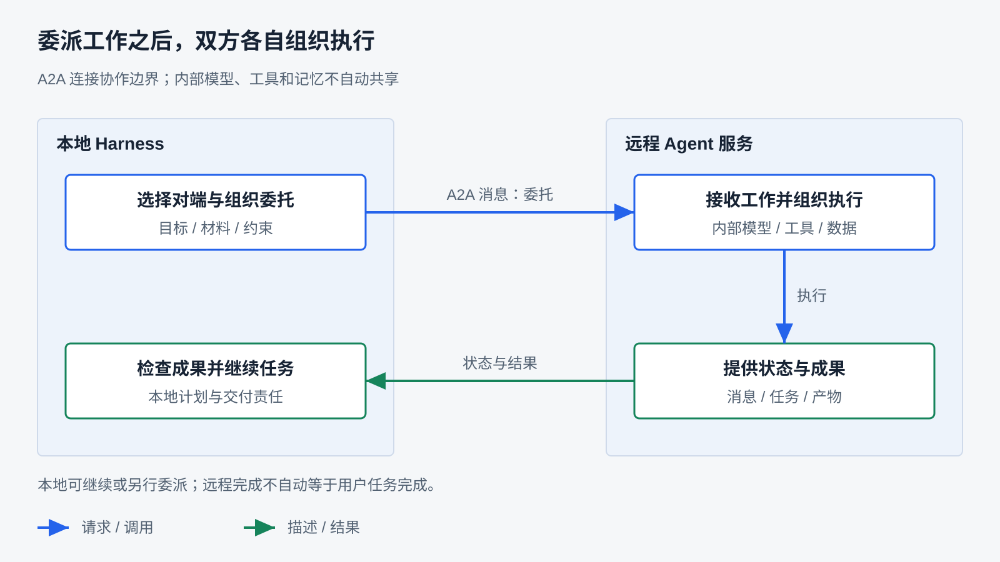
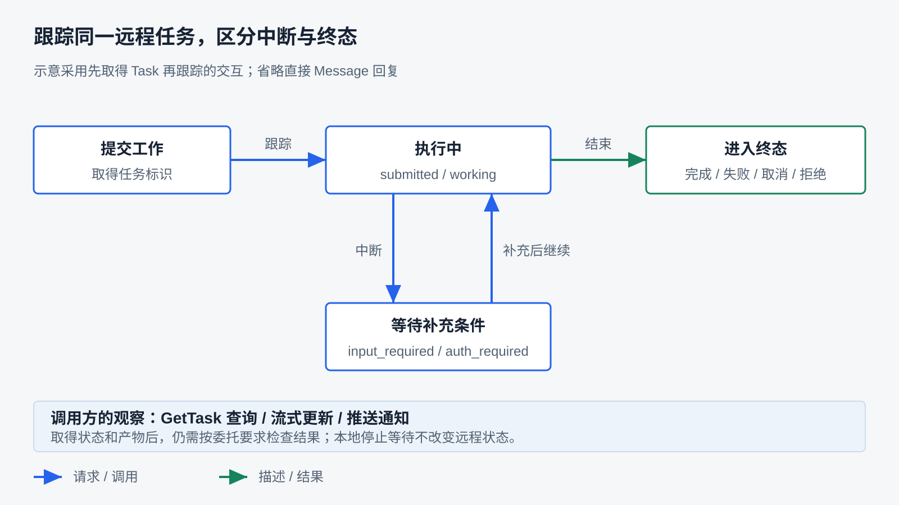
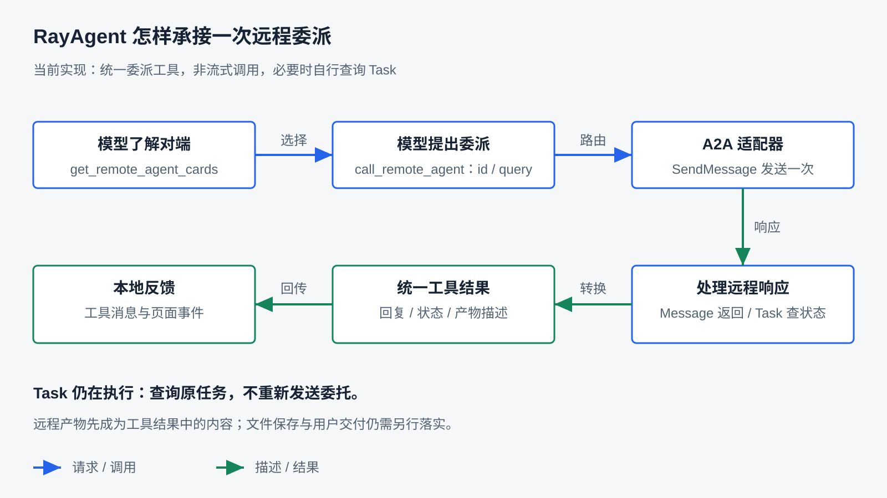

# 通过 A2A 协作远程 Agent

上一章通过 MCP 接入外部工具。如果现在希望把一项资料分析工作交给另一个 Agent，由它安排执行并交回成果，本地应用还需要知道：怎样说明委托，对端没有立即完成时怎样跟踪，最后怎样把结果接回自己的任务？

**A2A 为独立 Agent 之间的能力发现、消息与任务交互提供共同约定；Harness 负责选择委派对象、组织任务条件，并承接执行结果。** 本章先建立基本结构，再走通发现与请求，展开远程任务的状态和成果，最后对照 RayAgent 的接入、等待、取消与验收策略。

本文承接前面的工具调用、任务状态与 MCP 概念，采用项目锁定的 `a2a-sdk==1.1.2` 和 A2A `1.0` JSON-RPC。运行入口见 [A2A 实验指南](../labs/a2a/README.md)与 [API 协议指南](../ray_agent/api/README.md#mcpa2a)。

## A2A 的作用与基本结构

A2A（Agent2Agent）面向独立 Agent 系统之间的协作。调用方可以向对端表达工作要求，接收消息或跟踪任务，而不必知道对端的模型、提示词和内部执行循环。协议使双方能够交换这些信息，具体如何完成工作仍由各自的应用实现。

先看清双方承担的职责，再理解协议为什么需要能力说明、任务状态和产物。

### 调用方与远程 Agent

假设本地 Agent 正在编写报告，希望让一个熟悉内部资料的 Agent 完成其中的资料分析。这是教学场景，用来说明职责，不代表当前产品已经接入这样的业务服务。

本地需要给出分析目标、材料范围和期望交付；远程可以自行决定先搜索什么、如何比较和组织结论。远程交回分析后，本地还要判断它是否满足报告需要，再继续后续工作。

- **调用方**组织委派和后续使用。发送协议请求的客户端属于调用方应用，不必本身具有推理能力。
- **远程 Agent 服务**接收消息，处理工作并对外提供结果或任务状态。内部可以采用不同模型、工具和执行架构。
- **双方的 Harness**分别管理各自的执行。远程不会因收到请求就自动取得本地全部 Memory、附件、权限和沙箱。



图中的边界是执行职责边界，不要求双方位于不同机器。它也说明本地仍有工作要做：接收到对端的回复，并不自动完成自己的用户任务。

### A2A 与 MCP 怎样配合

两个协议都能接入进程外能力，但组织交互的重点不同：

| 观察角度 | MCP 工具接入 | A2A 协作 |
|---|---|---|
| 如何了解对端 | 工具描述、输入定义及其他能力 | Agent 能力说明、接口与交互能力 |
| 如何表达请求 | 选择工具并传入参数 | 向 Agent 发送消息，表达工作或继续交互 |
| 如何承接返回 | 消费工具调用结果 | 消费直接回复，或跟踪任务与产物 |
| 本地仍需负责 | 工具选择、执行控制与结果判断 | 委派范围、状态承接与成果验收 |

这不是按耗时或是否使用大模型划分：MCP 工具内部可以调用模型，A2A 服务也可以返回确定性结果。一个远程 Agent 还可以在内部通过 MCP 操作工具。选择应看希望对外提供什么交互契约，而不只是给服务换一个协议名字。

如果能力已有明确参数和稳定返回，工具接入可能足够；如果希望对端围绕目标组织工作，并通过任务状态和多轮消息协作，A2A 提供了相应的表达方式。接入协议并不会自动生成多 Agent 调度器，谁选择对端、谁汇总多个结果仍是应用设计。

### 能力、消息、任务和产物

可以先按用途理解四个对象：

| 对象 | 回答什么问题 | 本章怎样展开 |
|---|---|---|
| Agent Card（能力卡片） | 这个 Agent 提供什么，怎样访问？ | 下一节用于发现与选择接口 |
| Message（消息） | 这次要向对方表达什么？ | 承载委托、回复或补充信息 |
| Task（任务） | 这项工作处于什么状态？ | 第三节用于持续跟踪 |
| Artifact（产物） | 这项工作形成了什么成果？ | 第三节解释成果与状态的区别 |

Message 和 Artifact 的内容可以由多个 Part（内容部分）组成，不必都是一段文本；具体内容形态需要双方支持。对象定义见 [A2A 核心概念](https://a2a-protocol.org/latest/topics/key-concepts/)。

这张表提供的是协作所需的信息地图。接下来先走通最简单的路径：找到一个服务，发出消息，得到直接回复。

## 远程 Agent 的发现与请求

本节使用仓库已有的 A2A 本地实验。它默认不调用模型，只把收到的文本加上 `A2A_LAB_OK:` 返回。输入和结果确定，方便检查发现、发送与解析；它不承担分析能力或长任务执行的证明。

完整过程是：启动服务并公布卡片 → 客户端读取卡片并选择接口 → 发送消息 → 服务处理并返回 Message。先沿这个过程理解，再看 SDK 与手写请求的对应关系。

### 通过卡片了解对端

客户端需要先知道到哪里找服务。实验使用配置好的本地地址，再从 `/.well-known/agent-card.json` 取得卡片；实际系统也可以使用组织维护的目录或私有配置。卡片发现不会自动解决全网搜索和业务筛选。[Agent 发现说明](https://a2a-protocol.org/latest/topics/agent-discovery/)

下面摘取实验卡片中的主要字段，省略其他描述，不作为完整卡片模板：

```json
{
  "name": "RayAgent A2A 1.0 实验 Agent",
  "supportedInterfaces": [
    {
      "url": "http://127.0.0.1:9999/",
      "protocolBinding": "JSONRPC",
      "protocolVersion": "1.0"
    }
  ],
  "capabilities": {"streaming": false},
  "skills": [
    {
      "id": "deterministic-echo",
      "name": "确定性回复",
      "description": "返回 A2A_LAB_OK:原文，用于复现协议调用闭环。",
      "tags": ["验收", "echo"]
    }
  ]
}
```

`skills` 描述能承担的工作，`supportedInterfaces` 给出通信地址、绑定方式与协议版本，`capabilities` 表明是否支持流式等交互。这里的 skill 是卡片里的能力说明，不是加载到本地执行的脚本，也不是 MCP 工具的参数 schema。

读取卡片的地址与实际发送消息的接口地址要分别看。跨设备部署时，只改客户端的发现地址还不够：如果卡片继续公布 `127.0.0.1`，调用方会访问自己的机器。实验卡片与客户端默认地址共同面向本机运行。

卡片帮助判断服务是否适合任务，却不证明描述准确、身份可信或业务质量合格。固定的内部服务可以通过配置限定范围；开放的服务目录还需要来源与能力验证。RayAgent 当前采用已配置服务集合，第四节会说明其发现策略。

### 把委托表达为消息

发送消息前，调用方应明确对方完成工作所需的信息。对前面的资料分析场景，“帮我分析一下”缺少范围和标准；更可执行的委托应包含分析问题、可用材料、需要回答的要点和期望结果形式。协议能传递内容，但不能自动补齐这些业务条件。

本地实验只发送短文本。下面按手写客户端构造请求，ID 替换为教学值：

```json
{
  "jsonrpc": "2.0",
  "id": "rpc-1",
  "method": "SendMessage",
  "params": {
    "message": {
      "messageId": "message-1",
      "role": "ROLE_USER",
      "parts": [{"text": "ray-agent-lab"}]
    },
    "configuration": {}
  }
}
```

外层 JSON-RPC `id` 关联这次请求与响应；`messageId` 标识消息。`ROLE_USER` 在这里表示发给远程 Agent 的用户侧消息，即使实际发送者是另一个程序。`parts` 才包含本次委托的内容。

请求通过 HTTP POST 发到卡片选定的 JSON-RPC 接口，客户端还发送 `A2A-Version: 1.0` 请求头。协议还定义其他绑定方式，本章以产品采用的 JSON-RPC 为主。不要混用旧版 `message/send` 与当前 `SendMessage` 方法及消息形状；版本变化见 [A2A 1.0 变更说明](https://a2a-protocol.org/latest/whats-new-v1/)。

### 服务怎样处理并回复

实验的服务入口组装三部分：Agent Card、SDK 请求处理器和自定义执行器。卡片说明能力，请求处理器接收协议消息，执行器负责实际业务。本地执行器的核心可以简化为：

```python
async def execute(self, context, event_queue):
    query = query_from(context)
    answer = f"A2A_LAB_OK:{query}"
    await event_queue.enqueue_event(text_message(answer))
```

这里的 `query_from` 和 `text_message` 是实验辅助函数：前者取文本，后者构造 Agent Message。`event_queue` 把执行器输出交给 SDK 处理器，并非 RayAgent 向 UI 推送的事件队列。这段简化代码省略可选模型分支；默认确定性执行不需要模型密钥。

客户端实际收到的回复包含如下内容，ID 为教学值：

```json
{
  "jsonrpc": "2.0",
  "id": "rpc-1",
  "result": {
    "message": {
      "messageId": "reply-1",
      "role": "ROLE_AGENT",
      "parts": [{"text": "A2A_LAB_OK:ray-agent-lab"}]
    }
  }
}
```

这条路径返回直接 Message，没有可供轮询的 Task。回复可能是最终答案，也可能是澄清或能力协商，调用方要根据内容与任务要求解释，不能仅凭“收到了 Message”就确认用户目标完成。

### SDK 与手写客户端怎样对照

仓库的 `client.py` 使用卡片解析器和客户端工厂，`httpx_a2a.py` 显式读取卡片、选择接口、拼装请求。两者访问同一服务，并核对同一固定回复。本次两条入口都已运行通过。

SDK 版虽使用 `async for response in client.send_message(...)`，却配置了 `streaming=False` 和 `polling=False`。Python 的异步迭代形式不等于网络上启用了 SSE，也不表示 SDK 会替应用一直轮询。应同时核对配置与实际返回分支。

手写版有助于看清字段如何进入 HTTP 请求，但只解析直接 Message。下一节的 Task 路径不能用这个脚本的成功替代验证。至此基本通信成立；当对端需要持续执行时，还需要能够跟踪同一项工作。

## 远程任务的状态与结果

如果资料分析需要多步处理，本地不能只靠保持一个 HTTP 请求来理解工作进展。Task 为这项工作提供标识、状态和产物，使调用方可以在后续交互中继续询问它。

先区分两件事：请求是否已经返回，以及远程工作是否已经结束。它们可以发生在不同时间。



图示展示典型关系，省略部分合法转换。需要输入或认证属于中断，不能与完成、失败、取消和拒绝合并为同一种“结束”；具体字段和状态含义按下面的过程理解。

### 从直接回复到可跟踪的任务

A2A 可以返回 Message，也可以返回 Task。Task 带有自身标识，后续通过查询或更新继续观察；不要求调用方了解对端执行了哪些内部步骤。[任务生命周期说明](https://a2a-protocol.org/latest/topics/life-of-a-task/)

在 A2A 1.0 中，`SendMessage` 默认等待任务到终态或中断态才返回。若设置 `configuration.returnImmediately=true`，则可以先取得任务，再通过查询、订阅或推送跟踪。服务是否耗时较长，与请求是否立即返回，是两个不同选择。[发送配置规范](https://a2a-protocol.org/v1.0.0/specification/#322-sendmessageconfiguration)

下面是依据产品任务夹具形状构造的 Task 示例，表示正在执行，省略其他可选信息：

```json
{
  "id": "task-1",
  "contextId": "context-1",
  "status": {"state": "TASK_STATE_WORKING"}
}
```

发送响应会把它放在 `result.task` 中；查询操作返回对应任务。客户端应确认跟踪的还是原任务，不能把另一个任务的完成当作这次委派完成。

### 标识分别关联什么

| 标识 | 用途 | 不应混淆的对象 |
|---|---|---|
| JSON-RPC `id` | 关联一次协议请求与响应 | 一项任务可以经历多次请求 |
| `messageId` | 标识一条消息 | 不等于任务 ID |
| Task 的 `id` / 消息中的 `taskId` | 标识或引用具体远程任务 | 不等于 RayAgent 本地任务 ID |
| `contextId` | 关联同一上下文中的消息与任务 | 不代表共享本地 Memory |
| `artifactId` | 标识一份远程产物 | 不等于产品附件 ID 或下载权限 |

同一远程上下文可以关联多项任务；给已有任务补充内容时，需要使用相应的任务引用。已经进入终态的任务不能简单当作原任务继续执行，新工作应按协议建立新的任务关系。保留 `contextId` 也不等于远程永远保留全部历史，更不能把它视为双方共享数据库的证据。

这些标识使续接成为可能，但 Harness 仍要决定何时保存、保存在哪里、怎样关联本地任务。只有把 ID 打印进日志，不足以构成重启后的恢复机制。

### 查询、流式更新与推送

取得 Task 后，有三种常见的观察方式：

| 方式 | 怎样得到进展 | 需要承担的工程责任 |
|---|---|---|
| 轮询 | 间隔调用 `GetTask` | 查询频率、总体预算、任务标识与失败处理 |
| 流式更新 | 通过流接收状态或产物更新 | 连接寿命、事件解释、断连后的继续观察 |
| 推送 | 服务向已配置的接收端发送通知 | 接收端可达性、认证、重复通知与状态关联 |

轮询容易落地，但观察存在间隔，也有重复请求成本；流式适合持续展示进展或增量产物；推送适合调用方不长期保持连接的情况，却需要额外的接收服务。它们都不保证远程业务成功。[流式与异步交互说明](https://a2a-protocol.org/latest/topics/streaming-and-async/)

A2A 的状态更新流承载协议事件，不等于模型 token 流。某条状态消息写着“正在分析”，也不能据此还原远程全部工具轨迹。RayAgent 当前使用非流式请求并自行轮询，没有把远程流式进展或推送接入任务事件。

### 状态怎样影响本地下一步

下表使用便于阅读的状态简称；线上的枚举值带 `TASK_STATE_` 前缀：

| 状态 | 远程含义 | 本地需要决定什么 |
|---|---|---|
| `submitted`、`working` | 已提交或正在执行 | 是否继续等待，何时再次观察 |
| `input_required` | 需要补充输入 | 谁提供信息，怎样续接原任务 |
| `auth_required` | 需要完成相关认证或授权步骤 | 怎样引导授权，再恢复交互 |
| `completed` | 远程宣告完成 | 取得成果并按委托要求验收 |
| `failed`、`rejected`、`canceled` | 失败、拒绝或取消，已进入终态 | 解释原因，决定是否补救或另行委派 |

中断态保留继续交互的可能；终态表示这项远程任务的生命周期结束。规范说明见[任务状态定义](https://a2a-protocol.org/v1.0.0/specification/#413-taskstate)。本地应用可以暂不支持续接，但应明确这是产品能力范围，不能把协议中断改写成远程业务失败。

### 产物怎样成为可用成果

Task 的状态说明“进行到哪里”，Artifact 表达工作形成的成果。前者可能是“分析完成”，后者才是分析正文、结构化数据或文件内容。产物由内容部分组成，也可能分批更新；完整成果的组装需要处理对应产物及增量，不能无条件把所有更新拼成一段文字。

产品测试夹具在延迟任务完成时返回文本产物 `A2A_ARTIFACT_OK`。它能验证客户端最终取得产物，不证明真实分析质量、文件可访问性或复杂增量合并。与第十二章一样，远程返回文件引用后，还要考虑本地是否有权读取、是否需要保存、是否应交付用户。

**远程任务完成、取得远程产物、本地用户任务完成，是三个需要分别检查的结果。** 接下来回到 RayAgent，观察这些对象和状态如何成为本地工具反馈。

## RayAgent 如何将远程协作接入任务

对模型而言，委派仍通过本地工具提出；对协议适配器而言，则需要完成卡片选择、消息发送和远程状态解释。RayAgent 沿现有工具循环接入 A2A，远程执行过程保持在对端。



图中将模型委派、协议等待和结果反馈分开。卡片是模型选择对端的材料，远程状态是适配器判断等待的依据，两者不应混成同一份工具声明。

### 配置与发现：确定可用的远程 Agent

RayAgent 从配置读取启用的服务，初始化时并行获取卡片。适配器检查名称与接口，拒绝自身不支持的必需扩展，再交给 SDK 工厂选择 JSON-RPC 接口。它设置 `A2A-Version: 1.0`，使用静态请求头配置。发现有单服务超时和总体预算；某个服务失败不阻止其他成功服务保留。

配置中的 `id` 是本地委派路由标识，卡片里的 Agent 名称主要用于描述。把两者分开，避免显示名称变化就被误当成另一个路由。产品通过卡片列表工具向模型提供配置 ID 与卡片内容。

设置页探测使用临时管理器，任务运行再初始化自己的连接；“已连接”表示那次探测可用。当前管理器初始化后缓存卡片与客户端，清理时释放，没有完整的按用户动态发现或卡片实时更新机制。固定服务集合便于控制范围，但需要接受信息可能过时的代价。

### 模型选择与委派：两项本地工具

A2A 工具箱向模型提供两个动作：

| 本地工具 | 输入与结果 | 在循环中的用途 |
|---|---|---|
| `get_remote_agent_cards` | 无参数；返回已发现服务的 ID 和卡片 | 了解有哪些对端与能力 |
| `call_remote_agent` | `id` 与 `query` | 向选定 Agent 发送委托，等待本地适配结果 |

上一章 MCP 把远程工具描述转换为模型工具声明；这里采用统一委派入口，卡片中的 skills 作为选择材料返回，没有为每个 skill 生成独立函数。统一入口比较简单，任务表达更依赖 `query` 的质量；逐能力设计专门输入可以更严格，但会增加适配工作。

模型应根据卡片选择服务并编写委托，程序按精确的配置 ID 路由。工具顺序不是由协议强制的，当前工具箱也没有把“先查卡片”做成调用前置校验；不可用或已禁用的 ID 会返回失败。工具描述提醒失败后不要自动重复提交，但提醒不构成业务幂等保证。

当前适配只把 `query` 放进一条新的文本 Message。它不会自动传递本地完整对话、附件、Plan 或用户身份，也不接受已有远程 `taskId` / `contextId` 作为续接参数。要补充材料，需要先判断文本委托是否足够，以及对端能否访问其中引用的资源。

### 等待与状态处理：只提交一次，再查询

管理器为一次委派建立总体 `call_timeout`。直接 Message 经过角色、标识和内容检查后返回；Task 则核对任务 ID、上下文 ID 与状态。处于 `submitted` 或 `working` 时，适配器查询同一任务，等待间隔从 1 秒逐步增加，最大 5 秒。

下面按实现整理为教学伪代码，省略 SDK 响应迭代、字段校验和异常分支：

```python
async def delegate(client, request, budget):
    async with asyncio.timeout(budget):
        response = await send_once(client, request)
        if response.is_message:
            return message_result(response.message)
        task = response.task
        interval = 1.0
        while task.state in {"submitted", "working"}:
            await asyncio.sleep(interval)
            task = await get_same_task(client, task.id)
            interval = min(5, interval * 1.5)
        return task_result(task)
```

关键是查询已有任务，不在每次等待时重新发送委托。产品测试检查延迟任务只增加一次 `SendMessage`，随后取得完成状态与固定产物。

这里还要区分标准交互与兼容处理：当前产品没有设置 `returnImmediately=true`，按规范默认应等待终态或中断态；适配器仍防御性处理提前返回的进行中 Task。测试夹具刻意这样返回，用于验证轮询分支，不能把夹具的这一行为当作合规服务端的默认示范。

Task 的 `completed` 映射为本地成功；其他非活动状态映射为 `success=False` 并保留 `remote_state`。因此 `input_required` 在本地表示尚未完成且需要处理，适配器不会继续轮询，也不会自动转成 RayAgent 的用户等待流程。未指定状态或查询过程中任务身份变化会被视为非法响应。

### 结果反馈：接回模型与页面事件

正常返回的直接 Message 在本地标记 `remote_state="message"`；Task 结果保留任务 ID、上下文 ID、远程状态和任务内容。`ToolResult.success` 表示适配层的判断，没有对回答事实和业务交付进行自动评分。

BaseAgent 将工具结果序列化为工具消息，继续模型调用；运行器还将结果放入 `ProtocolToolContent.outcome`，供页面展示与历史回放。轮询在适配器内部进行，当前不会把每次远程状态变化逐条转换为 UI 进度事件。页面显示本地工具“正在调用”，不等于正在展示对端的实际执行轨迹。

结果转换复用第十四章的内容处理：保留空值和结构化字段，限制过长文本与列表，省略二进制数据。远程 Task 包含 Artifact，不意味着它已经成为可下载的 RayAgent 附件；当前路径主要把其描述交回模型，需要另行完成文件读取、保存和交付。

至此，远程协作已经进入本地循环。它仍是当前步骤里的一次工具调用；本地 Plan 与远程 Task 没有自动形成持久化的父子任务调度关系，也没有因此获得多 Agent 并行汇合能力。

## Harness 如何管理远程委派

把工作交给远程 Agent 后，本地不能直接控制对端每一步执行。需要通过清楚的委派范围、有限等待、状态关联和结果检查，决定什么时候继续、什么时候停止，以及什么时候需要人介入。

### 委派范围与上下文：对端需要知道什么

委派粒度影响协作成本。只交付一个细小动作，输入和结果容易明确，但本地仍需安排每一步；委派完整子任务，可以利用对端的专业执行能力，也要求更清楚地说明目标与验收条件。粒度应根据对端能力、材料依赖和失败代价选择。

对资料分析，可以把“分析这份资料”补成：回答哪些问题、依据哪些材料、需要列出哪些证据、哪些结论无法确认时应明确说明。这里约束的是可观察结果，不要求远程公开全部内部推理或复制本地执行方法。

材料传递还涉及执行位置。本地沙箱路径对远程可能毫无意义；一个 URL 也可能需要对端没有的权限。可以传必要内容、提供受控访问入口或预先约定共享资源，但应分别确认访问范围和保留时间。当前 RayAgent 的文本 `query` 只提供基本通道，没有自动完成这些交接。

### 等待与超时：观察已有工作还是重新提交

本地预算限制自己等待多久，不决定远程一定何时结束。RayAgent 在发送和轮询外围设置总体调用预算，HTTP 还设置连接等超时；超时后返回 `timeout`，保留已知任务信息，并说明结果未知、未重新提交。

当前调用超时分支不会主动发送 `CancelTask`。关闭 HTTP 客户端也不能推断远程工作已停止。因此要区分两种业务策略：预算耗尽就请求取消，或结束本地等待但保留远程工作供稍后查询。后者还需要保存关联信息和提供恢复入口；当前产品没有完整的跨运行查询续接能力。

已取得任务 ID 时，可以围绕原任务核对结果；还未取得时，情况更难判断：服务可能尚未接收，也可能已创建任务但响应丢失。直接重发委托可能产生第二份工作甚至重复副作用。

A2A 允许服务利用 `messageId` 检测重复消息，但发送操作的幂等不是普遍保证；需要确认对端的去重约定、保存期限和业务效果。[幂等语义](https://a2a-protocol.org/v1.0.0/specification/#331-idempotency) RayAgent 每次新的委派调用生成新的消息 ID，没有跨调用复用的幂等账本。模型再次调用工具也属于新的提交，不能因为适配器内部只发送一次就宣称整个系统至多执行一次。

### 取消与续接：本地停止之后远程怎样处理

用户取消本地调用会触发与超时不同的路径。RayAgent 捕获取消后，在独立的 `cancel_timeout` 内尝试取消已知远程 Task，然后继续向上传播本地取消。没有 Task ID 时记录 `no_task_id`；有 ID 时还可能得到取消成功、对端未取消、拒绝、超时或未知结果。

这些观察应分别解释。发送取消请求不等于对端接受，接受取消也不等于撤销已发生的业务效果。本地清理负责释放 HTTP 资源，不能代替远程业务补偿。当前取消观察保存在管理器内并记日志，不是完整的持久化恢复账本。

现有测试覆盖取消成功、拒绝、超时和未取得任务 ID，并核对多次初始化与清理后本地 HTTP 客户端关闭。夹具的取消回复是确定性模拟，不证明真实远程模型、工具子进程或外部业务动作已经停止。

如果远程返回 `input_required`，持续查询通常不能代替补充输入。应用需要取得问题、向用户呈现、保存任务关联，再将答复送回原任务；`auth_required` 则还涉及合适的授权交互。协议允许这些协作，RayAgent 当前只返回相关状态，没有连接第八章的等待续接机制。

### 身份、权限与成果验收

能力卡片声明身份与安全要求，客户端还需要核对服务来源、取得适当凭据，并由服务执行权限检查。传输认证与任务内授权也可能出现在不同阶段，不能把它们全部理解成配置一次请求头。[认证与授权规范](https://a2a-protocol.org/v1.0.0/specification/#7-authentication-and-authorization)

RayAgent 当前支持静态请求头。卡片声明认证要求而配置没有任何头时，发现会失败；有请求头也不证明凭据满足具体安全方案。产品没有完整 OAuth 获取、刷新和任务内授权流程，这些能力不能从 SDK 支持范围推断为应用已实现。

远程结果可能包含引用、建议和下一步操作要求。它们应作为来自对端的材料，由本地围绕用户目标判断，不能自动提升为新授权。必要时应限制委派中传出的数据，并将不可逆动作留在明确授权的执行边界内。

成果验收则要回到原委托：是否回答了指定问题，证据是否可查，文件能否访问，格式是否可供下一步使用。对于固定格式可以检查字段和文件；对于分析结论还要检查依据与不确定性。远程 `completed` 只提供生命周期信息，本地仍需承担自己的交付责任。

这些管理策略相互影响：粒度越大、任务越长，越需要明确材料、关联和恢复；副作用越强，越需要谨慎处理重复提交与取消。A2A 提供交互基础，具体策略取决于业务。

## 总结：如何设计一次远程 Agent 协作

回到开篇，一次委派需要贯通六步：**选择对端 → 明确委托与材料 → 发送请求 → 跟踪状态 → 承接成果 → 验证本地任务能否继续。** 卡片帮助认识能力，Message 表达交互，Task 承载持续状态，Artifact 表达成果；Harness 把这些对象与自己的任务控制连接起来。

快速、独立的委派可以用直接回复和有限等待；耗时较长、可能中断的工作，则需要状态跟踪、任务关联和续接安排。对会产生外部副作用的工作，还需明确幂等、取消和验收条件。没有一种等待或恢复策略适合所有服务。

验证也应沿这条关系分层：

| 要确认什么 | 本章可用证据 | 尚不能证明什么 |
|---|---|---|
| 能发现并交换消息 | SDK 与手写客户端返回同一固定文本 | 真实模型理解了委托 |
| 能跟踪 Task 并取得产物 | 产品夹具的延迟任务与状态测试 | 真实服务全过程与内容质量 |
| 能处理超时和取消 | 预算、取消结果及资源清理测试 | 远程副作用回滚或跨运行恢复 |
| 能完成用户任务 | 需要按业务要求检查最终成果 | 不能由协议成功或 `completed` 单独推出 |

本章本地实验和协议测试已运行；真实模型与完整 Web 委派任务仍 `unverified`。条件与覆盖范围见[制作进度](progress.md#第-15-章通过-a2a-协作远程-agent)。

可以用三个问题检查自己能否运用这些机制：

1. 一个资料服务既能提供查询工具，也能完成整项分析，怎样选择 MCP 接入或 A2A 委派？需要怎样定义交付要求？
2. 远程要求补充材料，本地应该保存什么、向谁提问、怎样继续原任务？当前 RayAgent 缺少哪段交接？
3. 委派超时但远程可能已修改业务记录，怎样取得证据并决定是否重新提交？为什么仅有新的消息 ID 不能解决重复执行？

远程协作扩大了可用能力，也增加了本地看不见的执行过程。下一章将把这些边界与前面的文件、浏览器和工具执行放在一起，研究如何验证可靠性，并评估完整任务的执行质量。

[上一章：通过 MCP 接入外部工具](14-external-tools-with-mcp.md) · [课程目录](README.md) · [下一章：可靠性、验证与评估](16-reliability-and-verification.md)
