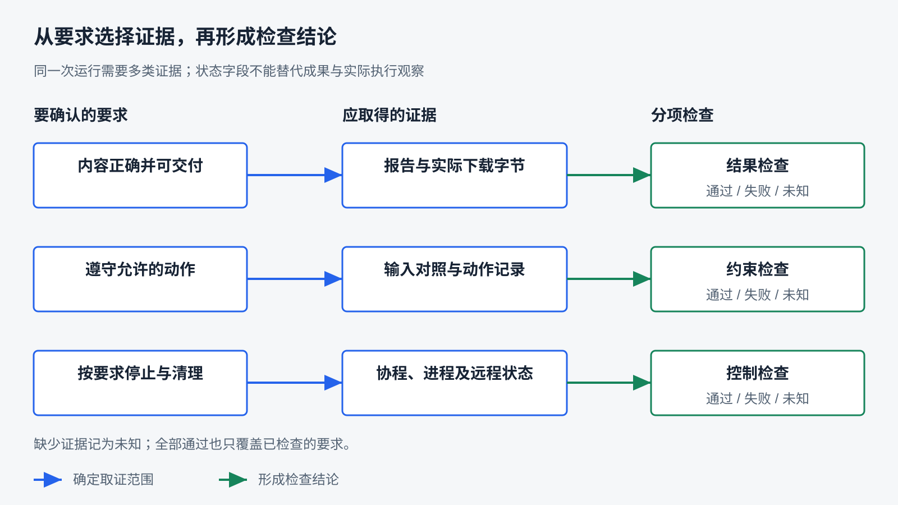
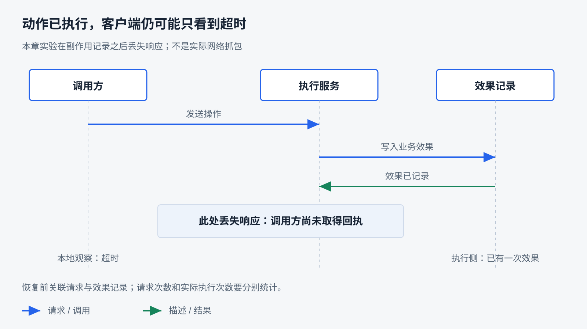

# 可靠性、验证与评估

前面几章反复遇到同一种情况：文件工具成功返回，用户未必能下载成果；浏览器点击成功，页面数据未必已经更新；远程 Agent 返回 `completed`，成果仍可能不符合委托。执行过程给出了状态，用户关心的却是目标是否实现。

**本章研究怎样用证据判断 Harness 与模型共同完成任务的质量和可靠性。** 先把目标写成可检查的要求，再选择证据与检查方法；接着验证失败和中断下的行为，最后通过任务集与重复运行判断稳定性，并据此改进系统。

本章承接前面的执行控制、状态、工具与产物机制。独立实验和任务样本见[验证方法实验](../labs/verification/README.md)，产品测试入口见 [API 指南](../ray_agent/api/README.md#测试与数据库迁移)。

## 把任务目标变成可验证的要求

验证从要确认的事情开始。若只问“这次运行成功了吗”，答案很容易被一个状态字段或一句总结替代。先拆开成功的含义，才能决定去哪里取证据。

### 结果、约束、控制与成本

面对一个用户任务，可以从四个方面检查：

| 维度 | 要确认什么 | 可能的证据 |
|---|---|---|
| 结果 | 内容、产物是否正确、完整且可用 | 文件字节、业务记录、下载结果、内容审阅 |
| 约束 | 是否遵守数据范围和允许的动作 | 输入前后对照、工具参数、操作审计 |
| 执行控制 | 是否正确等待、停止和处理失败 | 状态变化、事件顺序、调用及资源观察 |
| 资源与成本 | 等待和资源占用是否符合预期 | 计时、请求记录、实际可得用量 |

四者不能互相代替。报告算对了数值，但覆盖了禁止修改的原文件，仍未满足任务要求；任务因服务不可用而停止，可能正确处理了失败，但没有完成用户目标。验证报告应分别写清这些结果。

成本也需要区分限制与比较指标。用户要求五分钟内完成时，时间是验收条件；没有这个约束时，耗时可以用于比较方案，而不是事后随意判为失败。权限违规等硬要求不能通过其他质量项的高分抵消。

### 定义一个完整任务样本

本章在前面文件交付机制的基础上设计一个统计任务。它是教学样本，不是已经通过的真实模型任务。

输入文件 `source.csv` 包含三笔金额 12、18、30。用户要求：**统计 amount 总和，生成 `summary.json` 并提供下载，保留原文件内容。** 一个可验证的任务定义如下：

| 项目 | 本样本约定 |
|---|---|
| 初始条件 | 新会话、独立材料副本；输出文件尚不存在 |
| 输入 | CSV 表头为 item、amount，三行金额为 12、18、30 |
| 目标产物 | JSON 对象包含整数 `total`，值为 60；允许附加说明字段 |
| 保留要求 | 原 CSV 字节不变 |
| 交付要求 | 从产品提供的下载入口取得报告，内容与当前报告一致 |
| 执行范围 | 使用本次提供的材料和独立工作区，不需要外部服务 |
| 检查方法 | 解析报告、比较输入字节、实际下载核对；执行范围另看动作记录 |

完整输入与运行记录约定维护在[实验指南的任务样本](../labs/verification/README.md#五类任务样本)。把这些条件放在运行前，可以避免看到输出之后才选择有利于通过的解释。

为什么“存在 summary.json”不够？文件可能为空、数值错误，或者只是上一次留下的结果。为什么“工具读回正确”仍不够？它证明工作区内读到了正确内容，用户下载的可能是另一份旧报告。每项要求都需要覆盖到它真正成立的位置。

### 规定成果，允许有效的执行差异

同一任务可以通过 Python、文件工具或其他合理方式完成。只要满足目标与约束，不应因为调用顺序和参考轨迹不同就判错。模型的计划、措辞和工具次数都可能变化，参考轨迹不应自动成为唯一答案。

有些过程要求则必须检查。例如禁止对外发送材料，就需要观察发送行为；要求先确认再提交，就要核对确认与副作用的先后。最终文件内容不变，不能证明过程中从未发生过越权读取或先修改后恢复。

因此，验收条件应分为结果条件和必要的过程约束。检查内容正确时可以解析结构；检查行为合法时要取得相应轨迹。证据不足的约束应标记未知，不能因为没有看到违规就断言全部合规。

对开放性报告，“写得好”也需要具体化。例如要求保留事实范围、指出材料局限、使结论可以追溯。若两个评审者对这些要求理解不同，首先要澄清标准，而不是直接把分歧算成模型波动。

要求明确以后，下一步是选择能够支撑这些结论的证据和检查方法。

## 为结论选择证据与检查方法

工具返回、执行记录和最终环境描述的是不同对象。应当从要求反推证据：要确认用户拿到正确报告，就观察实际交付；要确认失败后没有重复副作用，就观察执行侧记录。



图中的检查结果有“通过、失败、未知”三种。未知表示缺少足够证据；它不等于通过，也不一定说明系统已经做错。尚未运行的样本还应单独标记，避免与观察结果混合。

### 三种检查方式怎样配合

**确定性检查**适合有明确规则的条件。例如解析 JSON 后比较数值、核对输入哈希、确认下载字节、检查调用次数或进程是否退出。规则应贴近要求，避免按整段文本逐字匹配而拒绝有效格式变化。

**人工审阅**适合判断依据是否充分、结论是否越过材料范围、表达是否利于使用。评审应逐项给出理由和证据位置；“感觉不错”难以复查。多人存在分歧时，应保留分歧并校准标准。

**模型辅助评判**可以帮助检查大量开放性输出，但它也会误读材料、偏好某种表达或受无关指令干扰。需要提供明确标准与证据，把待评内容作为材料处理，并用人工标注的正确、错误和边界样本核对评判。关键硬约束不应只依赖另一个模型的口头判断。

实践中可以组合使用：先用代码检查报告格式和引用是否存在，再由人工或辅助模型判断引用是否真正支持结论。检查器的选择应对应问题，而不是统一给所有任务一个评分。关于代码、人工和模型评判的组合，可参阅 [Agent 评估工程经验](https://www.anthropic.com/engineering/demystifying-evals-for-ai-agents)。

### 局部测试、集成验证与完整任务

同一项能力可以在不同范围取得证据：

| 验证范围 | 能隔离什么 | RayAgent 中的例子 | 仍需补什么 |
|---|---|---|---|
| 局部规则 | 参数、转换、单个控制分支 | 空值保留、错误映射、工具名称路由 | 与真实依赖的交接 |
| 集成交接 | 多个实际组件如何协作 | 真实 Flow 配固定模型响应；协议客户端配本地服务 | 真实模型选择与环境变化 |
| 完整任务 | 用户输入到成果交付 | Web 发起任务、执行工具、下载并核对 | 多样任务和重复运行 |

局部测试容易稳定地制造错误，适合定位；完整任务更接近真实使用，但变量多，失败原因不一定直接可见。两者应互相支持。不能因为有替身就否定集成测试，也不能把替身保证的行为写成真实服务已经通过。

RayAgent 的文件产物测试保留实际同步逻辑，替换存储和数据库会话，能检查同步失败时如何处理记录；它不会经过真实下载路由。第六章的文件任务已有实际下载字节证据，却只代表那次输入、环境和执行。前者覆盖分支，后者覆盖实际路径，各有作用。

同样，A2A 的固定回复测试证明发现和响应解释；模型是否会选择合适的远程 Agent，需要另外的任务运行。把协议测试数量放到“Agent 成功率”的分母里没有意义。

### 检查器本身也需要验证

本章的 `check_delivery.py` 为统计任务构造七种输出：正确、有效格式变体、错误总数、缺少文件、输入被修改、下载旧文件，以及没有交付观察。每个样本的预期判定在检查器运行前给出。

只检查文件存在，会错误接受内容错误、原件改变、交付错误或缺少交付观察的结果；按要求检查则分别解析总数、比较原件、核对已观察的下载字节。核心判断可简化为：

```python
checks = {
    "content": report_is_correct,
    "input": source_is_preserved,
    "delivery": download_matches if delivery_observed else None,
}
if False in checks.values():
    verdict = "fail"
elif None in checks.values():
    verdict = "unknown"
else:
    verdict = "pass"
```

这个顺序表示：已经发现违反要求，可以判失败；没有发现错误但缺必要观察，只能判未知。若全部分项通过，也只能说这些分项通过。实验没有完整动作审计，不能据此扩大为“全部权限约束通过”。

本次实验中，存在性检查误接受四个样本，其中三个应失败，一个应未知；分项检查与七个预设标签一致。它还接受合法的 JSON 空白和附加字段，避免把格式差异当成错误。这是检查器在构造样本上的校准结果，不是 Agent 的七次任务成绩。下载字节在实验中由固定数据模拟，真实交付仍需访问产品入口。

检查器应保持独立：不要用待验收报告里的数字反过来生成标准答案，也不要允许被评估过程随意改写标准和检查代码。新增失败样本后，还应检查旧的正确样本是否被误拒绝。

### 运行中的检查与运行后的评估

Agent 在执行中读回文件、验证页面或检查返回字段，可以尽早发现问题并纠正。这些动作属于 Harness 的反馈设计。运行结束后，评估者还应独立取得成果与状态，确认自查结论有依据。

如果把标准答案直接放进 Agent 可见上下文，它可能绕过需要验证的能力。正常业务约束应该给 Agent，隐藏的参考答案和评判标签则用于评估侧。运行中检查与外部验收可以采用相似规则，但要明确谁提供输入、谁能修改检查条件。

证据方法清楚之后，还要主动创造正常路径不会遇到的条件，验证控制与恢复边界。

## 通过失败与中断验证执行边界

可靠性不仅体现为顺利时完成任务，也体现为失败后不会误报、无界等待或重复产生不允许的效果。故障实验要明确失败发生在哪里，否则“测试了超时”仍然难以解释。

### 在确定的位置制造条件

一个可复查的故障实验应包含五项：触发位置、触发条件、预期行为、观察点和清理方式。例如在服务记录动作之后、客户端收到结果之前丢失响应，再观察重试次数与实际动作次数。

用固定同步点比随意等待一段时间更容易复现。第十三章通过控制响应释放，让按钮更新与价格返回之间的窗口稳定出现；第八章测试在 `calling` 事件处注入新输入，检查旧动作是否尚未执行。这些实验说明的是明确的时序，不是所有真实网络都具有相同时延。



图中服务端已经产生效果后，客户端仍可能只得到超时。只检查客户端异常看不到真实副作用；只检查服务完成也看不到用户是否收到结果。要验证恢复，就需要把两侧记录关联起来。

### 工具明确失败：反馈是否支持下一步

先选择无歧义的故障，例如工具明确返回“临时不可用，尚未执行”。验证要确认失败进入模型工具消息，后续行为遵守预算与任务要求，没有把失败文本写成成功成果。

“重试并完成”和“停止并报告受阻”可能分别适合不同业务。若用户要求必须拿到结果，报告受阻仍是目标未完成；但错误处理可以合格。提前区分这两个维度，才能解释测试为何通过而业务任务没有完成。

RayAgent 现有协议测试确认远端错误映射为本地失败，Flow 测试则用固定模型响应核对工具观察回传、步骤结果为 `success=False` 时的计划处理，以及解析失败后的中止。这些是不同层次的局部证据，不能合并成“真实模型已经在工具失败后完成纠正”；下一轮模型输出已被指定，也不能证明模型会自主选择合理补救。真实任务评估应保留实际模型，并检查它究竟做了什么。

### 响应丢失：重试是否重复产生效果

本章的 `check_lost_response.py` 使用一个内存服务：先记下一次业务效果，再明确抛出超时模拟响应丢失。客户端随后重试，比较三组条件：

| 条件 | 请求次数 | 记录的业务效果次数 |
|---|---|---|
| 复用业务键，服务不去重 | 2 | 2 |
| 复用业务键，服务保存并返回原回执 | 2 | 1 |
| 服务支持去重，但重试换了业务键 | 2 | 2 |

三组使用相同故障位置，本次均得到表中结果。它说明稳定业务键与服务端去重需要配合；仅复用一个标识，或仅声称服务支持去重，都不足以保证重试安全。

这是单线程内存模型。真实系统还要验证效果写入与去重记录是否原子提交、并发请求是否竞争、记录保存多久，以及崩溃后能否恢复。实验没有这些能力，不能据此宣称 RayAgent 已实现幂等恢复。

回到第十五章：A2A 适配器内部只发送一次委派，并不限制模型后来再次提出委派；请求超时也不自动取消远程工作。验证时应分别数协议请求与业务效果，不能只看本地工具被调用了几次。只读操作的重试代价通常较小，修改业务记录则应先查原操作结果或满足明确的幂等条件。

### 取消与断连：到底停止了哪一层

至少要区分页面连接、调用等待、本地任务协程、执行进程和远程业务。关闭页面可能只停止观察；返回停止确认可能早于后台清理；协程取消也可能留下工具启动的子进程。

RayAgent 的停止测试刻意阻塞协议清理，观察到停止接口返回、状态写入和 `done` 事件可以先发生，而执行协程尚未完成。测试还确认该路径不调用沙箱销毁。它证明不能用状态或事件代替清理完成，不意味着所有沙箱资源都已泄漏或已经回收。

如果要验收长操作取消，可在独立环境运行周期写入标记的进程。确认它开始后发出取消，同时记录停止响应、协程结束、进程退出以及最后一次标记的时间。预先规定观察窗口，再检查窗口后是否仍有新效果。本章任务样本给出具体条件，但尚未进行产品长进程的真实取消验收。

SSE 断连则要分别观察任务是否继续、事件是否保存、重新连接是否补齐，以及是否因重复提交重新执行。页面刷新后看到历史，只证明历史可以读取；要证明断点续传或执行恢复，还需验证相应位置的连续性。

第九章已有同会话等待续接证据：使用新运行器读取保存状态并继续。它不能替代 API 进程崩溃、事务失败或不同执行者接管的验证。恢复实验必须写清保留了哪些资源、替换了哪些组件、恢复后如何检查重复效果。

通过这些案例，可以把失败分析落实为具体问题。接下来需要扩大样本范围，判断观察到的表现能否稳定重现。

## 用任务集评估稳定性与质量

一条成功轨迹提供存在性证据：系统在这些条件下做到了。实际使用还关心其他输入、不同边界和重复尝试时能否做到。任务集用于覆盖这些差异，重复运行用于观察同类条件下的波动。

### 从业务风险选择样本

任务集可以从实际需求和已有失败开始，不必先收集大量题目。本课程采用五类起始样本：

| 类别 | 要覆盖的能力或风险 | 关键检查 |
|---|---|---|
| 文件与产物交付 | 正确执行并交付可用结果 | 内容、原件保留、实际下载 |
| 资料整理与报告 | 依据材料作出有边界的结论 | 事实范围、引用、局限 |
| 工具失败后的纠正 | 反馈是否改变后续行为 | 错误被消费、不捏造、有限补救 |
| 长操作等待与取消 | 停止能否落实到执行侧 | 时序、进程及后续效果 |
| 压缩后的继续执行 | 必要条件是否仍能影响动作 | 实际触发压缩、约束保留、产物正确 |

每类还应有正常、边界或失败变体，具体取决于业务风险。单纯增加许多相似的简单任务，可能让总体分数很好看，却没有覆盖高代价问题。完整初始条件、请求与验收规则见[五类任务样本](../labs/verification/README.md#五类任务样本)，本章未把这些样本全部运行成真实模型成绩。

资料报告样本使用固定材料，明确事实与局限，减少外部网页变化带来的干扰。需要评估真实搜索能力时，再引入外部来源，并记录取证时间与材料版本。不同测试目的应分别设置条件。

### 固定条件与隔离尝试

至少记录代码版本、模型标识、提示与配置、工具集合、材料版本、运行环境和预算。固定配置只能减少差异，不能保证远程模型输出完全确定。

Agent 会改变环境，重跑前必须检查是否残留上次的文件、登录态、Memory 或远程任务。若第二次直接读到上次答案，就无法据此判断本次执行能力。每次使用独立材料副本和会话；确实要研究状态复用时，应把复用明确列为实验条件。

不同版本对照尽量使用相同样本与初始条件，并交错安排运行，降低服务负载、时间和外部数据变化的影响。一次同时更换模型、提示和工具，很难把结果归因于某项 Harness 改动。

### 区分样本、尝试和额外重试

一个任务样本可以执行多次，每次是一次独立尝试。尝试内部可能包含多个模型请求或工具重试，这些不应被拆成新的样本来增加分母。人工重跑一次也应记录，不能悄悄替换原失败记录。

例如某任务运行五次，通过四次，应报告“在这些条件下 4/5 次通过”，并保留失败类型。五次中至少一次成功，与五次都稳定成功回答不同的问题。次数少时，不应把观察比例直接当成未来业务的精确成功概率。

运行次数和停止规则应提前决定，不能一直运行到结果满意才停止。高风险场景需要更充分证据，但没有一个对所有任务都正确的固定次数。成本有限时，可以先用较少尝试识别主要失败，再对关键类别增加观察，说明样本量限制。

### 记录分项结果与可得成本

每次记录应能回答：输入是什么，运行发生在什么条件下，观察到了什么，哪些条件通过，以及凭什么这样判断。可以先用结构化文件或表格，不必立即建设平台。

| 记录 | 用途 |
|---|---|
| 样本 ID、尝试 ID、版本与条件 | 关联同条件比较 |
| 产物、状态与轨迹位置 | 保留可复查依据 |
| 各项 pass / fail / unknown | 分开目标、约束与控制 |
| 失败阶段与原因线索 | 区分输入、模型、工具、环境、交付和检查器问题 |
| 耗时、请求次数、实际用量 | 比较运行成本，并标明缺失 |

尚未执行标记 `not_run`。已执行但下载观察缺失可以是 `unknown`；不能把未知删掉后只在其余结果中宣传成功率。汇总时写明总样本、已运行、通过、失败和未知数量，说明分母。

耗时也要说明测量范围：首个回复、工具执行、整个任务和用户拿到文件是不同时间。RayAgent 当前事件与用量字段提供部分证据，但不是覆盖所有重试、远程 Agent 内部调用与真实账单的完整账本。缺失 token 应记缺失，不能填零；远程返回一个结果，也不表示对端没有模型成本。

最终按类别查看表现，再观察总体趋势。取消正确但报告质量较弱，与两类都偶发失败，可能具有相同平均分，却需要不同改进。关键约束违规应单列，不能用简单任务的大量成功稀释。

任务集给出了表现分布，还需要将结果转成可检验的改进假设。

## 用验证结果指导 Harness 改进

评估的价值在于帮助做决定：问题发生在哪里，改动是否解决了它，新增代价是否值得。先建立失败证据，再选择改动；否则容易把一个偶然成功解释成方案有效。

### 从观察提出可检查的假设

“报告数值错误”是观察，“模型算术能力差”是推断。真实原因也可能是读到旧文件、工具结果截断、选择了错误材料或下载入口指向旧产物。应沿输入、调用、反馈和交付逐段缩小范围。

例如工作区报告正确、下载字节错误，首先检查产物同步和关联，比立即更换模型更有针对性；若失败结果没有进入下一轮请求，就先检查反馈链；若反馈完整而模型仍反复同样调用，再研究工具说明、可见信息或决策策略。

定位过程中保留“已确认”与“待验证”的区别。错误标签可以帮助分类，不能独立证明根因。RayAgent 的事件、Memory 与产物需要交叉使用；未捕获的完整模型请求不能根据 UI 展示推造出来。

### 用小型对照验证一次改动

本章已经完成两个有限对照。检查器实验保持样本不变，比较存在性判断与按要求分项判断，发现误接受减少；但这表示测量更准确，不表示 Agent 本身更强。响应丢失实验保持故障位置不变，比较去重条件，观察业务效果次数；它说明设计条件，不证明产品已经拥有对应实现。

若要验证“更清楚的工具失败说明能减少无效重试”，可以制定如下真实模型实验，当前作为待运行设计：

1. 固定模型、任务材料、工具实际行为和调用预算。
2. 基线使用原说明；候选只改变失败说明，让模型明确知道动作未执行、可以何时重试。
3. 对明确未执行、执行结果未知、正常成功三类样本分别运行多次。
4. 核对完成情况、无效重试、重复副作用和耗时，同时检查正常路径是否退步。
5. 保留全部尝试，按相同标准比较，而不只展示候选最好的一次。

这里特意保留“执行结果未知”的样本，防止改动只是鼓励所有失败都重试。对照要检验预期收益，也检验可能破坏的边界。实验期间不同时调整模型和预算，以免难以解释差异。

### 防止改进只适合见过的样本

反复对同一批失败调整说明，可能逐渐适配它们的措辞和特定路径。应保留未参与调试的样本，包括有效表达变体和不同失败位置，再观察收益能否迁移。

发现新失败可以加入回归集合，保护已经修好的行为；同时保留更接近真实业务分布的样本，避免整个评估集只剩少数故障类型。若样本、评分规则或检查器版本改变，历史分数未必可直接比较，应使用相同标准重评或明确断开比较。

模型评判器也可能变化。需要记录它的版本和规则，对部分结果保留人工复核；不能把评分器偏好改变误当成被评估系统质量改变。

### 综合收益、成本与适用范围

更严格的结果检查可能增加耗时，却减少错误交付；更长等待可能提高完成数，也可能占用资源并延迟用户得知失败。是否保留改动，要结合业务对错误、延迟与成本的接受程度。

判断应写成有条件的结论，例如“在这组固定材料的文件任务上，交付错误减少，增加了多少等待；对外部服务不可用的任务仍未改善”。避免从局部收益推广成普遍最佳实践。

第十六章不要求 RayAgent 先具备独立评估平台。明确样本、可靠检查、可复查记录与可比实验，就能开始支持工程判断；规模扩大以后，再决定哪些重复工作值得自动化。

## 总结：形成有证据的工程判断

本章把前面各机制的验证问题组织成一条连续路径：**定义要求 → 选择证据 → 检查正常与故障行为 → 重复运行 → 解释差异 → 决定改进。** 验证回答具体要求有没有满足，评估观察一组条件下的质量和稳定性，两者共同支持 Harness 的设计取舍。

可以用下面的对应关系回顾：

| 面对的判断 | 首先需要什么 |
|---|---|
| Agent 说完成了 | 独立核对成果、约束和交付 |
| 测试通过了 | 说明保留了哪些组件、替换了哪些依赖 |
| 超时后重试成功了 | 检查执行侧是否重复产生效果 |
| 页面显示停止了 | 核对协程、进程和远程状态的实际边界 |
| 一次改动分数提高了 | 相同条件、全部尝试、未调试样本与成本对照 |

本章两个确定性实验与相关产品测试已运行；五类任务的完整真实模型评估、产品长操作取消与断连恢复等仍未完成。运行条件见[验证方法实验](../labs/verification/README.md)。方法能够覆盖这些问题，不表示所有问题已经得到通过结论。

用三个问题检查自己是否能够独立开展验证：

1. Agent 给出正确答案，却修改了禁止改动的输入，应分别怎样判定结果和约束？还需要什么过程证据？
2. 十次运行中失败两次，怎样区分偶发环境故障、模型选择问题与检查器误判，并设计下一步实验？
3. 一项改动提高完成率却增加耗时，哪些业务条件会改变是否采用它的决定？

至此，课程沿一条任务主线走完了 Harness 的职责、控制、状态、观察、执行环境、外部能力与验证方法。后续若要把能力延伸到长期项目协作，需要先单独评估范围与验收条件，不属于本章结论。

[上一章：通过 A2A 协作远程 Agent](15-agent-collaboration-with-a2a.md) · [课程目录](README.md)
