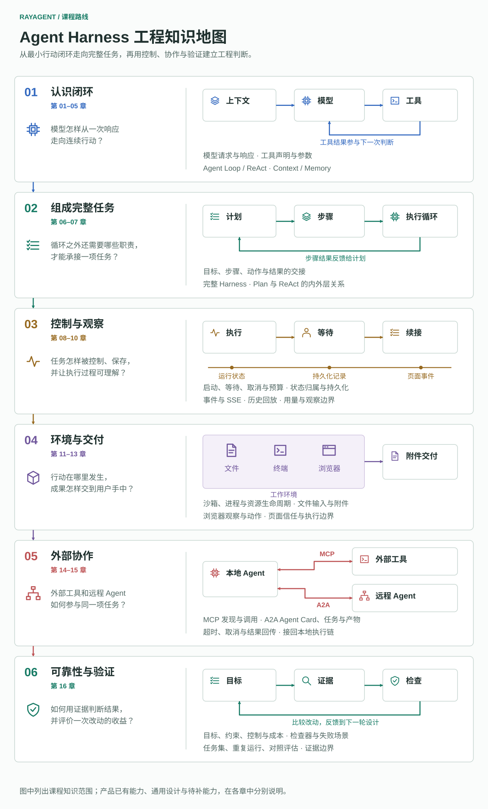

# RayAgent：Agent Harness 工程课程

以 RayAgent 为实践载体，学习 Agent Harness 的核心机制、系统设计与工程验证。课程研究模型之外的运行系统如何组织 Context、行动与反馈，让任务持续执行、受到控制，并交付可验证的结果。

先理解通用概念与设计取舍，再对照实验和现有实现。labs 用于隔离机制，RayAgent 用于观察机制组合；读者自行决定阅读、运行或修改。学习后应能解释职责与交接、比较设计方案、定位实现，并用任务与失败场景验证行为。

知识地图按六个阶段自上而下展开，标出每个阶段的核心问题、涉及机制和读完能够判断的事情；阶段只表示阅读顺序，不是章节编号。图中列出的是课程知识范围，不代表产品已经实现全部能力。具体章节见下方目录。运行命令与实验条件见所属 lab 或服务指南，模块边界见[架构说明](../docs/architecture.md)。

## 章节目录

| 章 | 主题 | 核心问题 |
|---|---|---|
| 01 | [认识 Agent Harness：从一句请求到任务完成](01-the-rayagent-system.md) | 为什么模型之外还需要 Harness，它承担哪些职责？ |
| 02 | [与模型交互](02-model-interaction.md) | 程序如何请求模型并消费响应？ |
| 03 | [工具与行动](03-tools-and-actions.md) | 模型提出的动作如何真正执行？ |
| 04 | [Agent Loop 与 ReAct](04-agent-loop-and-react.md) | Agent 如何根据工具结果继续决策并停止？ |
| 05 | [上下文与记忆](05-context-and-memory.md) | Agent 每一步究竟知道什么？ |
| 06 | [从 Agent Loop 到完整 Harness](06-from-agent-loop-to-harness.md) | Context、模型调用、工具反馈与任务运行如何组成完整 Harness？ |
| 07 | [规划与内外层循环](07-planning-and-nested-loops.md) | 外层计划与内层工具反馈如何协作？ |
| 08 | [任务执行与控制](08-task-execution-and-control.md) | 任务如何启动、继续、等待、取消并受到执行预算约束？ |
| 09 | [状态与持久化](09-state-and-persistence.md) | 执行中的信息分别归谁，能够保存多久？ |
| 10 | [事件与可观察性](10-events-and-streaming.md) | 现有事件能让我们看见什么，又看不见什么？ |
| 11 | [沙箱与执行环境](11-sandbox-and-execution-environment.md) | 工具在哪里执行，环境由谁管理？ |
| 12 | [文件与任务产物](12-files-and-artifacts.md) | Harness 如何组织执行所需的文件，并把成果交给用户？ |
| 13 | [浏览器如何成为工具](13-browser-as-a-tool.md) | Harness 如何把浏览器变成可观察、可操作、可反馈的工具，并处理页面内容的时效与信任？ |
| 14 | [通过 MCP 接入外部工具](14-external-tools-with-mcp.md) | 进程外的工具如何接入已有执行链？ |
| 15 | [通过 A2A 协作远程 Agent](15-agent-collaboration-with-a2a.md) | 调用远程 Agent 与调用工具有什么不同？ |
| 16 | [可靠性、验证与评估](16-reliability-and-verification.md) | 如何处理失败、验证结果，并通过一组任务评估执行质量？ |

章节按解释层次分工：第 01 章建立用途与职责直觉，第 06 章沿真实任务串联交接，第 07 章深入两层循环；第 05 章关注模型可见信息，第 09 章关注系统状态、保存、回放与恢复。第 03 章解释工具契约与参数校验，第 08 章展开授权、暂停和执行控制，第 16 章系统讨论结果验证与评估。允许为不同问题重访同一概念。

## 相关资料

- [实验指南](../labs/README.md)：实验环境与运行指南。
- [应用运行指南](../ray_agent/README.md)：完整产品的部署与运行。
- [架构说明](../docs/architecture.md)：系统边界与实现概览。
- [项目计划](../PLAN.md)：项目阶段与完成标准。
